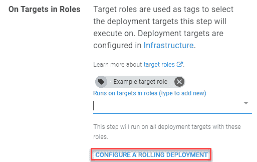
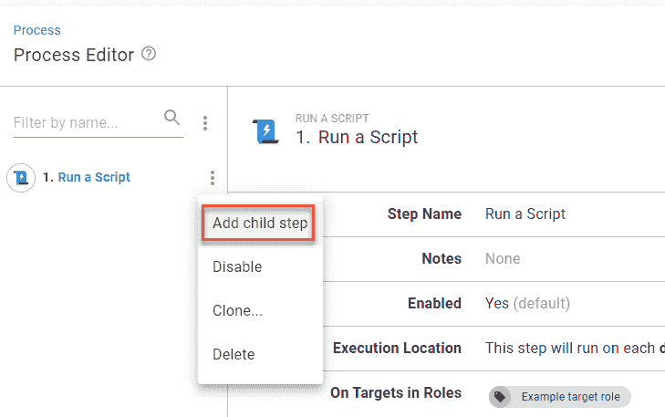
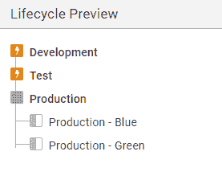
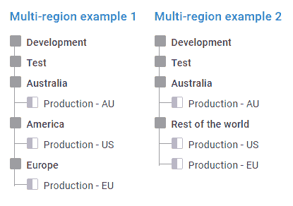
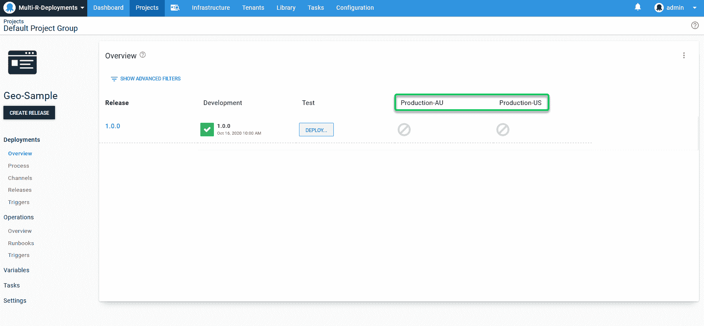

# 常见的部署模式以及如何在 Octopus - Octopus 部署中使用它们

> 原文：<https://octopus.com/blog/common-deployment-patterns-and-how-to-set-them-up-in-octopus>

部署模式对于任何开发管道都很重要，有助于减少您的团队和客户的停机时间和其他问题。然而，部署模式有许多方法，其中一种可能比其他方法更适合您的需求。

这篇文章着眼于一些最常见的部署模式，并解释了如何在 Octopus 中设置它们。

## 滚动部署

滚动模式一次向一个[部署目标](https://octopus.com/docs/infrastructure/deployment-targets)(或一批目标)交付版本。这减少了部署期间您环境中的停机时间和流量拥塞。

作为更简单的选择之一，滚动部署可能很慢，但是可靠、低风险且易于回滚。

### 在 Octopus 中设置滚动部署模式

默认情况下，Octopus 中的部署流程只有在前一个步骤结束时才开始新的步骤。然而，如果一个步骤被部署到一个具有多个目标的[目标角色](https://octopus.com/docs/getting-started/best-practices/environments-and-deployment-targets-and-roles#deployment-target-environment-and-role-relationship)(例如，一个服务器场)，那么您可以同时命中多达 10 个目标。

相反，您可以在定义部署流程时强制实施滚动模式:

1.  在流程编辑器中部分的 **On Targets in Roles** 下，点击**配置滚动部署**。

2.  在**滚动部署**部分，使用**窗口大小**字段设置您想要一次部署多少台机器。例如:

    *   窗口大小为“1”将一次部署到 1 台机器
    *   窗口大小为“3”将同时部署到 3 台机器

如果在部署到另一个目标之前需要在目标上运行一系列步骤，请使用子步骤。您还可以在**流程编辑器**中添加子步骤:

1.  点击预期“父”步骤旁边的 3 个垂直点，并选择**添加子步骤**。
2.  像处理父步骤一样完成子步骤(选择步骤类型并完成字段)，然后单击**保存**。根据需要重复任意多的步骤。

【T2 

### 有关滚动部署的更多信息

看一看 Octopus 示例实例中的[滚动部署设置示例](https://samples.octopus.app/app#/Spaces-45)。

此外，查看我们的[滚动部署文档](https://octopus.com/docs/deployments/patterns/rolling-deployments)了解更多信息，包括如何使用引导故障和可变运行条件。更多关于滚动部署的阅读，请看我们的其他博客帖子:

## 蓝色/绿色部署

蓝/绿模式使用两个生产环境，在每个版本中在“实时”和“暂存”之间交换角色。

例如，如果应用程序的实时版本在您的蓝色服务器上，您可以在将流量重定向到绿色服务器之前使用绿色服务器进行暂存和测试。切换后，蓝色服务器将充当新的临时区域。

蓝/绿模式在这个列表中有最简单的回滚解决方案——只需将您的流量重定向回原始服务器。鉴于需要克隆您的整个生产环境，蓝/绿技术可能会非常昂贵和复杂。

### 在 Octopus 中设置蓝/绿图案

您可以使用[环境](https://octopus.com/docs/infrastructure/environments)在 Octopus 中设置蓝/绿图案。

创建两个带有清晰标签的生产环境，并为它们分配所需的部署目标。

要创建环境:

1.  点击顶部菜单中的**基础设施**，然后从左侧选择**环境**。
2.  点击**添加环境**。
3.  输入环境名称(例如`Production – Blue`，点击**保存**。

我们还建议创建一个新的[生命周期](https://octopus.com/docs/releases/lifecycles)(或者改变现有的生命周期)，这样蓝色和绿色环境就处于一个共享阶段。要创建这样的生命周期:

1.  点击顶部菜单中的**库**，然后从左侧选择**生命周期**。
2.  点击右上角的**添加生命周期**。
3.  输入新生命周期的名称和描述，然后单击**添加阶段**。
4.  如果添加完整的开发管道(推荐):
    *   输入您最早阶段的名称(例如，`Development`)。
    *   点击**添加环境**按钮，从下拉菜单中选择相关环境。决定是否要自动部署并点击**确定**。
    *   点击**添加阶段**添加另一个并重复这些步骤。
5.  当添加生产阶段时，添加蓝色和绿色环境。
6.  对您的生命周期感到满意时，单击**保存**。

【T2 

要分配生命周期，请执行以下操作:

1.  点击顶部菜单中的**项目**，从列表中选择您的项目，然后点击左侧的**流程**。
2.  点击**生命周期**标题下右侧的**变更**。
3.  从下拉列表中选择您的生命周期，然后单击**保存**。

当准备好一个新的发布进行试运行时，检查您的 Octopus 仪表板并部署到不作为您的实时服务的环境中。

### 有关蓝/绿部署的更多信息

看看我们的 Octopus 示例实例中的[示例蓝/绿部署设置](https://samples.octopus.app/app#/Spaces-302)。

有关蓝/绿部署的更多信息，请查看我们的其他博客帖子:

## 金丝雀部署

canary 部署模式在推广到其他地方之前，会发布对少数生产目标的更新以供测试。以旧的矿工早期预警系统命名，它有助于及早发现问题，而不会影响你的整个服务。

### 在 Octopus 中设置金丝雀模式

您可以在 Octopus 中执行金丝雀模式，而无需任何特殊设置。只需手动部署到您选择的 canary 目标上，进行测试，然后在满意时继续其余的目标。

也就是说，Octopus 完全是自动化的，您可以在部署过程中构建一个金丝雀模式:

1.  部署到您的“金丝雀”目标
2.  当您测试或邀请用户反馈时，通过[手动干预步骤](https://octopus.com/docs/projects/built-in-step-templates/manual-intervention-and-approvals)等待手动批准
3.  一旦您满意了，就可以部署到其余的生产目标

首先，您应该创建目标角色，以确保在正确的阶段达到正确的部署目标:

1.  点击顶部菜单中的**基础设施**，然后从左侧选择**部署目标**。
2.  单击您打算充当金丝雀的部署目标。
3.  点击**部署**标题下的**目标角色**部分展开。
4.  在**角色**字段输入一个名称(例如`canary`，点击**保存**。

重复这些步骤，并为剩余的部署目标创建目标角色(如果它们还不存在)。创建目标角色后，可以在其他部署目标中重用它。

现在，您可以创建部署流程:

1.  点击顶部菜单中的**项目**，从列表中选择您的项目，然后点击左侧的**流程**。
2.  点击**添加步骤**，选择步骤类型，完成部署细节。在角色部分的**目标上选择您的金丝雀目标角色。完成后点击**保存**。**
3.  再次点击**添加步骤**并使用**选择步骤模板**字段搜索“手动干预”。将光标悬停在**需要手动干预**框上，点击**添加**。
4.  填写以下字段并点击**保存**:
    *   **步骤名称**
    *   **注释**–描述手动步骤的目的
    *   **说明**–输入需要发生的事情，例如测试或等待用户反馈
    *   **负责团队**–选择负责测试或监控反馈的团队
    *   **阻止部署**–选择**在等待干预时阻止其他部署**
    *   **必需的**–使这成为必需的步骤
    *   根据需要完成其他选项，点击**保存**。
5.  单击**添加步骤**并重新创建第一个步骤，但是这一次部署到剩余生产目标的目标角色。

[T52](#)

### 关于金丝雀部署的更多信息

看看我们的 Octopus 示例实例中的[示例 canary 部署设置](https://samples.octopus.app/app#/Spaces-542)。

## 多区域部署

多区域模式是指将一个版本部署到多个海外目标，比如服务器或数据中心。虽然我们认为它本身是一个部署模式，但它是一个离群值，因为它使用其他模式作为过程的一部分。

### 在 Octopus 中设置多区域部署模式

在 Octopus 中设置多区域部署有三种方式:

#### 环境和生命周期

您可以使用此解决方案来强制您所在区域的部署顺序。

要创建环境:

1.  点击顶部菜单中的**基础设施**，然后从左侧选择环境。
2.  点击**添加环境**。
3.  输入环境名称(例如`US-West`，点击**保存**。

对您的每台全球服务器重复上述步骤。

要创建合适的生命周期:

1.  点击顶部菜单中的**库**，然后从左侧选择**生命周期**。
2.  点击右上角的**添加生命周期**。
3.  输入新生命周期的名称和描述，然后单击**添加阶段**。
4.  如果添加完整的开发管道(推荐):
    *   输入您最早阶段的名称(例如，`Development`)。
    *   点击**添加环境**按钮，从下拉列表中选择相关环境。决定是否要自动部署，然后单击**确定**。
    *   点击**添加阶段**添加另一个并重复这些步骤。
5.  当添加生产阶段时，添加您所有的区域环境。在这里，您的生命周期可以:
    *   连续部署到您的所有环境中
    *   部署到一个环境，然后在您准备好的时候部署到其他环境
6.  对您的生命周期感到满意时，单击**保存**。

要分配生命周期:

1.  点击顶部菜单中的**项目**，从列表中选择您的项目，然后点击左侧的**流程**。
2.  点击**生命周期**标题下右侧的**变更**。
3.  从下拉列表中选择您的生命周期，然后单击**保存**。

您还可以使用计划部署在低使用率时间段进行部署:

1.  点击顶部菜单中的**项目**，从列表中选择您的项目，然后点击左侧的**发布**。
2.  点击**创建发布**。
3.  点击**部署到...**按钮
4.  在时点击**展开菜单，之后选择**。****
***   选择最适合该地区的日期和时间，然后单击**部署**。**

 **

#### 云区域和变量

如果您不在乎部署到您的区域的顺序，云区域是完美的。

要设置您的云区域:

1.  点击顶部菜单中的**基础设施**，然后从左侧选择**部署目标**。
2.  点击**添加部署**目标，选择**云区域**。
3.  将光标悬停在**云区域**框上，点击**添加**。
4.  填写以下字段并点击**保存**:
    *   **显示名称**
    *   **环境**
    *   **目标角色**

重复你所有的云区域。

要使用云区域，您必须使用特定于区域的变量。要设置这些:

1.  点击顶部菜单中的**项目**，从列表中选择您的项目，然后点击左侧的**变量**。
2.  完成以下各列，输入第一个变量:
    *   名称–您只需要将它用于第一个变量
    *   值–输入定义变量的值
    *   范围–点击该字段，并使用**选择目标**选项选择您的云区域。
3.  点击**添加另一个值**添加更多，为每个云区域创建一个值。
4.  准备好后点击**保存**。

[T34](#)

#### 房客

虽然我们为那些提供软件即服务(SaaS)的公司开发了租户，但是您也可以使用它来管理多区域部署。对于那些希望在 Octopus 仪表盘上获得更多控制和清晰度的人来说，这是一个很好的选择。

要创建您的租户:

1.  点击顶部菜单中的**租户**，然后点击右上角的**添加租户**。
2.  为您的租户提供一个名称和描述，然后单击**保存**。
3.  点击**连接项目**，从下拉框中选择您的项目，点击**添加连接**。
4.  如果您还没有为您的项目启用租用部署，Octopus 会提示您。点击**启用租用部署**，用下拉菜单选择您的环境，然后点击**添加连接**。
5.  我们建议为租户添加一个徽标或图标，使他们的目的更加明确。点击左侧菜单中的**设置**，上传 Logo 部分的图像，点击**保存**。
6.  点击顶部菜单中的**租户**，重复上述步骤创建您的其他租户。

您还应该使用[通用变量模板](https://octopus.com/docs/tenants/tenant-variables#common-variables)来提示您每个地区所需的数据(例如，存储帐户细节)。与[项目变量](https://octopus.com/docs/tenants/tenant-variables#project-variables)不同，您可以在所有租户之间重用公共变量。另外，它们不局限于特定的环境。

1.  点击顶部菜单中的**库**，从左侧选择**变量集**。
2.  点击**添加变量集**，输入名称和描述，点击**保存**。
3.  点击新集合上的**变量模板**选项卡，然后点击**添加模板**。
4.  填写以下字段并点击**添加**(根据您选择的控制类型，可能会有其他选项):
    *   **变量名**–输入一个名称，如‘租户’。'别名'
    *   **标签**–提示输入数据时显示的内容
    *   **帮助文本**–描述所需的操作
    *   **控制类型**–变量将提示什么类型的选项
    *   **默认值**(可选)
5.  回到**变量集**屏幕时，点击**保存**。

现在，您可以将变量连接到您的项目:

1.  点击顶部菜单中的**项目**，从列表中选择您的项目，然后点击左侧的**变量**。
2.  点击左边的**库集合**，点击右上角的**包含库变量集合**。
3.  选中新变量集的复选框，点击**保存**。

现在，如果您的租户丢失了信息，他们会提醒您。要设置所需的值:

1.  点击顶部菜单中的**租户**，从列表中选择您的租户，然后点击左侧的**变量**。
2.  点击**常用变量**选项卡，填写所需信息，点击**保存**。

现在，您可以在 Octopus 仪表板上看到一个项目部署了多少租户。

[T57](#)

要了解更多信息，您可以观看我们关于多租户部署的[网络研讨会](https://octopus.com/events/better-multi-tenancy-deployments-using-octopus-deploy)。

## 结论

如您所见，Octopus 可以帮助管理一系列部署模式，以适应您的团队、项目和客户。

请务必查看我们的文档,获取更多关于部署模式的帮助，以及 Octopus 的其他内容。

愉快的部署！**