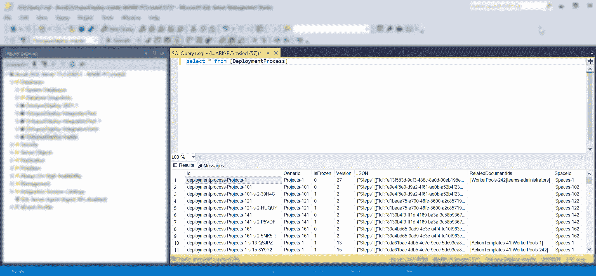
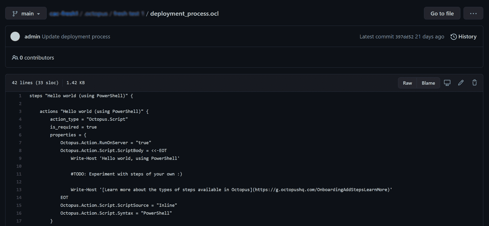

# 配置为代码和持久性无知- Octopus 部署

> 原文：<https://octopus.com/blog/config-as-code-persistence-ignorance>

当将配置为代码(Config as Code)特性引入我们的代码库时，我们遇到了一些[忽略持久性](https://deviq.com/principles/persistence-ignorance)的机会——让我们的代码忽略任何持久性/存储逻辑。

这篇文章探讨了我们的核心平台团队是如何对持久性无知做出决策的。我们希望其他人能从我们的经验中学习。

## Octopus 和 SQL

2014 年，在 Octopus 3.0 时代，我们决定[切换到 SQL](https://octopus.com/blog/3.0-switching-to-sql) 作为我们的存储/持久层。这意味着当您在 Octopus 中保存数据时，它会存储/持久化到 SQL 数据库表中，正如您所期望的那样。

[](#)

在 Octopus 代码库中，我们选择保持简单。我们直接与那些有[永不超生](https://github.com/OctopusDeploy/Nevermore/wiki)事务的表进行对话。永不超生是一个微型 ORM，它将 SQL Server 视为一个文档存储库。

在这个例子中，我们的类:

*   对一个`store`产生了依赖
*   在必要的地方开始查询我们需要什么
*   用我们的`using`块完成并处理我们的`transaction`

任务完成。

```
class Thinger : IDoThings
{
    readonly IOctopusRelationalStore store;

    public Thinger(IOctopusRelationalStore store)
    {
        this.store = store;
    }

    public DeploymentProcess GetDeploymentProcessForProject(Project project)
    {
        using (var transaction = store.BeginTransaction())
        {
            var deploymentProcess = transaction
                .LoadRequired<DeploymentProcess>(project.DeploymentProcessId);
            return deploymentProcess;
        }
    }

    ...
} 
```

## 配置为代码

当我们开始[将 Config 塑造成代码](https://octopus.com/blog/shaping-config-as-code)时，我们突然有了多个需要考虑的持久层。

对于受版本控制的项目，部署过程的数据现在作为 Octopus 配置语言(OCL)文件存储在 Git 存储库中，而不是存储在 SQL 中。

[](#)

从 API 消费者的角度来看，变化并不大。您请求一个部署过程，并告诉我们您想要查看哪个分支。我们从 Git 分支读取，将 OCL 反序列化为我们数据模型，并将结果作为 JSON 返回给您。

例如，设想一个常规项目的部署过程可以被请求如下:

```
/api/Spaces-1/projects/Projects-1/deploymentprocesses 
```

受版本控制的项目将包含分支信息。在这种情况下，我们看到一个`beta`分支被请求:

```
/api/Spaces-1/projects/Projects-1/beta/deploymentprocesses 
```

作为一个 API *消费者*，你不知道(或者不关心)这些数据来自哪里。你只是想要一个部署过程。您依赖 API 来获得答案应该是简单和直观的。

作为一名 API *开发者*，你支持用户体验的旅程也应该简单直观。

> 我只想要一个 x，我不在乎它是怎么储存的，也不在乎它从哪里来。

如果我们的开发人员在考虑数据模型时不得不在头脑中管理太多的切换逻辑，**就会有这样的风险，混乱会以 bug、不一致的行为或特性/修复的缓慢变动的形式扩展到客户**。

再考虑一下这种带有版本控制的方法:

```
public DeploymentProcess GetDeploymentProcessForProject(Project project)
{
    // Wait, we better check if this thing is version-controlled!
    if (project.PersistenceSettings is VersionControlSettings)
    {
        throw new NotImplementedException(); //TODO: Lookup deployment process from Git.
    }
    else
    {
        using (var transaction = store.BeginTransaction())
        {
            var deploymentProcess = transaction
                .LoadRequired<DeploymentProcess>(project.DeploymentProcessId);
            return deploymentProcess;
        }
    }
} 
```

如果您正在进行原型开发以证明 Git 的可能性，这并不是一个不合理的起点(并且这个*是我们在探索可能性时开始的*)。

但是从长远来看，随着更多的特性*可能*转移到 Git，以及更多的工程师需要查询/改变数据，这是一个架构和可伸缩性的机会。

## 文档存储简介

为了解决这个问题，我们引入了一个文档存储抽象层(参见[存储库模式](https://deviq.com/design-patterns/repository-pattern))。

```
public interface IDocumentStore<TDocument> where TDocument : class, IDocument
{
    Task Add(TDocument document, ...);
    Task Update(TDocument document, ...);
    Task<TDocument> Get(string id, ...);
    Task<TDocument?> GetOrNull(string id, ...);
    Task<IReadOnlyList<TDocument>> GetMany(IReadOnlyCollection<string> ids, ...);
    Task<IReadOnlyList<TDocument>> All(...);
    IQueryable<TDocument> Query();
    ... 
```

我们的愿景是开发人员可以依赖于一个`IDocumentStore<T>`，通用接口将允许他们以类似于我们现有的(永不超生)接口的方式查询数据模型。

我们的新抽象需要两个具体的实现:

*   `DatabaseDocumentStore<T>`
*   `GitDocumentStore<T>`

当开发人员要求一个`IDocumentStore<T>`时，我们的基本文档库使用一个[策略模式](https://deviq.com/design-patterns/strategy-pattern)来确定你是在处理一个版本控制项目还是一个常规(SQL)项目。它的工作是为您提供正确类型的文档存储。作为一个开发者，你不用考虑这个问题。

我们之前的代码示例变得更容易推理:

```
class Thinger : IDoThings
{
    readonly IDocumentStore<DeploymentProcess> deploymentProcessesStore;

    public Thinger(IDocumentStore<DeploymentProcess> deploymentProcessesStore)
    {
        this.deploymentProcessesStore = deploymentProcessesStore;
    }

    public DeploymentProcess GetDeploymentProcessForProject(Project project)
    {
        return deploymentProcessesStore.Get(project.DeploymentProcessId);
    }
    ...
} 
```

## 事务性呢？

事务性是一个有趣的挑战和观察。

当我们与 SQL 数据库对话时，我们打开一个事务，对该事务执行操作，然后关闭并处理它。

您可能会问上面代码中的事务发生了什么？

从 2014 年开始，我们在整个代码库(包括我们的 API 和任务系统)中选择了短期事务。

在许多方面，这是理想的。我们可以保证短期事务，并孤立地推理事务性代码。例如，无论您在哪里看到这样的代码，您都可以很容易地推断出事务的生存期:

```
using (var transaction = store.BeginTransaction())
{
    var foo = transaction.LoadRequired<Foo>("Foo-123");
    foo.Bar = "testing";
    transaction.Update(foo);
    transaction.Commit();
} 
```

在其他方面，我们看到了两个长期的不利因素。

首先，当我们考虑给定请求/命令的生命周期时，我们无法保证*的单一事务性*。因为我们在代码库的不同层次对事务进行微观管理，所以在一个给定的请求/命令中可能会涉及到几个事务*。*

有可能几个事务会成功完成并提交，但最后有一个会失败。在这种情况下，异常将被正确地返回给用户，但是来自*相同失败请求*的早期事务将不会回滚，给你留下数据不一致的问题(在这项工作中发现并修复了其中的几个问题)。

为了避免这种情况，我们发现在许多情况下，我们会在调用链的早期创建一个事务，然后将该事务作为方法参数传递(有时通过深度超过 10 个方法的大规模调用链，包括许多静态调用链)。在这些情况下，一些中间方法可能会调用`.Commit()`,你只能希望在同一个事务中没有其他方法会调用`.Commit()`(因为你只能调用 commit 一次)。

其次，当我们开始讨论文档存储抽象时，我们开始问:

开发人员必须考虑他们要求的东西(部署过程)，以及如何围绕这个东西进行事务处理。

当我们在这种情况下谈论单一责任时，交易是额外的和不必要的上下文。这与我们要求的部署过程无关。

明确地说，像我们一直做的那样，拥有事务控制的*选项*是非常强大的。但是对于大多数情况，我们不应该去想它。

我们发现，如果你只依赖于一个像 SQL 这样的持久层，你可以在很多年内不直接使用事务。但是一旦你有了多个持久层(不是永不超生/EF/SQL，而是 T12)，你就有问题了。

此外，事务是一个高级主题。我们日益壮大的团队中的开发人员很容易以可疑的方式持有事务，或者完全忘记提交。像这样的事情很可能在测试中被发现，但是这说明了*不必要的变动*开始悄悄出现。

我们在架构上的工作是帮助我们的开发人员落入成功的陷阱。当我们观察到这种复杂性时(特别是当我们开始扩展时)，这是一个很好的机会来考虑一个新的抽象，并尝试在让我们走到这一步的惊人基础上进行改进。

## 介绍工作单元

为了帮助我们管理跨请求/命令的事务，我们引入了一个[工作单元](https://martinfowler.com/eaaCatalog/unitOfWork.html)，这样开发者就少了一件需要考虑的事情。消费者只需要一个给定类型的文档存储。围绕他们操作的工作单元将为他们管理，而不是他们所关心的。

可以肯定地说，消费者只是想要一个`X`，所以让他们要求*正是他们需要的*。

例如，当你想要的只是一把画笔时，你不应该要求整个邦宁商店。就要画笔！画笔是否来自邦宁商店与你无关。

随着事务性被抽象成一个工作单元，这就导致了分支的问题。

## 引入项目范围

还记得我们前面提到的关于文档存储的策略模式吗(它帮助我们确定当您请求一个`IDocumentStore<T>`时，您应该接收什么类型的*文档存储)？*

我们知道会有一些细节(比如项目和/或 Git 分支)对层级较低的消费者有用。我们希望将这些信息封装到一个“项目范围”中。

我们希望不要将这些信息作为方法参数到处传递。风险是在我们的后端有相当于道具爆炸的东西(传递一个东西超过 10 层，以便最底层的消费者可以使用它)。

想象一下，必须将 Git 分支名称和/或提交信息作为可选参数传递给我们可能需要用于版本控制文档的所有`IDocumentStore`方法。我们的文档存储抽象会突然变成...不是很抽象。

依靠我们的[依赖倒置](https://deviq.com/principles/dependency-inversion-principle) (DI)原则，我们可以获取对一个`IProjectScope`的依赖，并告诉它尽可能在调用链的最高层(如 ASP.NET 中间件或动作过滤器)对每个请求封装一次分支或项目信息*。*

那么我们在同一个调用链中最底层的代码也可以把`IProjectScope`作为一个依赖项并安全地查询那个信息，而不需要我们把所有东西都作为方法参数传递。

当我们以这种方式使用 DI 时，我们很快发现了所有的拦路虎，比如不能利用构造函数依赖的`public static`方法。我们以非静态的方式重写了这些方法，去掉了(现在)不必要的`transaction`方法参数，并包含了更多的单一责任。

最后，我们发现脑子里一下子没什么可记的了；更少的理由；改变的理由更少。

## 缓存呢？

在以前的许多案例中，我们必须依赖缓存抽象并直接使用它，以便为不同的客户提供性能改进。

这些年来，这项工作做得很好。但是随着我们的成长，我们的代码变得越来越复杂。

考虑这个例子，消费者正在为一个给定的项目寻找`Foo`文档:

```
using (var transaction = store.BeginTransaction())
{
    var foos = cache.Get<Foo>(transaction, x => x.ProjectId == projectId).ToList();
    ... 
```

只有几行字，却提供了重要的价值。它提供了一个`Foo`的缓存版本，避免我们不必要地访问数据库。

但是消费者必须停下来思考一下这个问题。

消费者必须:

1.  旋起一个`transaction`
2.  意识到他们可以利用一个`cache`依赖
3.  弄清楚他们给定的类型(`Foo`)是否支持缓存*(不是我们所有的类型都支持缓存)*
4.  确定如何直接调用缓存方法，传递`Get<T>`方法 a `transaction`和 Lambda

开发人员在编写代码时经常没有考虑到我们的缓存。正因为如此，我们对一些性能问题做出了反应，并在出现问题时使用缓存来修复问题。

但是，消费者为什么要考虑缓存呢？这不是他们的责任。

然而，这是某人的责任。我们仍然想要它所提供的价值。它只需要移到别的地方。

有了`IDocumentStore<T>`抽象，我们可以编写装饰器并透明地引入缓存层。

例如，类似这样的事情:

```
public class CachingDocumentStoreDecorator<TDocument> : IDocumentStore<TDocument> where TDocument : class
{
    readonly IDocumentStore<TDocument> inner;
    readonly ICache cache;

    public CachingDocumentStoreDecorator(IDocumentStore<TDocument> inner, ICache cache)
    {
        this.inner = inner;
        this.cache = cache;
    }

    public async Task<TDocument> GetAsync(string id, CancellationToken cancellationToken)
    {
        return TryGetFromCache(id).SingleOrDefault()
            ?? await inner.GetAsync(id, cancellationToken);
    }
    ... 
```

当您请求一个带有给定`id`的文档时，`TryGetFromCache`方法会判断该类型是否支持缓存，并在缓存可用时返回结果。

消费者对这一层一无所知。我们修饰了我们的抽象，并围绕这一层放置了强大的测试覆盖，给了我们信心，它做了我们期望的事情。任何`IDocumentStore<T>`的消费者都会得到这些开箱即用的装饰品。

## 受到惯例的鼓励

我们的开发者现在被鼓励依赖`IDocumentStore<T>`，我们有[惯例测试](https://github.com/andrewabest/Conventional)来帮助他们停止直接依赖商店/交易。

我们核心平台的消费者请求他们需要的东西，在他们认为合适的时候改变它，知道(或者不知道)每个请求都有一个`IUnitOfWork`,它将在需要时负责建立一个`transaction`,并在请求完成时提交该事务(对于 Git 或 SQL)。

所有独立的问题都得到透明的处理，因此您可以专注于向客户提供出色功能的工作。

## 结论

我们希望这篇文章提供了一些关于架构变化的见解，当我们支持像代码配置这样的特性时，可以帮助我们建立长期的信心和稳定性。

例如:

```
public class CreateChannelController : BaseApiController
{
    readonly IResourceMapper resourceMapper;
    readonly IDocumentStore<Channel> channelStore;
    readonly IDocumentStore<Project> projectStore;

    public CreateChannelController(
        IResourceMapper resourceMapper,
        IDocumentStore<Channel> channelStore,
        IDocumentStore<Project> projectStore)
    {
        this.resourceMapper = resourceMapper;
        this.channelStore = channelStore;
        this.projectStore = projectStore;
    }

    // I don't think about DB vs Git
    // I don't think about transactions
    // I don't think about caching
    // I don't think about entity tracking
    // I don't think about deletion rules
    // I don't think about veto rules
    // ...
    // I just use my document stores
    ... 
```

我们相信，这将为使用我们核心平台的开发人员带来更简单、更快速、更直观的未来，从而为您(客户)带来简单、快速、直观的特性。

愉快的部署！