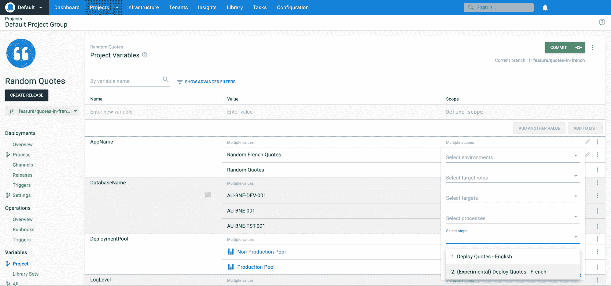
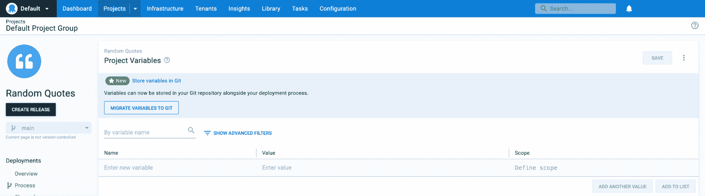

# 将配置整形为变量代码- Octopus Deploy

> 原文：<https://octopus.com/blog/config-as-code-variables>

我们在 2022 年 3 月推出了[配置即代码(Config as Code)](https://octopus.com/blog/octopus-release-2022-q1) ，并根据客户反馈继续增加新功能。最受欢迎的特性之一是将变量配置为代码。

从 [Octopus 2022.3](https://octopus.com/blog/octopus-release-2022-q3) 开始，您可以在 Git 中存储您的非敏感变量以及您的部署流程和部署设置。

在这篇文章中，我将介绍我们所做的改变，并深入探讨变量章鱼配置语言(OCL)模式的设计。

## 为什么变量是 Config as Code 的第一个主要升级

自 2022 年 3 月发布 Config as Code 以来，我们一直在听取每个人的反馈，以继续改进我们的支持。

虽然有许多特性请求，但有一个明确的主题: *Config，因为在 Git 存储库*中没有变量，代码会感觉不完整。

变量是第一位的，但是我们将继续听取您的反馈，并将配置作为代码进行改进，以满足您的需求。

## 随着代码变得更加强大

Config as Code 的第一个版本很好地支持了版本控制的部署过程和设置，但是需要补充变量变化的过程变化需要仔细协调。如果您更改了错误的值，或者删除了错误的变量，可能会中断其他部署。

Git 存储库中现在有了项目变量，Config as Code 特性和分支功能更加强大。您可以在一个特性分支上对您的部署过程和变量一起进行重大更改，而不会影响到其他人，直到您准备好合并您的更改。

Octopus 现在在项目变量页面上有了分支上下文。当设置操作范围时，它从选定的分支中提取操作列表(而不是只显示默认分支中的操作)。

[](#)

这使得动作范围在 Git 项目中更加有用。您可以在您的特性分支上添加一个新的步骤，将一个变量作用于这个步骤，并在准备好的时候将它们合并回您的默认分支，作为一个单独的配置块。

### 支持敏感值

目前，*敏感变量将保留在 Octopus 数据库*中。在“项目变量”页面上，我们通过在所有敏感值旁边显示一个数据库图标来明确这一点。

【T2 

不管选择了哪个分支、提交或标记，您总是要查看和修改一组共享的敏感变量。我们正在研究在 Git 中安全存储敏感变量的最佳方式。我们希望在将来的某个时候增加对它的支持，但是现在敏感的值仍然保留在数据库中。

## 入门指南

在您升级到受[支持的版本](https://octopus.com/downloads)之后，当将项目转换为 Git 时，项目变量将会随着您的部署过程和部署设置自动迁移。您不需要完成任何额外的步骤。

对于现有的 Git 项目，您需要手动将变量迁移到 Git。

### 将变量迁移到 Git

我们最初计划在下次提交时为每个升级的人自动迁移变量。然而，在对这种方法进行了一些测试之后，很明显这对于许多团队来说是行不通的。中断的可能性太大了，尤其是对于经常收到实例更新的云客户。

相反，我们选择了一个产品化阶段，这样每个人都可以在适合自己的时间执行迁移。如果您有一个现有的 Git 项目，其中的变量还没有被迁移，那么您会在项目页面上看到一个横幅。

[](#)

单击 **MIGRATE VARIABLES TO GIT** 按钮会显示一个向导，引导您完成迁移。

#### 过渡到自动迁移

这个产品化阶段导致了 3 种可能的项目状态:

*   带有 Git 变量的 Git 项目
*   带有数据库变量的 Git 项目
*   数据库项目

这给代码库增加了额外的复杂性，并且需要可以用于新功能的时间和精力。考虑到这一点，*我们不会永远支持这个过渡状态*。我们最终会取消对数据库中有变量的 Git 项目的支持，所以我们建议尽快迁移您的变量。

### 路线变更

随着项目变量集现在在 Git 存储库和 Octopus 数据库之间分离，Git 项目有 2 个项目变量路径:

*   `/api/{spaceId}/projects/{projectId}/{gitRef}/variables`:对所有不敏感的变量类型使用此路径。每个 [Git 引用](https://git-scm.com/book/en/v2/Git-Internals-Git-References)都有一组独立的变量，并在`{gitRef}`中指定这个引用。虽然您可以读取任何类型的引用，但提交和标记是不可变的，因此您只能写入分支。
*   `/api/{spaceId}/projects/{projectId}/variables`:对你的敏感变量使用这条路线。这些都保留在数据库中，永远不会写入您的 Git 存储库。

最初的变量 route ( `/api/{spaceId}/variables/variableset-{projectId}`)将继续为 Git 中有变量的项目工作，但是它将只返回敏感值。我们建议始终使用新项目范围内的路线。

如果你只通过 UI 使用 Octopus，这些都不适用。“项目变量”页面会将值写入正确的位置。

## 可变 OCL 模式

Config as Code 的一个持续目标是保持 Octopus UI 对 Git 项目的完全功能性。我们希望为那些直接在文本文件中编辑 OCL 的人提供良好的体验。

在 Config as Code 的第一个版本中，我们采用现有的部署流程和部署设置资源模型，并将它们直接转换到 OCL 来创建模式。这对于这些资源来说很好，但是我们必须对变量采取不同的方法。

变量通过 API 传递，并作为单级变量数组保存。多值变量作为具有相同名称的完全独立的变量来保存。如果我们只是将它直接写入 Git 存储库，那么 OCL 应该是这样的。

```
variable "DatabaseName" {
    value = "AU-BNE-TST-001"
    scope = {
        environment = ["test"]
    }
}

variable "DatabaseName" {
    value = "AU-BNE-001"
    scope = {
        environment = ["production"]
    }
}

variable "DeploymentPool" {
    type = "WorkerPool"
    value = "production-pool"
    scope = {
        environment = ["production"]
    }
}

variable "DeploymentPool" {
    type = "WorkerPool"
    value = "non-production-pool"
}

variable "DatabaseName" {
    value = "AU-BNE-DEV-001"
    scope = { 
        environment = ["production"]
    }
} 
```

这是功能性的，用户界面工作正常，但是 OCL 的编辑体验并不理想。存在重复的变量名和类型，同一个变量的值很容易被分开，并且产生了不必要的嵌套。相反，当序列化为 OCL 时，我们将同一个变量的值合并在一起，缩小范围，一切都变得更加清晰。

```
variable "DatabaseName" {
    value "AU-BNE-TST-001" {
        environment = ["test"]
    }

    value "AU-BNE-DEV-001" {
        environment = ["development"]
    }

    value "AU-BNE-001" {
        environment = ["production"]
    }
}

variable "DeploymentPool" {
    type = "WorkerPool"

    value "non-production-pool" {}

    value "production-pool" {
        environment = ["production"]
    }
} 
```

我们采用了完全不同的 OCL 序列化方法来实现这一点，但我们对结果很满意。这让 OCL 更容易理解，并提供了很好的编辑体验。这为我们将来如何定义 OCL 模式提供了选择，并将为我们计划对持久性和 API 层进行的增强提供支持。

## 下一步是什么？

当您下载 2022.3 版本时，最新版本的 Config as 代码和 Git 变量将被部署到云中，并在本地可用。在实例更新之后，只要准备好了，就可以将变量迁移到 Git。

我们希望听到您的反馈，并通过我们的[配置代码反馈表](https://oc.to/CaCEAPFeedbackForm)了解您下一步想要什么功能。

[提供反馈](https://oc.to/CaCEAPFeedbackForm)

愉快的部署！