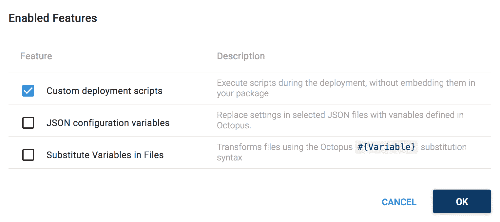
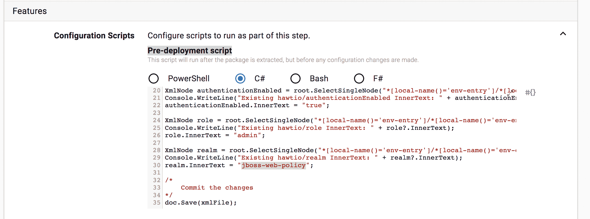
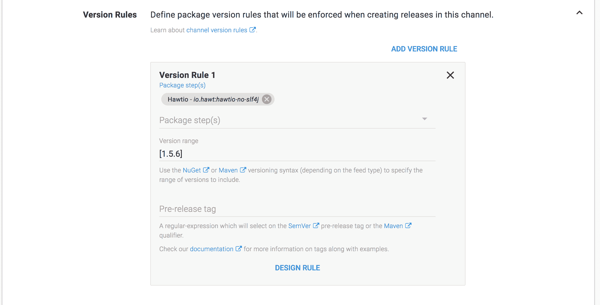
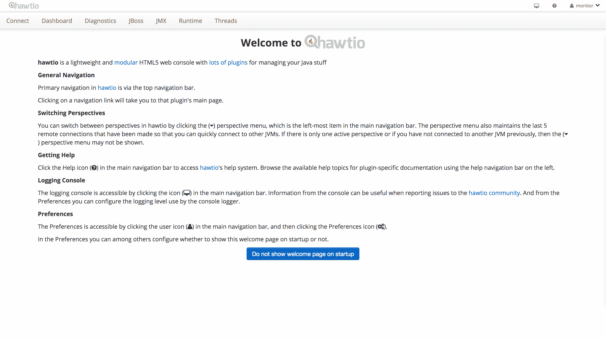

# 部署期间配置 web.xml 文件- Octopus Deploy

> 原文：<https://octopus.com/blog/configuring-web-xml>

使用 Octopus 的包的典型部署使您能够替换模板文件中的标记。当您控制源包并且可以将所需的标记语句嵌入到配置文件中时，这是非常好的，但是当您正在部署您不控制的包时会发生什么呢？

在这篇博文中，我们将看看如何使用一些简单的脚本来更新来自 Maven central 的 Java web 应用程序中的`web.xml`文件，我们对此没有任何控制。

## 下载八达通部署 4.1

首先从[下载页面](https://octopus.com/downloads)获取 Octopus Deploy 4.1 的副本。版本 4.1 包括与 Maven repos 集成的能力。你可以从[文档](https://octopus.com/docs/installation)中找到更多关于安装 Octopus 的信息。

Octopus 4.1 目前处于测试阶段，所以如果现在还不能从下载页面获得，那也很快了。看好这个空间！

## 安装 WildFly

在这个例子中，我们将为 WildFly 安装 [Hawtio](http://hawt.io/) 管理应用程序。特别是，我们将安装 [io.hawt:hawtio-no-slf4j](https://mvnrepository.com/artifact/io.hawt/hawtio-no-slf4j) 包。

所以下载一个 [WildFly 11](http://wildfly.org/downloads/) 的副本，[用一个可以被 Octopus](https://octopus.com/docs/deployments/java/deploying-java-applications#deploying-to-wildflyjboss-eap) 使用的 admin 用户配置它。

## 配置 Maven 中央存储库

下一步是将 Maven central 设置为外部提要。更多细节可以参考[文档](https://octopus.com/docs/packaging-applications/package-repositories/maven-feeds)，或者这个[的博文](https://octopus.com/blog/secured-tomcat-from-scratch#configure-maven-central-as-an-external-feed)。

## 添加应用程序用户

我们将在部署期间更新 Hawtio `WEB-INF/web.xml`文件，以启用身份验证。但是在我们这样做之前，WildFly 需要配置 Hawtio 用户登录的凭证。

运行`bin/add-user.sh`(适用于 Linux 和 Mac)或`bin\add-user.bat`(适用于 Windows)脚本，将新的`Application User`添加到`admin`组。在下面的例子中，我们创建了一个名为`monitor`的用户。

```
PS C:\wildfly11_standalone\wildfly-11.0.0.Beta1\bin> .\add-user.bat
JAVA_HOME is not set. Unexpected results may occur.
Set JAVA_HOME to the directory of your local JDK to avoid this message.

What type of user do you wish to add?
 a) Management User (mgmt-users.properties)
 b) Application User (application-users.properties)
(a): b

Enter the details of the new user to add.
Using realm 'ApplicationRealm' as discovered from the existing property files.
Username : monitor
Password recommendations are listed below. To modify these restrictions edit the add-user.properties configuration file.
 - The password should be different from the username
 - The password should not be one of the following restricted values {root, admin, administrator}
 - The password should contain at least 8 characters, 1 alphabetic character(s), 1 digit(s), 1 non-alphanumeric symbol(s)
Password :
Re-enter Password :
What groups do you want this user to belong to? (Please enter a comma separated list, or leave blank for none)[  ]: admin
About to add user 'monitor' for realm 'ApplicationRealm'
Is this correct yes/no? yes
Added user 'monitor' to file 'C:\wildfly11_standalone\wildfly-11.0.0.Beta1\standalone\configuration\application-users.properties'
Added user 'monitor' to file 'C:\wildfly11_standalone\wildfly-11.0.0.Beta1\domain\configuration\application-users.properties'
Added user 'monitor' with groups admin to file 'C:\wildfly11_standalone\wildfly-11.0.0.Beta1\standalone\configuration\application-roles.properties'
Added user 'monitor' with groups admin to file 'C:\wildfly11_standalone\wildfly-11.0.0.Beta1\domain\configuration\application-roles.properties'
Is this new user going to be used for one AS process to connect to another AS process?
e.g. for a slave host controller connecting to the master or for a Remoting connection for server to server EJB calls.
yes/no? no
Press any key to continue . . . 
```

## 部署 Hawtio

我们可以使用`Deploy to WildFly or EAP`步骤部署 Hawtio，选择外部 Maven 提要，然后部署包`io.hawt:hawtio-no-slf4j`。

在部署过程中，我们希望更新`web.xml`文件中的三个`<env-entry-value>`元素。这些值配置了`hawtio/authenticationEnabled`、`hawtio/role`和`hawtio/realm`T5 的设置。默认值如下所示。

```
<web-app 
          xmlns:xsi="http://www.w3.org/2001/XMLSchema-instance"
          xsi:schemaLocation="http://java.sun.com/xml/ns/j2ee
          http://java.sun.com/xml/ns/j2ee/web-app_2_4.xsd"
          version="2.4">

  ...

  <env-entry>
    <description>Enable/disable hawtio's authentication filter, value is really a boolean</description>
    <env-entry-name>hawtio/authenticationEnabled</env-entry-name>
    <env-entry-type>java.lang.String</env-entry-type>
    <env-entry-value>false</env-entry-value>
  </env-entry>

  <env-entry>
    <description>Authorized user role, empty string disables authorization</description>
    <env-entry-name>hawtio/role</env-entry-name>
    <env-entry-type>java.lang.String</env-entry-type>
    <env-entry-value></env-entry-value>
  </env-entry>

  <env-entry>
    <description>JAAS realm used to authenticate users</description>
    <env-entry-name>hawtio/realm</env-entry-name>
    <env-entry-type>java.lang.String</env-entry-type>
    <env-entry-value>*</env-entry-value>
  </env-entry>

  ...

</web-app> 
```

我们希望`hawtio/authenticationEnabled`的`<env-entry-value>`是`true`，`hawtio/role`是`admin`(我们用`add-user`脚本将用户添加到的同一个组)，以及`hawtio/realm`到`jboss-web-policy`。

`jboss-web-policy`是 WildFly 和 JBoss EAP 中配置的默认领域，它遵从由`add-user`脚本配置的`Application User`凭证。你可以阅读[文档](https://access.redhat.com/documentation/en-us/jboss_enterprise_application_platform/6.1/html/security_guide/use_a_security_domain_in_your_application)了解更多细节。

要进行这些更改，我们需要启用`Custom deployment scripts`功能。

[](#)

我们将使用一个 C#预部署脚本来更新`web.xml`文件，然后将其重新打包并部署到 WildFly。

[](#)

该脚本加载了`web.xml`文件，并使用一些 XPath 语句来查找需要更新的元素。然后保存 XML 文件，更新后的文件将被重新打包和部署。

XPath 语句通过引用元素`*[local-name()='env-entry']`来避免与名称空间相关的问题。

```
using System.Xml;
using System.IO;

/*
    Get the location of the web.xml fie
*/
var installation = Octopus.Parameters["Octopus.Action.Package.InstallationDirectoryPath"];
var xmlFile = installation + Path.DirectorySeparatorChar + "WEB-INF" + Path.DirectorySeparatorChar + "web.xml";

/*
    Parse the web.xml file
*/
XmlDocument doc = new XmlDocument();
doc.Load(xmlFile);
XmlNode root = doc.DocumentElement;

/*
    Update the nodes
*/
XmlNode authenticationEnabled = root.SelectSingleNode("*[local-name()='env-entry']/*[local-name()='env-entry-value'][../*[local-name()='env-entry-name'][text()=\"hawtio/authenticationEnabled\"]]");
Console.WriteLine("Existing hawtio/authenticationEnabled InnerText: " + authenticationEnabled?.InnerText);
authenticationEnabled.InnerText = "true";

XmlNode role = root.SelectSingleNode("*[local-name()='env-entry']/*[local-name()='env-entry-value'][../*[local-name()='env-entry-name'][text()=\"hawtio/role\"]]");
Console.WriteLine("Existing hawtio/role InnerText: " + role?.InnerText);
role.InnerText = "admin";

XmlNode realm = root.SelectSingleNode("*[local-name()='env-entry']/*[local-name()='env-entry-value'][../*[local-name()='env-entry-name'][text()=\"hawtio/realm\"]]");
Console.WriteLine("Existing hawtio/realm InnerText: " + realm?.InnerText);
realm.InnerText = "jboss-web-policy";

/*
    Commit the changes
*/
doc.Save(xmlFile); 
```

## 定义渠道规则

出于某种原因，Hawtio 的一个旧版本发布到了 Maven central，其版本为 2.0.0。Hawtio 的最新版本其实是 1.5.6。默认情况下，Octopus 会尝试部署最新版本，但在这种情况下，版本号最大的版本不是最新版本。为了解决这个问题，我们可以创建一个通道规则，强制 Octopus 部署版本 1.5.6。

[](#)

## 测试部署

在 WildFly 中配置了 Hawtio 用户并且更新了`web.xml`文件以要求认证之后，我们可以通过打开[http://server:8080/haw TiO](http://server:8080/hawtio)来完成部署并检查结果。您将看到登录页面。

[](#)

使用我们之前创建的`monitor`用户登录后，将显示欢迎页面。

[](#)

## 结论

通过一些简单的 C#脚本，我们可以对 XML 文件进行任何我们无法控制的修改。这是由 Octopus 部署时可以应用于 Java 应用程序的强大定制的一个例子。

如果您对 Java 应用程序的自动化部署感兴趣，[下载 Octopus Deploy](https://octopus.com/downloads) 的试用版，并查看[我们的文档](https://octopus.com/docs/deployments/java/deploying-java-applications)。