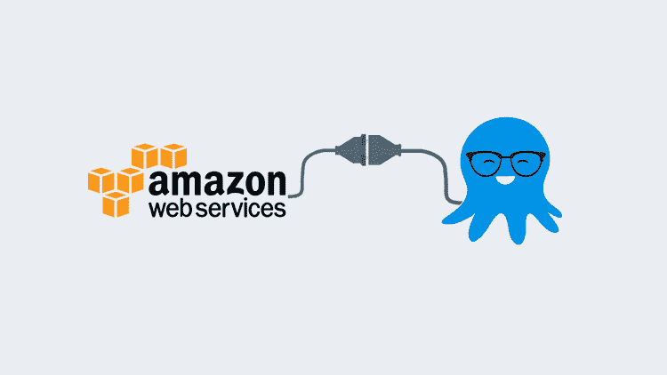

# 将 AWS 帐户连接到 Octopus Deploy - Octopus Deploy

> 原文：<https://octopus.com/blog/connect-an-aws-account-to-octopus>

[](#)

当您与任何云提供商合作时，您都希望有一种连接到云的简单方法。您不希望仅仅为了部署代码或构建持续交付的基础设施而担心创建定制脚本、API 调用和管道胶带解决方案。

Octopus Deploy 有一种干净、直接的方式来连接许多云提供商。在这篇博文中，您将了解如何将 Octopus Deploy 连接到 AWS。

## 先决条件

要跟进这篇博文，您需要具备:

*   AWS 账户。
*   Octopus 部署服务器，可以是 Octopus 服务器的本地实例，也可以是 Octopus 云实例。

你可以从八达通服务器或八达通云免费开始使用。

## 创建 IAM 用户

在从 Octopus Deploy 部署到 AWS 之前，您需要一种身份验证方法。因为 Octopus Deploy 将向 AWS 部署基础设施或应用程序，AWS 需要知道*Octopus Deploy*是谁。AWS 的典型认证方法是身份和访问管理( [IAM](https://aws.amazon.com/iam/#:%7E:text=AWS%20Identity%20and%20Access%20Management%20(IAM)%20enables%20you%20to%20manage,offered%20at%20no%20additional%20charge.) )，它提供访问密钥和秘密。

### 在 UI 中创建 IAM 用户

1.  要在 AWS UI 中创建 IAM 用户，请打开 web 浏览器并进入 [AWS 控制台](https://aws.amazon.com/console/):

[](#)

2.  在搜索栏的**查找服务**下，输入 **IAM** 。
3.  点击**权限管理**下的**用户**选项。
4.  要创建可以从 Octopus Deploy 访问 AWS 的新用户，请单击蓝色的**添加用户**按钮。
5.  在“设置用户详细信息”下，为用户名创建一个适当的名称。比如`OctopusDeployAccount`。
6.  在**选择 AWS 访问类型**部分，选择**编程访问**选项。Octopus Deploy 将在 SDK 级别对 AWS 进行 API 调用。
7.  点击蓝色**下一步:权限**按钮。

用户的权限将取决于您希望 Octopus Deploy 拥有哪些 AWS 服务的权限。例如，假设您希望 Octopus Deploy 只部署 EC2 实例，在这种情况下，您可以让 IAM 用户访问类似于`AmazonEC2FullAccess`的内容。

8.  出于这篇博文的目的，我们希望 Octopus 与所有 AWS 服务通信，因此我们将选择**直接附加现有策略**下的`AdministratorAccess`策略。选择`AdministratorAccess`选项后，点击蓝色的 **Next: Tags** 按钮，如下图所示。

9.  标签对于这篇博文来说并不是必须的，所以你可以点击蓝色的 **Next: Review** 按钮。

10.  最后，要创建新的 IAM 用户，单击蓝色的**创建用户**按钮。

您将看到一个包含访问密钥 ID 和秘密访问密钥的屏幕。将秘密访问密钥保存在安全的位置，因为您将无法再次访问它。但是，如果丢失了这个密钥，您可以创建一个新的秘密访问密钥。访问密钥 ID 和秘密访问密钥将用于 Octopus Deploy 身份验证。

[](#)

### CLI 上的 IAM 用户

正如您在上一节中看到的，创建一个 IAM 用户并将其添加到适当的策略可能有点麻烦，并且需要大量的点击操作。如果你使用 AWS CLI，有一个简单得多的方法，只需要几行代码。

第一段代码创建了新的 IAM 用户:

```
aws iam create-user --user-name OctopusDeployAWSAccount 
```

输出应该类似于下面的屏幕截图:

[](#)

接下来，您需要创建秘密访问密钥。秘密访问密钥充当各种类型的*密码*。

要创建秘密访问密钥，请运行以下代码:

```
aws iam create-access-key --user-name OctopusDeployAccount 
```

输出应该类似于下面的屏幕截图:

[](#)

现在，您已经准备好将 AWS IAM 帐户连接到 Octopus Deploy。

## 将 AWS 连接到 Octopus Deploy

在上一节中，您了解了如何在编程级别创建让 Octopus Deploy 与 AWS 交互的能力。既然您已经理解了访问密钥和秘密密钥的用途，那么是时候在 Octopus Deploy 中设置 AWS 帐户了。

1.  打开网络浏览器，进入 Octopus Deploy 门户网站:

[](#)

2.  导航至 **基础设施➜账户** 以设置新的 AWS 账户。
3.  在**账户**下，点击绿色**添加账户**按钮，选择 **AWS 账户**:

[](#)

4.  在**详情**下，您可以添加关于您的账户的元数据；名称和描述。
5.  接下来，在**凭证**下，您可以添加 AWS 访问密钥和秘密密钥。
6.  最后，您可以在“限制”部分设置限制。例如，我选择只允许我的开发环境使用这个帐户。
7.  点击页面顶部的绿色**保存**按钮。

恭喜你。您已经成功地在八达通部署中设置了一个 AWS 帐户。

## 结论

与不同的基于云的平台进行交互的需求不会消失。无论您使用什么样的持续交付和部署工具，从 CD 工具到云甚至本地平台的身份验证总是有原因的。

愉快的部署！