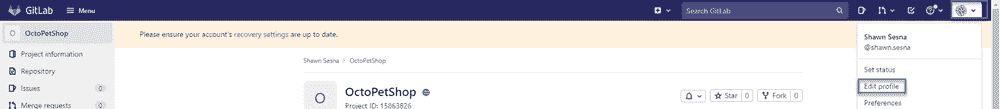
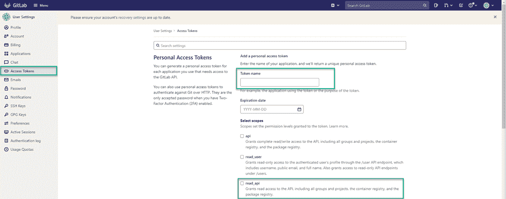
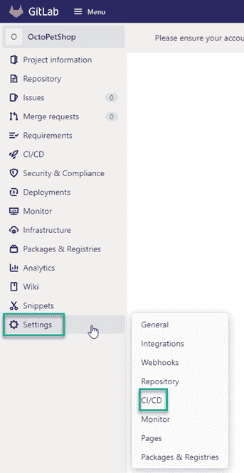
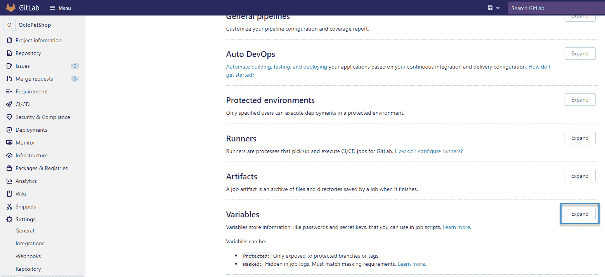
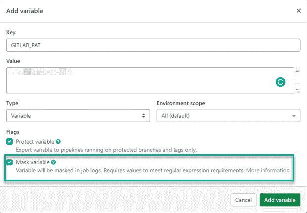
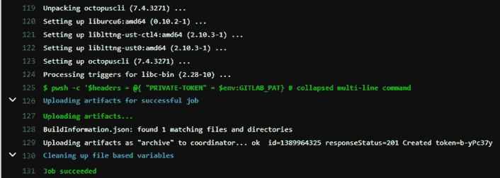
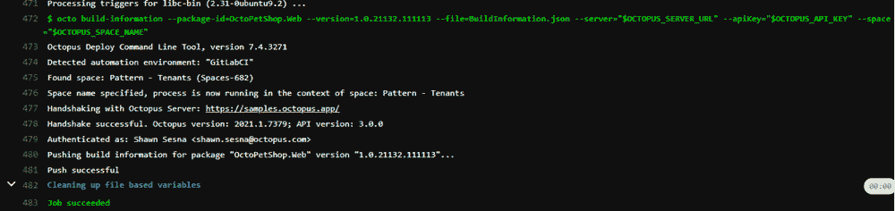
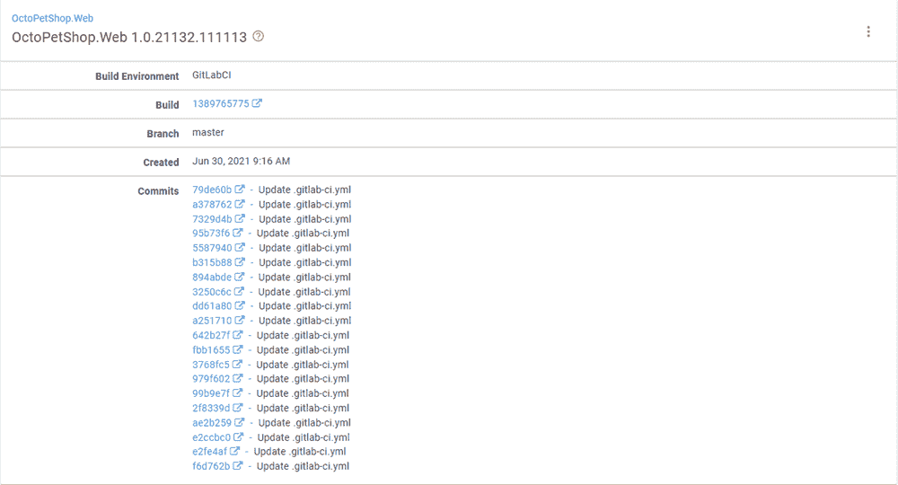

# 构建构建信息- Octopus 部署

> 原文：<https://octopus.com/blog/constructing-build-information>

构建服务器传统上是一种内部工具，但是，许多组织决定将他们的构建卸载到云上。

Azure DevOps、Jenkins (CloudBees)以及最近的 TeamCity 等大牌公司都创建了他们流行的构建平台的云版本。像 AppVeyor、Travis CI、Circle CI、GitHub Actions 和 GitLab 这样的纯在线技术也越来越受欢迎。

对于已经开发了插件或集成的技术，推送构建信息就像将任务添加到流程中一样简单。

对于那些唯一的选择是集成 Octopus CLI(运行时或容器)的技术，让提交信息显示出来可能会令人困惑。

在这篇文章中，我演示了如何构建将构建信息推送到 Octopus Deploy 所需的文件。

## GitLab

在这篇文章中，我使用 GitLab 作为构建服务器，因为我以前没有使用过它。

这篇文章关注的是生成[构建信息](https://octopus.com/docs/packaging-applications/build-servers/build-information)并将其上传到 Octopus Deploy 的单一任务。它不包括使用 GitLab 构建应用程序。

### 变量

在开始构建定义之前，您需要创建在流程中使用的变量:

*   GitLab 个人访问令牌
*   Octopus 部署 API 密钥
*   Octopus 部署服务器 URL
*   Octopus 部署空间名称

#### GitLab 个人访问令牌

为了收集您正在执行的构建的提交，您需要对 GitLab 进行 API 调用。API 端点受到保护，需要访问令牌才能成功调用它。

##### 创建个人访问令牌

要创建访问令牌，请单击右上角的您的个人资料，然后选择**编辑个人资料**。

[](#)

点击左侧菜单中的**访问令牌**。给你的令牌起个名字，至少要有 **read_api** 权限。

**截止日期**是可选的。将其留空会创建一个永不过期的令牌。

点击**创建个人访问令牌**。当令牌显示时，将其存储在安全的地方-该值仅显示一次。

【T2 

##### 为个人访问令牌创建变量

获得令牌后，导航回项目并单击**设置**，然后单击 **CI/CD** 。

[](#)

滚动到**变量**部分，点击**展开**。

[](#)

点击**添加变量**并填写详细信息。对于这个例子，我使用`GITLAB_PAT`作为**键**和我们上面为**值**生成的令牌。

勾选**掩码变量**选项，确保令牌不会在构建期间显示在任何消息中。

[](#)

#### 章鱼变量

对 Octopus 变量重复上面的**添加变量**过程。这篇文章假设你熟悉[创建一个 API 键](https://octopus.com/docs/octopus-rest-api/how-to-create-an-api-key):

*   Octopus 部署 API 密钥
*   Octopus 部署服务器 URL
*   Octopus 部署空间名称

### 建设 YAML

对于 GitLab，构建是使用 YAML 在一个特殊的文件中定义的，`.gitlab-ci.yml`位于您的库的根目录中。您的流程将包括两个阶段:

*   建筑信息
*   推送-构建-信息

#### 建筑信息

构建信息阶段包括构建用于上传构建信息的文件。我用 PowerShell Core 来构建文件，Ubuntu 默认没有。我没有安装 PowerShell Core，而是使用了 GitLab Docker runner 功能。镜像`mcr.microsoft.com/dotnet/core/sdk:3.1`是安装了 PowerShell 核心的。

```
build-information:
    stage: build-information
    image: mcr.microsoft.com/dotnet/core/sdk:3.1 
```

##### GitLab 提交 API

提交 API 需要您之前作为变量创建的访问令牌。这个令牌需要作为流程中 API 调用的头提供。这些变量可以在代码中以环境变量的形式访问。变量`GITLAB_PAT`是我们创建的变量，而`CI_PROJECT_ID`是 GitLab 预定义的[。](https://docs.gitlab.com/ee/ci/variables/predefined_variables.html)

```
$headers = @{ "PRIVATE-TOKEN" = $env:GITLAB_PAT}

# Get commits from GitLab
$commits = (Invoke-RestMethod -Method Get -Uri "https://gitlab.com/api/v4/projects/$($env:CI_PROJECT_ID)/repository/commits?first_parent=true" -Headers $headers) 
```

##### 构建信息对象

为了存储构建信息，创建一个 PowerShell [哈希表](https://docs.microsoft.com/en-us/powershell/scripting/learn/deep-dives/everything-about-hashtable)对象。`Commits`部分被定义为哈希表中的一个数组:

```
$jsonPayload = @{
    PackageId = "OctoPetShop.Web"
    Version = "1.0.21132.111113"
    Branch = $env:CI_COMMIT_BRANCH
    BuildUrl = $env:CI_JOB_URL
    BuildNumber = $env:CI_JOB_ID
    BuildEnvironment = "GitLabCI"
    VcsCommitNumber = $env:CI_COMMIT_SHA
    VcsType = "Git"
    VcsRoot = $env:CI_PROJECT_URL
    Commits = @()
} 
```

接下来，遍历 commits API 调用的结果，并将它们添加到数组中:

```
foreach ($commit in $commits)
{
    $commitInfo = @{
        Id = $commit.id
        LinkUrl = $commit.web_url
        Comment = $commit.message
    }
    $jsonPayload.Commits += $commitInfo
} 
```

最后，将 PowerShell 哈希表转换为 JSON 字符串，并将其写入文件:

```
Add-Content -Path "BuildInformation.json" -Value "$($jsonPayload | ConvertTo-JSON -Depth 10)" 
```

您需要将该文件作为一个工件包含进来，以便在以后的过程中使用。为此，在舞台 YAML 中加入一个`artifacts`组件:

```
artifacts:
    paths: [ BuildInformation.json ] 
```

#### 推送-构建-信息

将构建信息推送到 Octopus 由脚本中的一个命令组成，并使用前一阶段创建的`BuildInformation.json`:

```
push-build-information:
    stage: push-build-information
    image: octopuslabs/gitlab-octocli
    script:
        - octo build-information --package-id=OctoPetShop.Web --version=1.0.21132.111113 --file=BuildInformation.json --server="$OCTOPUS_SERVER_URL" --apiKey="$OCTOPUS_API_KEY" --space="$OCTOPUS_SPACE_NAME" 
```

#### 。gitlab-ci.yml 文件

完成后，你的 YAML 应该看起来像这样:

```
image: ubuntu:latest

stages:
    - build-information
    - push-build-information

build-information:
    stage: build-information
    image: mcr.microsoft.com/dotnet/core/sdk:3.1
    script:
        - |
          pwsh -c '$headers = @{ "PRIVATE-TOKEN" = $env:GITLAB_PAT}

          # Get commits from GitLab
          $commits = (Invoke-RestMethod -Method Get -Uri "https://gitlab.com/api/v4/projects/$($env:CI_PROJECT_ID)/repository/commits?first_parent=true" -Headers $headers)

          # Create payload
          $jsonPayload = @{
            PackageId = "OctoPetShop.Web"
            Version = "1.0.21132.111113"
            Branch = $env:CI_COMMIT_BRANCH
            BuildUrl = $env:CI_PIPELINE_URL
            BuildNumber = $env:CI_PIPELINE_ID
            BuildEnvironment = "GitLabCI"
            VcsCommitNumber = $env:CI_COMMIT_SHA
            VcsType = "Git"
            VcsRoot = $env:CI_PROJECT_URL
            Commits = @()
          }

          # Loop through commits and add to collection
          foreach ($commit in $commits)
          {
            $commitInfo = @{
              Id = $commit.id
              LinkUrl = $commit.web_url
              Comment = $commit.message
            }
            $jsonPayload.Commits += $commitInfo
          }

          # Write information to file
          Add-Content -Path "BuildInformation.json" -Value "$($jsonPayload | ConvertTo-JSON -Depth 10)"'
    artifacts:
      paths: [ BuildInformation.json ]

push-build-information:
    stage: push-build-information
    image: octopuslabs/gitlab-octocli
    script:
        - octo build-information --package-id=OctoPetShop.Web --version=1.0.21132.111113 --file=BuildInformation.json --server="$OCTOPUS_SERVER_URL" --apiKey="$OCTOPUS_API_KEY" --space="$OCTOPUS_SPACE_NAME" 
```

## 执行构建

在构建被触发后，您将看到类似这样的内容(为了简洁起见，图片显示了日志的最后一部分):

构建-信息 [](#)

推-建-信息 [](#)

导航到 OctoPetShop 的构建信息。Web 在 Octopus Deploy 中，您可以看到您的构建信息已经上传。

[](#)

## 结论

在这篇文章中，我演示了如何为构建信息构建文件，以及如何使用 Octopus Deploy CLI 上传它。

愉快的部署！