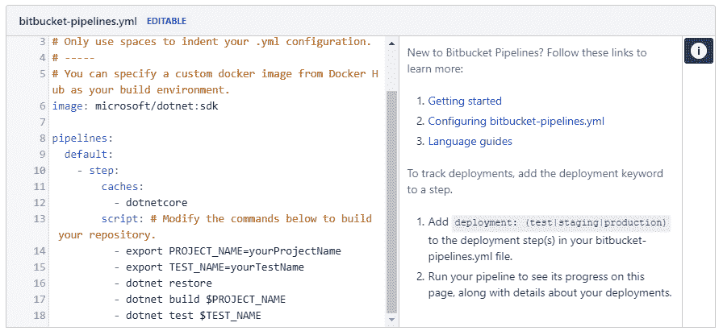
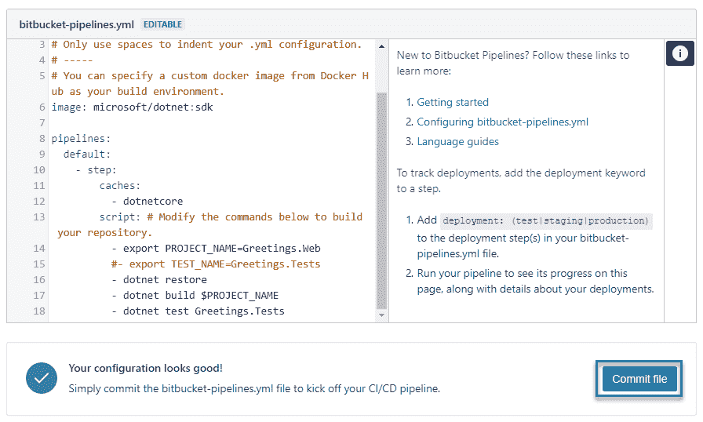
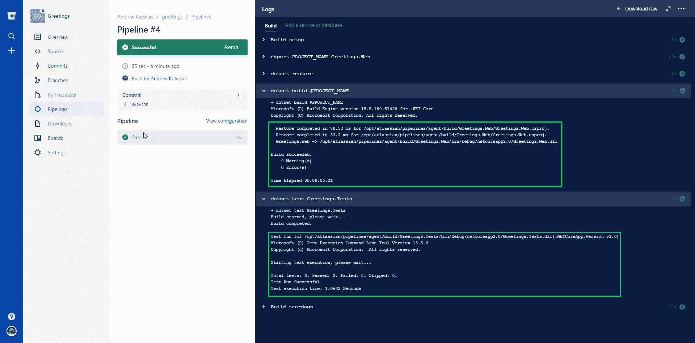

# 连续交货。使用 Octopus Deploy 和 Bitbucket 管道的 NET Core-Octopus Deploy

> 原文：<https://octopus.com/blog/continuous-delivery-bitbucket-pipelines>

自从这篇文章首次发表以来，我们已经重新命名了 Octo.exe，现在它是 Octopus CLI，更多信息，请参见这篇文章: [Octopus release 2020.1](https://www.octopus.com/blog/octopus-release-2020-1) 。

[](#)

上周，我热爱 PowerShell 的同事 Jason Brown 写了一篇关于使用 Octopus 和 T2 TakoFukku 为 PowerShell 模块建立连续交付渠道的精彩文章。在晚上的时间里，我一直在摆弄 Bitbucket 管道来自动化一些个人项目，所以我想我应该写一篇关于为。净核心项目。

## 人物简介

**[Bitbucket](https://bitbucket.org/)** 是一个基于 git 的源代码控制平台，由 Atlassian 开发，是 GitHub 的替代产品，提供免费无限的私有回购，因此它非常适合你不想在野外进行的个人项目。

**[bit bucket Pipelines](https://bitbucket.org/product/features/pipelines)**是 Atlassian 的新产品，它是一个轻量级的云持续集成服务器，使用预配置的 docker 容器。每月有 50 分钟的构建时间是免费的，额外时间的费用非常实惠(在撰写本文时是正确的)。设置一个 CI 服务器并构建在云中运行的代理可能是一个漫长而昂贵的过程，因此这是一个很好的入门方式。

## 序言:计划

该解决方案有几个移动部分，因此该过程将按如下方式工作:

1.  新代码被提交到 Bitbucket 上一个被祝福的分支。
2.  当提交被推送到远程存储库时，位桶管道启动构建脚本。
3.  构建脚本构建、测试、打包应用程序代码，并将其推送到 Octopus Deploy 服务器。
4.  Octopus 会自动创建一个版本，并将其部署到 Azure(或任何您想部署代码的地方)。

## 第一幕:设置好一切

我们需要创建一些帐户和服务，设置它们的说明超出了本文的范围。您需要做的关键事情是:

### 创建一个比特币账户

如果你还没有一个 Bitbucket 账户，那就去 https://bitbucket.org/account/signup/建立一个吧。这是您将设置远程存储库和保存源代码的地方。

### 创建新的存储库

如果您刚刚创建了一个新的 Bitbucket 帐户，您还应该设置一个可以将源代码放入其中的存储库。Bitbucket UI 相当直观，(但是如果你喜欢具体的说明，你可以[阅读这个有用的教程](https://confluence.atlassian.com/bitbucket/create-a-git-repository-759857290.html))。一旦你建立了回购，做一个初始提交，从你的本地源代码(或者任何你正在测试的玩具项目)推它，这样你就有一些代码提交了。

在本文中，我将使用一个名为“问候”的玩具项目。Web”，它在一个名为“Greetings”的测试项目中有一个单元测试。测试”。

### 建立一个八达通服务器

如果你还没有运行的 Octopus 服务器，[开始试用](https://octopus.com/licenses/trial)并按照我们的[安装指南](https://octopus.com/docs/installation)立即开始运行。我正在使用我们全新的[章鱼云](https://octopus.com/cloud)预览服务器；如果您有兴趣了解我们的最新进展，您可以[注册您的兴趣](https://octopus.com/cloud/register-interest)并在我们发布到 RTM 时得到通知。

## 动作 2:配置管道以在提交时运行构建

CI(持续集成)通常通过将您的构建系统集成到您的源代码控制仓库中来工作，因此当新代码被推送到您的远程仓库时，新的构建会自动启动。我们将使用管道(在 Bitbucket 中)来完成这些构建，所以我们需要创建一个名为`bitbucket-pipelines.yml`的特殊文件来让 Bitbucket 知道做什么和如何做。

在浏览器中打开您的 Bitbucket 存储库，并选择**管道**菜单选项；这将把你带到管道界面，有一个有用的图形用户界面来设置你的管道 YAML 文件。因为我将部署一个. Net 核心应用程序，所以我将使用**。NET Core** 模板(在 **More** 菜单中)作为起点。有许多模板可以作为其他语言类型的起点，所以请随意选择对您有意义的模板。

如果你想知道为什么没有**。NET** 模板可用，原因是因为 Pipelines 使用 Linux docker 容器来运行构建步骤。作为。NET 核心是跨平台的，有一个模板供微软使用。网络核心 docker 镜像；在撰写本文时，不支持 Windows 和 Mac/iOS 版本。

在生成的模板中，我们可以调整命令以适应我们的构建环境；每一行都是一个可以在终端运行的**命令行**。如果您选择了。NET 核心模板，您的文件将如下所示:

[](#)

### 命令

每个关键词在链接到该模板的帮助材料中都有详细的解释，所以请阅读这些文章，以便更广泛地了解 YAML 文件应该如何构建。出于我们的目的，我们正在查看特定的命令本身:

*   `export <name>=<value>`是设置一个名为`<name>`(值为`<value>`)的**环境变量**的命令，我们可以在后面的文件中引用它。这是一种指定像`PROJECT_NAME`这样的变量的简便方法，并在构建和测试的多个地方使用该值。
*   `dotnet restore`是一个. NET 核心命令，用于将 NuGet 包恢复到您的项目中。这确保了您所引用的任何包都可以在本地使用，因此您的生成可以运行(通常包不会提交给源代码管理，因此需要在您的生成代理上还原)。
*   `dotnet build <ProjectName>`将构建指定的项目；这是使用`PROJECT_NAME`变量的好地方。关于该命令选项的更多信息，见[点网构建参考资料](https://docs.microsoft.com/en-us/dotnet/core/tools/dotnet-build?tabs=netcore2x)。
*   `dotnet test <TestProjectName>`会使用。NET 测试运行器来运行指定测试项目中的任何单元测试。这也是放置变量的好地方(例如`TEST_NAME`)。关于该命令选项的更多信息，参见[点网测试参考资料](https://docs.microsoft.com/en-us/dotnet/core/tools/dotnet-test?tabs=netcore2x)。

简而言之，这个模板文件将**恢复**您的 NuGet 包，**构建**您的项目并运行**单元测试**。现在，只需修改`export`命令分别指向您的项目和测试项目名称，并使用`#`注释掉任何不适用的行。

我已经用一个项目名变量设置了我的，由`build`命令使用，但是我已经移除了`TEST_NAME`变量来显示你如何注释掉你不需要的行，并且如果你不需要的话，你不需要*使用*变量。我完全配置的文件如下所示:

[](#)

然后我们只需要点击`Commit file`，pipelines 文件就会在正确的位置(项目的根目录)提交给你的 repo，你的第一次构建就拉开了序幕。如果一切配置正确，您应该会看到如下屏幕:

[](#)

第一次建不起来也不用担心；阅读输出，进行任何修改，并推送您的更改——每次推送都会自动启动一个新的构建。

### 扩展脚本

现在，您已经愉快地运行了一个基本的管道构建，是时候扩展脚本来打包您构建的代码，并将其推送到 Octopus 进行部署了。

**更新 2018/06:自从写了这篇文章后，我们开始将`octo.exe`发布到一个容器中，以使这个过程更加简单。查看我们的[更新博客文章](https://octopus.com/blog/bitbucket-pipelines-redux)了解详情。**

#### Octopus API 密钥

首先，我们需要为我们的 Octopus 登录创建一个 API 键，这样管道就可以使用 Octopus API 来推送我们的代码包。[本文](https://octopus.com/docs/octopus-rest-api/how-to-create-an-api-key)将带您创建一个 API 密匙；请确保您将它保存在某个地方，以便以后检索。

#### 管道敏感变量

API 密匙(以及其他类似的认证令牌)非常强大，因为它们授予持有者做任何你可以做的事情的权利，而不需要密码——所以我们需要保证它们的安全。Pipelines 通过“安全变量”来管理这一点，这些变量就像 Octopus 中的敏感变量一样——一旦你设置了它们，它们就是安全的，没有人可以再把它们复制回来。这对我们的 API 键来说是完美的。

1.  在 Bitbucket 上打开你的库，打开**设置**页面，然后在**管道**部分选择**环境变量**。
2.  在这个页面上，输入`Octopus.ApiKey`作为变量名，并将您的 API 键粘贴到 value 框中。勾选`Secured`，点击`Add`保存变量。我们现在可以在构建脚本中使用它，就像之前的`PROJECT_NAME`一样。

#### 扩展构建脚本

现在我们需要调整我们的构建脚本来添加额外的命令——您可以在本地进行这些更改并提交更新后的 YAML 文件，或者您可以使用 web GUI 找到该文件并在浏览器中编辑它。

由于我们正在推进 Octopus 中的内置提要，而不是 NuGet 提要，我们可以只压缩我们发布的项目输出——不需要花哨的 NuGet 包或 nuspec 文件。但是，如果您愿意，您可以修改这些步骤，使用`octo.exe pack`来生成 NuGet 包。

经过编辑，我们的管道文件的`script`部分现在看起来如下，并带有解释新命令的注释:

```
# zip is not installed in the docker image, so we need to update apt-get and then install it so we can create our package later on
- apt-get update
- apt-get install zip -qq

# we use the PROJECT_NAME variable to generate our package name, as well as the in-built BITBUCKET_BUILD_NUMBER, which is the incrementing number of the build. This ensures we get incrementing unique package versions
- export PROJECT_NAME=Greetings.Web
- export VERSION=1.$BITBUCKET_BUILD_NUMBER
- export ZIP_FILE=$PROJECT_NAME.$VERSION.zip

- dotnet restore
- dotnet build $PROJECT_NAME
- dotnet test Greetings.Tests
# this will publish our app output into a subfolder so that we can package it up
- dotnet publish $PROJECT_NAME --output ../publish
# we need to make sure our app is at the root level of the zip file, or Azure will complain about it when we deploy. So we change into that directory
- cd ./publish
# we use the ZIP_FILE variable from above to generate the package
- zip -r $ZIP_FILE * -q

# curl comes installed in the image, so we just need to post the contents of the zip file to our Octopus instance, making sure we add an HTTP Header for our API key. This will be expanded by Pipelines from the environment variable we created previously
- curl -X POST https://cloud-perm.octopus.com/api/packages/raw -H "X-Octopus-ApiKey:$Octopus.ApiKey" -F "data=@$ZIP_FILE" 
```

确保适当地更改任何变量名/值，并为 Octopus 实例使用正确的 HTTP 端点。

运行时，如果。NET 命令正确运行(即，只要我们的代码编译和测试成功运行)，我们的应用程序将被发布、打包并推送到内置的 Octopus feed。通过向你的回购协议提交一份承诺，并观察这一过程的展开，来测试一下。如果一切正常，您应该在 Library -> Packages 下看到一个包，它的版本与成功构建的版本相匹配。

## 第 3 步:设置 Octopus 自动部署

现在我们有了构建和打包代码的管道，我们有很大的信心没有引入任何错误，所以我们想把它推到一个部署目标——也许是一个可以测试您的更改的阶段环境。然而，我们不希望每次构建完成时都必须手动部署——这简直是胡说八道！

用 Octopus 实现这一自动化的关键包括两个伟大的(但经常被忽视的)特性:

1.  **自动释放创建**会按照盒子上说的去做；每当在内置的包提要中检测到与项目名称相匹配的新包时，就会自动创建一个新的版本，并且
2.  **自动部署**，当一个版本到达部署的这个阶段时，它将自动部署到一个环境中。

有了这两个便利的特性，我们所需要做的就是向 Octopus 推送一个新的包，它将自动地被包装在一个新的版本中，并被部署到您已经设置好的环境中。多棒啊。！

### 1.为自动部署创建环境和生命周期

如果我们部署到一个试运行环境来持续测试我们的工作，我们需要一个称为“试运行”的环境——如果您还没有设置，现在就通过 infra structure-> Environments-> Add Environment 创建它。

接下来，我们需要一个我们的项目可以使用的特殊生命周期，通过 Library-> life cycles-> Add life cycle，将我们的新版本自动部署到这个阶段环境中(您也可以在其他项目中使用这个生命周期)。称之为“自动部署到登台”，添加一个称为“登台”的阶段，并将您的`Staging`环境添加到其中。在弹出窗口中，**确保**选择了“自动部署到该环境”选项；这就是让一切运转的魔力。

通过环境名称旁边的橙色闪电，您可以知道我们已经正确设置了自动部署:

[](#)

现在，任何使用这个生命周期的项目都会自动部署到`Staging`中，无论何时创建一个新的版本。在离开此页面之前，请确保**保存**生命周期。

### 2.设置您的项目

接下来，我们需要一个新的 Octopus 项目来执行我们需要的部署步骤。项目的进程将取决于您正在部署什么，以及您需要将它部署到哪里，我们的文档中有一个很棒的章节是关于用 Octopus 部署的。对于我的玩具项目，我想将其部署到现有的 Azure web 应用程序，因此我有一个项目，只需一步即可部署到 Azure。

#### 创建项目

通过“项目”->“添加项目”创建一个新项目，为其命名，并确保您展开了**高级设置**部分，并选择我们在上面创建的新生命周期(请记住，我的生命周期称为“自动部署到暂存”)。如果您正在使用现有项目，您可以在项目设置的“流程”页面下更改生命周期。

#### 设置流程

为了让自动发布创建工作，我们至少需要一个部署包的步骤；这就是 Octopus 如何知道在内置提要中应该关注哪些包。如果你已经设置了一个 Azure 账户，请阅读本文[以获取关于设置 Azure 部署步骤的信息。否则，请查阅 Octopus 文档以获得更多关于部署到您的环境的信息。](https://octopus.com/docs/deployments/azure/deploying-a-package-to-an-azure-web-app)

#### 设置自动发放创建

现在我们已经有了一个建立了流程的项目，并且处于正确的生命周期中，我们需要打开**自动发布创建**——这是每当检测到一个新包时创建一个新发布的魔法。打开项目的“触发器”页面，点击**自动创建发布**下右侧的“设置”；您将需要选择它应该使用哪个步骤来评估一个新的包是否应该触发一个发布。选择您在上面创建的步骤，并保存。

#### 创建一个发布并测试流程

最后，使用在您第一次成功构建之后出现的包创建一个发布，一旦您保存了这个发布，由于您之前配置的生命周期设置，它应该会自动部署到 Staging。如果工作正常，那么一切都准备好了！如果有任何错误，请阅读输出日志，查看部署中的错误并修复任何问题。

## 收场白

是时候尝试一下了！对您的代码进行更改，使其可在您的暂存主机上识别，并将此更改推送到您的 Bitbucket repo。您应该看到 Pipelines 开始构建，一旦成功，Octopus 应该创建一个发布并自动将其部署到您的登台环境中——一切都像变魔术一样！

希望这篇文章能让你为你的小型个人项目采用 CD 管道，以一种成本有效且轻量级的方式扩展到其他项目。如果没有别的，也许它已经激励你采用这个过程的一部分，并给你一些关于未来可能发生的事情的想法。

愉快的部署！

## 了解更多信息