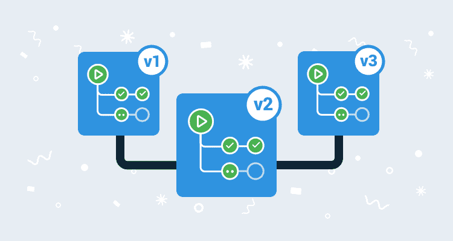

# 持续运送八达通-八达通展开

> 原文：<https://octopus.com/blog/continuous-delivery-of-octopus>

## 每夜构建和持续部署

一段时间以来，我们一直在执行一项长期任务，以增加工作流程，减少我们所有团队的反馈时间。在 2021 年初，我们仍然面临一些关键的制约因素:

*   我们的部署管道经常遭受“比特腐蚀”。
*   我们的代码变更经常停留在比我们想要的时间更长的分支上。

截至本周，我们已经交付了一些关键的更改，以帮助我们发布更快、更高质量的版本。

## 持续部署

我们现在正在练习将 Octopus 服务器、触手和 Octopus CLI 持续部署到内部客户环境，以及将 T2 持续交付到外部客户环境。

这对你意味着什么？

好吧，我们现在从每个提交到通过所有测试的可发布分支中自动创建一个发布，而不是必须做出部署一个发布的深思熟虑的决定。成功的构建部署到我们的内部环境，然后经过一段合适的“烘焙时间”，部署到 Octopus Cloud，然后部署到网站。这意味着我们在追求交付高质量产品的过程中不断“喝自己的香槟”。

您可以阅读更多关于我们如何看待[持续交付和持续部署](/blog/ten-pillars-of-pragmatic-deployments#continuous-integration-continuous-delivery-and-continuous-deployment)之间差异的信息。

### 每夜构建

对于我们旧的 LTS 版本，我们发现“比特腐烂”导致我们的管道失败，因为我们只在需要向旧版本发布补丁时才使用它们。现在，除了我们的提交触发构建之外，我们每晚为每个潜在可发布的分支触发一次构建，以清理所有管道，在出现问题时及早提醒我们，这反过来使问题更容易诊断，修复成本更低。

### 主要版本.次要版本.内部版本

不过，夜间构建确实给我们带来了有趣的挑战。使用我们之前的编号方案(`major.minor.patch`)，每天晚上的重新构建将导致每次 Git 提交的多次构建，并且我们的构建编号只有在提交后才会改变。这意味着我们最终得到了具有相同版本号的多个版本。许多下游系统(如 nuget.org、registry.npmjs.org)不喜欢不同的包有相同的版本号，这意味着我们需要一个新的计划。

我们现在使用一种`major.minor.build`编号策略。这意味着补丁数量比我们习惯的要大得多，但实际上，它只是一个数字。因为这是一个内部版本号，所以版本号之间会有差距，但是你总是想得到最新的版本号。

顺便说一句，我们沿着这条道路的旅程意味着我们已经偏离了 [GitVersion](https://github.com/GitTools/GitVersion) 的设计目标很远，我们最终编写了自己的版本计算器 [OctoVersion](https://github.com/OctopusDeploy/OctoVersion) 。这更好地处理了我们的多个发布流，并且因为它是以我们的用例为中心的，所以它也更快。

### 使用 Git 修订图代替 GitHub 里程碑，更准确地计算从版本`X`到版本`Y`的发行说明

另一个有趣的变化是我们如何生成发行说明。我们以前使用 GitHub 里程碑，并在构建发布之前分配它们。现在，当我们为每一个提交构建一个版本时，我们使用 Git 修订图来计算哪个修正进入了哪个版本。这意味着更准确的发行说明。

### 更好地处理有效/无效升级路径

现在我们使用 Git 修订图来计算这些发行说明，我们也获得了一些关于可行升级路径的知识。以前，**2020.4.13➜2020.5.0**看起来是有效的升级路径，但实际上会回到以前，因为 2020 . 5 . 0 是在 2020 . 4 . 13 创建之前分支的。这偶尔会导致一些错误，比如数据库发生了意料之外的结构变化。现在，我们显示一个警告，这不是一个可行的升级路径，这意味着整个类的错误被避免。

## 结论

我们对这些变化感到非常兴奋！它们将帮助我们将更多的精力放在改进 Octopus 上，让 Octopus 云客户更快地获得这些改进，并在升级他们的自托管安装时为我们的客户提供更好的体验。