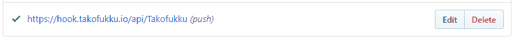
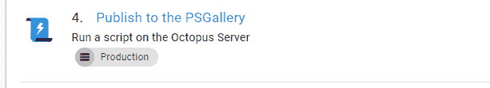

# 使用 Octopus Deploy 和 TakoFukku - Octopus Deploy 连续交付 PowerShell 模块

> 原文：<https://octopus.com/blog/continuous-delivery-powershell-octopus-takofukku>

传统上，Octopus Deploy 是一个推出应用程序的引擎——从历史的角度来说。NET 应用程序-到服务器。但如今，远不止如此。

因为 Octopus 是一个优秀的分布式任务运行器，具有丰富的预滚动模板集，所以它可以用于驱动许多工作负载和流程，否则这些工作负载和流程可能需要手动完成，或者使用在 CI 服务器中运行的精心手工滚动的脚本来完成。事实上，对于 PowerShell 模块来说，它们通常是小而分散的功能块，没有长时间的编译阶段，Octopus 是一个完美的选择。

我有几个开源项目，我使用 Octopus 来驱动对它们的测试和发布，所以今天我将使用 StatusCakeDSC 作为一个例子，向您介绍这是如何完成的。StatusCakeDSC 是一个用于设置状态监控的状态配置模块。我们在八达通这里用它，我自己也用它。它可以在 PowerShell Gallery 上获得，当我想发布新版本时，Octopus 会为我完成这项工作。

[](#)

## 项目设置

这只是一个标准的 Octopus 项目，但是你会注意到这里的一切都运行在 Octopus 服务器上。这并不一定；只是在基础设施方面更便宜。这些步骤基本上可以在任何安装了 PowerShell 的目标上运行，因此我可以针对一个 VM、一个容器，甚至是我的家庭网络上的一个轮询触角。

我在项目中存储了一些重要的、敏感的变量。我的 PowerShell Gallery 的 NuGet API 密钥，我的 StatusCake 凭据，这样我就可以运行测试和我的 Slack webhook 端点。这使得我可以将这些敏感的字符串远离 GitHub，所以我很少有机会不小心发布它们。我发现对于这样的项目来说，使用八达通是保护我的秘密安全和远离公众视线的好方法。

然后我有一套相当简单的 Octopus 步骤来完成这项工作，稍后我将概述一下。

对于这个项目，我有两个环境，`DevTest`和`Production`。当部署到`Production`时，所有的步骤都被配置为运行。但在 DevTest 中，我明确排除了“发布到 PS Gallery”这一步。这是为生产保留的，因为我不希望预发布代码错误地进入画廊。

## 触发项目

该项目使用 Webhooks 基于 Github 中的提交触发，使用我的一个名为 Takofukku 的小项目。Takofukku 是一个面向 Octopus deploy 的轻量级、无服务器的 webhook 解决方案，开放给任何人使用。您只需将一个名为 [takofile](https://github.com/stopthatastronaut/takofukku/blob/master/takofiles.md) 的 YAML 文档放入 GitHub repo 中，[在 push 事件上配置一个 webhook](https://github.com/stopthatastronaut/takofukku#ok-so-how-do-i-hook-this-up) ，就可以开始了。

[](#)

每次 push 事件发生时，GitHub 都会向端点发送 POST 请求。Takofukku 接收这个钩子，然后从指定的 repo 中获取 takofile，如果找到有效的映射，就在您的 Octopus 服务器上触发 Octopus 部署。GitHub 上有完整的文档，当然也接受拉取请求。

在这个具体的例子中，我的 takofile 将 GitHub `master`分支映射到 Octopus `production`环境，将 GitHub `develop`分支映射到 Octopus `DevTest`环境。每当我们在这些分支上进行推送/合并时，Takofukku 将创建一个新的发布，将最后一次推送的提交消息作为发布说明，并将该发布部署到指定的环境中。

## 获取代码

[](#)

它做的第一件事是 git pull，使用来自章鱼库的[社区步骤模板。如果我们在`Production`部署，我们克隆`master`分支。如果在`DevTest`中，我们克隆`develop`，使用一个简单的作用域变量。](https://library.octopus.com/step-templates/5c08170d-e919-4afe-9da3-7616c797d42b/actiontemplate-git-pull-(https))

在这个步骤之后，您可以看到有一个编写. creds 文件的步骤。这是特定于模块的，因为 StatusCakeDSC 允许你在磁盘上存储凭证，使测试变得更容易——这在模块的库的[中有解释，所以我在这里不赘述。](https://github.com/stopthatastronaut/StatusCakeDSC/blob/master/README.md#credentials)

## 运行测试

[](#)

StatusCakeDSC 使用 Pester 来运行测试，这个 PowerShell 脚本步骤非常简单:

```
$error.Clear()             # make sure errors are empty
pushd c:\StatusCakeDSC     # make sure we're in the right working path
# invoke pester
$failcount = Invoke-Pester -EnableExit -Verbose
if($failcount -gt 0 -or $error.count -gt 0)  # if tests have failed _or_ the step has thrown errors, exit
{
    Fail-Step "Pester returned $failcount failed tests"
}
popd 
```

我在 Pester 测试中发现的一个小问题是，测试直接范围之外的错误并不总是如预期的那样失败。因此，这一步检查步骤中的纠缠故障和一般错误，然后如果出现问题，使用 Octopus 的`Fail-Step` cmdlet 使部署失败。

## 发布到 PowerShell 画廊

[](#)

我尊敬的同事 Chris van Dal 不久前请求将`publish.ps1`添加到这个 repo 中，以便我可以轻松地部署到 PS Gallery 中。你可以在 GitHub repo 上看到这个脚本[，它几乎是大多数 PowerShell 模块作者用来推出他们的模块的。我只是从我的章鱼步骤如下驱动它:](https://github.com/stopthatastronaut/StatusCakeDSC/blob/master/publish.ps1)

```
Set-Location c:\StatuscakeDSC
.\publish.ps1 -nugetapikey $psgalleryapikey 
```

此步骤的运行条件设置为仅在前面所有步骤都成功运行时运行，并且仅在生产环境中运行。

为了把这个放到 Octopus 中，我对原始脚本做了一些简单的调整。它现在:

*   将 API 键作为参数引入，这样我可以将它安全地存储在 Octopus 中。
*   检查模块清单以查找版本号。
*   检查 PowerShell 库以查看该版本是否已经发布。
*   如果成功，并且版本已经增加，它发布新的模块。
*   在最近的代码中，它将一个 git 标签推回到 GitHub 中，用图库中的版本号标记最新的代码。

## 完成这一切

[](#)

最后一步是一个[空闲通知](https://library.octopusdeploy.com/step-template/actiontemplate-slack-notify-deployment)，运行条件为“总是运行”。这一步足够智能，可以知道部署何时失败，并相应地调整其消息。我喜欢这个步骤模板，因为它意味着我甚至不需要登录我的 Octopus 服务器就可以知道在我提交一些提交之后部署是否正常。无论我身在何处，我的手机都会收到一个延迟通知。

因此，所有这一切的实际结果是，每当我想对 StatusCakeDSC 进行更改时，我真正需要做的就是合并到 git 中正确的分支，Octopus 将负责运行我的测试并发布到 Gallery。这是 PowerShell 模块的持续交付，我很喜欢。

请随意复制或增强这个过程，如果您添加了任何增强功能，请让我们知道。分散在 step 库中的这一步有很多改进的可能性，事实上，您可以编写的任何脚本都可以容纳在 Octopus 中。

愉快的部署！