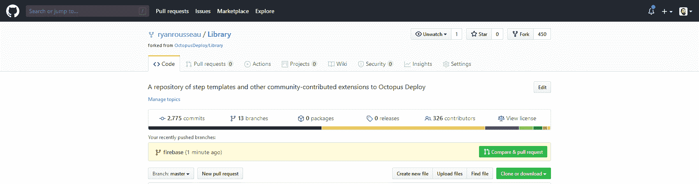

# 为 Octopus Deploy 社区库- Octopus Deploy 提供一个步骤模板

> 原文：<https://octopus.com/blog/contributing-a-step-template-to-the-octopus-deploy-community-library>

[](#)

我最近为 Firebase CLI deploy 命令创建了一个 Octopus Deploy [步骤模板。](https://octopus.com/blog/creating-an-octopus-deploy-step-template)

在这篇文章中，我将介绍 Octopus 社区库，并介绍提交新模板的过程。

[社区库](https://library.octopus.com/listing)是 step 模板和其他社区贡献的 Octopus Deploy 扩展的存储库。

库中的步骤由 Octopus、其他供应商和 Octopus 用户提供。

## 贡献的

如果您已经创作了一个步骤模板，您可以考虑将其贡献给库。

非常适合该库的步骤示例包括:

这不是一份详尽的清单。如果你有一个步骤模板的想法，并且你想要反馈，在 [GitHub](https://github.com/OctopusDeploy/Library/issues) 上打开一个问题。

也有[投稿指南](https://github.com/OctopusDeploy/Library/blob/master/.github/CONTRIBUTING.md)发布在知识库中。

该指南包括提交步骤模板的说明，以及步骤模板上提供的常见审核反馈的清单。

我将遵循这篇文章中的提交说明。

## 派生并克隆存储库

我分叉了 GitHub 中的存储库，这样我就有了一个可以工作的副本。

然后，我跳进终端窗口克隆存储库并开始一个分支。当我与 Git 交互时，我通常在终端中，但是您也可以使用您喜欢的 Git GUI 来完成这些步骤。

```
git clone https://github.com/ryanrousseau/Library.git rr_library
cd rr_library
git checkout -b firebase 
```

随着我的存储库的分叉和克隆，是时候导出我的模板了。

## 导出步骤模板

查看步骤模板时，您可以从操作菜单中选择**导出**将其导出。导出生成的 JSON 将进入存储库。

在一些老版本的 Octopus 中，作者需要更新 ID 和版本。在更新的版本中，Octopus 为作者设置了这些。

我的 Firebase 部署步骤的导出 JSON 是:

```
{
  "Id": "ac0dee2d-dcbe-42aa-96c6-bb6c644183b4",
  "Name": "Firebase - Deploy",
  "Description": "Deploys the contents of a package to a Firebase project using the [Firebase CLI deploy command](https://firebase.google.com/docs/cli/#deployment).",
  "ActionType": "Octopus.Script",
  "Version": 1,
  "CommunityActionTemplateId": null,
  "Packages": [
    {
      "Id": "343306b7-6997-429f-9ed5-4214ca4d32ac",
      "Name": "FirebaseDeploy.Package",
      "PackageId": null,
      "FeedId": "feeds-builtin",
      "AcquisitionLocation": "Server",
      "Properties": {
        "Extract": "True",
        "SelectionMode": "deferred",
        "PackageParameterName": "FirebaseDeploy.Package"
      }
    }
  ],
  "Properties": {
    "Octopus.Action.Script.ScriptSource": "Inline",
    "Octopus.Action.Script.Syntax": "Bash",
    "Octopus.Action.Script.ScriptBody": "packagePath=$(get_octopusvariable \"Octopus.Action.Package[FirebaseDeploy.Package].ExtractedPath\")\ntoken=$(get_octopusvariable \"FirebaseDeploy.CIToken\")\npublic=$(get_octopusvariable \"FirebaseDeploy.Public\")\nmessage=$(get_octopusvariable \"FirebaseDeploy.Message\")\nforce=$(get_octopusvariable \"FirebaseDeploy.Force\")\nonly=$(get_octopusvariable \"FirebaseDeploy.Only\")\nexcept=$(get_octopusvariable \"FirebaseDeploy.Except\")\nprintCommand=$(get_octopusvariable \"FirebaseDeploy.PrintCommand\")\nfirebasePath=$(get_octopusvariable \"FirebaseDeploy.FirebasePath\")\n\nif [ ! -z \"$firebasePath\" ] ; then\n   \tPATH=$firebasePath:$PATH\nfi\n\nif [ \"$force\" = \"True\" ] ; then\n    force=true\nelse\n    force=\nfi\n\nif [ \"$printCommand\" = \"True\" ] ; then\n    set -x\nfi\n\ncd $packagePath\n\nfirebase deploy ${public:+ -p \"$public\"} ${message:+ -m \"$message\"} ${force:+ -f} ${only:+ --only \"$only\"} ${except:+ --except \"$except\"} --token $token"
  },
  "Parameters": [
    {
      "Id": "55ddf9fd-bf2f-4148-912b-bc599c5f6ec6",
      "Name": "FirebaseDeploy.Package",
      "Label": "Package",
      "HelpText": "The package containing the Firebase project being deployed.",
      "DefaultValue": "",
      "DisplaySettings": {
        "Octopus.ControlType": "Package"
      }
    },
    {
      "Id": "46874eaf-7632-40d1-bd46-4627bd0f2d0c",
      "Name": "FirebaseDeploy.FirebasePath",
      "Label": "Firebase Path",
      "HelpText": "The path to the directory containing the Firebase CLI, if not in $PATH.",
      "DefaultValue": "",
      "DisplaySettings": {
        "Octopus.ControlType": "SingleLineText"
      }
    },
    {
      "Id": "c982c1f3-a91e-4dd4-89a6-db5d99b08347",
      "Name": "FirebaseDeploy.CIToken",
      "Label": "CI Token",
      "HelpText": "A CI token generated by the [Firebase CLI](https://firebase.google.com/docs/cli/#cli-ci-systems)",
      "DefaultValue": "",
      "DisplaySettings": {
        "Octopus.ControlType": "Sensitive"
      }
    },
    {
      "Id": "56628161-6b99-4ca3-9c4a-1234117a0018",
      "Name": "FirebaseDeploy.Public",
      "Label": "Public Path",
      "HelpText": "Override the Hosting public directory specified in firebase.json.",
      "DefaultValue": "",
      "DisplaySettings": {
        "Octopus.ControlType": "SingleLineText"
      }
    },
    {
      "Id": "e7c41fcb-dd74-4ba2-9671-fa7313d632b8",
      "Name": "FirebaseDeploy.Message",
      "Label": "Message",
      "HelpText": "An optional message describing this deploy.",
      "DefaultValue": "",
      "DisplaySettings": {
        "Octopus.ControlType": "SingleLineText"
      }
    },
    {
      "Id": "6a88a428-a538-4292-b6ee-b843c28887f3",
      "Name": "FirebaseDeploy.Force",
      "Label": "Force?",
      "HelpText": "Delete Cloud Functions missing from the current working directory without confirmation.",
      "DefaultValue": "",
      "DisplaySettings": {
        "Octopus.ControlType": "Checkbox"
      }
    },
    {
      "Id": "c0debcc3-6708-4d3c-977b-880811b48594",
      "Name": "FirebaseDeploy.Only",
      "Label": "Only Targets",
      "HelpText": "Only deploy to specified, comma-separated targets (e.g. \"hosting,storage\"). For functions, can specify filters with colons to scope function deploys to only those functions (e.g. \"--only functions:func1,functions:func2\"). When filtering based on export groups (the exported module object keys), use dots to specify group names (e.g. \"--only functions:group1.subgroup1,functions:group2)\".",
      "DefaultValue": "",
      "DisplaySettings": {
        "Octopus.ControlType": "SingleLineText"
      }
    },
    {
      "Id": "e62a6b0f-6331-4a63-a908-c759798ccd1c",
      "Name": "FirebaseDeploy.Except",
      "Label": "Except Targets",
      "HelpText": "Deploy to all targets except specified (e.g. \"database\").",
      "DefaultValue": "",
      "DisplaySettings": {
        "Octopus.ControlType": "SingleLineText"
      }
    },
    {
      "Id": "e2e0ac14-e5e9-4b3c-bdc1-b1da3d7be184",
      "Name": "FirebaseDeploy.PrintCommand",
      "Label": "Print Command?",
      "HelpText": "Prints the command in the logs using `set -x`. This will cause a warning when the step runs.",
      "DefaultValue": "",
      "DisplaySettings": {
        "Octopus.ControlType": "Checkbox"
      }
    }
  ],
  "$Meta": {
    "ExportedAt": "2020-06-08T19:44:37.662Z",
    "OctopusVersion": "2020.2.11",
    "Type": "ActionTemplate"
  },
  "LastModifiedBy": "Your GitHub Username",
  "Category": "other"
} 
```

它几乎准备好提交。我只需要将`LastModifiedBy`设置为我的 GitHub 用户名，并将类别设置为“firebase”

幸运的是，命名进入存储库的文件并不困难。我将 JSON 保存在`step-templates\firebase-deploy.json`中。

## 添加 Firebase 类别

`Firebase - Deploy`是`firebase`类别中的第一步库。我需要添加一个标志，并更新网站来处理类别。

我追踪到一个标志，并将其保存为`step-templates\logos\firebase.png`。

我打开`.gulpfile.babel.js`，找到`humanize`功能。我为 Firebase 添加了一个案例。

```
 case 'firebase': return 'Firebase'; 
```

## 测试

我可以在本地运行图书馆网站，以确保我没有错过任何东西。

我需要安装`gulp`来构建和测试网站:

```
npm install -g gulp 
```

然后，我安装依赖项，构建并启动站点:

```
npm install
gulp
node build/server.js 
```

我导航到`http://localhost:9000`并搜索`firebase`:

[](#)

看起来一切正常。是时候创建一个拉取请求了。

## 提交更改

我将我的更改存放并提交到库中，然后将它们推送到我的存储库分支:

```
git add ./gulpfile.babel.js
git add ./step-templates/firebase-deploy.json
git add ./step-templates/logos/firebase.png
git commit -m "Add Firebase - Deploy template"
git push -u origin firebase 
```

## 提交拉取请求

我在 GitHub 中导航到我的[分支。我看到 GitHub 已经选择了新的分支，并提供给我一个**比较&拉取请求**按钮。](https://github.com/ryanrousseau/Library)

[](#)

我单击按钮启动拉取请求流程。GitHub 默认拉请求目标为原始存储库。这是正确的，所以我不改变它。

拉请求模板包括两个部分。第一部分是指南的副本。我确认我的模板符合指导原则。然后我按照说明删除了第一部分。

第二部分是步骤模板需要完成的项目清单。我检查列表，确认我的步骤遵循了这些规则。

我提交了[拉取请求](https://github.com/OctopusDeploy/Library/pull/929)。在这篇文章发表时，它可能会被关闭，但任何评论和更改的历史记录都将可用。

## 后续步骤

在合并拉取请求之前，需要签署一份贡献者许可协议。还有一个自动构建来确保站点的构建。拼图的最后一块是 Octopus 团队的评论。

Octopod 的一个同伴将检查这些变化，以确保我遵循了指南，并且这一步是对库的一个有价值的补充。

如果有任何更改，我会进行更改，并将其添加到 pull 请求中，以便再次审核。

请求获得批准后，审阅者会将步骤合并到库中。将开始构建和部署库网站。几分钟后，其他八达通用户将可以使用该步骤。

## 结论

[八达通社区图书馆](https://library.octopus.com/listing)举办了各种各样的社区贡献的步骤。为了他人的利益，您可以向库提交模板。