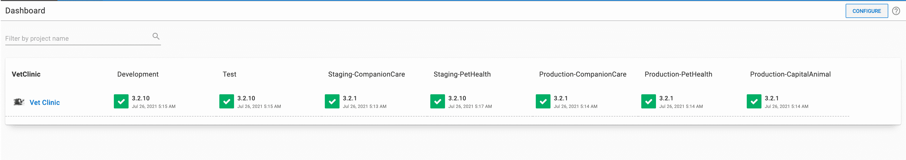
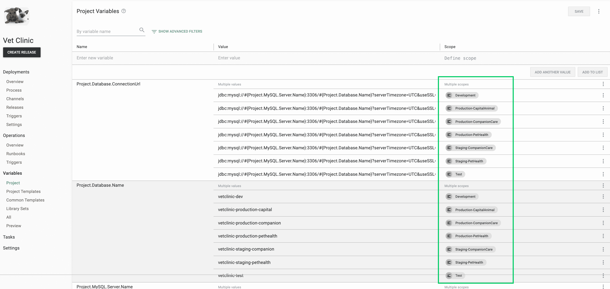
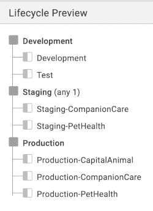
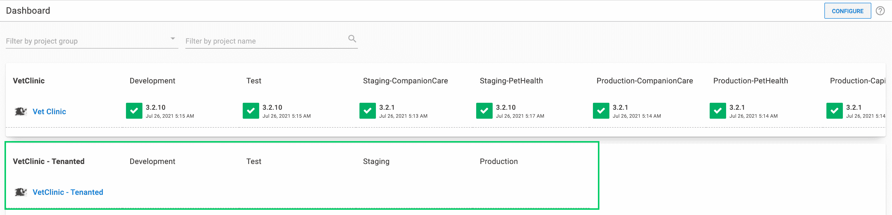
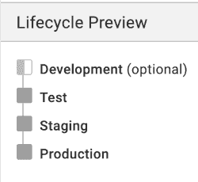
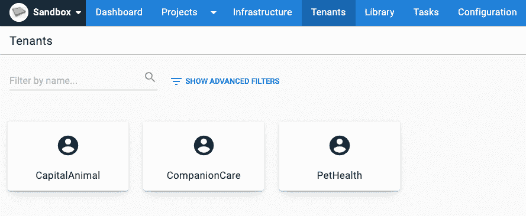
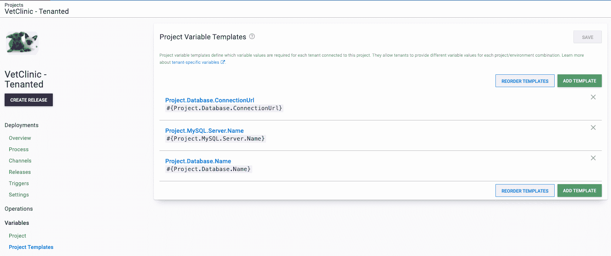
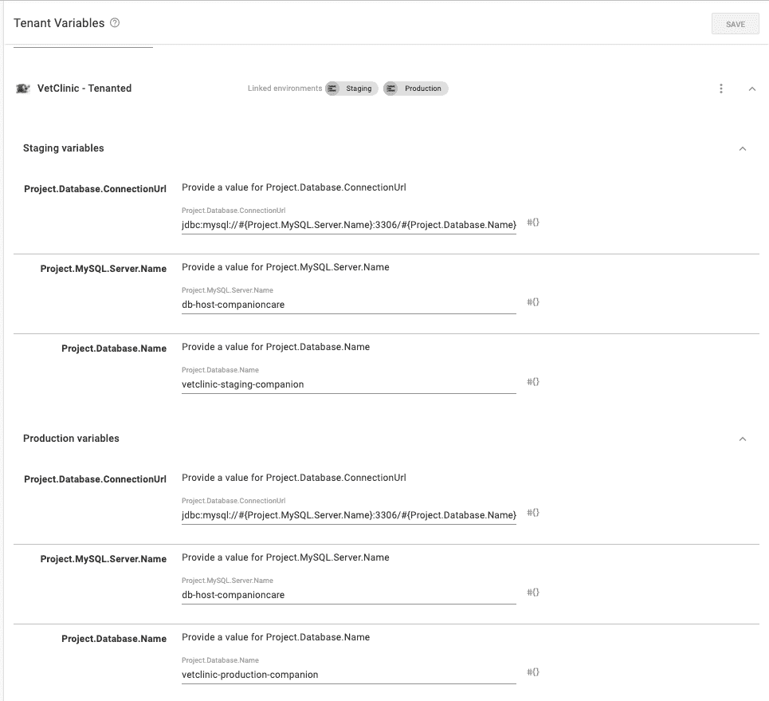

# 通过 Octopus API - Octopus Deploy 将许多环境转换为租户

> 原文：<https://octopus.com/blog/converting-to-tenants-via-api>

在之前的帖子中，Mark Harrison 在 Octopus 中写了关于多租户的好处。从一开始就设计一个适合多租户的应用程序比改造一个更容易，但是您应该如何处理现有的应用程序呢？我经常看到人们在为他们的每个客户部署同一应用程序的多个实例时创建特定于客户的环境。这可能导致复杂的生命周期、不清晰的发布仪表板以及复杂的项目变量范围。

幸运的是，从 Octopus 2.0 开始，Octopus REST API 已经可以用来帮助管理多租户。

使用一个名为 [Vet Clinic](https://samples.octopus.app/app#/Spaces-682/projects/vet-clinic/deployments) 的示例项目，我演示了如何利用 Octopus REST API 并开始自动转换到多租户。

## 初始项目状态

[Vet Clinic 项目](https://samples.octopus.app/app#/Spaces-682/projects/vet-clinic/deployments)的概览屏幕显示了您可以部署项目的各种环境。有些环境是特定于客户的，包括客户名称。这些是您转换为租户的环境。

[](#)

该项目针对每个环境设定了多个变量，以便为客户指定价值。您将客户环境范围内的变量转换为项目模板，以便为您创建的每个租户提供用于租赁部署的特定变量值。

通用环境范围内的变量，例如开发和测试，作为未租用部署的项目特定变量保存。

[](#)

最后一部分是项目的生命周期。每个客户都有他们特定的环境，生命周期中的每个阶段都有多个环境，您可以将项目部署到这些环境中。

您为项目可以部署到的每个阶段创建一个具有单一环境的新生命周期。旧的生命周期决定了每个新租户可以将项目部署到哪些环境中。

[](#)

## 入门指南

要开始转换过程，您需要在现有的 Vet Clinic 项目旁边创建一个新项目。通过[克隆现有项目](https://octopus.com/docs/projects#clone-a-project)来实现这一点。克隆允许您并行测试变更，而不用担心会中断您当前项目的部署。

当您对克隆项目的结果满意后，删除它并在原始项目上运行转换脚本。或者，您可以将所有内容移动到新的、克隆的项目中，并最终淘汰原始项目。

[](#)

接下来，您将为项目创建一个新的简化生命周期，以便在转换完成后使用。生命周期中的每个阶段都有一个单一的部署环境，这提供了一个更全面的视图，可以了解哪个版本部署到了哪个环境和租户。

[](#)

## 创建脚本

提供的示例仅供参考，在用于生产 Octopus 实例之前，应该进行修改和测试。

有了这两个部分，您就可以开始创建脚本了。对于第一个脚本，您从旧环境中创建租户。

您需要指定以下输入:

*   `$projectnames`:您希望您的租户加入的项目
*   `$tenantTags`:租户标签应用于所有新创建的租户
*   `$spaceName`:你的项目所在的 Octopus 空间名
*   `$lifecycleName`:您的未承租项目正在使用的旧生命周期的名称
*   `$newEnvironmentNames`:不转换为租户的环境列表

设置好这些输入后，脚本得到一个要转换的*旧环境*的列表。

当遍历旧环境列表时，会发生一些事情:

*   因为环境名称遵循`EnvironmentName-CustomerName`的约定，所以它解析出所需的租户名称。
*   从新租户名称开始，检查该租户是否已经存在。
*   为了确定每个租户应该部署到哪个新环境，该脚本循环遍历旧生命周期中的每个阶段。
*   输入的项目与租户应该部署到的环境相结合。
*   如果租户不存在，脚本将调用 API 用收集的数据创建一个新的租户。
*   如果租户不存在，脚本将发送一个请求，为租户提供它应该为项目部署的环境。

<details><summary>完整脚本创建*租户*from _ environments . PS1</summary></details>

```
$ErrorActionPreference = "Stop";

# Define working variables
$octopusURL = "https://youroctopus.octopus.app"
$octopusAPIKey = "API-YOURAPIKEY"
$header = @{ "X-Octopus-ApiKey" = $octopusAPIKey }

# Provide project names to attach new tenants to.
$projectNames = @("VetClinic - Tenanted")

# Optionally, provide existing tenant tagsets you wish to apply.
$tenantTags = @() # Format: TagSet/Tag

# Provide the space name
$spaceName = "Sandbox"
# Get space
$space = (Invoke-RestMethod -Method Get -Uri "$octopusURL/api/spaces/all" -Headers $header) | Where-Object {$_.Name -eq $spaceName}

# Provide the old lifecycle name
$lifecycleName = "Vet Clinic"
# Get lifecycle
$lifecycle = (Invoke-RestMethod -Uri "$octopusURL/api/$($space.Id)/lifecycles/all" -Headers $header) | Where-Object {$_.Name -eq $lifecycleName}

# List of environments to not convert to tenants
$newEnvironmentNames = @("Development","Test","Staging","Production")

# List of environment names and ids being converted to Tenants
$oldEnvionments = (Invoke-RestMethod -Uri "$octopusURL/api/$($space.Id)/environments/all" -Headers $header) | Where-Object {$_.Name -notin $newEnvironmentNames} | Select-Object -Property Id,Name

# Get the environment ids to attach the tenant to from the phase in the old lifecycle that the environment was apart of
function Build-EnvironmentIds {
    param ($oldEnvId)

    $environmentIds = @()

    foreach ($phase in $lifecycle.Phases) {
        if ($phase.AutomaticDeploymentTargets -contains $oldEnvId -or $phase.OptionalDeploymentTargets -contains $oldEnvId)
        {
            $newEnvId = (Invoke-RestMethod -Method Get -Uri "$octopusURL/api/$($space.Id)/environments/all" -Headers $header) | Where-Object {$_.Name -eq $phase.Name} | ForEach-Object {$_.Id}
            $environmentIds += $newEnvId
        }
    }

    ,$environmentIds
}

# Parse the old environment name for the new tenants name
function Edit-EnvironmentName {
    param ($oldEnvName)

    $start = $oldEnvName.IndexOf("-")+1
    $end = $oldEnvName.Length
    $newName = $oldEnvName.Substring($start, ($end-$start))
    $newName
}

# Get projects to attach tenants to
$projectIds = @()
foreach ($projectName in $projectNames)
{
    $projectIds += ((Invoke-RestMethod -Method Get -Uri "$octopusURL/api/$($space.Id)/projects/all" -Headers $header) | Where-Object {$_.Name -eq $projectName}).Id
}

# Loop though the old environment and create tenants
foreach($oldEnv in $oldEnvionments) {
    $tenantName = Edit-EnvironmentName($oldEnv.Name)

    # Check if tenant already exists
    $existingTenant = (Invoke-RestMethod -Method Get -Uri "$octopusURL/api/$($space.Id)/tenants/all" -Headers $header) | Where-Object {$_.Name -eq $tenantName}

    # Get environment ids to attach the tenants to
    $envIds = Build-EnvironmentIds($oldEnv.Id)

    # New tenant creation
    if ($null -eq $existingTenant) {        
        # Build project/environments
        $projectEnvironments = @{}
        foreach ($projectId in $projectIds)
        {
            $projectEnvironments.Add($projectId, $envIds)
        }

        # Build json payload
        $jsonPayload = @{
            Name = $tenantName
            TenantTags = $tenantTags
            SpaceId = $space.Id
            ProjectEnvironments = $projectEnvironments
        } | ConvertTo-Json

        # Create tenant
        Invoke-RestMethod -Method Post -Uri "$octopusURL/api/$($space.Id)/tenants" -Body $jsonPayload -Headers $header -ContentType "application/json"
    }
    else {

        foreach ($projectId in $projectIds) {
            $existingTenant.ProjectEnvironments.($projectId) += $envIds
        }

        $jsonPayload = $existingTenant | ConvertTo-Json

        # Update tenant
        Invoke-RestMethod -Method Put -Uri "$octopusURL/api/$($space.Id)/tenants/$($existingTenant.Id)" -Body $jsonPayload -Headers $header -ContentType "application/json"
    }
} 
```

* * *

创建租户后，您需要编写以下脚本，将旧的项目变量转换成变量模板，为每个租户提供一个值。

该脚本需要以下输入:

*   `$projectNames`:包含当前项目变量的*旧*项目名称，以及您想要为其创建变量模板的项目的*新*名称
*   `$$newEnvironmentNames`:环境名称列表，用于确定每个租户的项目变量和模板变量的范围
*   `$spaceName`:包含项目的 Octopus 空间名称

从指定的*旧项目*中检索项目变量列表。然后，该脚本遍历每个变量以及该变量的每个环境范围。

如果作用域环境是您将用于租用部署的新环境之一，那么将创建一个项目变量。否则，脚本将创建一个变量模板。

在这两种情况下，都会检查项目变量或变量模板是否已经存在。当它们不存在时，旧变量的细节被用来创建新的变量类型，它们被添加到各自的集合中，在脚本开始时被检索。

循环结束后，有一个对 API 的调用来更新项目的变量集合，还有一个调用来更新项目变量模板。

在为项目创建变量模板的 API 调用之后，脚本循环遍历每个变量，为每个租户的模板提供值。旧变量的环境范围被循环，以解析出该值所属的环境和租户的名称。解析的租户名称检索租户数据。

从租户数据开始，脚本循环遍历附加到租户的每个项目环境，然后遍历每个模板，直到旧变量的名称与模板的名称匹配，并且项目环境与环境范围匹配。进行 API 调用，用新值更新租户的变量。

<details><summary>完整脚本创建*项目*变量*和*模板. ps1</summary></details>

```
$ErrorActionPreference = "Stop";

# Define working variables
$octopusURL = "https://youroctopus.octopus.app"
$octopusAPIKey = "API-YOURAPIKEY"
$header = @{ "X-Octopus-ApiKey" = $octopusAPIKey }

# Provide the current project name and the new project name.
$projectNames = @{
    old = "Vet Clinic" 
    new = "VetClinic - Tenanted"
}

# Names of new environments
$newEnvironmentNames = @("Development","Test","Staging","Production")
$newEnvironmentIds = (Invoke-RestMethod -Uri "$octopusURL/api/$($space.Id)/environments/all" -Headers $header) | Where-Object {$_.Name -in $newEnvironmentNames} | ForEach-Object {$_.Id}

# Provide the space name
$spaceName = "Sandbox"
# Get space
$space = (Invoke-RestMethod -Method Get -Uri "$octopusURL/api/spaces/all" -Headers $header) | Where-Object {$_.Name -eq $spaceName}

# Get old project
$oldProject = (Invoke-RestMethod -Method Get -Uri "$octopusURL/api/$($space.Id)/projects/all" -Headers $header) | Where-Object {$_.Name -eq $projectNames['old']}

# Get new project
$newProject = (Invoke-RestMethod -Method Get -Uri "$octopusURL/api/$($space.Id)/projects/all" -Headers $header) | Where-Object {$_.Name -eq $projectNames['new']}

# Get old variable set
$oldVariableSet = Invoke-RestMethod -Method Get -Uri "$octopusURL/api/$($space.Id)/variables/$($oldProject.VariableSetId)" -Headers $header

# Get the new projects variables
$newProjectVariables = Invoke-RestMethod -Method Get -Uri "$octopusURL/api/$($space.Id)/variables/$($newProject.VariableSetId)" -Headers $header

# Get the tenants attached to the new project
$tenants = Invoke-RestMethod -Method Get -Uri "$octopusURL/api/$($space.Id)/tenants/all?projectId=$($newProject.Id)" -Headers $header 

# Create a new project variable
function New-Project-Variable {
    param (
        $oldVariable
    )
    # Check to see if variable is already present
    $variableToUpdate = $newProjectVariables.Variables | Where-Object {$_.Name -eq $oldVariable.Name -and $_.Scope -eq $oldVariable.Scope} 

    # If the variable does not exist create it
    if ($null -eq $variableToUpdate)
    {
        # Create new object
        $variableToUpdate = New-Object -TypeName PSObject
        $variableToUpdate | Add-Member -MemberType NoteProperty -Name "Name" -Value $oldVariable.Name
        $variableToUpdate | Add-Member -MemberType NoteProperty -Name "Value" -Value $oldVariable.Value
        $variableToUpdate | Add-Member -MemberType NoteProperty -Name "Type" -Value $oldVariable.Type
        $variableToUpdate | Add-Member -MemberType NoteProperty -Name "IsSensitive" -Value $oldVariable.IsSensitive
        $variableToUpdate | Add-Member -MemberType NoteProperty -Name "Scope" -Value $oldVariable.Scope

        # Add to collection
        $newProjectVariables.Variables += $variableToUpdate

        $newProjectVariables.Variables
    } 
}

# Create a new project template variable
function New-Project-Template {
    param (
        $oldVariable
    )

    # Check to see if the template already exists
    $templateToUpdate = $newProject.Templates | Where-Object {$_.Name -eq $oldVariable.Name}

    # If the template does not exist, create it
    if ($null -eq $templateToUpdate) {
        $templateToUpdate = New-Object -TypeName PSObject
        $templateToUpdate | Add-Member -MemberType NoteProperty -Name "Name" -Value $oldVariable.Name
        $templateToUpdate | Add-Member -MemberType NoteProperty -Name "DisplaySettings" -Value @{'Octopus.ControlType' = 'SingleLineText'}

        # Add to collection
        $newProject.Templates += $templateToUpdate

        $newProject.Templates
    }
}

# Create project template values for tenants
function New-Template-Values {
    param (
        $oldVariable
    )

    foreach ($envScope in $oldVariable.Scope.Environment) {

        # Get environment name from the old environment scope
        $environmentName = ($oldVariableSet.ScopeValues.Environments | Where-Object {$_.Id -eq $envScope}).Name

        if ($environmentName -notin $newEnvironmentNames)
        {
            $tenantNameAndEnvironment = $environmentName.Split("-")
            $tenantName = $tenantNameAndEnvironment[1]
            $newEnvironment = $tenantNameAndEnvironment[0]
            $environmentId = (Invoke-RestMethod -Uri "$octopusURL/api/$($space.Id)/environments/all" -Headers $header) | Where-Object {$_.Name -eq $newEnvironment} | ForEach-Object {$_.Id}

            # Get the tenant with that name
            $tenant = $tenants | Where-Object {$_.Name -eq $tenantName}
            # Get tenants variable set
            $tenantVariables = (Invoke-RestMethod -Method Get -Uri "$octopusURL/api/$($space.Id)/tenants/$($tenant.Id)/variables" -Headers $header)
            $newProjectId = $newProject.Id

            # Go through each tenant project environment and create a tenant template value for the corresponding template 
            foreach ($projectEnv in $tenant.ProjectEnvironments.$newProjectId) {
                foreach ($template in $tenantVariables.ProjectVariables.$newProjectId.Templates) {
                    if ($oldVariable.Name -eq $template.Name -and $projectEnv -eq $environmentId) {
                        $tenantVariables.ProjectVariables.$newProjectId.Variables.$projectEnv | Add-Member -MemberType NoteProperty -Name $template.Id -Value $oldVariable.Value
                    }
                }
            }

            # Update the variables with the new value
            Invoke-RestMethod -Method Put -Uri "$octopusURL/api/$($space.Id)/tenants/$($tenant.Id)/variables" -Headers $header -Body ($tenantVariables | ConvertTo-Json -Depth 10)
        }
    }
}

# Go through old project variables to create new project variables and template variables
foreach ($oldVariable in $oldVariableSet.Variables) {

    foreach ($environment in $oldVariable.Scope.Environment)
    {
        # Create project variables to old variables scoped to non tenant environments
        if ($environment -in $newEnvironmentIds) {
            # Create new project variable
            New-Project-Variable($oldVariable)
        }
        else {
            # Create new project template
            New-Project-Template($oldVariable)
        }   
    }  
}

# Update the new projects variable collection
Invoke-RestMethod -Method Put -Uri "$octopusURL/api/$($space.Id)/variables/$($newProject.VariableSetId)" -Headers $header -Body ($newProjectVariables | ConvertTo-Json -Depth 10)

# Update the new projects templates
Invoke-RestMethod -Method Put -Uri "$octopusURL/api/$($space.Id)/projects/$($newProject.Id)" -Headers $header -Body ($newProject | ConvertTo-Json -Depth 10)

# Loop through old variables again to update tenant variable values after the project templates have been created
foreach ($oldVariable in $oldVariableSet.Variables) {
    New-Template-Values($oldVariable)
} 
```

## 最终结果

对兽医诊所项目运行这两个脚本后，您可以看到脚本创建的新项目。

在租户控制面板上，您现在可以看到三个不同的租户:

[](#)

*兽医诊所租赁*项目现在只有新环境范围内的项目变量:

[](#)

该项目还包括新的变量模板，为每个租户提供一个值:

[](#)

在每个新租户中，变量值已经使用旧项目变量的范围和值针对每个环境进行了更新:

[](#)

要开始在部署中使用新租户，您需要设置您的[基础设施](https://octopus.com/docs/tenants/tenant-infrastructure)和任何您想要用来管理租户组的[租户标签](https://octopus.com/docs/tenants/tenant-tags)。

## 结论

Octopus 中的多租户是一个强大的特性，您可以利用它来创建可伸缩的、可重用的、简化的部署。然而，将一个相当大的现有项目转换成多租户似乎是一项艰巨的任务。

这篇文章展示了将现有项目转换为多租户的几个步骤。我希望它演示了 Octopus API 如何帮助您自动化这个过程中的步骤，节省您的时间和在 UI 中单击数百次鼠标的可能性。

## 了解更多信息

## 观看网络研讨会:使用 Octopus Deploy 实现更好的多租户部署

[https://www.youtube.com/embed/dD8psiK1wL4](https://www.youtube.com/embed/dD8psiK1wL4)

VIDEO

我们定期举办网络研讨会。请参见[网络研讨会页面](https://octopus.com/events)了解过去的网络研讨会以及即将举办的网络研讨会的详细信息。

愉快的部署！