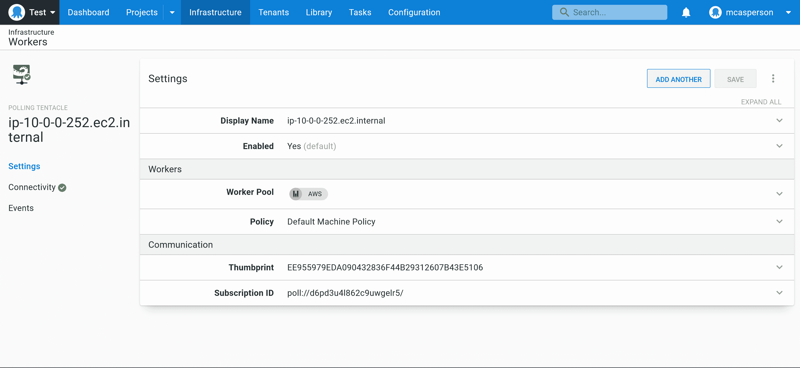

# 使用 CloudFormation - Octopus Deploy 创建 EC2 Octopus Worker

> 原文：<https://octopus.com/blog/creating-aws-cf-octopus-worker-cloudformation>

Workers 允许您将部署的执行委托给一台机器，该机器具有对正在修改的资源的特权访问，安装了专门的工具，或者只是为了消除从 Octopus 服务器执行部署的负担。

EC2 实例为托管 Octopus 工人提供了一个逻辑解决方案。

在本文中，您将学习如何使用 CloudFormation 将 Octopus Worker 部署到新的 EC2 实例上。

## 完整的模板

下面的 CloudFormation 模板在新 VPC 的公共子网中部署了一个 EC2 实例，并作为 VMs 初始化的一部分安装了一个 Octopus 触手作为 Worker:

```
AWSTemplateFormatVersion: 2010-09-09
Parameters:
  InstanceTypeParameter:
    Type: String
    Default: t3a.medium
    AllowedValues:
    - c1.medium
    - c1.xlarge
    - c3.2xlarge
    - c3.4xlarge
    - c3.8xlarge
    - c3.large
    - c3.xlarge
    - c4.2xlarge
    - c4.4xlarge
    - c4.8xlarge
    - c4.large
    - c4.xlarge
    - c5.12xlarge
    - c5.18xlarge
    - c5.24xlarge
    - c5.2xlarge
    - c5.4xlarge
    - c5.9xlarge
    - c5.large
    - c5.metal
    - c5.xlarge
    - c5a.12xlarge
    - c5a.16xlarge
    - c5a.24xlarge
    - c5a.2xlarge
    - c5a.4xlarge
    - c5a.8xlarge
    - c5a.large
    - c5a.xlarge
    - c5d.12xlarge
    - c5d.18xlarge
    - c5d.24xlarge
    - c5d.2xlarge
    - c5d.4xlarge
    - c5d.9xlarge
    - c5d.large
    - c5d.metal
    - c5d.xlarge
    - c5n.18xlarge
    - c5n.2xlarge
    - c5n.4xlarge
    - c5n.9xlarge
    - c5n.large
    - c5n.metal
    - c5n.xlarge
    - c6g.12xlarge
    - c6g.16xlarge
    - c6g.2xlarge
    - c6g.4xlarge
    - c6g.8xlarge
    - c6g.large
    - c6g.medium
    - c6g.metal
    - c6g.xlarge
    - c6gd.12xlarge
    - c6gd.16xlarge
    - c6gd.2xlarge
    - c6gd.4xlarge
    - c6gd.8xlarge
    - c6gd.large
    - c6gd.medium
    - c6gd.metal
    - c6gd.xlarge
    - d2.2xlarge
    - d2.4xlarge
    - d2.8xlarge
    - d2.xlarge
    - g2.2xlarge
    - g2.8xlarge
    - g3.16xlarge
    - g3.4xlarge
    - g3.8xlarge
    - g4dn.12xlarge
    - g4dn.16xlarge
    - g4dn.2xlarge
    - g4dn.4xlarge
    - g4dn.8xlarge
    - g4dn.metal
    - g4dn.xlarge
    - i2.2xlarge
    - i2.4xlarge
    - i2.8xlarge
    - i2.xlarge
    - i3.16xlarge
    - i3.2xlarge
    - i3.4xlarge
    - i3.8xlarge
    - i3.large
    - i3.metal
    - i3.xlarge
    - i3en.12xlarge
    - i3en.24xlarge
    - i3en.2xlarge
    - i3en.3xlarge
    - i3en.6xlarge
    - i3en.large
    - i3en.metal
    - i3en.xlarge
    - inf1.24xlarge
    - inf1.2xlarge
    - inf1.6xlarge
    - inf1.xlarge
    - m1.large
    - m1.medium
    - m1.small
    - m1.xlarge
    - m2.2xlarge
    - m2.4xlarge
    - m2.xlarge
    - m3.2xlarge
    - m3.large
    - m3.medium
    - m3.xlarge
    - m4.10xlarge
    - m4.16xlarge
    - m4.2xlarge
    - m4.4xlarge
    - m4.large
    - m4.xlarge
    - m5.12xlarge
    - m5.16xlarge
    - m5.24xlarge
    - m5.2xlarge
    - m5.4xlarge
    - m5.8xlarge
    - m5.large
    - m5.metal
    - m5.xlarge
    - m5a.12xlarge
    - m5a.16xlarge
    - m5a.24xlarge
    - m5a.2xlarge
    - m5a.4xlarge
    - m5a.8xlarge
    - m5a.large
    - m5a.xlarge
    - m5ad.12xlarge
    - m5ad.16xlarge
    - m5ad.24xlarge
    - m5ad.2xlarge
    - m5ad.4xlarge
    - m5ad.8xlarge
    - m5ad.large
    - m5ad.xlarge
    - m5d.12xlarge
    - m5d.16xlarge
    - m5d.24xlarge
    - m5d.2xlarge
    - m5d.4xlarge
    - m5d.8xlarge
    - m5d.large
    - m5d.metal
    - m5d.xlarge
    - m5zn.12xlarge
    - m5zn.2xlarge
    - m5zn.3xlarge
    - m5zn.6xlarge
    - m5zn.large
    - m5zn.metal
    - m5zn.xlarge
    - m6g.12xlarge
    - m6g.16xlarge
    - m6g.2xlarge
    - m6g.4xlarge
    - m6g.8xlarge
    - m6g.large
    - m6g.medium
    - m6g.metal
    - m6g.xlarge
    - m6gd.12xlarge
    - m6gd.16xlarge
    - m6gd.2xlarge
    - m6gd.4xlarge
    - m6gd.8xlarge
    - m6gd.large
    - m6gd.medium
    - m6gd.metal
    - m6gd.xlarge
    - m6i.12xlarge
    - m6i.16xlarge
    - m6i.24xlarge
    - m6i.2xlarge
    - m6i.32xlarge
    - m6i.4xlarge
    - m6i.8xlarge
    - m6i.large
    - m6i.metal
    - m6i.xlarge
    - r3.2xlarge
    - r3.4xlarge
    - r3.8xlarge
    - r3.large
    - r3.xlarge
    - r4.16xlarge
    - r4.2xlarge
    - r4.4xlarge
    - r4.8xlarge
    - r4.large
    - r4.xlarge
    - r5.12xlarge
    - r5.16xlarge
    - r5.24xlarge
    - r5.2xlarge
    - r5.4xlarge
    - r5.8xlarge
    - r5.large
    - r5.metal
    - r5.xlarge
    - r5a.12xlarge
    - r5a.16xlarge
    - r5a.24xlarge
    - r5a.2xlarge
    - r5a.4xlarge
    - r5a.8xlarge
    - r5a.large
    - r5a.xlarge
    - r5ad.12xlarge
    - r5ad.16xlarge
    - r5ad.24xlarge
    - r5ad.2xlarge
    - r5ad.4xlarge
    - r5ad.8xlarge
    - r5ad.large
    - r5ad.xlarge
    - r5d.12xlarge
    - r5d.16xlarge
    - r5d.24xlarge
    - r5d.2xlarge
    - r5d.4xlarge
    - r5d.8xlarge
    - r5d.large
    - r5d.metal
    - r5d.xlarge
    - r5n.12xlarge
    - r5n.16xlarge
    - r5n.24xlarge
    - r5n.2xlarge
    - r5n.4xlarge
    - r5n.8xlarge
    - r5n.large
    - r5n.metal
    - r5n.xlarge
    - r6g.12xlarge
    - r6g.16xlarge
    - r6g.2xlarge
    - r6g.4xlarge
    - r6g.8xlarge
    - r6g.large
    - r6g.medium
    - r6g.metal
    - r6g.xlarge
    - r6gd.12xlarge
    - r6gd.16xlarge
    - r6gd.2xlarge
    - r6gd.4xlarge
    - r6gd.8xlarge
    - r6gd.large
    - r6gd.medium
    - r6gd.metal
    - r6gd.xlarge
    - t1.micro
    - t2.2xlarge
    - t2.large
    - t2.medium
    - t2.micro
    - t2.nano
    - t2.small
    - t2.xlarge
    - t3.2xlarge
    - t3.large
    - t3.medium
    - t3.micro
    - t3.nano
    - t3.small
    - t3.xlarge
    - t3a.2xlarge
    - t3a.large
    - t3a.medium
    - t3a.micro
    - t3a.nano
    - t3a.small
    - t3a.xlarge
    - t4g.2xlarge
    - t4g.large
    - t4g.medium
    - t4g.micro
    - t4g.nano
    - t4g.small
    - t4g.xlarge
    - z1d.12xlarge
    - z1d.2xlarge
    - z1d.3xlarge
    - z1d.6xlarge
    - z1d.large
    - z1d.metal
    - z1d.xlarge
  WorkstationIp:
    Type: String
    Description: The IP address of the workstation that can RDP into the instance.
  Key:
    Type: String
    Description: The key used to access the instance.
  OctopusURL:
    Type: String
    Description: The URL of the Octopus instance to connect to.
  OctopusAPI:
    Type: String
    Description: The Octopus API key.
  OctopusSpace:
    Type: String
    Description: The Octopus space.
  OctopusWorkerPool:
    Type: String
    Description: The Octopus worker pool.
Mappings:
  RegionMap:
    eu-north-1:
      ami: ami-0f541966b45340fce
    ap-south-1:
      ami: ami-00c7dbcc1310fd066
    eu-west-3:
      ami: ami-0bce8e5f8fd912af2
    eu-west-2:
      ami: ami-02a7ca2a9d03676bf
    eu-west-1:
      ami: ami-02c55114d1d2a8201
    ap-northeast-3:
      ami: ami-02d358004635cea15
    ap-northeast-2:
      ami: ami-0dcf592770858a733
    ap-northeast-1:
      ami: ami-0a428a8bcfce0f804
    sa-east-1:
      ami: ami-035b4cb75ab88f259
    ca-central-1:
      ami: ami-0583af09af7e435f3
    ap-southeast-1:
      ami: ami-09df7bed19956d10b
    ap-southeast-2:
      ami: ami-0666dd0a9eccbab7d
    eu-central-1:
      ami: ami-0e8f6957a4eb67446
    us-east-1:
      ami: ami-0ba45cd7fcf163404
    us-east-2:
      ami: ami-086e001f1a73d208c
    us-west-1:
      ami: ami-0bd3976c0dbacc605
    us-west-2:
      ami: ami-04e6179c63d17513d
Resources:
  VPC:
    Type: AWS::EC2::VPC
    Properties:
      CidrBlock: 10.0.0.0/16
      Tags:
        - Key: Name
          Value: Linux VPC
  InternetGateway:
    Type: AWS::EC2::InternetGateway
  VPCGatewayAttachment:
    Type: AWS::EC2::VPCGatewayAttachment
    Properties:
      VpcId: !Ref VPC
      InternetGatewayId: !Ref InternetGateway
  SubnetA:
    Type: AWS::EC2::Subnet
    Properties:
      AvailabilityZone: !Select 
        - 0
        - !GetAZs 
      VpcId: !Ref VPC
      CidrBlock: 10.0.0.0/24
      MapPublicIpOnLaunch: true
  RouteTable:
    Type: AWS::EC2::RouteTable
    Properties:
      VpcId: !Ref VPC
  InternetRoute:
    Type: AWS::EC2::Route
    DependsOn: InternetGateway
    Properties:
      DestinationCidrBlock: 0.0.0.0/0
      GatewayId: !Ref InternetGateway
      RouteTableId: !Ref RouteTable
  SubnetARouteTableAssociation:
    Type: AWS::EC2::SubnetRouteTableAssociation
    Properties:
      RouteTableId: !Ref RouteTable
      SubnetId: !Ref SubnetA
  InstanceSecurityGroup:
    Type: AWS::EC2::SecurityGroup
    Properties:
      GroupName: "Internet Group"
      GroupDescription: "SSH in, all traffic out."
      VpcId: !Ref VPC
      SecurityGroupIngress:
        - IpProtocol: tcp
          FromPort: '22'
          ToPort: '22'
          CidrIp:  !Sub ${WorkstationIp}/32
      SecurityGroupEgress:
        - IpProtocol: -1
          CidrIp: 0.0.0.0/0
  ElasticIP:
    Type: AWS::EC2::EIP
    Properties:
      Domain: vpc
      InstanceId: !Ref Linux
  Linux:
    Type: 'AWS::EC2::Instance'
    Properties:
      SubnetId: !Ref SubnetA
      ImageId: !FindInMap
        - RegionMap
        - !Ref 'AWS::Region'
        - ami
      InstanceType:
        Ref: InstanceTypeParameter
      KeyName: !Ref Key
      SecurityGroupIds:
        - Ref: InstanceSecurityGroup
      BlockDeviceMappings:
        - DeviceName: /dev/xvda
          Ebs:
            VolumeSize: 250
      Tags:
        - Key: Name
          Value: Linux Server

      UserData:
        Fn::Base64:
          Fn::Sub: |
            #cloud-boothook
            #!/bin/bash
            # Wait for network connectivity
            until ping -c1 www.google.com &>/dev/null; do
                echo "Waiting for network ..."
                sleep 1
            done
            # Update all packages
            sudo yum update -y
            # Install useful tools
            sudo yum install jq wget curl awscli -y
            # Install Kubernetes cli tools
            curl -o kubectl https://amazon-eks.s3.us-west-2.amazonaws.com/1.21.2/2021-07-05/bin/linux/amd64/kubectl
            chmod +x ./kubectl
            sudo mv kubectl /usr/local/bin
            curl -o aws-iam-authenticator https://amazon-eks.s3.us-west-2.amazonaws.com/1.21.2/2021-07-05/bin/linux/amd64/aws-iam-authenticator
            chmod +x ./aws-iam-authenticator
            sudo mv aws-iam-authenticator /usr/local/bin
            curl --silent --location "https://github.com/weaveworks/eksctl/releases/latest/download/eksctl_$(uname -s)_amd64.tar.gz" | tar xz -C /tmp
            sudo mv /tmp/eksctl /usr/local/bin
            # Install Linux Tentacle
            sudo wget https://rpm.octopus.com/tentacle.repo -O /etc/yum.repos.d/tentacle.repo
            sudo yum install tentacle -y
            sudo /opt/octopus/tentacle/Tentacle create-instance --instance "Tentacle" --config "/etc/octopus/Tentacle/tentacle-Tentacle.config"
            sudo /opt/octopus/tentacle/Tentacle new-certificate --instance "Tentacle" --if-blank
            sudo /opt/octopus/tentacle/Tentacle configure --instance "Tentacle" --app "/home/Octopus/Applications" --noListen "True" --reset-trust
            sudo /opt/octopus/tentacle/Tentacle register-worker --instance "Tentacle" --server "${OctopusURL}" --name "$(hostname)" --comms-style "TentacleActive" --server-comms-port "10943" --apiKey "${OctopusAPI}" --space "${OctopusSpace}" --workerpool "${OctopusWorkerPool}"
            sudo /opt/octopus/tentacle/Tentacle service --install --start --instance "Tentacle"
Outputs:
  PublicIp:
    Value:
      Fn::GetAtt:                          
        - Linux
        - PublicIp
    Description: Server's PublicIp Address 
```

这个模板创建了许多资源，所以让我们来分解一下。

可用的实例类型在名为`InstanceType`的参数中定义。虽然工作人员通常不需要安装在高性能机器上，但不同 EC2 实例的网络功能可能需要选择特定的实例类型:

```
Parameters:
  InstanceTypeParameter:
    Type: String
    Default: t3a.medium
    AllowedValues:
    - c1.medium
    - c1.xlarge
    - c3.2xlarge
    # ... 
```

为了增加安全性，只有您的本地工作站可以 SSH 到 EC2 实例。你可以[谷歌你的 IP 地址](https://www.google.com/search?q=what+is+my+ip)并在`WorkstationIp`参数中定义它:

```
 WorkstationIp:
    Type: String
    Description: The IP address of the workstation that can RDP into the instance. 
```

名为`Key`的参数定义了分配给 EC2 实例的 SSH 密钥。此 CloudFormation 模板不创建键，因此必须指定一个现有键:

```
 Key:
    Type: String
    Description: The key used to access the instance. 
```

工人连接到的 Octopus 实例的 URL 在`OctopusURL`参数中定义。注意，这个模板创建了一个轮询工作器，这意味着 Octopus 实例必须是可公开访问的:

```
 OctopusURL:
    Type: String
    Description: The URL of the Octopus instance to connect to. 
```

用于验证 Octopus 服务器的 API 密钥在`OctopusAPI`参数中定义:

```
 OctopusAPI:
    Type: String
    Description: The Octopus API key. 
```

用于注册工人的 Octopus 空间在`OctopusSpace`参数中定义:

```
 OctopusSpace:
    Type: String
    Description: The Octopus space. 
```

用于放置工人的工人池的名称在`OctopusWorkerPool`参数中定义:

```
 OctopusWorkerPool:
    Type: String
    Description: The Octopus worker pool. 
```

AWS 中的每个可用性区域都有自己唯一的 AMI IDs。`Mappings`部分将 [Amazon ECS 优化的 AMI](https://docs.aws.amazon.com/AmazonECS/latest/developerguide/ecs-optimized_AMI.html) 映射到每个地区。

您使用 ECS 优化的 AMI，因为它已经安装了 Docker，这对于在[执行容器](https://octopus.com/docs/projects/steps/execution-containers-for-workers)中运行部署非常有用:

```
Mappings:
  RegionMap:
    eu-north-1:
      ami: ami-0f541966b45340fce
    ap-south-1:
      ami: ami-00c7dbcc1310fd066
    eu-west-3:
      ami: ami-0bce8e5f8fd912af2
    # ... 
```

所有 EC2 实例必须放在一个虚拟私有云(VPC)中，用一个 [AWS EC2 VPC](https://docs.aws.amazon.com/AWSCloudFormation/latest/UserGuide/aws-resource-ec2-vpc.html) 资源创建。

您定义了一个无类域间路由(CIDR)块`10.0.0.0/16`，这意味着分配给 VPC 的所有子网必须具有以`10.0`开头的 IP 地址:

```
 VPC:
    Type: AWS::EC2::VPC
    Properties:
      CidrBlock: 10.0.0.0/16
      Tags:
        - Key: Name
          Value: Linux VPC 
```

互联网网关提供与互联网之间的连接。它由[AWSEC2internet gateway](https://docs.aws.amazon.com/AWSCloudFormation/latest/UserGuide/aws-resource-ec2-internetgateway.html)资源表示:

```
 InternetGateway:
    Type: AWS::EC2::InternetGateway 
```

互联网网关使用[AWSEC2VPCGatewayAttachment](https://docs.aws.amazon.com/AWSCloudFormation/latest/UserGuide/aws-resource-ec2-vpc-gateway-attachment.html)资源连接到 VPC:

```
 VPCGatewayAttachment:
    Type: AWS::EC2::VPCGatewayAttachment
    Properties:
      VpcId: !Ref VPC
      InternetGatewayId: !Ref InternetGateway 
```

使用 [AWS EC2 子网](https://docs.aws.amazon.com/AWSCloudFormation/latest/UserGuide/aws-resource-ec2-subnet.html)资源将子网连接到 VPC。通过使用`!Select`函数从`!GetAZs`数组返回第一个项目，可以避免对可用性区域进行硬编码。

CIDR 块被设置为`10.0.0.0/24`，表示该子网中资源的 IP 地址都以`10.0.0`开头。将`MapPublicIpOnLaunch`设置为`true`意味着放置在该子网中的任何 EC2 实例都会收到一个动态的公共 IP 地址，允许您通过 SSH 访问它们:

```
 SubnetA:
    Type: AWS::EC2::Subnet
    Properties:
      AvailabilityZone: !Select 
        - 0
        - !GetAZs 
      VpcId: !Ref VPC
      CidrBlock: 10.0.0.0/24
      MapPublicIpOnLaunch: true 
```

路由表定义了与该 VPC 相关的流量的网络规则，并由一个[AWSEC2route table](https://docs.aws.amazon.com/AWSCloudFormation/latest/UserGuide/aws-resource-ec2-subnetroutetableassociation.html)资源定义:

```
 RouteTable:
    Type: AWS::EC2::RouteTable
    Properties:
      VpcId: !Ref VPC 
```

外部互联网流量通过由 [AWS EC2 Route](https://docs.aws.amazon.com/AWSCloudFormation/latest/UserGuide/aws-resource-ec2-route.html) 资源表示的路由被定向到互联网网关。CIDR 块`0.0.0.0/0`匹配所有 IPv4 地址，这意味着此规则匹配所有未由处理 VPC 内部流量的默认规则配置的流量:

```
 InternetRoute:
    Type: AWS::EC2::Route
    DependsOn: InternetGateway
    Properties:
      DestinationCidrBlock: 0.0.0.0/0
      GatewayId: !Ref InternetGateway
      RouteTableId: !Ref RouteTable 
```

路由表与使用[AWSEC2SubnetRouteTableAssociation](https://docs.aws.amazon.com/AWSCloudFormation/latest/UserGuide/Welcome.html)资源的子网相关联:

```
 SubnetARouteTableAssociation:
    Type: AWS::EC2::SubnetRouteTableAssociation
    Properties:
      RouteTableId: !Ref RouteTable
      SubnetId: !Ref SubnetA 
```

为了允许您的本地工作站 SSH 到 EC2 实例，一个安全组被配置为向来自您的本地 IP 地址的任何流量开放端口 22。安全组还允许将流量发送到任何目的地。安全组由[AWSEC2security group](https://docs.aws.amazon.com/AWSCloudFormation/latest/UserGuide/aws-properties-ec2-security-group.html)资源表示。

因为您配置了轮询触手，它建立了从 Worker 到 Octopus 服务器的出站连接，所以不需要打开任何端口来允许从 Octopus 到 EC2 实例的流量。安全组允许 Octopus 服务器响应工人提出的请求。

如果您配置了一个监听触手，Octopus 在那里建立了到 Worker 的网络连接，那么您必须向与您的托管实例相关联的[静态 IP 列表或者您的自托管 Octopus 实例的 IP 地址打开端口 10933。](https://octopus.com/docs/octopus-cloud/static-ip)

不过，轮询触角更容易通过防火墙进行配置，这就是这里显示的解决方案:

```
 InstanceSecurityGroup:
    Type: AWS::EC2::SecurityGroup
    Properties:
      GroupName: "Internet Group"
      GroupDescription: "SSH in, all traffic out."
      VpcId: !Ref VPC
      SecurityGroupIngress:
        - IpProtocol: tcp
          FromPort: '22'
          ToPort: '22'
          CidrIp:  !Sub ${WorkstationIp}/32
      SecurityGroupEgress:
        - IpProtocol: -1
          CidrIp: 0.0.0.0/0 
```

为了方便起见，您可以为 EC2 实例分配一个静态(或弹性)IP 地址。如果没有静态 IP 地址，EC2 实例在关闭并再次启动时会收到一个新的随机公共 IP 地址。静态地址消除了在登录 EC2 之前确认 IP 地址的需要。

弹性 IP 地址由 [AWS EC2 EIP](https://docs.aws.amazon.com/AWSCloudFormation/latest/UserGuide/aws-properties-ec2-eip.html) 资源表示:

```
 ElasticIP:
    Type: AWS::EC2::EIP
    Properties:
      Domain: vpc
      InstanceId: !Ref Linux 
```

前面所有的资源都需要为您提供一个放置 EC2 实例和配置其网络的位置。最后的资源是 EC2 实例本身，由 [AWS EC2 实例](https://docs.aws.amazon.com/AWSCloudFormation/latest/UserGuide/aws-properties-ec2-instance.html)资源表示。

该资源引用来自`Mappings`部分的 AMI IDs，加入子网，链接到安全组，并使用 SSH 密钥进行配置。它还定义了一个比默认情况下提供的更大的硬盘:

```
 Linux:
    Type: 'AWS::EC2::Instance'
    Properties:
      SubnetId: !Ref SubnetA
      ImageId: !FindInMap
        - RegionMap
        - !Ref 'AWS::Region'
        - ami
      InstanceType:
        Ref: InstanceTypeParameter
      KeyName: !Ref Key
      SecurityGroupIds:
        - Ref: InstanceSecurityGroup
      BlockDeviceMappings:
        - DeviceName: /dev/xvda
          Ebs:
            VolumeSize: 250
      Tags:
        - Key: Name
          Value: Linux Server 
```

[用户数据脚本](https://docs.aws.amazon.com/AWSEC2/latest/UserGuide/user-data.html)在提供实例后运行。在这里，您可以安装部署通常需要的任何专用工具，安装 Octopus 触手，并将触手配置为工作器。

需要注意的一个问题是，当执行这个脚本时，网络可能不可用。这已经在 StackOverflow 上[讨论过了。](https://stackoverflow.com/questions/54050975/aws-ec2-yum-update-does-not-work-in-autoscaling-launchconfig-userdata)

为了确保任何后续命令都可以访问网络，您必须进入一个循环，等待 ping 一个已知且可靠的站点(如 Google)成功:

```
 UserData:
        Fn::Base64:
          Fn::Sub: |
            #cloud-boothook
            #!/bin/bash
            # Wait for network connectivity
            until ping -c1 www.google.com &>/dev/null; do
                echo "Waiting for network ..."
                sleep 1
            done 
```

应用所有操作系统更新，并安装 AWS CLI、jq、wget 和 curl 等常用工具:

```
 # Update all packages
            sudo yum update -y
            # Install useful tools
            sudo yum install jq wget curl awscli -y 
```

部署到 Kubernetes 集群要求`kubectl`在`PATH`上可用。EKS 集群需要一个名为`aws-iam-authenticator`的附加二进制文件来执行身份验证。`eksctl`工具提供了一种创建 EKS 集群的简单方法。这些可执行文件被下载并放置在 path 中，以便 Octopus 部署可以使用它们:

```
 # Install Kubernetes cli tools
            curl -o kubectl https://amazon-eks.s3.us-west-2.amazonaws.com/1.21.2/2021-07-05/bin/linux/amd64/kubectl
            chmod +x ./kubectl
            sudo mv kubectl /usr/local/bin
            curl -o aws-iam-authenticator https://amazon-eks.s3.us-west-2.amazonaws.com/1.21.2/2021-07-05/bin/linux/amd64/aws-iam-authenticator
            chmod +x ./aws-iam-authenticator
            sudo mv aws-iam-authenticator /usr/local/bin
            curl --silent --location "https://github.com/weaveworks/eksctl/releases/latest/download/eksctl_$(uname -s)_amd64.tar.gz" | tar xz -C /tmp
            sudo mv /tmp/eksctl /usr/local/bin 
```

然后你安装章鱼触手:

```
 # Install Linux Tentacle
            sudo wget https://rpm.octopus.com/tentacle.repo -O /etc/yum.repos.d/tentacle.repo
            sudo yum install tentacle -y 
```

然后部署一个 Worker，以轮询模式连接到您的 Octopus 实例。

当您在 Linux 中手动配置一个触手时，显示了下面的脚本。要重新创建这些命令，请运行一个手动的触手安装，并复制根据您的输入生成的脚本输出:

```
 sudo /opt/octopus/tentacle/Tentacle create-instance --instance "Tentacle" --config "/etc/octopus/Tentacle/tentacle-Tentacle.config"
            sudo /opt/octopus/tentacle/Tentacle new-certificate --instance "Tentacle" --if-blank
            sudo /opt/octopus/tentacle/Tentacle configure --instance "Tentacle" --app "/home/Octopus/Applications" --noListen "True" --reset-trust
            sudo /opt/octopus/tentacle/Tentacle register-worker --instance "Tentacle" --server "${OctopusURL}" --name "$(hostname)" --comms-style "TentacleActive" --server-comms-port "10943" --apiKey "${OctopusAPI}" --space "${OctopusSpace}" --workerpool "${OctopusWorkerPool}"
            sudo /opt/octopus/tentacle/Tentacle service --install --start --instance "Tentacle" 
```

输出捕获分配给 EC2 实例的公共静态 IP 地址:

```
Outputs:
  PublicIp:
    Value:
      Fn::GetAtt:                          
        - Linux
        - PublicIp
    Description: Server's PublicIp Address 
```

在这个模板被部署之后，一个新的 Worker 出现在您的 Octopus 实例中，准备开始处理部署:

[](#)

## 结论

将 Workers 部署为 EC2 实例允许您将部署任务卸载到专用虚拟机，并且可以通过在更接近被修改的 AWS 资源的地方执行部署来提高部署的效率。

在本文中，您了解了一个 CloudFormation 模板，该模板在一个 VPC 中部署了一个 EC2 实例，该实例具有公共互联网访问权限，并且具有安装和配置 Octopus 触手作为工作器的初始化脚本。

我们还有其他关于云形成的帖子，你可能也会觉得有帮助。

阅读我们的 [Runbooks 系列](https://octopus.com/blog/tag/Runbooks%20Series)的其余部分。

愉快的部署！