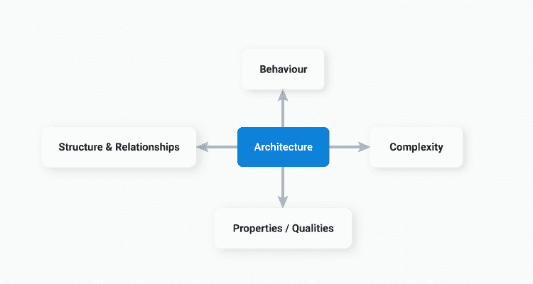
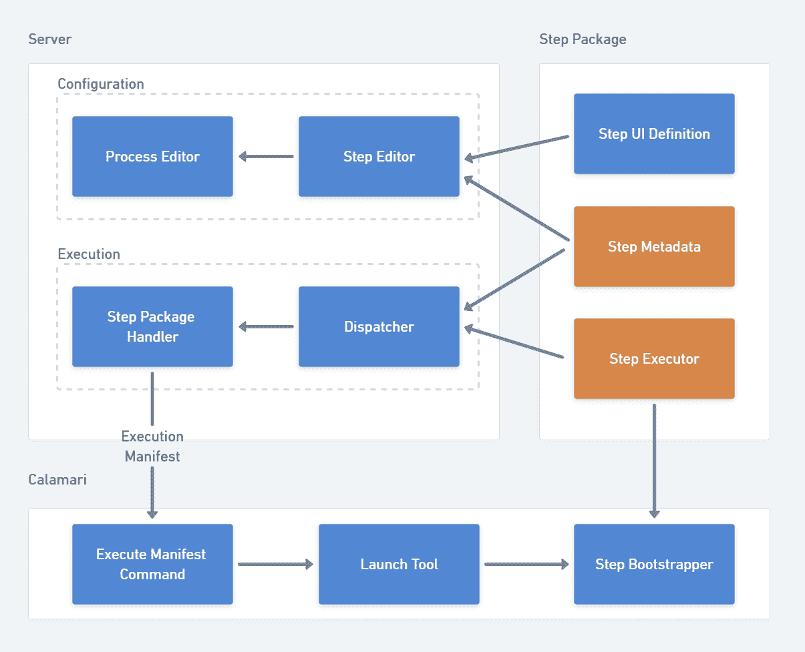
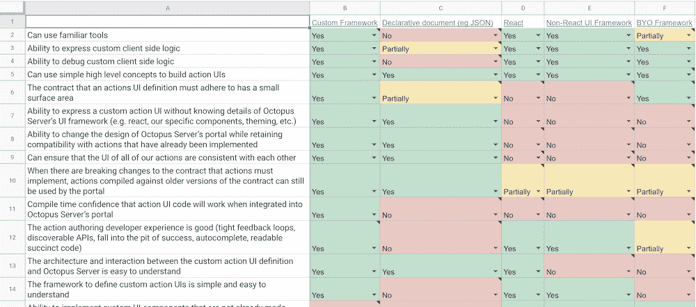

# 我们如何思考创造新的架构-章鱼部署

> 原文：<https://octopus.com/blog/creating-new-architecture>

在软件中，架构包括:

*   系统的结构
*   其组成部分之间的关系
*   系统发出的属性(有时称为“特征”)
*   系统编码的行为

一些系统可能包含一个单一的大型软件。其他的可能被分解成更小的子系统，它们一起工作来完成目标。

创建新的架构总是一个有趣的挑战:

*   你从哪里开始？
*   需要解决哪些问题？
*   你如何真正地传递东西而不迷失在无尽的兔子洞里？

在这篇文章中，我们将探索如何定义和构建一个新的软件架构来增加你成功的机会。

## 为什么建筑很重要

好的架构帮助你快速自信地做出决定和改变。想要添加新行为吗？好的架构会使推理和执行变得容易。糟糕的架构会让你在编写一行代码之前就开始思考世界是如何形成的。

卡尔·萨根曾经说过:“如果你希望从零开始做苹果派，你必须首先创造宇宙。”你不希望在软件中执行那种推理——你只是希望从一套好的苹果派配料中推理出来。

快速而自信地做出改变是八达通必须做的。发布管理的前景正以前所未有的速度增长。正在创建新的技术生态系统，可以在其中开发工作负载。新的云服务不断涌现，提供了新的、新颖的方法来托管工作负载。Octopus 的目标是将这些工作负载部署到世界级的新平台上，我们希望尽快在 Octopus 中实现这些体验。

为了确保我们能够实现这一目标，在 Octopus，我们一直在投入时间和精力，为 Octopus 内部的开发步骤创建一个全新的架构。毕竟，步骤是完成部署工作的东西！

### 目标

软件的成功来自于知道终点线在哪里。你如何知道自己是否成功了？成功不仅仅是拥有一些新软件。如果您正在定义一个全新的架构，或者只是构建一个小的特性，这是正确的。如果你不知道你要去哪里，任何一条路都可以把你带到那里，我们不想去任何地方，我们想要成功！

在与我们的主要利益相关者以及我们的首席执行官 Paul 进行初步合作后，我们就新 steps 架构的以下目标达成了一致:

*   我们应该能够在 Octopus 服务器版本的带外发布 steps。
*   步骤应该简单，易于开发。
*   应该可以用 C#/.NET 之外的技术开发步骤。

这些目标巩固了 Octopus 的业务目标，即建立一个高绩效的团队来提供新的部署能力，并更快地为 Octopus 的客户实现新的部署方案。

目标是必须具备的，因为它们能帮助你思考决策，避免兔子洞。当你决定是否应该以某种方式做某事时，它们提供了一个很好的试金石。如果某件事让你朝着其中一个目标前进，那可能是件好事。如果它让你远离目标，这可能是一件坏事。如果它对一个目标没有任何贡献，那么它可能是不需要的。

### 限制

一旦我们对定义成功的目标达成一致，我们就可以开始定义架构本身。再说一次，建筑指的是很多东西:

> 架构包括系统的结构、组件之间的关系、系统发出的属性(有时称为“能力”)，以及系统编码的行为。

对于步骤，我们首先通过将“步骤”分解为子系统来定义结构和关系，这样我们就可以对它们进行推理和决策。

其中包括:

*   步骤用户界面
*   步骤执行者
*   输入和输出
*   编程模型
*   服务器集成(打包模型)
*   部署执行

在定义新体系结构时，最初的对话可能具有挑战性。在对话中很难“让飞机着陆”,因为您会围绕一个子系统中的决策将如何影响其他子系统，探索不同的观点，如用户体验、开发人员体验和每一圈的产品体验。一行对话可以让你在子系统中绕一整圈，直到你再次到达你试图决定的起点。

如果你很难在早期做出决定，并且谈话感觉循环或永无止境，你可能会错过一个关键因素:**约束**。

当定义和开发架构时，约束限制了我们的选择自由。

这正是我们早期想要的。我们希望对我们可以施加的约束做出强有力的决定，因为它限制了我们的选择并使决定更容易。

我们的一些目标已经施加了严格的约束，例如，“应该有可能用 C#/.NET 之外的技术开发步骤。”

其他的没有这么严格。例如，“简单且易于开发”提供了上下文，但不是硬性的约束，它是一个定性的目标。

在设计我们的新架构的早期阶段，我们努力围绕步骤的编程和组合模型获得清晰性和一致性。如果用户希望某个步骤的行为“稍有不同”,并对步骤行为的逻辑内部顺序进行重新排序，或者在步骤中注入一些他们自己独特的行为，这是我们应该支持的吗？

通过对上述潜在需求采取立场，我们可以建立一个明确的约束。这个约束影响了架构的许多子系统，UI、执行器、编程模型。它甚至超越了我们架构的界限，可能会影响 Octopus 的其他领域。

通过合作，我们决定不需要在步骤中实现任意组合。如果您遵循这种思路，最终您将需要开发一种 DSL 或编程语言来构建部署流程，因为这是唯一一种足够灵活来满足所有用例的方法。

我们没有追求这一目标，而是决定专注于为用户提供高杠杆、高价值的步骤，并在用户需要自己独特的行为时，为他们提供一种从固执己见的步骤到更灵活的步骤(例如，运行模板、运行脚本/cli)的顺畅方式。

这个约束产生了直接影响，我们可以更清楚地推理我们的 UI、我们的执行器、我们的编程模型，以及对 Octopus 本身的影响，这要感谢这个约束强加的明确限制。

### 名称

在这些初始对话中，另一个具有挑战性的方面是，你正在谈论尚未命名的新兴概念。

谈论没有名字的事物会很快变得令人沮丧。你倾向于根据自己的背景为别人不理解的事情起自己的名字，你会在谈话中花费过多的精力，只是为了确保每个人都在谈论相同的事情，而不是关注更重要的细节。

令人惊讶的是，一旦你建立了一种共同的语言，对话开始变得如此容易，而不再只是试图解释你正在谈论的架构中的哪个逻辑组件或子系统。

这里最好的方法是召集你的团队，拿出一个白板(虚拟的或物理的)，画出你的概念模型，然后开始头脑风暴命名。

当我们这样做时，我们建立了一些指导原则，以确保这些名称不仅在我们的团队中有意义，而且对更广泛的受众也有意义:

> 指导方针
> 
> *   我们希望用对顾客有意义的方式命名
> *   命名应该简单和自我描述
> *   示例:“我想开发一个自定义步骤！”“我想开发一个部署到 X Cloud 的步骤。”

我们抽象地描述了每个*事物*，例如*“提供步骤 UI 的事物”*。然后我们试图给每一个抽象的事物命名。

在流程结束时，我们有了子系统和组件的清晰地图，在讨论我们的架构时，我们可以更自由地谈论它们:

### 决策

在 Octopus，我们坚信在决策时要达成共识，然后满怀信心地执行。几乎所有有影响力的决策都会被仔细审查。

在定义架构时，这种审查允许您预见架构选择的系统级影响。这是构建新架构时最难做的事情之一，但也是最重要的事情。

做出高质量决策的第一步是与你的团队紧密合作以达成决策。您已经与他们一起研究了候选解决方案，并对它们的影响达成了共识。在任何足够复杂的系统中，您总是需要从其他人那里获得输入，以确保您能够看到新架构可能带来的所有潜在影响，而您的团队是这方面的最佳起点。

我们在 Octopus 用来征求意见的一个工具是[稻草人提案](https://en.wikipedia.org/wiki/Straw_man_proposal)。您向您的团队展示您为给定组件或子系统提出的设计，并对其进行足够详细的解释，以便团队能够对其进行推理。对于稻草人，你不希望你的团队同意它，你希望他们挑战它，指出它的缺陷，提出替代方案和改进意见。这种类型的对话会产生深刻的见解和解决方案选项，引导您做出高质量的决策。

在您的团队给出输入之后，您还需要确保合适的专家已经为您的架构决策提供了输入。

例如，在我们的新架构中，发现了与项目 Bento 的重叠，这是我们新的项目导入/导出系统。通过与开发 Bento 的团队交谈，我们发现在我们的两个计划下有一个共享的系统部分——步骤的输入模型。Bento 需要知道一组给定的输入是否包含一个帐户，或者 Octopus 中其他特定于域的资源。它将使用这些知识来*抓取*它需要跨空间导出/导入的资源集。我们建议重新定义输入在 Octopus 中的建模方式，所以我们需要确保我们提出的架构仍然能够满足 Bento 的需求。

广泛征求意见并不意味着由委员会设计。所有权很重要，作为架构师，您应该拥有您开发的架构。然而，这意味着您有责任广泛地寻求对您的架构设计的输入，并在您的专业领域之外找到可能需要影响您的设计的其他子系统的专家。

> 目标和决策
> 
> 另一件有助于决策的事情是保持目标在头脑中。虽然约束限制了我们的选择，所以我们知道哪些事情我们不需要做出决定，但目标可以帮助我们在多个潜在的有效选项之间做出决定。
> 
> 目标可以作为试金石。这个决定是让我们朝着这个目标前进，还是让我们离目标更远？确保所有基本决策都考虑到他们。在决定如何实现支撑新架构的各种 API 时，我们已经多次重温了我们的目标，即步骤“简单且易于开发”。

### 复杂性

架构内的复杂性往往分为两类:

*   静态复杂性，处理系统的组件及其关系。
*   突发的复杂性，它来自用户以新颖独特的方式使用你的软件，以及使用对系统影响的整体变化。

架构决策需要将两者都考虑在内。

#### 静态复杂性

静态的复杂性倾向于影响意义的形成；如果你工作的领域非常复杂，就很难做出决定。很难推理出您的决策可能影响各种子系统的所有方式。

这个问题的解决方法是深入分析。我们在 Octopus 中大量使用了[异想天开的](https://whimsical.com/)，但是其他图表工具在这些场景中也会有所帮助。您需要一个工具来构建流程图，并可视化特定上下文中各种子系统之间的连接。这将有助于你确定做决定时需要考虑的所有地方。

这种分析是不可避免的。如果你不这样做，你会做出错误的假设，这些假设会在以后伤害你。这种类型的分析也很难“外包”。有人可能能够描述特定子系统的内部工作方式，但是如果他们没有详细的地图提供给你，你很可能需要找出代码并绘制图表。

#### 涌现复杂性

突发的复杂性来自于试图预测人类如何与系统交互，或者系统的使用如何随着时间的推移而改变，以及您将需要如何适应这种改变。

我们可以尝试限制我们架构中出现的复杂性，或者承认并控制它。

为了限制它，我们可以回到约束。我们能限制用户使用我们系统的方式吗？这将限制可能出现的复杂性，也将简化我们的决策。

如果我们有适当的约束，我们可以看看某些实现决策如何帮助我们控制突发的复杂性。

当我们决定如何表达一个步骤的 UI 时，我们面临着一个决定:我们应该让用户自带 HTML、JavaScript 和框架来表达步骤 UI 吗？让他们只提供一些 HTML 怎么样？如果是用代码写的 API 呢？简单的老式声明性 JSON 怎么样？这些解决方案中的每一个都会对突发的复杂性产生非常不同的影响。

为了应对这种复杂性并帮助做出决策，我们创建了一个决策矩阵来帮助可视化每个选项如何解决或不解决每个复杂性。

通过列举一个解决方案可能对我们有贡献的属性，并根据这些属性评估每个候选解决方案，我们可以做出考虑到我们的突发复杂性的决策。

我们决定实现一个定制的 UI 框架，也就是说，可以用来表达一个步骤的 UI 的代码。这给了人们用代码和熟悉的工具实现 UI 的能力和灵活性，但它避免了人们提供任意 HTML 和 JavaScript 所带来的复杂性。

### “感受”

能力，或[系统质量属性](https://en.wikipedia.org/wiki/List_of_system_quality_attributes)，指的是系统可能需要遵守的非功能需求。

一个好的架构会释放出支持你认为重要的“特性”的属性。这些“能力”倾向于贯穿一个架构中的所有子系统。

对于新的 steps 架构来说，一个我们非常重视的“能力”的例子是**可维护性**。

如果我们需要在步骤和 Octopus 本身之间的接口边界的一侧进行更改，我们希望确保不需要强制将更改传播到数百个步骤中(或者要求步骤作者做同样的事情)。

知道这对我们的架构很重要，我们非常详细地关注我们的 API 表面，它形成了 steps 和 Octopus 之间的接口，关注版本控制和兼容性。

在 steps 体系结构中有许多兼容性表面。确保这些表面具有显式的版本控制，将允许我们随着时间的推移对它们进行更改，并随着它们的发展对它们的兼容性做出慎重的决定。

在早期对可能对您的架构重要的各种“能力”进行头脑风暴是很重要的，以便您可以在您的架构发展过程中考虑它们。

## 结论

好的软件架构允许您随着软件的增长而降低软件的复杂性，使您能够快速而自信地开发新的功能，或者更改现有的功能。

优秀的架构:

*   建立在一系列与业务目标相关的明确目标之上。
*   表达了限制体系结构需要支持的复杂性的强约束。
*   为子系统和组件建立通用语言。
*   是在许多高质量决策的基础上发展起来的，这些决策已经应用了适当的分析、审查和专家意见。
*   承认复杂性，确保通过深入分析来理解复杂性，并为紧急情况而设计。
*   解决重要的“问题”，确保在架构中定义的所有子系统中考虑和设计这些问题。