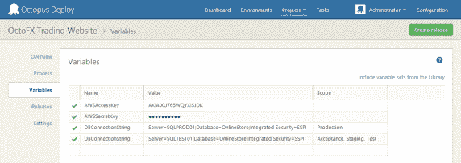

# 使用 Octopus REST API 导入变量- Octopus Deploy

> 原文：<https://octopus.com/blog/creating-variables-with-the-api>

Octopus 2.0 引入了一个全面的 REST API，可以用来执行 UI 可以执行的任何事情。我们知道这一点，因为 UI 本身完全构建在 REST API 之上。今天，一些人问他们如何使用 API 自动导入变量，我将在下面演示。

变量的集合存储在一个`VariableSet`资源中。在 UI 中编辑变量时，您正在编辑`VariableSet`。例如，在这个截图中，四个变量属于一个`VariableSet`:



变量集资源[支持`GET`和`PUT`操作](https://github.com/OctopusDeploy/OctopusDeploy-Api/wiki/VariableSets)。这个想法是，你`GET`变量集，进行修改(从集合中添加、修改、删除变量)，然后`PUT`它回来。

`VariableSets`属于一个`Project`(或者属于一个发布，因为我们对每个发布的变量进行快照)。所以你需要这个项目来获取变量集。

## 使用章鱼。客户

这里有一个使用 [Octopus 的完整例子。客户端](http://docs.octopusdeploy.com/display/OD/Octopus.Client):

```
var octopus = new OctopusRepository(new OctopusServerEndpoint("http://your-octopus", "API-YOURKEY"));

// Find the project that owns the variables we want to edit
var project = octopus.Projects.FindByName("My Project");

// Get the variables for editing
var variableSet = octopus.VariableSets.Get(project.Link("Variables"));

// Add a new variable
variableSet.Variables.Add(new VariableResource()
{
    Name = "ConnectionString",
    Value = "Server=(local);Database=Foo;trusted_connection=true",
    Scope = new ScopeSpecification()
    {
        // Scope the variable to two environments using their environment ID
        { ScopeField.Environment, new ScopeValue("Environments-1", "Environments-2" )}
    }, 
});

// Save the variables
octopus.VariableSets.Modify(variableSet); 
```

## 正在发生什么

首先，客户机点击`/api`并返回一个文档，如下所示:

```
{
  "Application": "Octopus Deploy",
  "Version": "2.0.12.1092",
  "ApiVersion": "3.0.0",
  "Links": {
    ...
    "Projects": "/api/projects{/id}{?skip}",
    ...
    "Variables": "/api/variables{/id}"
  }
} 
```

跟随*项目*链接，我们得到一个项目列表:

```
{
  "ItemType": "Project",
  "IsStale": false,
  "TotalResults": 7,
  "ItemsPerPage": 30,
  "Items": [
    {
      "Id": "projects-65",
      "Name": "My Project",
      "VariableSetId": "variableset-projects-65",
      ...
      "Links": {
        "Self": "/api/projects/projects-65",
        "Releases": "/api/projects/projects-65/releases{/version}{?skip}",
        "Variables": "/api/variables/variableset-projects-65",
        "DeploymentProcess": "/api/deploymentprocesses/deploymentprocess-projects-65",
        "Web": "/app#/projects/projects-65"
      }
    },
    {
      "Id": "projects-129",
      "Name": "My Project 2",
      "VariableSetId": "variableset-projects-129",
      ... 
```

项目上的*变量*链接将我们指向变量集资源:

```
{
  "Id": "variableset-projects-129",
  "OwnerId": "projects-129",
  "Variables": [
    {
      "Id": "80bcaf5a-632a-470d-a8aa-a366f20c302e",
      "Name": "ConnectionString",
      "Value": "Server=(local);Database=Foo;trusted_connection=true",
      "Scope": {
        "Environment": [
          "Environments-1",
          "Environments-2"
        ]
      },
      "IsSensitive": false,
      "IsEditable": true,
      "Prompt": null
    }
  ],
  "ScopeValues": {
    "Environments": [
      {
        "Id": "Environments-1",
        "Name": "Automation Testing"
      },
      {
        "Id": "Environments-34",
        "Name": "EC2 Production"
      },
      {
        "Id": "Environments-33",
        "Name": "EC2 Staging"
      },
      {
        "Id": "Environments-97",
        "Name": "Octopus"
      },
      {
        "Id": "Environments-2",
        "Name": "Release To Web"
      }
    ], 
```

我们现在可以对此资源进行更改，并将其放回原处。

注意，VariableSet 文档实际上定义了不同的范围值选项。在 UI 中，我们使用它来填充定义范围时的下拉列表。在设置范围选项时，您可以使用它将诸如“EC2 Production”之类的名称映射到“Environments-34”。

我希望这有助于提供如何使用八达通的样本。客户端 API 来修改变量，以及了解幕后实际发生的事情。愉快的部署！