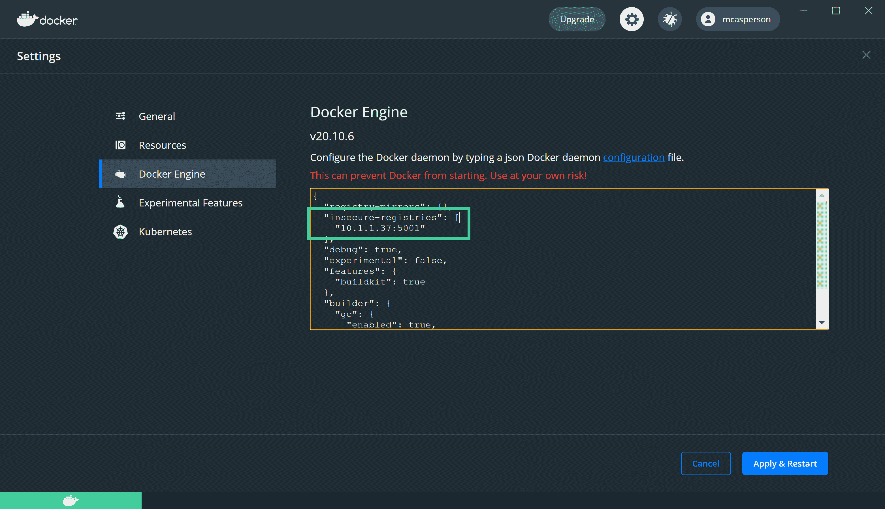
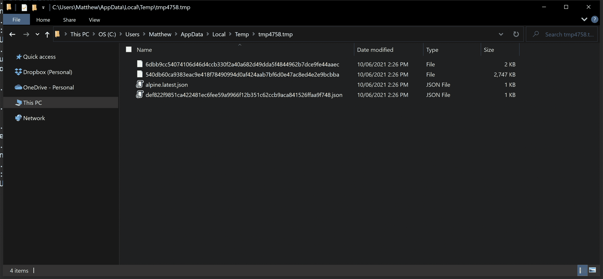

# 创建自定义 Docker 注册表- Octopus Deploy

> 原文：<https://octopus.com/blog/custom-docker-registry>

你想知道当你做`docker push`或`docker pull`时会发生什么吗？在幕后，像 Docker Hub 这样的存储库实现了 [Docker V2 HTTP API](https://docs.docker.com/registry/spec/api/) 规范，响应这些请求来接收或交付 Docker 映像。不过，这个规范对任何人都是开放的，您可以从一个最小的 docker 注册实现中了解更多关于 Docker 的知识。

在这篇文章中，我们创建了一个成功响应`docker push`或`docker pull`命令的 C#服务器。在这个过程中，您可以看到组成 Docker 图像的各个组件。

## 用于推和拉图像的 Docker API

这些是我们的应用程序必须实现以支持推和拉图像的路径:

*   GET `/v2` : Docker 访问这个路径来验证服务器是否支持 Docker HTTP API 的版本 2。
*   HEAD `{name}/blobs/{digest}`:该路径用于判断服务器上是否存在该图层。
*   GET `{name}/blobs/{digest}`:一旦客户端确定该层存在于服务器上，该路径返回该层。
*   POST `{name}/blobs/uploads`:这个路径被调用来启动层上传。
*   PATCH `{name}/blobs/uploads/{uuid}`:该路径接收分块层上传。
*   PUT `{name}/blobs/uploads/{uuid}`:一旦分块层上传完成，就调用这个路径。
*   HEAD `{name}/manifests/{reference}`:调用这个路径来确定服务器上是否存在清单。
*   GET `{name}/manifests/{reference}`:这个路径返回一个层，一旦客户端确定它存在于服务器上。
*   PUT `{name}/manifests/{reference}`:这个路径在服务器上创建一个清单。

## 推送图像

推送 Docker 图像的流程是:

1.  联系`/v2`以确认服务器支持正确的 API。
2.  对`{name}/blobs/{digest}`进行头部查询，其中`name`是类似`alpine`的图像名称，`digest`是图层的哈希。
3.  如果该层不存在，执行提交到`{name}/blobs/uploads`。来自该路径的响应包括格式为`{name}/blobs/uploads/{uuid}`的`Location`报头，在此执行层上传。
4.  然后上传该层，可能会上传与对`{name}/blobs/uploads/{uuid}`的补丁请求一样多的小块。被发送的数据在`Range`头中被捕获，服务器被期望用每个传入的块增量地填充层文件。
5.  当上传一个层时，对`{name}/blobs/uploads/{uuid}`进行一个 PUT 调用。这个请求包括一个名为`digest`的查询参数，它的值是已经完成的层的散列。
6.  一旦层被上传，在`{name}/manifests/{reference}`上的头部查询确定清单是否已经存在于服务器上。
7.  如果清单不存在，那么对`{name}/manifests/{reference}`的 PUT 请求会创建它。

## 提取图像

拉图像比推图像容易:

1.  联系`/v2`确认服务器支持正确的 API。
2.  在`{name}/manifests/{reference}`上执行头部查询，以确定清单是否存在。
3.  如果清单存在，用对`{name}/manifests/{reference}`的 GET 请求检索它。
4.  对于清单中列出的每个映像，在`{name}/blobs/{digest}`上执行头部查询以验证它是否存在。
5.  然后通过对`{name}/blobs/{digest}`的 GET 请求下载图像。

## 示例应用程序

我们的示例应用程序并不漂亮，您不能用它来承载生产工作负载。但它的功能足以允许推拉图像。这为深入了解 Docker 图像的幕后情况提供了一个很好的视角。

这里描述的源代码可以从 [GitHub](https://github.com/OctopusSamples/DotNetCoreDockerRegistry) 获得。

从一个将其所有方法都放在`v2`根路径下的控制器开始。这个根路径是 Docker 规范中的一个硬性要求。一些混合工件存储库在其自己的端口上公开一个 Docker 注册表，以确保这个根路径不会与其他 API 冲突:

```
namespace Controllers
{
    [Route("v2/")]
    public class DockerRegistry : ControllerBase
    { 
```

每次启动应用程序时，创建一个新的临时目录来保存 Docker 图像和层。这对于测试来说非常好，因为你可以重启应用程序并拥有一个空的注册表:

```
 private static readonly string LayerPath;

        static DockerRegistry()
        {
            LayerPath = GetTemporaryDirectory();
            Console.Out.WriteLine($"Saving artifacts to {LayerPath}");
        }

        static string GetTemporaryDirectory()
        {
            var tempFolder = Path.GetTempFileName();
            System.IO.File.Delete(tempFolder);
            Directory.CreateDirectory(tempFolder);

            return tempFolder;
        } 
```

这个处理程序响应`/v2`根路径上的 GET 请求。您返回一个 HTTP 200 OK 响应，让客户端知道您支持 V2 API:

```
 [HttpGet]
        public IActionResult Root(string path)
        {
            return Ok();
        } 
```

接下来，构建处理程序以允许图像被推送到服务器。您需要响应 HEAD 请求，检查服务器上是否已经存在图像。`name`参数是图像名称(如`alpine`),而`digest`参数是标识层的散列，如`sha256:11ad9c3e3069bdb53ff873af66070ca6c4309e85581cf3befe05459f889fd729`。

在这里采取一个小捷径，将图层保存为 SHA 哈希，减去`sha256:`前缀。如果文件存在，返回 200 OK，用`content-length`头表示图像的大小。如果图层不存在，返回 404 未找到:

```
 [HttpHead("{name}/blobs/{digest}")]
        public IActionResult Exists(string name, string digest)
        {
            var hash = digest.Split(":").Last();

            if (System.IO.File.Exists(LayerPath + "/" + hash))
            {
                Response.Headers.Add("content-length", new FileInfo(LayerPath + "/" + hash).Length.ToString());
                Response.Headers.Add("docker-content-digest", digest);
                return Ok();
            }

            return NotFound();
        } 
```

如果该层不存在，客户端将使用这个 POST 请求启动上传。响应包括一个带有唯一 URL 的`location`头，实际图层数据将发送到该头:

```
 [HttpPost("{name}/blobs/uploads")]
        public IActionResult StartUpload(string name)
        {
            var guid = Guid.NewGuid().ToString();
            Response.Headers.Add("location", "/v2/" + name + "/blobs/uploads/" + guid);
            Response.Headers.Add("range", "0-0");
            Response.Headers.Add("content-length", "0");
            Response.Headers.Add("docker-upload-uuid", guid);
            return Accepted();
        } 
```

Docker 支持[整体](https://docs.docker.com/registry/spec/api/#monolithic-upload)和[分块](https://docs.docker.com/registry/spec/api/#chunked-upload)上传。该处理程序支持分块上传方法(示例应用程序不支持整体上传)。

客户端可能会也可能不会提供一个指示正在上传的块的`content-range`头。通常整个层作为单个块上传，并且不提供`content-range`头。

在这个方法中，您将请求的主体保存到一个文件中，该文件带有在`StartUpload`方法中生成的随机 GUID:

```
 [DisableRequestSizeLimit] 
        [HttpPatch("{name}/blobs/uploads/{uuid}")]
        public async Task<IActionResult> Upload(string name, string uuid)
        {
            var start = Request.Headers["content-range"].FirstOrDefault()?.Split("-")[0] ?? "0";
            await using (var fs = System.IO.File.OpenWrite(LayerPath + "/" + uuid))
            {
                fs.Seek(long.Parse(start), SeekOrigin.Begin);
                await Request.Body.CopyToAsync(fs);

                Response.Headers["range"] = "0-" + (fs.Position - 1);
            }

            Response.Headers["docker-upload-uuid"] = uuid;
            Response.Headers["location"] = $"/v2/{name}/blobs/uploads/{uuid}";
            Response.Headers["content-length"] = "0";
            Response.Headers["docker-distribution-api-version"] = "registry/2.0";
            return Accepted();
        } 
```

上传图层后，将调用此方法来表示上传完成。[规范提到，这个方法可能会被调用，最终的内容块将被保存到层](https://docs.docker.com/registry/spec/api/#completed-upload)，因此您需要将 PUT 主体中的任何内容追加到层文件中。

现在使用来自`digest`查询参数的散列将文件从临时 GUID 重命名为散列:

```
 [HttpPut("{name}/blobs/uploads/{uuid}")]
        public async Task<IActionResult> FinishUpload(string name, string uuid)
        {
            if (Request.Headers["content-length"].First() != "0")
            {
                var ranges = Request.Headers["content-range"].First().Split("-");
                await using var fs = System.IO.File.OpenWrite(LayerPath + "/" + uuid);
                fs.Seek(long.Parse(ranges[0]), SeekOrigin.Begin);
                await Request.Body.CopyToAsync(fs);
            }

            var rawDigest = Request.Query["digest"];
            var digest = Request.Query["digest"].First().Split(":").Last();
            System.IO.File.Move(LayerPath + "/" + uuid, LayerPath + "/" + digest);
            Response.Headers.Add("content-length", "0");
            Response.Headers.Add("docker-content-digest", rawDigest);

            return Created("/v2/" + name + "/blobs/" + digest, "");
        } 
```

在层被上传之后，清单(你可以认为是 Docker 图像)被创建。首先，客户端发出 HEAD 请求，查看清单是否存在。

奇怪的是，`reference`可能是一个标签名，比如`latest`，也可能是一个散列。为方便起见，将清单保存在两个位置:

*   一个基于标签名
*   一个基于散列

这效率不高，但对于您的示例应用程序来说，这是一个简单的解决方案:

```
 [HttpHead("{name}/manifests/{reference}")]
        public IActionResult ManifestExists(string name, string reference)
        {
            var hash = reference.Split(":").Last();
            var path = LayerPath + "/" + name + "." + reference + ".json";
            var hashPath = LayerPath + "/" + hash + ".json";
            var testedPath = System.IO.File.Exists(path) ? path :
                System.IO.File.Exists(hashPath) ? hashPath :
                null;

            if (testedPath != null)
            {
                Response.Headers.Add("docker-content-digest", "sha256:" + Sha256Hash(path));
                Response.Headers.Add("content-length", new FileInfo(path).Length.ToString());

                var content = System.IO.File.ReadAllText(path);
                var mediaType = JObject.Parse(content)["mediaType"].ToString();

                Response.Headers.Add("content-type", mediaType);

                return Ok();
            }

            return NotFound();
        } 
```

如果清单不存在，用对该方法的 PUT 请求保存它。再次注意，您必须将清单保存在两个地方:

*   一个文件名中带有标签
*   另一个在文件名中包含哈希:

```
 [HttpPut("{name}/manifests/{reference}")]
        public async Task<IActionResult> SaveManifest(string name, string reference)
        {
            var path = LayerPath + "/" + name + "." + reference + ".json";

            await using (var fs = System.IO.File.OpenWrite(path))
            {
                await Request.Body.CopyToAsync(fs);
            }

            var hash = Sha256Hash(path);
            Response.Headers.Add("docker-content-digest", "sha256:" + hash);

            System.IO.File.Copy(path, LayerPath + "/" + hash + ".json", true);

            return Created($"/v2/{name}/manifests/{reference}", null);
        } 
```

这些端点允许你完成一个`docker push`命令。

提取图像需要另外两种方法。

第一个使用 GET 请求将图层数据返回给以下方法:

```
 [HttpGet("{name}/blobs/{digest}")]
        public async Task<IActionResult> GetLayer(string name, string digest)
        {
            var hash = digest.Split(":").Last();
            var path = LayerPath + "/" + hash;

            if (System.IO.File.Exists(LayerPath + "/" + hash))
            {
                Response.Headers.Add("content-length", new FileInfo(path).Length.ToString());
                await using (var fs = new FileStream(path, FileMode.Open))
                {
                    await fs.CopyToAsync(Response.Body);
                    return Ok();
                }
            }

            return NotFound();
        } 
```

清单数据随对以下方法的 GET 请求一起返回。就像 HEAD 请求一样，您需要基于标记名或散列码搜索清单文件，因为`reference`可能是这两个值中的任何一个。

注意，这里您加载了清单文件，将其解析为 JSON，并提取了`mediaType`属性。这作为`content-type`头发送回客户端:

```
 [HttpGet("{name}/manifests/{reference}")]
        public async Task<IActionResult> GetManifest(string name, string reference)
        {
            var hash = reference.Split(":").Last();
            var path = LayerPath + "/" + name + "." + reference + ".json";
            var hashPath = LayerPath + "/" + hash + ".json";
            var testedPath = System.IO.File.Exists(path) ? path :
                System.IO.File.Exists(hashPath) ? hashPath :
                null;

            if (testedPath != null)
            {
                Response.Headers.Add("docker-content-digest", "sha256:" + Sha256Hash(testedPath));

                var content = System.IO.File.ReadAllText(testedPath);
                var mediaType = JObject.Parse(content)["mediaType"].ToString();

                Response.Headers.Add("content-type", mediaType);
                Response.Headers.Add("content-length", new FileInfo(testedPath).Length.ToString());

                await using (var fs = new FileStream(testedPath, FileMode.Open))
                {
                    await fs.CopyToAsync(Response.Body);
                }

                return Ok();
            }

            return NotFound();
        } 
```

这样，您就拥有了支持拉取图像所需的所有端点。

## 测试服务器

web 应用程序已通过`launchSettings.json`文件配置为监听所有 IP 地址。下面是显示`applicationUrl`设置的精简文件，它被配置为监听`0.0.0.0`，这意味着应用程序响应所有 IP 地址上的请求。

我在测试中发现这是必要的，因为推送至`localhost`在基于 Windows 的机器上不起作用，所以我不得不推送至机器的本地 IP 地址:

```
{
...

  "profiles": {

    ...

    "dockerregistry": {
      "applicationUrl": "https://0.0.0.0:5002;http://0.0.0.0:5001",
    }
  }
} 
```

默认情况下，Docker 试图通过 HTTPS 联系所有外部存储库。web 应用程序有一个自签名证书，所以为了测试，您希望 Docker 使用 HTTP。

我的笔记本电脑的 IP 地址是 10.1.1.37。要指示 Docker 通过您的 IP 访问注册表，您需要编辑 Docker 配置文件中的`insecure-registries`数组:

[](#)

使用以下内容运行应用程序:

```
dotnet run 
```

存放工件的临时目录显示在控制台中:

```
$ dotnet run
Building...
info: Microsoft.Hosting.Lifetime[0]
      Now listening on: https://0.0.0.0:5002
info: Microsoft.Hosting.Lifetime[0]
      Now listening on: http://0.0.0.0:5001
info: Microsoft.Hosting.Lifetime[0]
      Application started. Press Ctrl+C to shut down.
info: Microsoft.Hosting.Lifetime[0]
      Hosting environment: Development
info: Microsoft.Hosting.Lifetime[0]
      Content root path: C:\Users\Matthew\Octopus\dockerregistry
Saving artifacts to C:\Users\Matthew\AppData\Local\Temp\tmp5E8E.tmp 
```

下载 Docker 映像并根据本地存储库重新标记它:

```
$ docker pull alpine
$ docker tag alpine 10.1.1.37:5001/alpine 
```

然后将映像推送到本地服务器:

```
$ docker push 10.1.1.37:5001/alpine 
```

在临时目录中创建了四个文件:两个图像层，以及与标签和散列一起保存的清单:

[](#)

现在从你的本地电脑上删除图像。这可以确保此图像的任何下载都不能重复使用您以前缓存的图像:

```
$ docker image rm 10.1.1.37:5001/alpine
$ docker image rm alpine 
```

使用以下命令从您的服务器下载映像:

```
$ docker pull 10.1.1.37:5001/alpine 
```

现在，您已经从最小 Docker 存储库中推送和提取了图像。仍然缺少一些功能，比如删除图像和搜索，但是我们将把实现留在这里。

## 结论

Docker 是许多开发工作流的核心，但有趣的是，关于如何实现 Docker API 的信息并不多。[官方文档](https://docs.docker.com/registry/spec/api/#monolithic-upload)有点密集(正如规范通常的那样)，所以在这篇文章中，我们看了一个非常简单的实现，它允许使用常规的 Docker 客户端来推和拉 Docker 图像。

希望这能揭开围绕 Docker 图像传输的一些过程，如果您希望将自己的应用程序与 Docker 客户机集成，这是一个有用的起点。

愉快的部署！