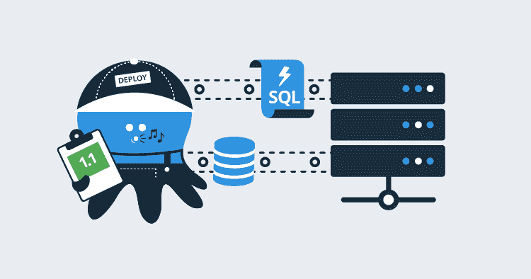
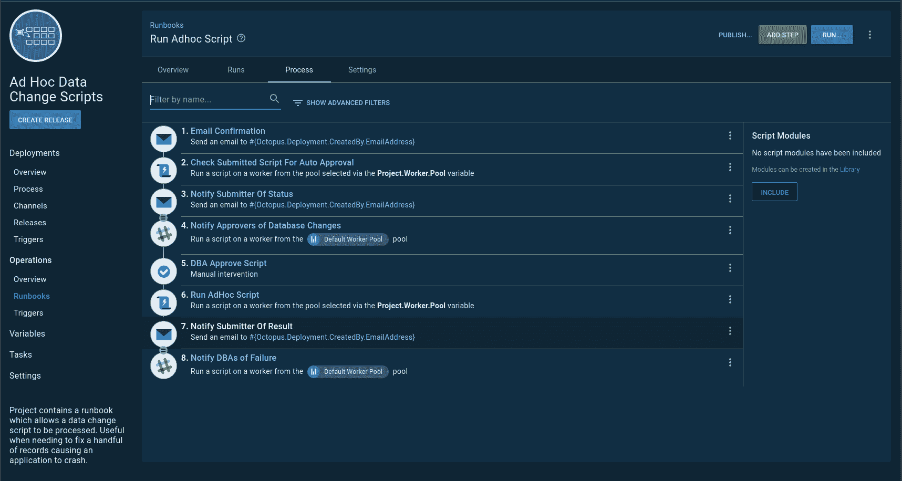
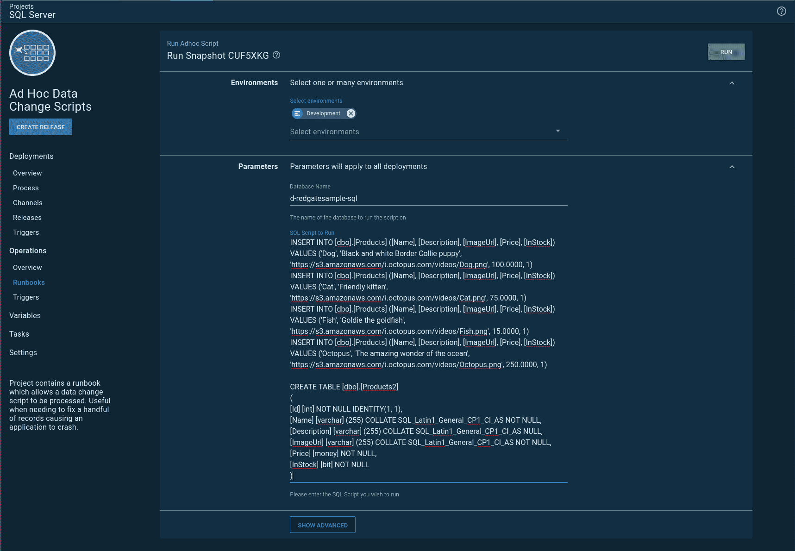
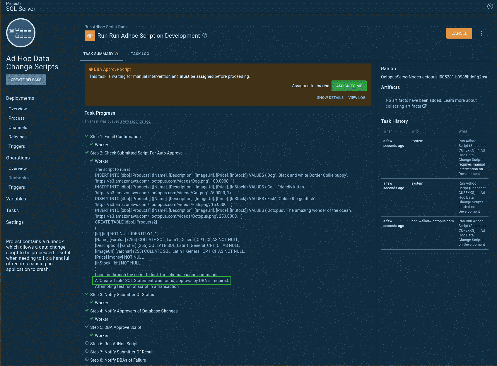
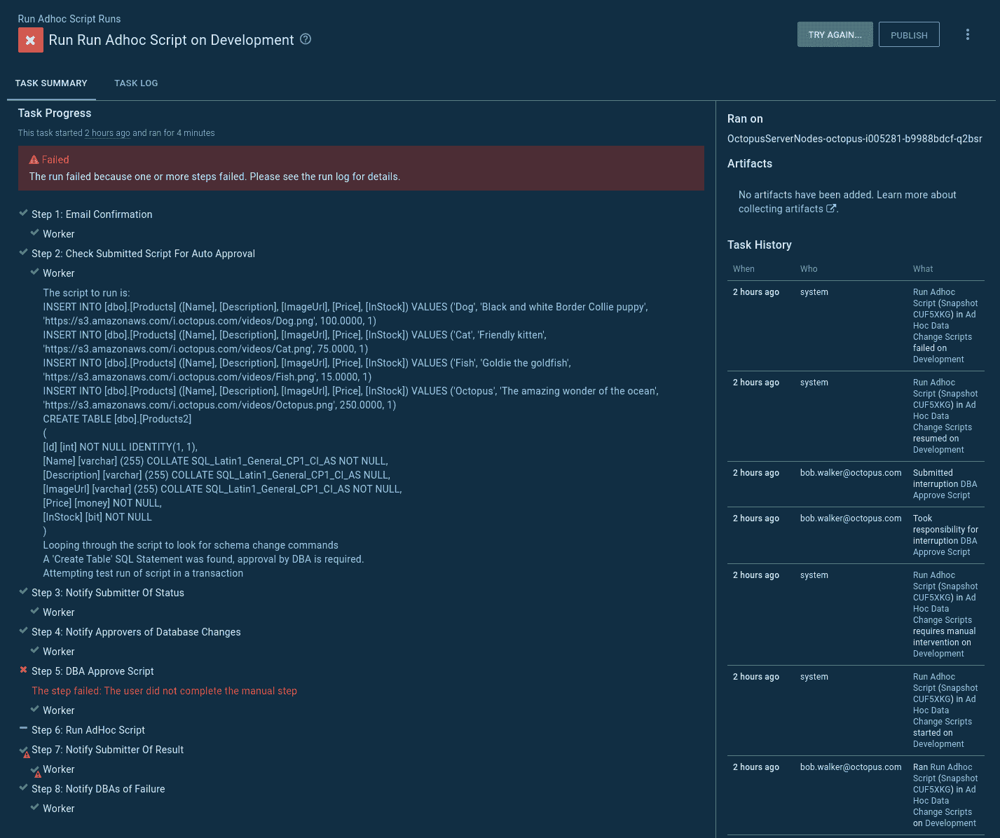
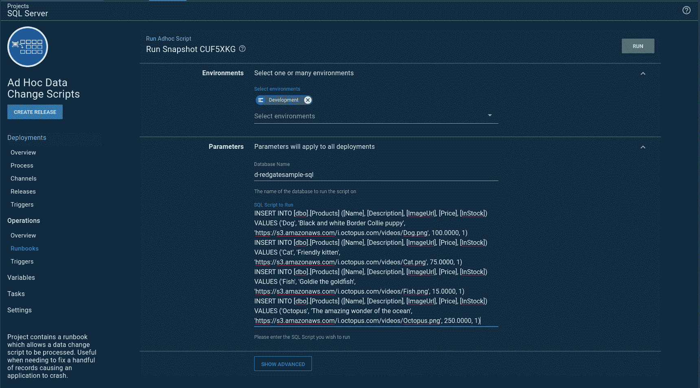
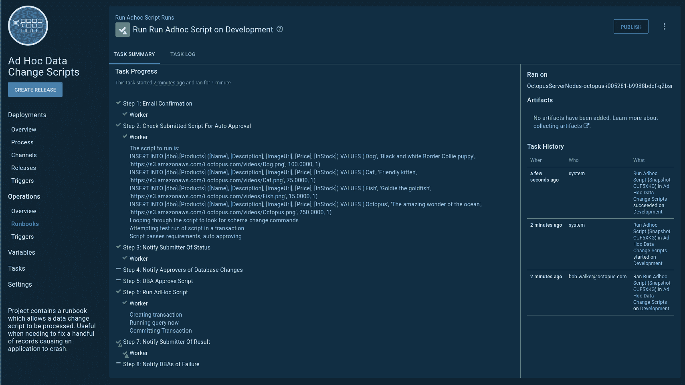
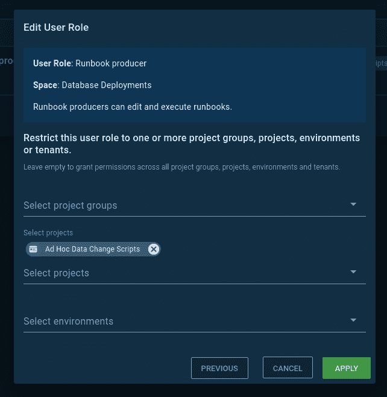
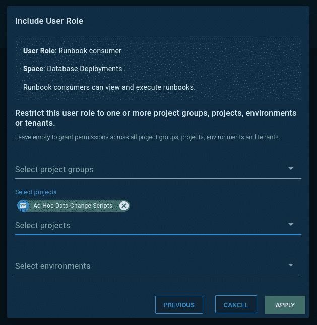
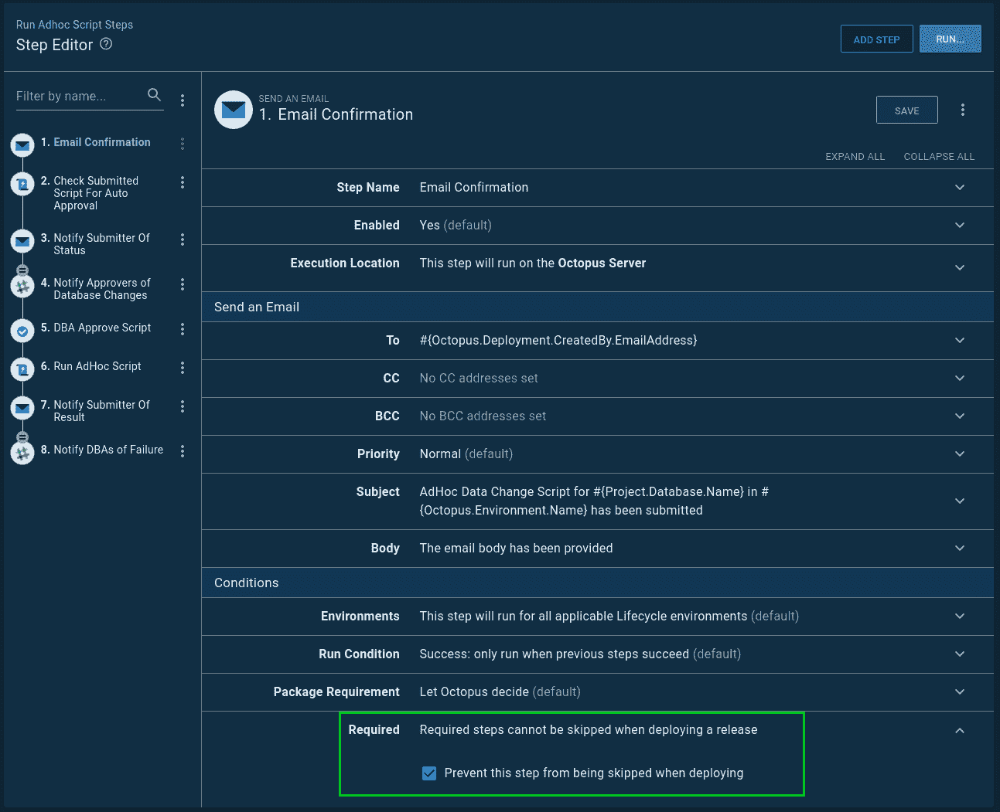

# 使用 Runbooks 在数据库部署自动化管道中运行特定的 SQL 脚本——Octopus Deploy

> 原文：<https://octopus.com/blog/database-deployment-automation-adhoc-scripts-with-runbooks>

[](#)

在之前的一篇文章中，我写了[如何在数据库部署管道](https://octopus.com/blog/database-deployment-automation-adhoc-scripts)中运行特定的 SQL 脚本。在写的时候，我觉得那是我要求的最好的过程。新的 [runbooks 功能](https://octopus.com/runbooks)，作为我们 2019.11 版本的一部分发布，看起来可能更适合这个过程。在本文中，我将使用 Operations Runbooks 特性完成一个新流程。

## 为什么我们需要特别的 SQL 脚本

在上一篇文章中，我详细介绍了为什么我们在自动化数据库部署管道中需要专门的 SQL 脚本。下面是一个快速总结，让你快速了解。

所有的软件都有 bug，但不是所有的 bug 都值得花时间和精力去修复。很难证明修复一个错误的工程成本是合理的，这个错误每个季度只发生一次，并且只在*太阳、月亮和星星都排成一行*时发生。然而，有时像这样的错误会导致数据进入不良状态。这个 bug 不太可能被修复，但是数据需要被修复，这样用户才能继续使用这个应用程序。通常，开发人员为 DBA 编写一个 SQL 脚本来修复数据。

我工作过和合作过的每家公司都有运行这类脚本的流程。这可能像给 DBA 发电子邮件要求他们运行脚本一样简单，也可能像需要大量签名的多页表单一样复杂，但是这个过程似乎总是手动的。

使用 Octopus Deploy 之类的工具自动完成这一过程有许多优点:

*   **审计** : Octopus Deploy 可以告诉您谁提出了请求，谁批准了请求，以及这一切是何时发生的。
*   **工件**:使用 Octopus Deploy 内置的工件功能，可以存储和捕获运行的确切 SQL 脚本，但是，如果有人在文件共享之后更改了脚本，就无从得知了。
*   批准:在某些情况下，让另一双眼睛来审视剧本是很重要的。Octopus Deploy 可以设置为基于一组标准有条件地批准脚本。
*   **自动化**:不再需要手动发送邮件。不再需要手动发送确认。不再需要打开 SSMS 来运行 SQL 脚本。
*   **Repeatable** :在所有环境中使用相同的流程来运行脚本。

## 自动化要求

在看我以前的文章时，我看到了许多移动的部分。我想在移植到 runbook 时简化这个过程。这种复杂性是将特定的 SQL 脚本过程强加到部署过程中的结果，但是在我的需求中是否有其他因素导致了这种复杂性？

这些要求又出现了:

*   章鱼展开。
*   没有源代码管理。许多 DBA、支持工程师和业务分析师不熟悉源代码控制工具。
*   自动化。当脚本准备好时，它们应该在五分钟内运行，而不必填写表格或通知任何人。
*   剧本分析。如果脚本包含某些关键字，那么人们应该在运行它之前检查脚本。
*   在任何环境下工作。我们希望鼓励人们在任何环境下运行这一功能，甚至是开发环境。

这一个很突出:

> 自动化。当脚本准备好时，它们应该在五分钟内运行*，而不必填写表格*或通知任何人。

有了 runbooks，我可以稍微调整一下需求:

> 自动化。当脚本准备好了，他们应该通过一个易于使用的形式提交，并立即执行。

## 操作手册流程

好了，需求更新了；现在是重新制定流程的时候了:

1.  用户启动 runbook 运行，并在[提示变量](https://octopus.com/docs/projects/variables/prompted-variables)中输入数据库名称和 SQL 脚本。
2.  向提交者发送确认消息。
3.  运行一个脚本来评估提交的脚本。它查找模式更改命令，使用事务运行和回滚脚本，并检查更改的行数。如果所有条件都满足，则[输出变量](https://octopus.com/docs/projects/variables/output-variables) `DBA Approval Required`设置为`False`，否则设置为`True`。
4.  向提交者发送自动批准的结果。
5.  如果需要 DBA 审查脚本，则会发送通知，并且流程会暂停，以便进行[手动干预](https://octopus.com/docs/deployment-process/steps/manual-intervention-and-approvals)。
6.  如果脚本是自动批准的，或者 DBA 批准了该脚本，则该脚本将运行。
7.  DBA 和提交者被告知运行的结果。

我将把那本操作手册投入到一个新项目中。这将有助于我在本文后面配置安全性:

【T2 

## 自动批准脚本

自动审批脚本是整个操作的大脑。它确保符合标准，并且没有人试图潜入模式更改脚本。

您可以在我们的[示例实例](https://samples.octopus.app/app#/Spaces-106/projects/ad-hoc-data-change-scripts/operations/runbooks/Runbooks-225/steps/RunbookProcess-Runbooks-225/step/7ff33a39-2088-4a52-aea2-cce41c70c61b)中查看该脚本。

以下是剧本中的一些亮点。首先，我将所有需要注意的模式更改命令放入一个变量中:

```
$scriptToRun = $OctopusParameters["Project.ScriptToRun.Text"]
$commandsToLookFor = $OctopusParameters["SQLServer.Commands.Warnings"]

$approvalRequired = $false
$messages = ""

Write-Highlight "Looping through the script to look for schema change commands"
$commandsToCheck = $CommandsToLookFor -split ","
foreach ($command in $commandsToCheck)
{
    Write-Host "Checking for command $command"
    $foundCommand = $scriptToRun -match "$command"

    if ($foundCommand)
    {
        $warningMessage = "A '$command' SQL Statement was found, approval by DBA is required."
        $messages += $warningMessage + "`r`n"
        Write-Highlight $warningMessage
        $approvalRequired = $true        
    }
} 
```

接下来，它尝试运行事务中提供的 SQL 脚本。无论如何，事务都会回滚:

```
$scriptToRun = $OctopusParameters["Project.ScriptToRun.Text"]
$databaseName = $OctopusParameters["Project.Database.Name"]
$databaseServer = $OctopusParameters["Project.Database.Server"]
$connectionString = $OctopusParameters["Project.Database.ConnectionString"]
$environmentName = $OctopusParameters["Octopus.Environment.Name"]

Write-Highlight "Attempting test run of script in a transaction"
$sqlConnection = New-Object System.Data.SqlClient.SqlConnection
$sqlConnection.ConnectionString = $connectionString

$command = $sqlConnection.CreateCommand()
$command.CommandType = [System.Data.CommandType]'Text'
$command.CommandText = $scriptToRun

Write-Host "Opening the connection to $databaseName on $databaseServer"

$sqlConnection.Open()   

try
{
    Write-Host "Creating transaction"
    $command.Transaction = $sqlConnection.BeginTransaction()

    Write-Host "Running query now"
    $rowsChanged = $command.ExecuteNonQuery()
}
catch
{
    throw $_
}
finally
{
    $command.Transaction.Rollback()
} 
```

在上面的脚本中记下这一行:

```
$rowsChanged = $command.ExecuteNonQuery() 
```

最后的检查确保 SQL 脚本不会在没有人查看的情况下更改大量记录。它使用了`$rowsChanged`变量:

```
if ($rowsChanged -gt 10)
{
    $warningMessage = "The number of rows which will changed is $rowsChanged, approval by DBA is required."
    $messages += $warningMessage + "`r`n"
    Write-Highlight $warningMessage

    $approvalRequired = $true
}
elseif ($rowsChanged -le 0)
{
    $warningMessage = "No rows will be changed, verify change with DBA"
    $messages += $warningMessage + "`r`n"
    Write-Highlight $warningMessage
    $approvalRequired = $true
} 
```

最后，它设置一个输出变量，指示 DBA 是否需要批准该脚本:

```
Set-OctopusVariable -name "ApprovalRequired" -value $approvalRequired 
```

这只是脚本的第一次迭代。我希望阅读本文的任何人都能根据自己的业务需求修改脚本。

## 自动化即席 SQL 脚本运行

运行已提交数据更改的脚本是自动批准脚本的修改版本。我倾向于看到的一个需求是每个脚本都需要包装在一个事务中。要么全有，要么全无。我完全同意这个要求。运行已提交数据变更的脚本强制执行该要求:

```
$scriptToRun = $OctopusParameters["Project.ScriptToRun.Text"]
$databaseName = $OctopusParameters["Project.Database.Name"]
$databaseServer = $OctopusParameters["Project.Database.Server"]
$connectionString = $OctopusParameters["Project.Database.ConnectionString"]

$sqlConnection = New-Object System.Data.SqlClient.SqlConnection
$sqlConnection.ConnectionString = $connectionString

$command = $sqlConnection.CreateCommand()
$command.CommandType = [System.Data.CommandType]'Text'
$command.CommandText = $scriptToRun

Write-Host "Opening the connection to $databaseName on $databaseServer"

$sqlConnection.Open()   

try
{
    Write-Highlight "Creating transaction"
    $command.Transaction = $sqlConnection.BeginTransaction()

    Write-Highlight "Running query now"
    $rowsChanged = $command.ExecuteNonQuery()

    Write-Highlight "Committing Transaction"
    $command.Transaction.Commit()
}
catch
{
    Write-Highlight "Exception with running script, rolling back transaction"
    $command.Transaction.Rollback()
    throw $_
} 
```

## 看到它的实际应用

现在是测试流程的时候了。我想做两个测试:

1.  包含数据和模式更改的 SQL 脚本。我以为会触发手动干预。
2.  只有数据更改的 SQL 脚本。无需人工干预。

### 包含数据和模式更改的 SQL 脚本

如前所述，我使用提示变量来运行数据库和脚本。当我创建 runbook 运行时，我必须为两者提供值:

[](#)

正如所料，`Create Table`命令触发了手动干预:

[](#)

有些情况下需要一个`Create Table`。也许该脚本正在创建一个临时表，但是在这种情况下，DBA 会拒绝这样的脚本:

[](#)

### 仅包含数据更改的 SQL 脚本

在下一个测试中，我删除了 create table 命令:

[](#)

不出所料，该变更被自动批准并立即生效:

[](#)

## 数据库自动化和安全性

任何人都可以提交临时脚本，但是应该只允许 DBA 编辑这个过程。让我们在 Octopus 中建立两个团队来执行这个要求。

DBA 将被分配新项目的角色`Runbook producer`。这使他们能够在特定项目中编辑和执行操作手册:

[](#)

同时，开发人员将被分配到新项目的`Runbook consumer`角色。这使他们只能执行操作手册:

[](#)

最后，创建 runbook 运行时，不要跳过该过程中的任何步骤，这一点很重要。流程中的每一步都将按要求进行标记，以防止这种情况发生:

[](#)

## 结论

我实话实说。比起我之前的过程，我更喜欢这个过程。Runbooks 使一切变得更简单，更容易维护。移动部件的数量已经减少。我真的很喜欢不必创建一个版本来运行一个特别的 SQL 脚本。我不必为了在任何环境中运行脚本而创建一个时髦的生命周期。

我认为这是一个更好的流程的良好开端。在我输入这段文字的时候，我可以想出更多的迭代来使这个过程更加有用。最终，保留策略将运行，runbook 运行将被清除。需要保留策略来保持 Octopus 的精简运行，但是我们不希望丢失特定环境的任何审计历史。我可以添加一个步骤，将提交的脚本和结果保存在文件共享中。

如果您想查看工作示例，可以访问我们的[示例实例](https://samples.octopus.app/app#/Spaces-106/projects/ad-hoc-data-change-scripts/operations/runbooks)。

下次再见，愉快的部署！

* * *

数据库部署自动化系列文章: