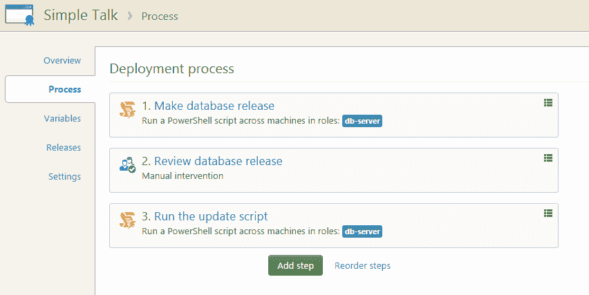

# Octopus 和 Redgate SQL 版本的数据库部署- Octopus Deploy

> 原文：<https://octopus.com/blog/database-deployments-with-octopus-and-redgate-sql-release>

如果您使用 SQL Server，您可能熟悉我们在红门的[朋友。他们是 SQL server 工具的领先开发者。虽然他们的一些最著名的工具(如 SQL Compare)专注于使手动过程更容易，但最近他们在数据库自动化方面投入了大量的时间和精力。他们的最新创造是一个名为 SQL Release 的插件，它与 Octopus 集成在一起，支持自动化数据库部署。以下是来自 SQL 发布团队的](http://www.red-gate.com/products/dlm/deployment-manager/octopus-deploy)[布莱恩·哈里斯](https://twitter.com/harrisimo)的客座博文。

### 什么是 SQL 版本？

在 SQL 发布团队中，我们希望发布新版本的数据库就像发布其他应用程序一样简单。麻烦在于数据库包含数据；因此，您需要升级实时数据库状态以匹配新版本，而不是部署一个全新的数据库。

我们在 SQL Release 中实现的解决方案是生成一个 SQL 更新脚本，将现有数据库升级到新版本。在运行这个脚本之前，您可以检查将要进行的更改，并查看引发的任何警告(例如，删除表时的数据丢失)。

当您对更新感到满意时，SQL Release 可以运行更新脚本。为了提高安全性，在运行脚本之前，SQL Release 会检查自脚本生成以来目标数据库是否发生过更改。

SQL 版本是作为一系列 PowerShell cmdlets 实现的，便于与 Octopus Deploy 集成。在未来，我们计划与其他发布管理工具集成。

### 演练:将 SQL Release 与 Octopus Deploy 一起使用

为了说明这在实践中是如何工作的，我们将通过一个简单的场景，使用 SQL Release 和 Octopus 从开发数据库直接部署到生产数据库。

开始之前，我们需要设置以下内容:

*   章鱼部署
*   一个名为 **Production** 的 Octopus 部署环境
*   配置了 **db-server** 角色的章鱼触手
*   [SQL Release 安装](http://documentation.red-gate.com/display/SR1/Installing)在 Octopus 触手的同一台机器上(触手安装 SQL Release 后需要重启)

### 创建新的 Octopus 部署项目

首先，我们需要创建一个新的 Octopus 项目，并给它命名。该项目由一系列管理数据库部署过程的步骤组成。当我们完成时，它将看起来像这样:



注意，我们不需要为这个项目中的任何步骤指定目标环境。如果您没有指定环境(在本例中没有问题，因为只有一个生产环境),默认情况下，项目将部署到所有环境中。

### 添加“发布数据库”步骤

我们添加的第一步是创建部署 SQL 脚本。在项目**流程**选项卡上，选择**添加步骤**并选择**运行 PowerShell 脚本**。

在字段中输入这些详细信息:

**Name**:Make database release**Machine roles**:d b-server
**Script**:该脚本使用了一组项目变量，我们将在后面定义:

```
# This step uses SQL Release to create a directory containing the
# Database Release: all the artifacts relating to the deployment.
#
# The directory, 'DatabaseRelease', has the structure:
#   - States
#       - Target: SQL Compare scripts folder of the state the database
#                 is in BEFORE the deployment.
#       - Source: SQL Compare scripts folder of the state the database
#                 will be in AFTER the deployment.
#   - Update.sql: The SQL change script that updates the target database from the
#                 target state to source state.
#   - Reports
#       - Changes.html: An HTML report showing which database objects
#                       will be changed in the deployment and how.
#       - Warnings.xml: An XML report containing warnings relating to the
#                        deployment.
# Makes sure the directory we're about to create doesn't already exist.
If (Test-Path $DatabaseReleaseDirectory) {
    rmdir $DatabaseReleaseDirectory -Recurse -Force
}
# Sets up connection string for the target database.
$developmentDatabase = "Data Source=$DevelopmentDatabaseServer; `
                        Initial Catalog=$DevelopmentDatabaseName; `
                        User ID=$DevelopmentSQLServerUsername;Password=$DevelopmentSQLServerPassword"
$productionDatabase =  "Data Source=$ProductionDatabaseServer; `
                        Initial Catalog=$ProductionDatabaseName; `
                        User ID=$ProductionSQLServerUsername;Password=$ProductionSQLServerPassword"
# Creates the DatabaseRelease directory.
New-DatabaseRelease -Target $productionDatabase `
                    -Source $developmentDatabase `
                    -Verbose `
| Export-DatabaseUpdate -Path $DatabaseReleaseDirectory
# Imports the changes report, deployment warnings, and update script
# as Octopus artifacts, so you can review them in Octopus.
New-OctopusArtifact "$DatabaseReleaseDirectory\Reports\Changes.html"
New-OctopusArtifact "$DatabaseReleaseDirectory\Reports\Warnings.xml"
New-OctopusArtifact "$DatabaseReleaseDirectory\Update.sql" 
```

点击**保存**。

### 添加“审查数据库发布”步骤

接下来，我们添加一个步骤来暂停部署，以便手动检查脚本和其他资源，这样我们可以确保在发布之前我们对发布感到满意。上一步导入了一个变更报告、更新脚本和一个警告文件，它们将在 Octopus UI 中显示以供查看。

在**项目流程**选项卡上，点击**添加步骤**并选择**需要手动干预**。

在字段中输入这些详细信息:

**名称:**
【审核数据库发布】

**说明:**

```
Please review the deployment artifacts on the right:
(1) Update.sql: SQL change script that updates the target database.
(2) Warnings.xml: XML report containing warnings relating to the deployment.
(3) Changes.html: HTML report showing which database objects will be changed in the deployment and how. 
```

### 添加“运行更新脚本”步骤

最后一步是部署我们在审核步骤获得批准后生成的脚本。

在**项目流程**选项卡上，点击**添加步骤**并选择**运行 PowerShell 脚本**。这是部署步骤。

在字段中输入这些详细信息:

**名称**:运行更新脚本
**机器角色** : db-server
**脚本**:

```
#This step uses SQL Release to deploy the database release we previously generated and wrote to disk.
$targetDatabase = "Data Source=$ProductionDatabaseServer; `
                   Initial Catalog=$ProductionDatabaseName; `
                   User ID=$ProductionSQLServerUsername;Password=$ProductionSQLServerPassword"

Import-DatabaseRelease $DatabaseReleaseDirectory | Use-DatabaseRelease -DeployTo $targetDatabase 
```

点击**保存**。

### 设置项目变量

| 变量名 | 价值 |
| --- | --- |
| 基本目录 | # {章鱼。触手. agent . applicationdirectorypath } \ # { Octopus。Environment . Name } \ # {章鱼。Project.Name}\#{Octopus。版本号} |
| 数据库名 | <nameofyourdatabase></nameofyourdatabase> |
| 数据库服务器 | <yoursqlserverinstance></yoursqlserverinstance> |
| 数据库释放目录 | # {基本目录} \数据库版本 |
| 章鱼。action . package . custominstallationdirectory | # { packageextractdirect } |
| packageextractddirectory | # {基本目录} \数据库包 |
| SQLServerPassword | <yoursqlserverpassword></yoursqlserverpassword> |
| SQLServerUsername | <yoursqlserverusername></yoursqlserverusername> |

### 运行部署

我们现在准备在 Octopus 中部署数据库更新。部署数据库版本的过程与使用 Octopus Deploy 部署普通更新的过程相同。

### 摘要

我向您展示了一个简单的用例:作为 Octopus Deploy 版本的一部分，从一个数据库模式部署到另一个数据库模式，但是 SQL 版本可以用于更复杂的情况。

我们可以使用 SQL Release 首先发布到预生产环境，在验证部署成功后，我们可以将其提升到我们的生产环境。

这种方法的好处是，我们可以针对生产运行与我们在生产前数据库上测试的完全相同的脚本。作为部署 SQL 版本检查的一部分，生产数据库仍处于我们预期的初始状态，因此我们可以确定针对预生产的试运行是对生产版本的良好测试，并且可以安全地重用脚本。

您还可以从数据库 NuGet 包中部署更改。这意味着可以对数据库进行源代码控制，在构建服务器中构建并测试它，然后使用 SQL 版本部署该构建，并提供所有的安全性和可靠性。

如果你想尝试 SQL Release，你可以在这里下载它。