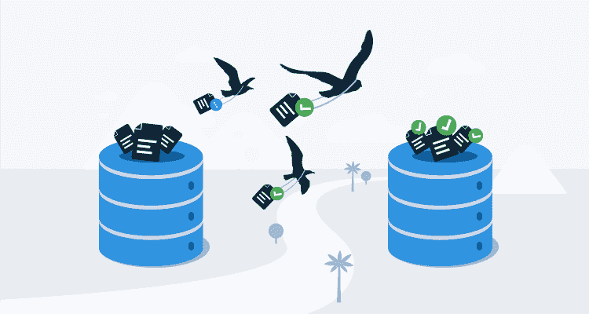
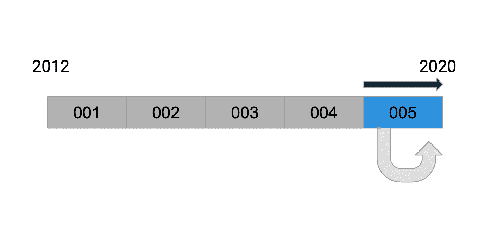
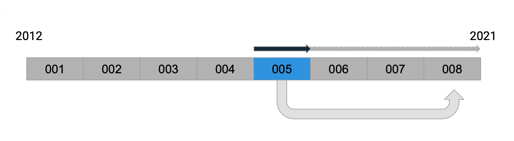

# 数据库迁移经验教训- Octopus 部署

> 原文：<https://octopus.com/blog/database-migrations-lessons-learned>

数据库迁移是一种以可控方式更新应用程序数据库的流行方式，这种方式可以将风险降至最低。这种方法也称为模式迁移、数据库升级脚本、变更驱动或基于脚本的更新。Octopus Deploy 从产品开始就使用数据库迁移，随着 Octopus 的规模和复杂性的增长，我们学到了很多东西。

在这篇文章中，我将介绍数据库迁移，分享一些常见的框架，并涵盖我们从近十年的经验中学到的教训。

## 什么是数据库迁移？

大多数应用程序需要将应用程序的状态信息保存在文件或数据库中。对象的形状几乎总是随着时间的推移而发展和变化，这意味着需要某种迁移代码或脚本来保持持久数据的形状同步(或一致)。没有它们，应用程序代码将需要从一开始就处理文档的所有可能版本。

大多数框架都支持这一概念，为您提供了一种提供迁移脚本来操作数据库的方法。有些甚至让您指定回滚操作。通常，它们会跟踪已经应用到表中的脚本。

几乎每个平台都有许多选项，每个选项通常都有一些独特的属性:

**节点 j**

**巨蟒**

**红宝石**

**。网**

**Java**

## 经验教训

### 第 1 课:让您的迁移脚本远离您的生产代码

作为软件开发人员，我们被训练重用和避免重复代码。这是我们*希望*复制代码的一次，因为我们希望我们的迁移脚本的行为在时被*捕捉到。*

下图描述了一个示例。每个脚本(编号为 001 到 005)负责将数据库状态从 **A** 更改为 **B** 。如果脚本引用了生产代码中的常量或函数(比如生成新属性的默认值的函数)，那么在编写时，该脚本仍将按预期工作。

 *现在可能行得通...*

如果引用的代码在几个月内发生了变化(比如常量的值发生了变化)，那么脚本实际上依赖于未来。这种行为上的变化是微妙而难以察觉的，*只有当客户直接从脚本首次引入之前的旧版本升级时才会出现*。

 *但是以后管用吗？*

### 第二课:保持低技术含量，不要反序列化

这一步适用于使用对象关系映射器(ORM)或文档数据库(即 NoSQL)的团队。Octopus 使用一种叫做[永不超生](https://github.com/OctopusDeploy/Nevermore)的微 ORM，它将 SQL Server 视为一个文档存储。

您可能会尝试反序列化数据库记录，以便可以使用代码完成(即 IntelliSense)或类型安全可用的对象。实际上，您将自己暴露在序列化和类型转换器的复杂性中。

如果您直接使用文本或文档模型，升级脚本会更简单。这通常意味着您需要处理不同格式的抽象。例如，Octopus 是用。这意味着我们直接用`JObject`处理`JSON`文档，或者用`XElement`处理`XML`文档。其他平台使用等效的概念和框架。

### 第 3 课:编写测试来单独测试每个迁移脚本

让测试运行单个脚本极大地增加了对迁移脚本的信心。手动测试迁移是一件痛苦的事情，因为您需要拍摄数据库的快照，并在测试后恢复它。

您可能还想对旧数据库样本的备份运行完整的迁移，以捕捉任何未预料到的数据或单个测试无法涵盖的错误假设。

### 4.考虑在线运行长时间迁移

Octopus 服务器在启动时同步运行其迁移脚本。这有利于在应用程序启动时使数据库处于已知的可预测状态。当然，缺点是在大型表上运行迁移会导致长时间的停机，这意味着我们要避免涉及大型表的某些结构变化。

当应用程序启动并运行时，我们已经开始尝试在后台异步运行大型迁移作业。这意味着停机时间更少，客户可以更快地恢复使用该应用程序，但这也带来了新的问题:

1.  应用程序必须支持旧状态和新状态的数据库
2.  当您对同一表进行后续更改时，升级作业可能会受到影响。然后，您需要在所有三种可能的状态下支持数据库，或者强制客户升级到中间版本。

这方面我们还没有具体的建议，但我们会继续评估。

### 5.考虑对文档进行版本控制

虽然使用迁移脚本来更新数据库模式更改和文档属性很方便，但是如果将这两个问题分开，您将获得一些灵活性。例如，如果您对文档进行了版本控制并单独升级了文档结构，那么您可以重用相同的升级代码从文件中导入相同的文档。

## 结论

从这些经验中最重要的一点是将你的升级脚本从主要的生产代码中分离出来，这样它的行为就能在时间中被*捕捉到。*

总之，我们的数据库迁移经验是:

*   让您的迁移脚本远离您的生产代码。
*   保持低科技，不要反序列化。
*   编写测试来单独测试每个迁移脚本。
*   考虑在线运行长时间迁移。
*   考虑对文档进行版本控制。