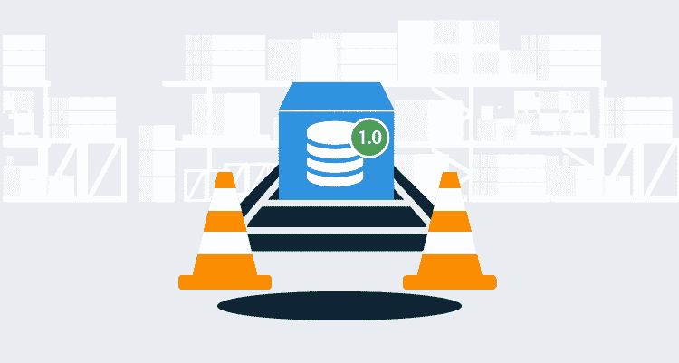

# SQL 回滚和自动化数据库部署的缺陷——Octopus 部署

> 原文：<https://octopus.com/blog/database-rollbacks-pitfalls>

虽然可以执行 SQL 回滚来恢复数据库更改，但问题是，您应该这样做吗？回滚数据库更改不像回滚代码更改那样简单。数据库是应用程序的生命线。不成功的回滚可能会导致数据损坏或被删除。本文介绍了导致坏数据或删除数据的陷阱，以及为什么前滚是更好的方法。

**TL；博士**

向前滚动是更好的选择。在特定情况下，可以回滚数据库更改，但这种情况很少见。花在设计数据库回滚过程上的精力应该集中在尽可能快速和安全的部署上。快速安全的数据库部署允许您进行前滚。

本文是我们撰写的关于自动化数据库部署系列文章的一部分。

## 回滚场景

回滚需求通常分为三类:

*   在部署期间。
*   在部署后的验证期间。
*   经过部署和验证。

部署和验证是有意分开的，因为用户可能在验证期间使用应用程序。这取决于部署策略(中断、金丝雀或蓝/绿部署)和您的应用程序支持的内容。例如，Octopus Deploy 具有[维护模式](https://octopus.com/docs/administration/managing-infrastructure/maintenance-mode)特性，该特性防止其他非管理员部署代码，即使他们仍然可以访问它。维护模式等功能支持部署后的验证。

让我们来看一个典型应用程序的部署过程。该应用程序有一个数据库、一个用 React 编写的前端、一个 RESTful API 后端和一个后台服务。部署过程可能如下所示:

1.  批准生产部署。
2.  部署数据库更改。
3.  部署后台服务。
4.  对于每个 web 服务器:
    1.  将服务器从负载平衡器中取出。
    2.  部署 RESTful API。
    3.  部署前端。
    4.  运行健全性检查测试。
    5.  将服务器重新添加到负载平衡器中。
5.  通过运行一整套测试来验证版本。
6.  将发布通知相关人员。

对于某些部署，数据库更改很简单。存储过程的新索引或效率调整。回滚这些更改不会有什么影响。回滚复杂的更改、添加列、移动列、添加表或拆分表都会产生重大影响。不要忘记迁移脚本。这些回滚要复杂得多。

## 为什么要回滚部署？

我听到的三个常见答案是:

1.  部署出了问题。
2.  我们运行一系列测试，其中一个或多个测试失败。
3.  用户发现节目停止错误。

好吧，酷，但是*出问题了*有点模糊。部署失败可能有多种原因，例如:

*   由于网络问题而失败。可能是网络管理员重启了交换机，导致与部署目标的连接中断。
*   DBA 应用角色成员资格更改，但新角色没有数据读取权限。
*   部署目标已关闭。
*   用于部署的服务帐户在当天早些时候更改了密码，但部署仍使用旧密码。
*   更新的应用程序需要。网芯 3.0，但仅此而已。已安装 NET Core 2.2。
*   部署过程中的错误配置。

我认为这些都不能证明回滚数据库更改是正确的。通常重试可以解决这些问题。这就是为什么我们在 Octopus Deploy 的部署中增加了[引导失败功能](https://octopus.com/docs/deployment-process/releases/guided-failures)，它允许你选择如何处理部署失败。

第二个原因，因为一个或多个测试失败而回滚。**所有的**测试都需要通过吗？就像部署失败一样，测试失败可能有多种原因，例如:

*   集成测试导致应用程序调用外部系统。外部系统预定明天才更新，并返回一个意外的结果。这个结果对于当前版本的外系统是正确的，但是对于明天即将发布的版本是不正确的。
*   有人不小心改了一些测试客户的名字。测试期望**测试用户**，但是现在数据是**测试用户#1** 。
*   外部系统与您的应用程序同时更新。测试将会失败，直到 20 分钟后外部系统启动并运行。

同样，我不认为这些失败证明回滚数据库更改是正确的。对于集成测试来说，只有当星星排成一行时才能工作，这是很常见的。

正在部署的更改量也会影响回滚。当进行几个更改时，回滚的愿望要比进行几十个更改时强烈得多。当发现一个停止显示的 bug 时，回滚的愿望会成倍增加。缺点是它们通常会被用户发现。这就变成了第二十二条军规。为了找到一个停止显示的 bug，用户必须使用这个应用程序。然而，一旦用户开始使用应用程序，回滚就变得更加困难。

## 备份和恢复的陷阱

您可能会想，“为什么我们不在部署过程开始之前进行数据库备份呢？这将解决回滚这些复杂更改的问题。”备份的有用性是有限的。在以下情况下，备份变得无用:

1.  用户开始使用应用程序的新版本。
2.  进行下一次定时备份。

这些事件可能在 1 分钟或几小时后发生。回滚意味着更改数据。或者更糟，删除数据。

通过备份恢复的回滚不会在真空中发生。应用程序共享数据是非常常见的。

在 Octopus Deploy 工作之前，我从事贷款发放系统的工作，主要目的是收集数据并发送给决策引擎。决策引擎决定贷款是应该被拒绝、自动批准，还是需要贷款官员收集更多数据。在信贷员输入更多数据后，他们可以提交这些数据以进行后续决策。贷款发放系统和决策引擎是具有独立数据库的独立应用程序。决策引擎处理第一个决策的方式不同于第二个决策。它使用贷款发放系统发送的唯一标识符来跟踪所做的决策。

我们第一次在测试环境中从备份中恢复贷款发放系统时，我们开始从决策引擎中获得意想不到的结果。问题是决策引擎的数据库不是从备份中恢复的。我们看到了两个问题:

**问题#1:**

1.  用户提交贷款。
2.  决策引擎自动批准贷款。
3.  从备份进行还原。
4.  用户再次提交贷款。
5.  决策引擎将此视为第二个请求，并拒绝贷款，认为这是一个欺诈贷款。

**问题 2:**

1.  用户为客户 a 提交贷款。
2.  决策引擎自动批准贷款。
3.  从备份进行还原。
4.  还原删除了整个贷款记录，以及许多其他贷款记录。
5.  用户重新创建贷款并提交它，但是它获得一个不同的惟一 ID 发送给决策引擎。
6.  决策引擎已经有了客户 B 的唯一 ID，它基于客户 A 和 B 的信息做出决策。

如您所见，备份不应该用于回滚。它们应该仅用于灾难恢复。我看到的典型备份计划是每周一次完整备份，每天一次部分备份，全天进行时间点备份。这些备份是在数据库服务器或数据中心丢失时进行的。

## 陷阱回滚脚本

我见过一些公司制定了这样的规则:*对于数据库的每一次更改，都必须编写相应的 SQL 回滚脚本*。然而，回滚脚本也有自己的缺陷。

编写 SQL 回滚脚本需要时间。如果脚本从未运行过，那么它就是在浪费时间。如果您有几十个成功的部署，编写回滚脚本的动机就会降低。随着时间的推移，人们开始公开质疑为什么首先需要创建它。最终，脚本变成了回滚的最小量。编写它们是为了选中一个复选框。

更重要的是，脚本必须经过测试。这引出了进一步的问题，例如:

*   谁测试他们？
*   他们什么时候被测试？
*   是自动化测试还是手动测试？

如果这些问题的答案是， *Bob 在产品发布之前的早上测试它们*，那么测试有可能只发生一半的时间。如果它不是一个阻塞任务，如果它不是自动化的，那么它就不会被完成。

回滚脚本的生命周期是有限的，就像数据库备份一样。当回滚是非中断的，例如，删除一个新的索引，或者恢复一个调整过的存储过程，生命周期很长。当变更中断时，例如，一个新的列或表被删除，生命周期是有限的。

例如，如果向表中添加了一列，回滚脚本将删除该列。简单。但是，如果该列在生产环境中运行了两天，并且数百个用户将数据保存到该列，回滚脚本还应该删除该列吗？在大多数应用程序中，删除数据是一件大事。

有一种诱惑，想出一个决策树，说明什么时候回滚脚本是必要的。最终，这将使事情变得更糟。一个接一个的场景将会被添加到树中，它将会变得一团糟。

## 向前滚动:一种不同的思维方式

一旦用户在部署后开始使用应用程序，你就已经[破釜沉舟](https://en.wikipedia.org/wiki/Crossing_the_Rubicon)。有人可能会说，一旦核查开始，就已经破釜沉舟了。

通常情况下，成功地*回滚一个部署的努力远远超过将一个补丁推向生产的努力。*

 *贷款发放系统的数据库部署实现自动化后，部署时间不到 10 分钟。数据库部署只需 3-4 分钟。我们有四个环境，当我们知道问题是什么时，我们可以检入一个变更，验证它，并在不到 30 分钟的时间内将其推送到所有四个环境。如果我们想跳过两个较低的环境，不到 20 分钟。

当在部署后危机期间提出回滚主题时，团队必须:

*   分析之前的部署有哪些变化。通常需要打开一个 diff 工具，一行一行地检查变化。
*   创建一个测试区域列表，以确保回滚后应用程序不会崩溃。
*   确定哪些数据将被更改。
*   确定哪些数据将被删除。
*   确定是需要回滚数据库还是只回滚代码。
*   创建生产备份，并在测试服务器上恢复它。
*   回滚之前的部署并开始测试。

在部署后危机期间，这种分析不是在真空中进行的。用户要求知道正在发生什么。上级要求状态报告。必须联系数据库管理员以获得生产数据库的副本来进行测试。期望在不到两个小时内完成这些步骤是不现实的。我见过团队花一整天来完成所有这些步骤。

## 理想的解决方案是:向前滚动并进行向后兼容的更改

数据库部署通常是部署中风险最大的部分。有可能降低这种风险吗？

我回想起我做过的包括数据库在内的所有生产部署。当这些变化在几小时或几天前上演时，压力水平是不存在的。这给了我们时间来验证工作时间的变化。代码仍在部署窗口期间部署。部署代码通常非常快。部署窗口期间的验证要快得多，因为大部分工作已经完成。

只有当数据库变化是向后兼容的时候，这才是可能的，这需要大量的训练。关于如何进行向后兼容数据库更改的详细信息，请参见我的文章[蓝/绿数据库部署](https://octopus.com/blog/databases-with-blue-green-deployments)。这个例子有点极端，但我认为花在这上面的时间是值得的。

这种方法还意味着部署数据库变更的过程需要与部署代码变更的过程分开。它还需要更多的规划，因为您将不得不同时处理两个生产部署。即使这样，我认为回滚应该是最后的手段。数据库不需要回滚，但是代码需要回滚。这可能会删除功能并让用户感到沮丧。

这样做并不总是可行的。我的个人原则是:

*   如果可能，使数据库更改向后兼容。
*   如果可能的话，在代码部署前的几个小时甚至几天内，准备数据库的变更。
*   除非发生灾难性的事情，否则就向前滚。

## 结论

成功地*回滚部署的努力远远超过了将补丁推向生产的努力。回滚出错的几率比前滚高得多。对于数据库回滚来说尤其如此。一天只有这么多时间，与其花时间担心回滚和所有可能的情况，不如花时间改进部署。*

 *愉快的部署！

如果你喜欢这篇文章，我们有一整个系列的[自动化数据库部署](https://octopus.com/database-deployments)供你阅读。**