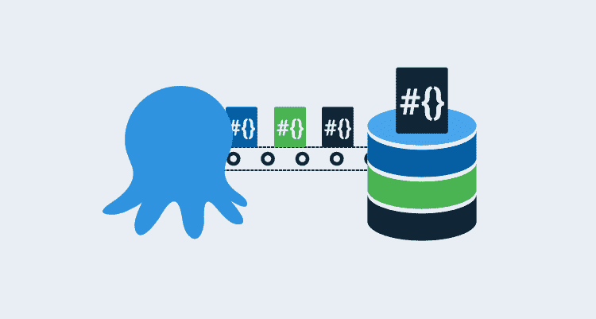
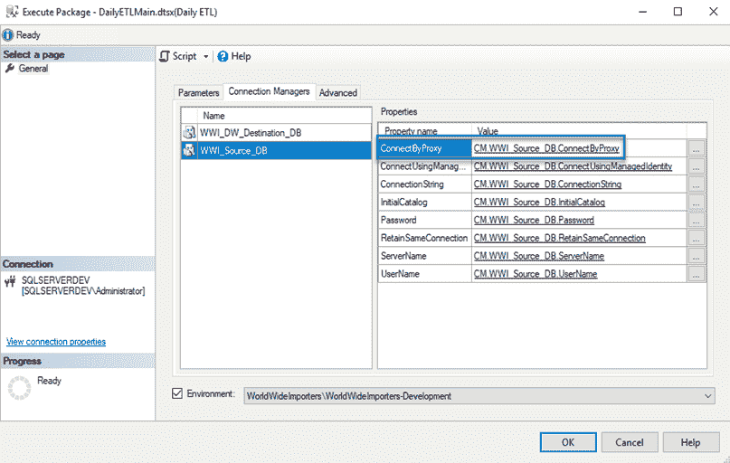
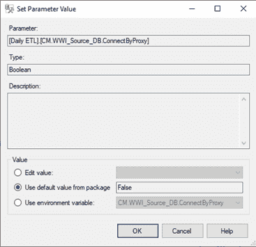

# 为 SSIS - Octopus 部署调试“集合属性中不存在元素”

> 原文：<https://octopus.com/blog/debugging-element-does-not-exist-in-the-collection-properties-for-ssis>

[](#)

在之前的一篇文章中，我介绍了如何使用 Octopus Deploy 部署 SQL Server Integration Services(SSIS)包。在这篇文章中，我讨论了一个我在包被部署到服务器上之后遇到的问题，这个问题是由于使用较新版本的 Visual Studio 来开发 SSIS 包，但是部署到了较旧版本的 SQL Server 上。

## 错误

成功部署后，开发人员尝试运行 SSIS 包，但收到以下错误消息:

```
Failed to configure a connection property that has the following path: \Package.Connections [WWI_Source_DB].Properties[ConnectByProxy]. Element "ConnectByProxy" does not exist in collection "Properties". 
```

为了进行研究，我首先查看了环境变量映射:

[](#)

该属性存在并映射到适当的环境变量。

作为一个实验，我让开发人员直接从 Visual Studio 发布 SSIS 包，这个包工作正常。这两种方法的主要区别在于 Visual Studio publish 没有将包参数映射到环境变量。相反，它们被设置为**使用包**中的默认值。在这种情况下，默认值显示为`False`。

[](#)

要进入此窗口:

1.  右键单击该包并选择**配置**。
2.  将范围下拉列表更改为**所有包和项目**。
3.  点击**连接管理器**选项卡

我使用 Octopus Deploy 重新部署了 SSIS 包。部署完成后，我编辑了包并选择了**编辑值**并选择了`False`。由于同样的错误，程序包再次失败，但是将值设置为**使用程序包**中的默认值成功。

## 问题是

经过几个小时的研究，我发现开发人员使用最新版本的 Visual Studio 来开发 SSIS 包，但它是部署到 SQL Server 的旧版本。

新版本的 Visual Studio 为连接管理器引入了旧版本的 SQL Server 所不知道的附加属性。该错误试图告诉我们这一点，但不清楚。

`Element "ConnectByProxy" does not exist in collection "Properties"`是说`ConnectByProxy`不存在于`Properties`的服务器集合中，而不是包本身。选择**使用包**中的默认值也具有误导性。

从 UI 来看，这个选择显示的值是`False`，然而，实际值是`null`(在读取包的 XML 时发现的)。

## 解决方案

有两种解决方案:

*   手动将封装参数更新为**使用封装**设置中的值。
*   使用 PowerShell 为您更新软件包参数。

### 手动方法

上面的提示描述了如何导航到包参数并手动更新它们。然而，这是低效的，因为它需要在每次部署后重复。

### PowerShell

更好的解决方案是将“运行脚本”任务添加到部署过程中，以便为您执行编辑。

下面的脚本应该可以帮助您完成大部分工作:

```
# define functions
Function Import-Assemblies
{
    # display action
    Write-Host "Importing assemblies..."

    # get folder we're executing in
    $WorkingFolder = Split-Path $script:MyInvocation.MyCommand.Path
    Write-Host "Execution folder: $WorkingFolder"

    # Load the IntegrationServices Assembly
    [Reflection.Assembly]::LoadWithPartialName("Microsoft.SqlServer.Management.IntegrationServices") | Out-Null # Out-Null suppresses a message that would normally be displayed saying it loaded out of GAC
}

Function Get-Catalog
{
    # define parameters
    Param ($CatalogName, $IntegrationServices)

    # define working variables
    $Catalog = $null

    # check to see if there are any catalogs
    if($integrationServices.Catalogs.Count -gt 0 -and $integrationServices.Catalogs[$CatalogName])
    {
        # get reference to catalog
        $Catalog = $integrationServices.Catalogs[$CatalogName]
    }
    else
    {
        Write-Error  "Catalog $CataLogName does not exist or the Tentacle account does not have access to it."

        # throw error
        throw
    }

    # return the catalog
    return $Catalog
}

Function Get-Folder
{
    # parameters
    Param($FolderName, $Catalog)

    # try to get reference to folder
    $Folder = $Catalog.Folders[$FolderName]

    # check to see if $Folder has a value
    if(!$Folder)
    {
        Write-Error "Folder not found."
        throw
    }

    # return the folder reference
    return $Folder
}

Function Clear-Parameter
{
    # define parameters
    Param($ParameterName)

    # Create a connection to the server
    $sqlConnectionString = "Data Source=$SQLServer;Initial Catalog=master;Integrated Security=SSPI;"
    $sqlConnection = New-Object System.Data.SqlClient.SqlConnection $sqlConnectionString
    $ISNamespace = "Microsoft.SqlServer.Management.IntegrationServices"

    # create integration services object
    $integrationServices = New-Object "$ISNamespace.IntegrationServices" $sqlConnection

    try
    {
        # get catalog reference
        $Catalog = Get-Catalog -CatalogName $CataLogName -IntegrationServices $integrationServices
        $Folder = Get-Folder -FolderName $FolderName -Catalog $Catalog

        # get reference to project
        $Project = $Folder.Projects[$ProjectName]

        # find specific parameter
        $Parameter = $Project.Parameters | Where-Object {$_.Name -eq $ParameterName}

        # set parameter to design time default value
        Write-Host "Clearing parameter $ParameterName"
        $Parameter.Clear()

        # set value
        $Project.Alter()
    }
    finally
    {
        # close connection
        $sqlConnection.Close()
    }
}

# get reference to assemblies needed
Import-Assemblies

$SQLServer = "#{Project.Database.Server.Name}"
$CataLogName = "SSISDB"
$FolderName = "#{Project.SSISDB.Folder.Name}"
$ProjectName = "#{Project.SSISDB.Project.Name}"

# fix the problem
Clear-Parameter -ParameterName "CM.WWI_Source_DB.ConnectByProxy" 
```

有了这个脚本，您可以调用`Clear-Parameter`来获取任何需要设置为`Use default value from package` on 的参数。

## 结论

在自动化 SSIS 部署时，我发现新版 Visual Studio 向连接管理器引入了旧版 SQL Server 不知道的附加属性。我希望这篇博客能让你避免遇到同样的问题。

愉快的部署！