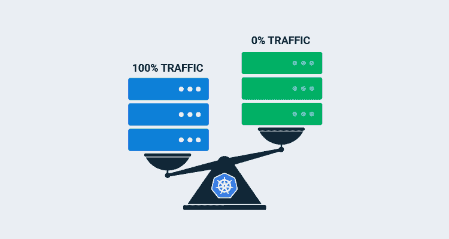
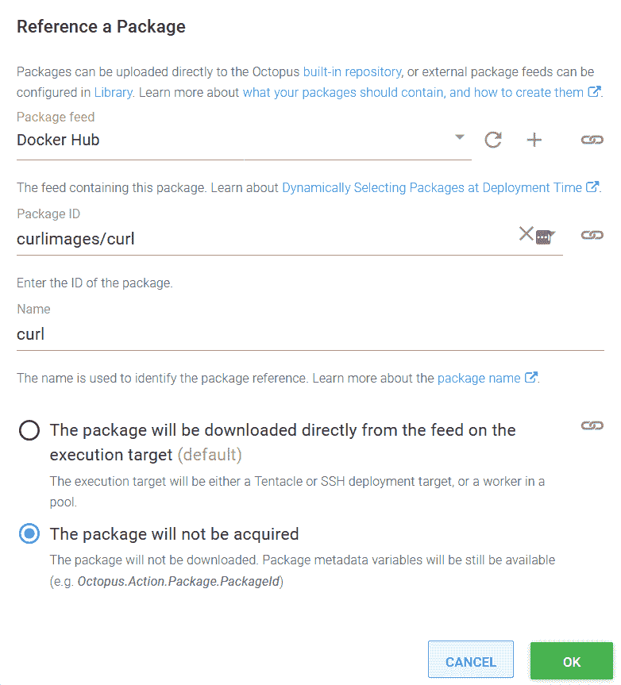

# 解构 Kubernetes - Octopus 部署中的蓝/绿部署

> 原文：<https://octopus.com/blog/deconstructing-blue-green-deployments>

[](#)

除了 Kubernetes 本身支持的重新创建和滚动部署策略之外，Octopus 还提供了执行蓝/绿部署的能力。此复选框选项允许以蓝/绿方式部署单个 Kubernetes 部署，完成服务切换和旧资源清理。

但是有时这种复选框方法不够灵活。如果您想要暂停到新部署的切换，以允许手动测试、编排多个部署(例如，前端和后端应用程序)，或者使用功能分支，那么您需要为自己重新创建蓝/绿部署流程。

在这篇博客文章和相关的截屏中，我将向您展示如何重新创建一个蓝/绿部署，并部署一个模拟特性分支作为该过程的演示。

## 截屏

[https://www.youtube.com/embed/BiaDsKAPSdU](https://www.youtube.com/embed/BiaDsKAPSdU)

VIDEO

## 创建初始部署

对于这个演示，我们将把 [httpd](https://hub.docker.com/_/httpd) docker 映像部署到 Kubernetes 中。这给了我们一个 web 服务器，我们可以将浏览器和命令行工具指向它，我们将利用像`2.4.46-alpine`这样的标签来模拟特性分支。

我们首先通过**部署 Kubernetes 容器**步骤部署一个新的 Kubernetes 部署资源。

部署资源必须有一个惟一的名称，我们通过将字符串`-#{Octopus.Deployment.Id | ToLower}`附加到资源名称上来创建这个名称。对于每个部署来说,`Octopus.Deployment.Id`变量是唯一的，因此我们可以确定每个新的部署都会创建一个新的 Kubernetes 资源。

我们还定义了一个名为`FeatureBranch`的标签，它被设置为我们将在下一节中创建的名为`PackagePreRelease`的变量的值。

下面的 YAML 可以粘贴到**部署 Kubernetes 容器**步骤的**编辑 YAML** 部分来配置资源:

```
apiVersion: apps/v1
kind: Deployment
metadata:
  name: 'httpd-#{Octopus.Deployment.Id | ToLower}'
  labels:
    FeatureBranch: '#{PackagePreRelease}'
spec:
  selector:
    matchLabels:
      octopusexport: OctopusExport
  replicas: 1
  strategy:
    type: Recreate
  template:
    metadata:
      labels:
        FeatureBranch: '#{PackagePreRelease}'
        octopusexport: OctopusExport
    spec:
      containers:
        - name: httpd
          image: index.docker.io/httpd
          ports:
            - name: web
              containerPort: 80 
```

## 定义变量

我们需要创建两个变量来获取特性分支的名称。

第一个变量叫做`PackagePreRelease`，值设置为`#{Octopus.Action[Deploy HTTPD].Package[httpd].PackageVersion | VersionPreReleasePrefix}`。这个模板字符串在称为`Deploy HTTPD`的步骤中从称为`httpd`的容器中提取版本(或图像标签)，并通过`VersionPreReleasePrefix`过滤器(在 Octopus 2020.5 中可用)提取预发布字符串。

这意味着对于主线部署来说,`PackagePreRelease`变量将为空，而对于我们在本演示中称之为特性分支部署来说，变量将被设置为`alpine`。

第二个变量叫做`ServiceSuffix`，值设置为`#{if PackagePreRelease}-#{PackagePreRelease}#{/if}`。如果`PackagePreRelease`不为空，该模板在`PackagePreRelease`的值前添加一个破折号。否则`ServiceSuffix`为空字符串。

这意味着对于主线部署来说,`ServiceSuffix`变量将为空，而对于我们在本演示中称之为特性分支部署来说，变量将被设置为`-alpine`。

## 为绿色部署创建临时服务

为了对新部署的 pod(我们称之为蓝/绿部署的绿色部分)做任何有用的事情，我们需要公开服务背后的 pod。

对于这个演示，我们只需要在 Kubernetes 集群内部公开 pod 来执行我们的测试，因此我们创建了一个集群 IP 服务。

服务选择器基于`Octopus.Deployment.Id`标签匹配 pod，该标签匹配当前部署期间创建的任何 pod。

下面的 YAML 可以粘贴到**部署 Kubernetes 服务资源**步骤的**编辑 YAML** 部分来配置资源:

```
apiVersion: v1
kind: Service
metadata:
  name: 'httpdservice-green#{ServiceSuffix}'
spec:
  type: ClusterIP
  ports:
    - name: web
      port: 80
      nodePort: ''
      targetPort: ''
      protocol: TCP
  selector:
    Octopus.Deployment.Id: '#{Octopus.Deployment.Id}' 
```

## 执行手动运行状况检查

您需要创建自己的蓝/绿部署的一个环境是在 Kubernetes 公开的活动探测器之外运行健康检查。这可能是由人工完成的手动检查，或者，正如我们将在这里演示的，是使用外部工具的自动化测试。在我们的例子中，我们将使用`curl`来检查我们部署的健康状况。

这是在一个**运行 kubectl CLI 脚本**步骤中完成的，在这里我们调用`kubectl`来运行集群中安装了`curl`的容器以完成检查:

```
echo "Testing http://httpdservice-green#{ServiceSuffix}"
kubectl run --attach=true --restart=Never test-#{Octopus.Deployment.Id | ToLower} --image=#{Octopus.Action.Package[curl].PackageId}:#{Octopus.Action.Package[curl].PackageVersion} -- --fail http://httpdservice-green#{ServiceSuffix}
exit $? 
```

映像名称是使用由附加包引用公开的变量构建的:

[](#)

## 创建持久服务

在健康检查通过之后，我们需要创建(如果这是第一次部署)或者重定向外部客户机用来访问我们正在部署的应用程序的持久服务。重定向这个持久服务上的流量是我们将流量从旧的蓝色部署切换到新的绿色部署的方式。

该服务与我们之前创建的临时服务非常相似，只是它是一个具有公共 IP 地址的负载平衡器，我们不会在部署结束时删除它:

```
apiVersion: v1
kind: Service
metadata:
  name: 'httpdservice#{ServiceSuffix}'
spec:
  type: LoadBalancer
  ports:
    - name: web
      port: 80
      nodePort: ''
      targetPort: ''
      protocol: TCP
  selector:
    Octopus.Deployment.Id: '#{Octopus.Deployment.Id}' 
```

## 清理资源

在流量被重定向到我们的新应用程序后，我们可以清理旧的资源。这是通过另一个**运行 kubectl CLI 脚本**步骤来执行的:

```
kubectl delete service httpdservice-green#{ServiceSuffix}
kubectl delete deployment -l Octopus.Project.Id=#{Octopus.Project.Id | ToLower},Octopus.Environment.Id=#{Octopus.Environment.Id | ToLower},Octopus.Deployment.Tenant.Id=#{unless Octopus.Deployment.Tenant.Id}untenanted#{/unless}#{if Octopus.Deployment.Tenant.Id}#{Octopus.Deployment.Tenant.Id | ToLower}#{/if},Octopus.Deployment.Id!=#{Octopus.Deployment.Id | ToLower},FeatureBranch=#{PackagePreRelease} 
```

请注意，我们基于旧资源的`Octopus.Deployment.Id`标签与当前部署的 ID 不匹配这一事实来匹配旧资源。此外，因为我们在`FeatureBranch`标签上匹配，主线和特性分支部署可以共存，不需要一个清理另一个。

## 结论

此处提供的示例是实施蓝/绿部署所需的最低要求，但是通过向流程中添加新步骤，您可以按照自己的意愿自定义工作流。可以添加手动干预步骤，以允许 QA 人员验证新的部署，可以执行更复杂的自动化测试，或者可以将多个资源作为一个组进行部署和切换。

愉快的部署！