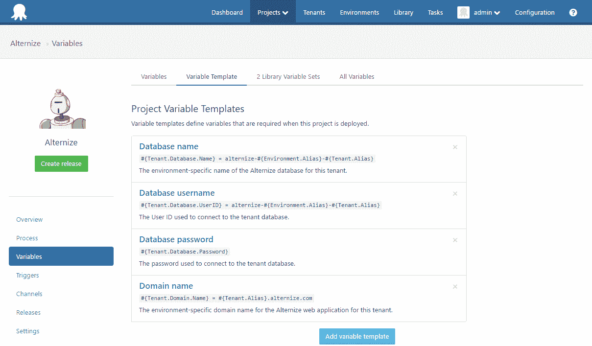
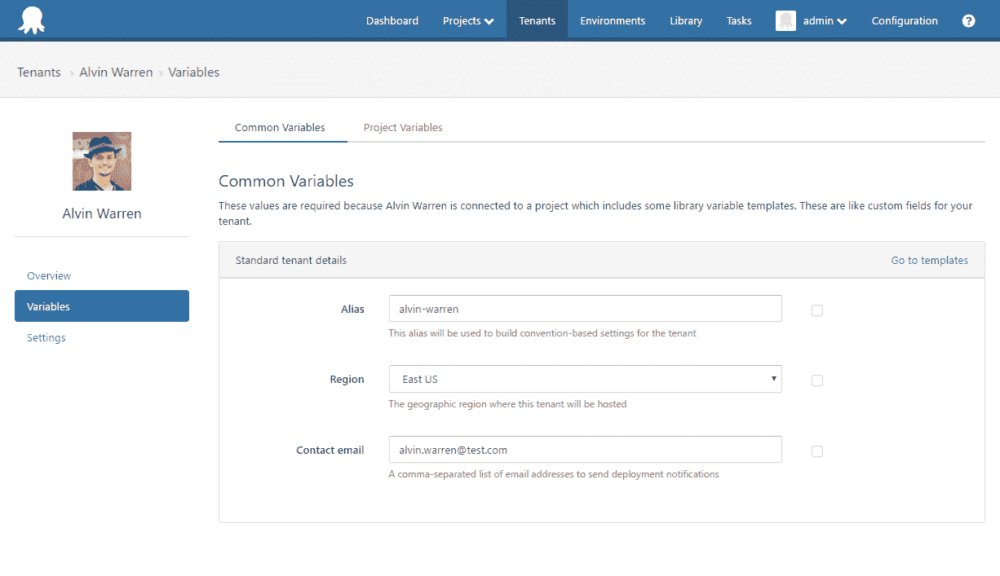
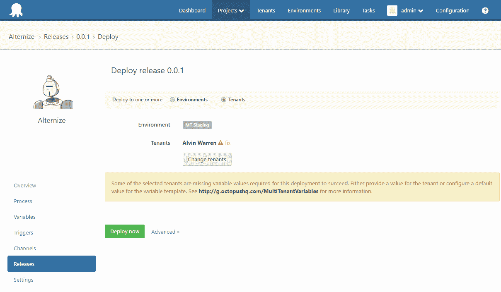

# 在多租户环境中定义变量——Octopus 部署

> 原文：<https://octopus.com/blog/defining-variable-templates>

这篇文章是我们 Octopus 3.4 博客系列的一部分。在我们的[博客](https://octopus.com/blog/octopus34-blog-series-kickoff)或我们的[推特](https://twitter.com/OctopusDeploy)上关注它。

**Octopus Deploy 3.4 已经发货！阅读[博文](https://octopus.com/blog/octopus-deploy-3.4)和[今天就下载](https://octopus.com/downloads)！**

* * *

Octopus 中的多租户部署为 Octopus 体验增加了一个新的维度。它能够以一种安全和可重复的方式向多个客户部署版本，这在以前是很难做到的。

在设计多租户部署时，我们必须考虑的一个重要特性是如何为租户处理定制变量。如果你想象一个可以为多个客户定制的 SaaS(软件即服务)web 应用程序，那么需要为每个客户或租户指定许多变量。有一些常见的特定于客户的详细信息需要更改，如网站名称、标题/页眉、图像/徽标 URL 和联系信息，以及服务器名称和数据库连接设置等技术细节。我们对此的解决方案是`Variable Templates`。变量模板允许您指定将项目成功部署到租户所需的变量。它们可以在一个项目或一个库变量集上定义，我们根据它们定义的位置以稍微不同的方式解释它们。

## 项目变量模板

在项目中定义变量模板意味着对于租户所连接的每个环境，变量可以有不同的值。这是管理技术设置(如数据库连接字符串或其他特定于环境的细节)的好方法。特定于租户的项目变量模板值在“项目变量”选项卡下的“租户变量”页面上进行管理。

## 库变量模板

在库中定义变量模板意味着无论项目和环境如何，该租户的变量都将有一个常量值。特定于租户的库变量模板值在“通用变量”选项卡下的租户页面上进行管理。

 

## 缺少变量

如果租户缺少任何必需的变量，我们也会向您发出警告，并帮助您快速轻松地修复它们。

## 项目变量和库变量集

值得一提的是，虽然变量模板使您能够管理所需的特定于租户的变量，但仍然可以在项目和库变量集中定义“普通”变量，然后适当地确定范围。Octopus 3.4 还引入了将变量作用于租户标记的能力。

## 租户可变快照

最后，需要注意的是，特定于租户的变量不会被拍摄快照。当您在 Octopus 中创建一个版本时，我们会对部署过程和项目变量的当前状态进行快照，但是我们不会对租户变量进行快照。这使您可以随时添加新的租户，并为其部署现有版本。此外，这意味着您可以对租户变量进行更改，并立即部署它们。这消除了在生产之前创建新版本并在众多环境中部署它的需要。

* * *

要了解更多信息，我强烈推荐阅读我们的[多租户部署指南](http://docs.octopus.com/display/OD/Multi-tenant+deployment+guide)，并特别关注[使用租户特定变量](http://docs.octopus.com/display/OD/Working+with+tenant-specific+variables)页面。