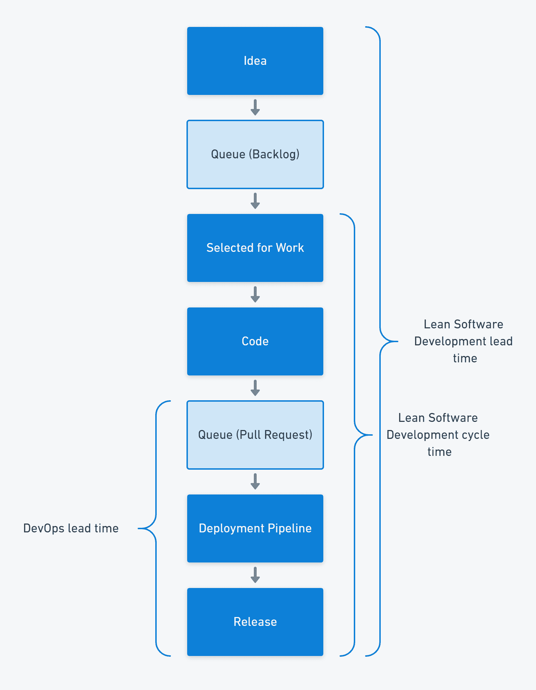
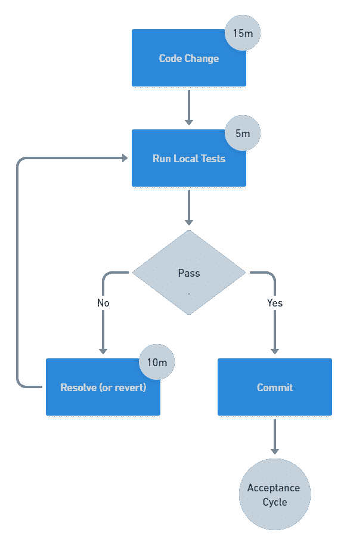

# 为什么有这么多提前期的定义？-章鱼部署

> 原文：<https://octopus.com/blog/definitions-of-lead-time>

当有人提到软件交付中的交付周期时，通常不清楚他们是指精益软件开发中的交付周期定义，还是 DevOps 中的交付周期定义，或者其他完全不同的定义。

在这篇文章中，我将探讨为什么有这么多提前期的定义，以及如何使用它们。

## 提前期定义

DevOps 对变更提前期的定义是从开发人员将代码提交到版本控制到有人将变更部署到生产环境之间的时间。这个定义比精益定义覆盖了软件交付过程的一小部分。

Mary 和 Tom Poppendieck 在精益制造运动的基础上创建了精益软件开发，他们测量了从你发现一个需求到某人满足该需求的前置时间。

基于丰田生产系统的精益运动将交付周期定义为客户下订单和收到汽车之间的时间。

## 交付时间是客户的衡量标准

所有这些交付周期都代表了一种客户衡量。但是它们不同，因为客户不同。

*   丰田从汽车购买者的角度来衡量这个系统
*   Poppendiecks 测量用户眼中的软件开发系统
*   DevOps 从作为客户的开发人员的角度来衡量部署管道

| 研制周期 | 顾客 | 开始 | 结束 |
| --- | --- | --- | --- |
| 丰田生产系统 | 汽车购买者 | 命令 | 交付 |
| 精益软件开发 | 用户 | 要求 | 工作软件 |
| DevOps | 开发者 | 代码提交 | 生产部署 |

成功测量交付周期的关键是展示客户如何看待消耗的时间。

如果你经营一家咖啡店，你可能会计算顾客下订单和把咖啡递给他们之间的时间。你可能会认为 2 分钟的提前期很好，因为你的竞争对手从下单到完成订单需要 3 分钟。

然而，你的竞争对手使用的是全系统提前期，从客户加入队列开始。他们增加了一名咖啡师，将排队时间从 15 分钟减少到 7 分钟。他们的顾客 10 分钟后就能拿到咖啡，但你的顾客要等 17 分钟(而且你正在失去那些看到排队就离开的顾客)。

除非你的交付周期代表了客户对系统的完整看法，否则你很可能优化了错误的东西。

## 周期时间

当您测量系统的一部分时，您正在收集一个*周期时间*。在汽车行业，跟踪一辆汽车在生产线上移动需要多长时间是很有用的。在软件交付中，收集从工作项目开始到结束的周期时间是很常见的。这表明了软件交付的性能，而没有工作开始前可能发生的变化的等待时间。

如咖啡店示例所示，您的客户不关心周期时间。虽然您可以使用周期时间来度量系统的不同部分，以确定限制工作流程的瓶颈，但是您应该始终记住整个系统。

在软件交付中，通常会发现很大一部分运行时间是由于工作在队列中等待。例如，一个需要几天才能交付的需求可能会积压几个月，或者一个拉取请求可能要等待几个小时甚至几天才能得到批准。您可以通过细分您的系统并测量每个部分来识别这些延迟。

提前期衡量的是系统的实际产出，但是周期时间可以帮助你找到系统的约束。

## 所有测量都是有用的

交付周期很有价值，因为它代表了客户的认知。识别您的客户并跟踪他们看到的交付周期，确保您做出的任何改进都会影响他们的体验。

如果你的改进没有减少交付时间，你就优化了系统的错误部分。在某些情况下，减少系统错误部分的时间甚至会增加总提前期，如果它增加了约束条件的额外压力的话。

一个*约束*是限制整个系统流动速度的瓶颈。解决约束会导致瓶颈移动，因此识别和解决约束的过程是连续的。

软件交付对大多数组织来说是一个限制，因为技术是一个关键的竞争优势。然而，这不是一个足够细粒度的识别来进行改进。您需要查看您的软件交付价值流，并在它们增加系统中工作流程的地方进行改进。

Eli Goldratt 创立的约束理论告诉我们，在一个系统中总是至少有一个约束。在约束之外的任何地方进行优化都无法提高整个系统的性能。

周期时间和其他部分系统计时器可以帮助您找出优化可能减少总交付时间的地方，因此您可以使用周期时间和交付时间来评估改进。

## 常见的软件交付限制

软件交付中有一些常见的约束:

*   大批量工作
*   提取请求批准队列
*   分支过多的，或分支存在时间过长的
*   人工测试
*   政策约束，如不必要的批准
*   功能孤岛之间的移交(例如开发、测试和操作)

这些约束中的一些反映在[连续交付提交周期](https://octopus.com/devops/continuous-delivery/how-to-start-using-continuous-delivery/#key-practice-continuous-integration)中，该周期具有以下推荐的时间:

*   每 15 分钟提交一次
*   初始构建和测试反馈在 5 分钟内完成
*   10 分钟后修复任何故障或恢复更改

【T2 

## 结论

交付周期的不同定义反映了客户对同一流程各部分的不同理解。您可以根据需要使用任意多的提前期和周期时间度量来查找和解决系统中的约束。您可以长期跟踪交付周期，并将周期时间临时用作特定改进练习的一部分。

当你改进或优化时，提前期可以帮助你了解你是否对整个系统产生了积极的影响。

愉快的部署！