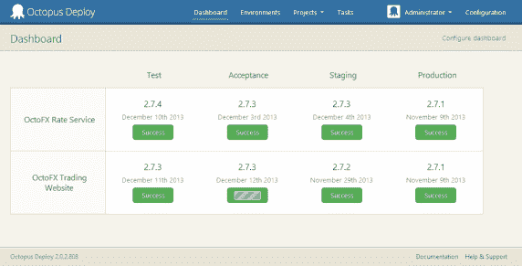

# 探索一个活的 Octopus Deploy 服务器

> 原文：<https://octopus.com/blog/demo-server>

如果不能与 Octopus Deploy 这样的产品进行交互，就很难了解它是如何工作的。我们有十个简短的视频展示如何设置，但这与点击鼠标探索真正的服务器不太一样。

为了提供帮助，我们创建了一个**现场演示**服务器:

[查看直播演示服务器](https://demo.octopusdeploy.com/)

 *演示服务器运行最新版本的 Octopus，有两个项目部署到七个触角上。您可以作为来宾登录来查看服务器和浏览。我们已经将[访客账户](http://docs.octopusdeploy.com/display/OD/Guest+login)设置为只读的 Octopus 管理员；您可以查看任何内容，但实际上您无法更改系统。

还有一个[演示团队城市服务器](http://teamcity.octopusdeploy.com/)，它被配置为编译代码并部署到 Octopus。每小时它触发一次构建和部署，每周它向**验收**环境发布一次。

演示项目突出了几个不同的特性，包括[滚动 web 应用部署](https://demo.octopusdeploy.com/app#/projects/octofx-trading-website/process)、[库变量集](https://demo.octopusdeploy.com/app#/configuration/library/variables/LibraryVariableSets-1)和[配置 Windows 服务](https://demo.octopusdeploy.com/app#/projects/octofx-rate-service/process/step/d2f405d0-e3a4-4ba5-99d6-a2ac0783f363)。我希望你会发现它是一个有用的参考服务器！*