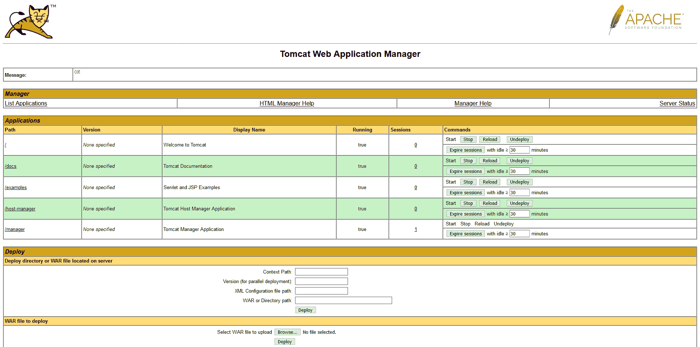

# 使用管理器应用程序- Octopus Deploy 在 Docker 中启动 Tomcat

> 原文：<https://octopus.com/blog/deployable-tomcat-docker-containers>

[](#)

当使用 Tomcat 测试 Java 部署时，官方的 Tomcat Docker 映像提供了一种方便的方法来启动和运行服务器。但是，要加载和访问管理器应用程序，有一些技巧。

在这篇博客文章中，我们将讨论如何引导 Tomcat Docker 映像来接受新的部署。

## 定义用户

首先，我们需要定义一个可以访问 manager 应用程序的 Tomcat 用户。该用户在名为`tomcat-users.xml`的文件中定义，将被分配`manager-gui`和`manager-script`角色，这两个角色授予对经理 HTML 界面以及 API 的访问权限:

```
<tomcat-users>
  <role rolename="manager-gui"/>
  <role rolename="manager-script"/>
  <user username="tomcat" password="s3cret" roles="manager-gui,manager-script"/>
</tomcat-users> 
```

## 揭发经理

默认情况下，管理器应用程序将只接受来自`localhost`的流量。请记住，从 Docker 映像的上下文来看，`localhost`意味着容器的环回接口，而不是主机的环回接口。启用端口转发后，到公开端口的流量通过容器的外部接口进入 Docker 容器，默认情况下会被阻止。这里我们有一个禁用了网络过滤的管理器应用程序`context.xml`文件的副本:

```
<Context antiResourceLocking="false" privileged="true" >
  <!--
    <Valve className="org.apache.catalina.valves.RemoteAddrValve"
         allow="127\.\d+\.\d+\.\d+|::1|0:0:0:0:0:0:0:1" />
  -->
  <Manager sessionAttributeValueClassNameFilter="java\.lang\.(?:Boolean|Integer|Long|Number|String)|org\.apache\.catalina\.filters\.CsrfPreventionFilter\$LruCache(?:\$1)?|java\.util\.(?:Linked)?HashMap"/>     
</Context> 
```

[这篇博客文章](https://pythonspeed.com/articles/docker-connection-refused/)提供了更多关于码头工人与转发端口联网的细节。

## 运行容器

需要跨越的最后一个障碍是，Tomcat Docker 映像默认情况下不加载任何应用程序。默认应用程序，如管理器应用程序，保存在一个名为`/usr/local/tomcat/webapps.dist`的目录中。我们需要将这个目录移动到`/usr/local/tomcat/webapps`。这是通过覆盖启动容器时使用的命令来实现的。

下面的命令映射我们上面创建的两个定制 XML 文件(在本例中保存到`/tmp`，将`/usr/local/tomcat/webapps.dist`移动到`/usr/local/tomcat/webapps`，最后启动 Tomcat:

```
sudo docker run \
  --name tomcat \
  -it \
  -p 8080:8080 \
  -v /tmp/tomcat-users.xml:/usr/local/tomcat/conf/tomcat-users.xml \
  -v /tmp/context.xml:/tmp/context.xml \
  tomcat:9.0 \
  /bin/bash -c "mv /usr/local/tomcat/webapps /usr/local/tomcat/webapps2; mv /usr/local/tomcat/webapps.dist /usr/local/tomcat/webapps; cp /tmp/context.xml /usr/local/tomcat/webapps/manager/META-INF/context.xml; catalina.sh run" 
```

## 访问管理应用程序

要打开管理器应用程序，请打开 URL http://localhost:8080/manager/html。输入`tomcat`作为用户名，输入`s3cret`作为密码:

[](#)

## 结论

Tomcat 映像维护人员选择不启用默认应用程序作为安全预防措施，但是通过两个自定义配置文件和覆盖 Docker 命令，可以用一个全功能的管理器应用程序来引导 Tomcat。

在本文中，我们提供了示例配置文件和 Docker 命令，以便在运行 Tomcat 之前恢复默认应用程序。