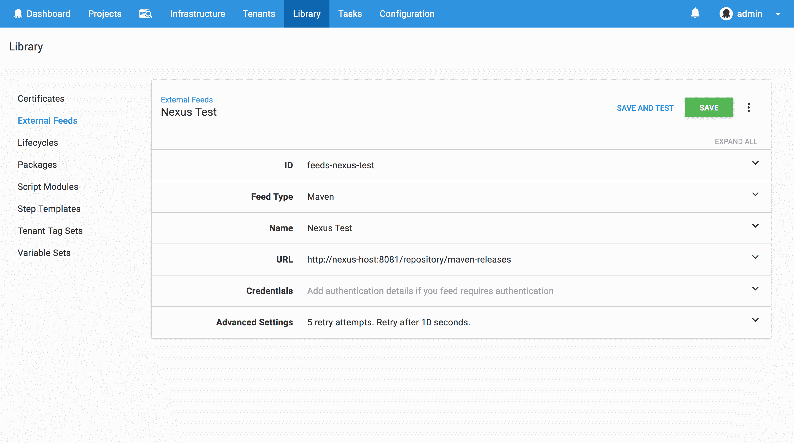
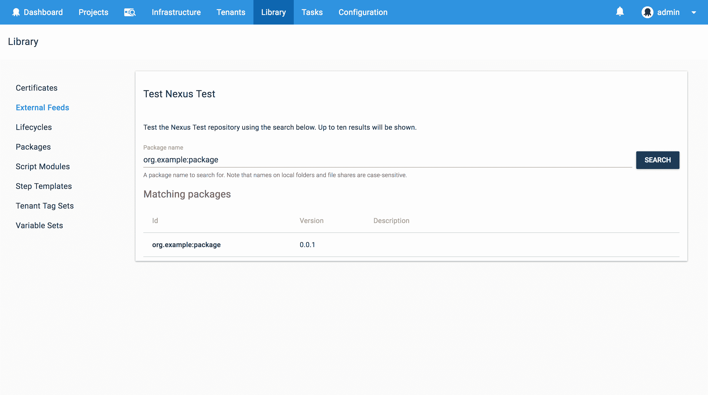
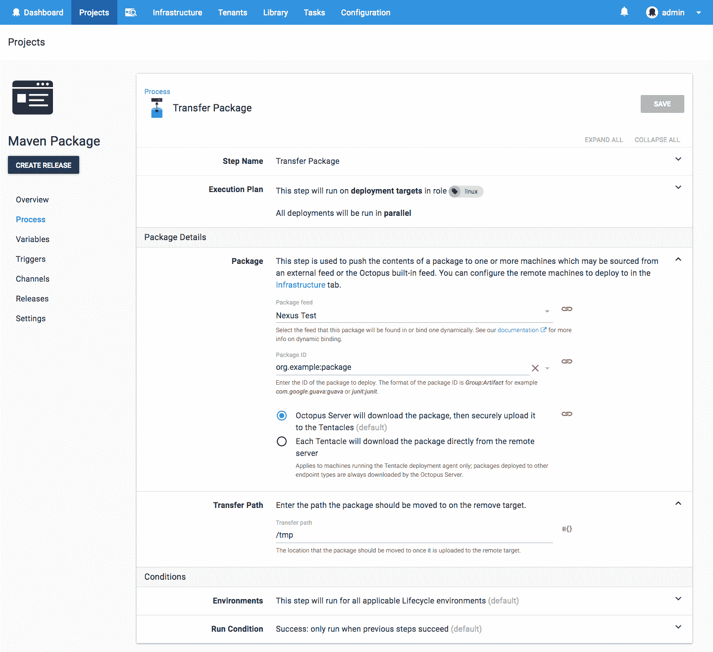

# 从 Maven - Octopus Deploy 部署和使用 ZIP 文件

> 原文：<https://octopus.com/blog/deploy-and-consume-zip-files-from-maven>

[](#)

Maven 是一个多功能的工件存储库，它超越了传统的 Java 包，如 jar 和 WARs，提供了托管通用 ZIP 存档的能力。在这篇博文中，我将介绍如何将通用档案发布到 Maven 存储库中，以及如何在 Octopus 项目中使用它们。

## Maven 存储库配置

第一步是在`~/.m2/settings.xml`文件中配置 Maven 存储库。该文件包含 Maven 存储库凭证等设置。

以下示例定义了 Nexus Maven 存储库的默认凭据:

```
<settings 
  xmlns:xsi="http://www.w3.org/2001/XMLSchema-instance"
  xsi:schemaLocation="http://maven.apache.org/SETTINGS/1.0.0
                      https://maven.apache.org/xsd/settings-1.0.0.xsd">
  <servers>
    <server>
      <id>Nexus</id>
      <username>admin</username>
      <password>admin123</password>
    </server>
  </servers>
</settings> 
```

## 创建一个包

接下来，我们需要创建将要上传的包。在这个例子中，我创建了一个名为`package.zip`的标准 ZIP 存档，其中保存了文件`test.txt`:

```
zip package.zip test.txt 
```

## 上传包

为了上传这个包，我使用了 Maven `deploy:deploy-file`目标。下载 [Maven](https://maven.apache.org/download.cgi) 。

该命令中的`repositoryId`系统属性需要匹配`settings.xml`文件中的`<id>`元素。

```
mvn deploy:deploy-file \
  -DgroupId=org.example \
  -DartifactId=package \
  -Dversion=0.0.1 \
  -Dpackaging=zip \
  -Dfile=package.zip \
  -DrepositoryId=Nexus \
  -Durl=http://nexus-host:8081/repository/maven-releases 
```

## 创建外部 Maven 提要

为了使用 Octopus 中的新工件，我们需要添加 Nexus 服务器作为外部 Maven 提要。这是在库➜外部馈送下完成的:

[](#)

然后，我们可以通过搜索工件`org.example:package`来测试存储库，工件`org.example:package`是与`artifactId`相结合的`groupId`:

[](#)

## 转移包裹

现在我们可以访问 Maven 提要了，我使用 **Transfer a package** 步骤将工件下载到目标机器上。我们再次用`org.example:package`引用 Maven 工件:

[](#)

## 结论

通过托管通用的 ZIP 文件，Maven 存储库可以用于管理各种部署的包，而不仅仅是针对 Java 的包，并且通过对 Maven 提要的本机支持，Octopus 可以轻松地将这些工件作为部署过程的一部分。