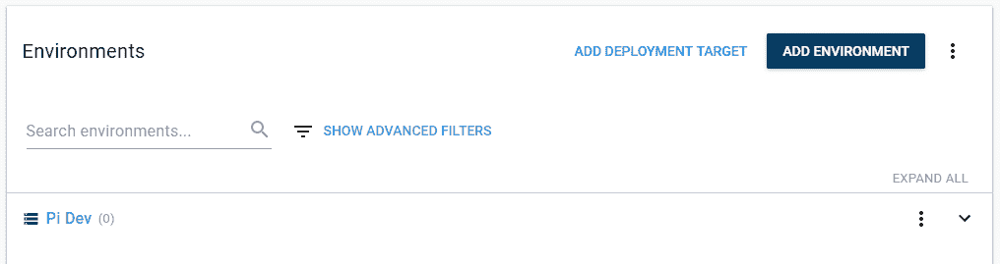

# 展开。NET 核心应用程序到带有 Octopus - Octopus 部署的 Raspberry Pi

> 原文：<https://octopus.com/blog/deploying-an-octopus-pi>

[](#)

**更新 2020 年 2 月**
*开箱*对 Linux ARM 和 Linux ARM64 SSH 目标的支持分别包含在*章鱼服务器 2019.11.2* 和 *2020.2.0* 中。

这篇文章最初发表于 2018 年 2 月，但后来发生了一些变化，这是原始文章的更新版本。

。NET Core 在过去的几年里取得了长足的进步，Octopus Deploy 也是如此。我们最近增加了在没有 Mono 的情况下运行 [Calamari 的支持，在这篇文章中，我将向你介绍如何部署。NET 核心应用程序到一个没有 Mono 的 Raspberry Pi 3+上。](https://octopus.com/blog/octopus-release-3-16#ssh-targets-sans-mono)

在这篇文章中，我将向您展示部署和运行是可能的。NET 核心应用程序，我还将描述一些与 Octopus Deploy 服务器交互的不同方式。

## 开始前的要求

*   编辑:Visual Studio，Visual Studio 代码，Rider。
*   [章鱼命令行](https://octopus.com/downloads)。
*   [章鱼服务器](https://octopus.com/downloads)和一个 [API 密匙](https://octopus.com/docs/octopus-rest-api/how-to-create-an-api-key)。
*   。网芯: [Windows](https://www.microsoft.com/net/download/windows) 或者 [Macos](https://www.microsoft.com/net/download/macos) 。
*   一个树莓 Pi 3+运行 [Raspbian](https://www.raspberrypi.org/downloads/raspbian/) 与。NET core 2.0 或更高版本运行时[已安装](https://github.com/dotnet/core/blob/master/samples/RaspberryPiInstructions.md):
*   对于角度或反作用应用:
    *   如果您选择的应用程序需要的话(angular 或 react)，您的开发机器上的节点和 npm。
    *   pi 上的 node.js
*   [卷曲](https://curl.haxx.se/download.html)

ASP.NET 在其捆绑包中包含了 NodeServices，这要求在它能够服务任何请求之前安装 Node。当你在 Raspberry Pi 上安装 Node.js 时，它会安装 4.x 版本，可执行文件名为`nodejs`，但是 NodeServices 会在你的路径中寻找`node`。您可以通过创建符号链接来解决这个问题:

```
sudo ln -s /usr/bin/nodejs /usr/bin/node 
```

## 构建应用程序

### 创建一个基本的。网络核心应用

```
dotnet new angular 
```

### 修改应用程序以侦听外部请求

默认情况下，ASP.NET 核心应用程序将只为`http://localhost:5000`的请求提供服务。要允许 web 主机向您的本地网络提供请求，请在`Program.cs`中的`.UseStartup<Startup>()`后添加以下内容:

```
.UseKestrel(options => {
    options.Listen(System.Net.IPAddress.Any, 5000);
}) 
```

有关配置 Kestrel Web 主机的更多信息，请查看[文档](https://docs.microsoft.com/en-us/aspnet/core/fundamentals/servers/kestrel?tabs=aspnetcore2x)。

### 构建应用程序

```
npm install
dotnet build
mkdir publish
dotnet publish -o publish --self-contained -r linux-arm 
```

如果您的目标是在 Raspberry Pi 上支持 64 位的发行版，请将`linux-arm`替换为`linux-arm64`

### 打包应用程序

创建. NET 核心应用程序包的最简单方法是使用 Octopus CLI 工具。

创建一个`artifacts`目录，然后使用`octo pack`命令创建包:

```
mkdir artifacts
octo pack --id core4pi --version 1.0.0 --format zip --outFolder artifacts --basePath publish 
```

再次使用 Octopus CLI，将包推送到服务器:

```
octo push --server http://octopus/ --apikey API-ABCDEF123456 --package artifacts\core4pi.1.0.0.zip 
```

## 构建服务定义

要让应用程序作为服务运行，请参阅微软关于[托管的文档。Linux 上的 NET Core](https://docs.microsoft.com/en-au/aspnet/core/host-and-deploy/linux-nginx?tabs=aspnetcore2x)。

创建一个名为`core4pi.service`的文件，包含以下文本:

```
[Unit]
Description=core4pi

[Service]
WorkingDirectory=#{Octopus.Action[deploy web site].Output.Package.InstallationDirectoryPath}
ExecStart=/usr/local/bin/dotnet "#{Octopus.Action[deploy web site].Output.Package.InstallationDirectoryPath}/core4pi.dll"
Restart=always
RestartSec=10
User=pi
Environment=ASPNETCORE_ENVIRONMENT=Production
Environment=DOTNET_PRINT_TELEMETRY_MESSAGE=false

[Install]
WantedBy=multi-user.target 
```

上面的`core4pi.service`文本中的`[deploy web site]`字符串表示部署包的步骤的名称。
该输出变量将包含新安装服务的路径。这将确保在安装服务时，它看到的是最新版本。

为服务定义创建一个包，并将其推送到 Octopus 服务器:

```
octo pack --id core4pi.service --version 1.0.0 --format zip --outFolder artifacts
octo push --server http://octopus/ --apikey API-ABCDEF123456 --package artifacts\core4pi.service.1.0.0.zip 
```

## 创建基础设施

如果您还没有为您的 Raspberry Pi 配置 Octopus 环境，请在命令行中创建一个:

```
octo create-environment --server http://octopus/ --apikey API-ABCDEF123456 --name "Pi Dev" 
```

或者通过 **基础设施使用 web 界面➜环境➜添加环境** 。

[](#)

接下来，创建一个访问 Pi 的帐户，该帐户可以是用户名/密码帐户，也可以是 Octopus 门户网站中** 基础设施➜帐户* *部分的 SSH 密钥。

[](#)

最后，在 **基础设施➜部署目标下创建一个部署目标➜添加部署目标** 作为 **SSH 目标**。

将目标角色设置为代表目标职责的东西，例如`PiWeb`。

添加详细信息(IP 地址或 DNS 名称、SSH 端口和帐户)后，在**下。NET** 部分，确保选择*单声道未安装*，并选择`linux-arm`或`linux-arm64`作为平台。

[](#)

## 创建部署项目

通过 Octopus 门户网站的**项目**部分或命令行创建一个新项目:

```
octo create-project --server http://octopus/ --apikey API-ABCDEF123456 --name "PiWeb" --projectgroup "All projects" --lifecycle "Default Lifecycle" 
```

### 为应用程序创建部署步骤

在新的 **PiWeb** 项目中，定义您的部署过程。

添加一个**部署一个包**的步骤，称为`deploy web site`。

此处的步骤名称将允许正确更新服务定义文件中的值。

[](#)

将**环境**设置为`Pi Dev`环境。

将**角色**设置为`PiWeb`角色。

在**包**部分，选择您推送给服务器的包:`core4pi`。

我们不需要完成其他选项，因此请保存该步骤。

### 为服务定义创建部署步骤

添加另一个**部署一个包**的步骤。这将在目标上安装一个服务来运行应用程序。

对于包选择，从 **Octopus 服务器(内置)**包馈送中选择`core4pi.service`包。

[【](#)

对于这一步，您需要`Configure Features`:

[](#)

在**文件中替换变量**功能中添加服务定义文件的名称`core4pi.service`:

【T2 

在`Configuration Scripts`特性下，选择 **Bash** ，将下面的脚本粘贴到**部署脚本**部分:

```
#!/bin/bash
if [ -e /lib/systemd/system/core4pi.service ]
then
    echo stopping service
    sudo systemctl stop core4pi.service
fi

echo installing service
sudo cp core4pi.service /lib/systemd/system/
sudo chmod 644 /lib/systemd/system/core4pi.service
sudo systemctl daemon-reload
sudo systemctl enable core4pi.service
echo starting service
sudo systemctl start core4pi.service 
```

该脚本执行服务安装，并将在步骤执行期间执行。它将要求您用来连接到 Raspberry Pi 的用户拥有`sudo`权限。

## 部署它

从**项目**导航菜单中，选择**创建发布**。

**创建版本**页面将允许您设置版本号，您可以保留默认值。它还允许选择你想要部署的包的版本，默认情况下，它会选择最新的版本。

按**保存**然后按**部署到 PI Dev** 然后按**部署**开始部署过程。

**创建发布**也可以从命令行执行:

```
octo create-release --server http://octopus/ --apikey API-ABCDEF123456 --project "PiWeb"
octo deploy-release --server http://octopus/ --apikey API-ABCDEF123456 --project "PiWeb" --deployto="Pi Dev" --version "0.0.1" 
```

第一次部署时，Octopus 服务器将在目标机器上更新 Calamari，这可能需要几分钟。

## 测试一下

部署完成后，在端口 5000 上导航到您的 Raspberry Pi 的 IP 地址或 DNS 名称，您应该会看到应用程序:

[](#)

## 结论

随着许多不同技术的结合，部署。NET 到 Raspberry Pi 的转换是受支持的，而 Octopus Deploy 使它变得不那么痛苦。在这篇文章中，您还看到了许多与 Octopus 服务器集成的不同方式，包括命令行和 web 门户。