# 使用 Octopus - Octopus Deploy 将应用程序部署到 Kubernetes

> 原文：<https://octopus.com/blog/deploying-applications-to-kubernetes>

[](#)

[Octopus 2018.8](/blog/octopus-release-2018.8) 预览了许多新功能，使管理 Kubernetes 部署变得简单。这些 Kubernetes 步骤和目标旨在允许团队利用 Octopus 环境、仪表板、安全性、帐户管理、变量管理以及与其他平台和服务的集成，将应用程序部署到 Kubernetes。

在这篇博文的最后，你将学会如何:

*   按照最低特权原则配置服务帐户和命名空间
*   在 Kubernetes 中部署一个正常运行的 web 服务器
*   使用模拟故障对 Kubernetes 部署执行蓝/绿更新
*   通过公共网络负载平衡器访问应用程序
*   通过多个 Nginx 入口控制器引导流量
*   使用 Helm 部署应用程序
*   并在开发和生产环境中完成所有这些工作

这将是一篇很长的博文，但它将带您从一个空白的 Kubernetes 集群到一个功能性的多环境集群，该集群使用随着您的团队和应用程序的增长而扩展的模式进行可重复的部署。

Octopus 2018.8 中的 Kubernetes 功能只是预览版。这里讨论的特性可能会在未来的版本中发生变化。

## 先决条件

要阅读这篇博文，您需要有一个 Octopus 实例，一个已经配置好的 Kubernetes 集群，并且安装了 Helm。这篇博文将使用 Google Cloud 提供的 Kubernetes 服务，但是任何 Kubernetes 集群都可以。

Helm 是 Kubernetes 的一个包管理器，我们将使用它在 Kubernetes 集群中安装一些第三方服务。谷歌云提供了描述如何在他们的云中安装 Helm 的[文档](https://cloud.google.com/community/tutorials/nginx-ingress-gke#install-helm-in-cloud-shell)，其他云提供商也会提供类似的文档。

**刚接触章鱼？**查看我们的[入门指南](https://octopus.com/docs/getting-started)了解更多信息。

## 准备 Octopus 服务器

Octopus 中的 Kubernetes 步骤要求路径上有`kubectl`可执行文件。同样，掌舵步骤要求路径上有`helm`可执行文件。

如果你从 [Octopus workers](https://g.octopushq.com/OnboardingWorkersLearnMore) 运行 Kubernetes 步骤，你可以使用 [Kubernetes 网站](https://g.octopushq.com/KubernetesKubectlInstall)上的指令安装`kubectl`可执行文件，使用 [Helm 项目页面](https://g.octopushq.com/KubernetesHelmInstall)上的指令安装`helm`可执行文件。

因为 Octopus 中的 Kubernetes 功能处于预览状态，所以本文中讨论的步骤需要在`Features`部分启用。

[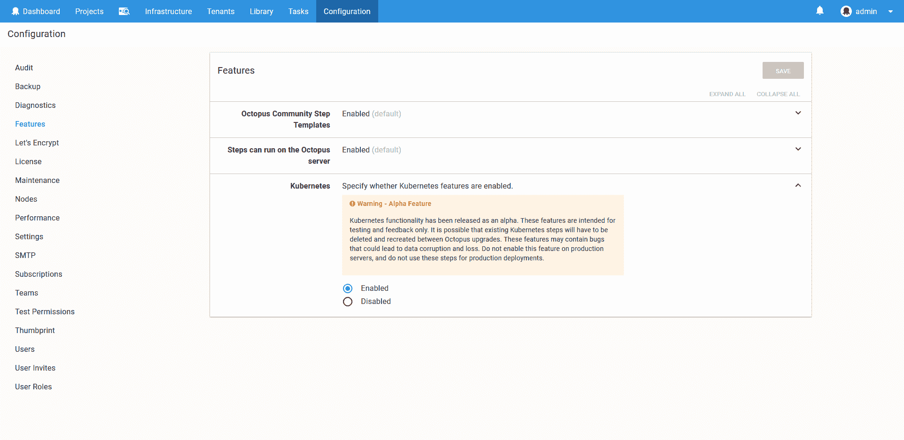](#)

## 我们将创造什么

在我们深入部署 Kubernetes 应用程序的细节之前，有必要理解我们试图通过这个例子实现什么。

我们的基础架构有以下要求:

*   两种环境:开发和生产
*   一个 Kubernetes 星团
*   单个应用程序(这里我们部署了 [HTTPD Docker 图像](https://hub.docker.com/_/httpd/)作为例子)
*   该应用程序由一个定制的 URL 路径公开，如 http://myapp/httpd
*   零停机部署

从高层次来说，这就是我们最终将得到的结果。

[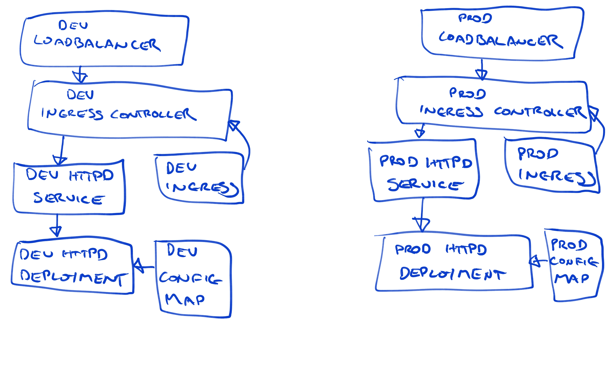](#)

不要担心这个图看起来吓人，因为我们将一步一步地构建这些元素。

## 饲料

Octopus 中的 Kubernetes 支持依赖于定义一个 Docker 提要。因为我们正在部署的 HTTPD 映像可以在主 Docker 存储库中找到，所以我们将根据`https://index.docker.io` URL 创建一个提要。

点击了解更多关于 Docker feeds [的信息。](https://octopus.com/docs/packaging-applications/package-repositories/registries)

[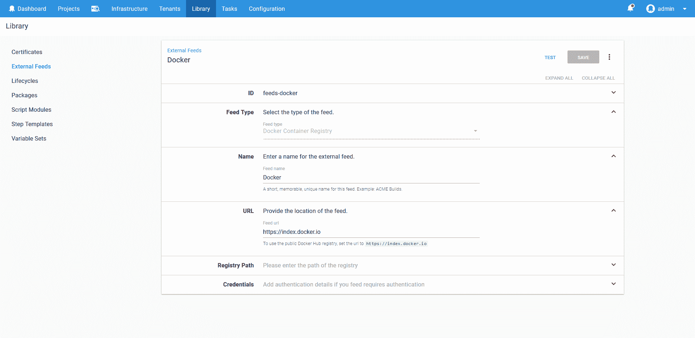](#)

## 环境

虽然我们列出了两个环境作为需求，但是我们实际上将创建三个。称为`Kubernetes Admin`的附加环境将是我们运行实用程序脚本来创建用户帐户的地方。

点击了解更多关于环境的信息[。](https://octopus.com/docs/infrastructure/environments)

[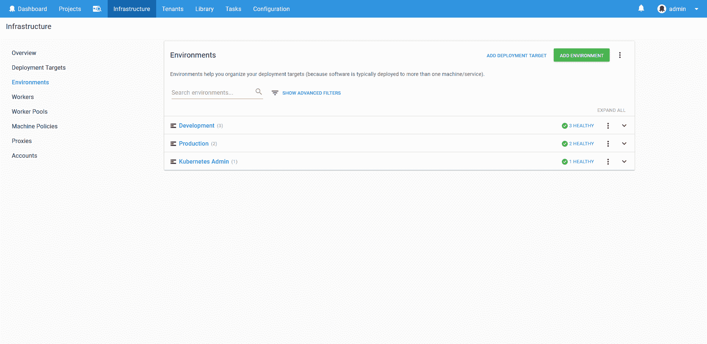](#)

## 生命周期

Octopus 中的默认生命周期假设所有环境都将依次部署到。对我们来说，情况并非如此。我们有两个不同的生命周期:`Development`->-`Production`，以及`Kubernetes Admin`作为运行实用程序脚本的独立环境。

为了对从`Development`到`Production`的进展进行建模，我们将创建一个名为`Application`的生命周期。它将包含两个阶段，第一阶段部署到`Development`环境，第二阶段部署到`Production`环境。

[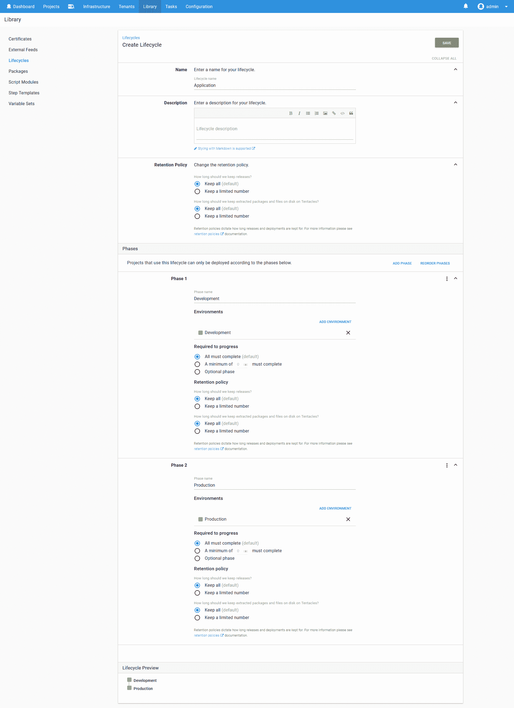](#)

为了对针对 Kubernetes 集群运行的脚本进行建模，我们将创建一个名为`Kubernetes Admin`的生命周期。它将包含部署到`Kubernetes Admin`环境的单一阶段。

[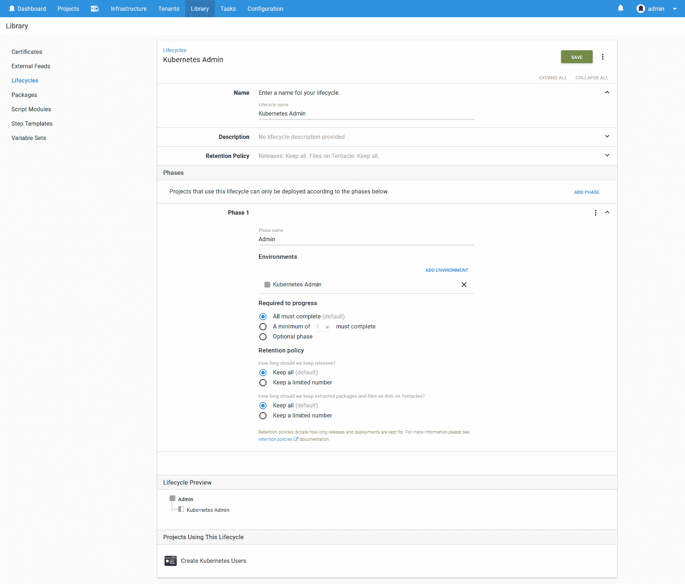](#)

点击了解更多关于生命周期的信息[。](https://octopus.com/docs/deployment-process/lifecycles)

## Kubernetes 管理目标

Octopus 中的 Kubernetes 目标在概念上是 Kubernetes 集群中的权限边界。它使用一个 Kubernetes 名称空间和一个 Kubernetes 帐户来定义这个边界。

随着部署到 Kubernetes 集群的环境、团队、应用程序和服务数量的增长，保持它们的隔离以防止资源被意外覆盖或删除，或者防止 CPU 和内存等资源被恶意部署消耗，这一点非常重要。可以通过将权限和资源限制应用到 Kubernetes 名称空间来实施它们，然后将这些限制应用到该名称空间中的任何部署。

按照最小特权的惯例，每个名称空间都有一个对应的系统帐户，该帐户只对该名称空间拥有特权。

名称空间和仅限于名称空间的服务帐户的组合构成了一个典型的 Octopus Kubernetes 目标。

话虽如此，我们需要一个起点来创建名称空间和服务帐户，为此，我们将创建一个 Kubernetes 目标，它带有部署到`Kubernetes Admin`环境的管理员凭证。

首先，我们需要创建一个保存管理员用户凭证的帐户。Google Cloud 中的 Kubernetes 集群为一个名为`admin`的用户提供了一个我们可以使用的随机生成的密码。

[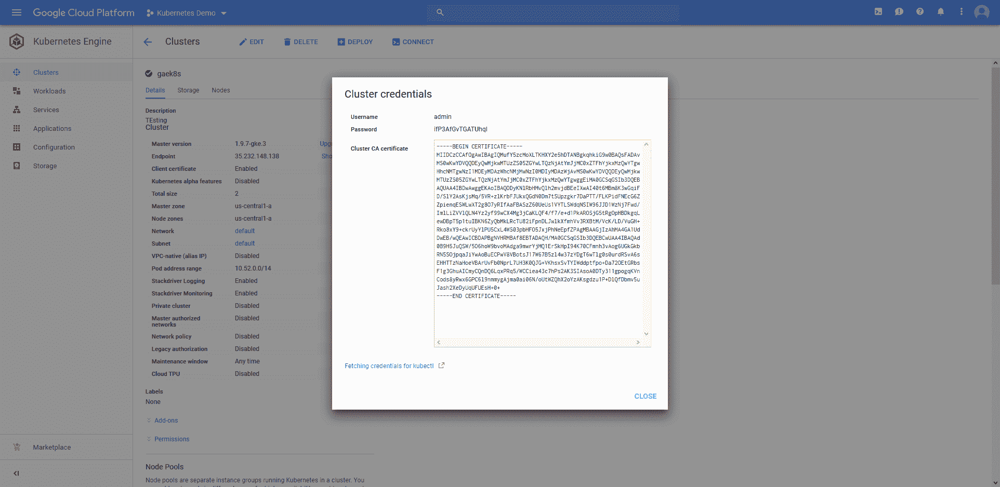](#)

这些凭证保存在用户名/密码八达通帐户中。

[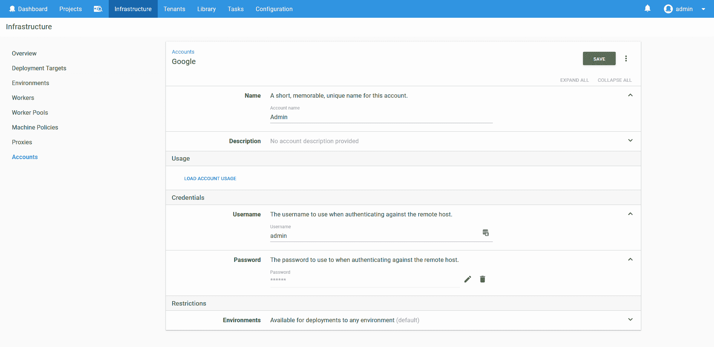](#)

其他云提供商对他们的管理员用户使用不同的认证方案。参见[文档](https://octopus.com/docs/deployment-examples/kubernetes-deployments/kubernetes-target#accounts)了解使用除用户名和密码之外的账户类型的详细信息。

大多数 Kubernetes 集群通过 HTTPS 公开它们的 API，但是通常使用不可信的证书。为了与 Kubernetes 集群通信，我们可以禁用任何证书验证，或者将证书作为 Kubernetes 目标的一部分提供。禁用证书验证被认为不是最佳做法，因此我们将把 Kubernetes 集群证书上传到 Octopus。

证书由 Google 以 PEM 文件的形式提供，如下所示(从`Cluster credentials`对话框中的`Cluster CA certificate`字段复制):

```
-----BEGIN CERTIFICATE-----
MIIDCzCCAfOgAwIBAgIQMufY5zcMoXLTKHXY2e5hDTANBgkqhkiG9w0BAQsFADAv
MS0wKwYDVQQDEyQwMjkwMTUzZS05ZGYwLTQzNjAtYmJjMC0xZTFhYjkxMzQwYTgw
HhcNMTgwNzI1MDEyMDAzWhcNMjMwNzI0MDIyMDAzWjAvMS0wKwYDVQQDEyQwMjkw
MTUzZS05ZGYwLTQzNjAtYmJjMC0xZTFhYjkxMzQwYTgwggEiMA0GCSqGSIb3DQEB
AQUAA4IBDwAwggEKAoIBAQDDyKNlRbHMvQlh2mvjdBEeIXwAI40t6MBm8K3wGqiF
D/SlY2AsKjsMq/5VR+zlKrbFJUkxQGdN0Dm7tSUpzgkr7DaPTT/FLKPidFNEcG6Z
ZpienqESWLwXT2g8O7yRIfAaFBASzZ60UeUs1VYTLSWdqNSIW96JJD1WzNj7Fwd/
ImlLiZVVlQLN4Yz2yf99wCX4Mg3jCaKLQF4/f7/e+d1PkAROSjG5tRgOpHBDkgqL
ewDBpT5p1tuIBKN6ZyQbMkLRcTU82iFpnDLJwlkXfmhVv3RXBtM/VcK/LD/VuGH+
Rko8xY9+ckrUyYlPU5CxL4WS03pbHFO5JxjPhNeEpfZPAgMBAAGjIzAhMA4GA1Ud
DwEB/wQEAwICBDAPBgNVHRMBAf8EBTADAQH/MA0GCSqGSIb3DQEBCwUAA4IBAQAd
0B9H5JuQSW/5O6hoW9bvoMAdga9mwrYjMQ1ErSkHpI94K70CFmnh3vAog6UGkGkb
RN5SOjpqaJiYwAoBuECPwV8VBotsJ17W67B5zl4w37zYDgT6wTlg0s0urdRSvA6s
EHHTTzNaHoeVBArUvFb0NprL7UH3K0QJG+VKhsxSvTYIWddptfpo+Da72OEtGRbs
F1g3GhuAICmyCQnDQ6LqxPRq5/WCCiea43c7hPs2AK3SIAsoA0DTy311gpogqKVn
Cods8yRwx6GPC6l9nmmygAjma0ai06N/oUtWZQhX2oYzAKsgdzu1P+DlQfDbmv5u
Jash2XeDyUqUFUEsH+0+
-----END CERTIFICATE----- 
```

然后，这些文本被保存到一个名为`k8s.pem`的文件中，并上传到 Octopus。

点击了解更多关于证书[的信息。](https://octopus.com/docs/deployment-examples/certificates)

[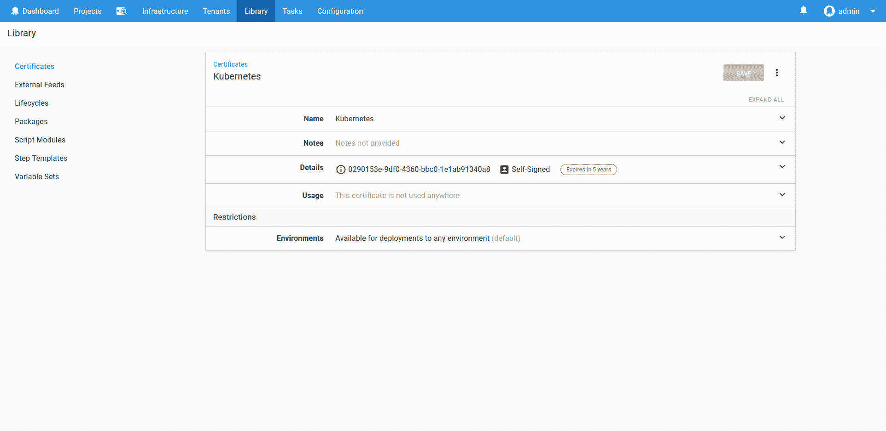](#)

保存用户帐户和证书后，我们现在可以创建名为`Kubernetes Admin`的 Kubernetes 目标。

这个目标将被部署到`Kubernetes Admin`环境中，并承担一个名为 Admin 的角色。该帐户将是我们在上面创建的`Kubernetes Admin`帐户，集群证书将引用我们在上面保存的证书。

因为这个`Kubernetes Admin`目标将用于运行实用程序脚本，所以我们不希望它指向 Kubernetes 名称空间，所以该字段留空。

[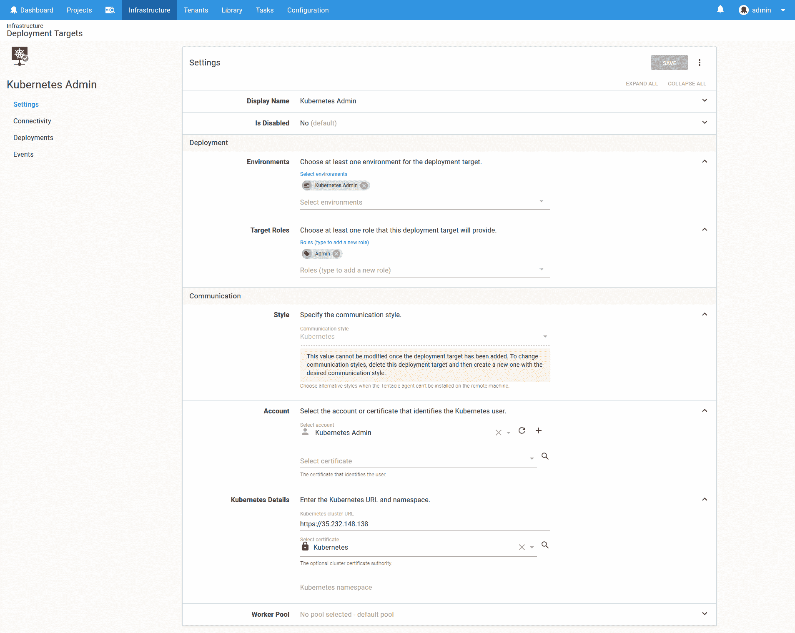](#)

点击了解更多关于 Kubernetes 目标[的信息。](https://octopus.com/docs/deployment-examples/kubernetes-deployments/kubernetes-target)

我们现在有了一个目标，可以用来为其他名称空间准备服务帐户。

## HTTPD 发展服务账户

我们现在有一个 Kubernetes 目标，但是这个目标是用集群管理员帐户配置的。使用管理员帐户来运行部署并不是一个好主意，所以我们需要做的是创建一个名称空间和服务帐户，它将允许我们在 Kubernetes 集群中的一个隔离区域中只部署我们的应用程序所需的资源。

为此，我们需要在 Kubernetes 集群中创建四个资源:一个名称空间、一个服务帐户、一个角色和一个角色绑定。我们已经讨论了名称空间和服务帐户。角色定义了可以应用的操作以及它们可以应用到的资源。角色绑定将服务帐户与角色相关联，授予服务帐户在角色中定义的权限。

Kubernetes 可以将这些资源表示为 YAML，而 YAML 可以在一个文件中表示多个文档，方法是用三重破折号分隔它们。下面的 YAML 文件定义了这四种资源。

```
---
kind: Namespace
apiVersion: v1
metadata:
  name: httpd-development
---
apiVersion: v1
kind: ServiceAccount
metadata:
  name: httpd-deployer
  namespace: httpd-development
---
kind: Role
apiVersion: rbac.authorization.k8s.io/v1
metadata:
  namespace: httpd-development
  name: httpd-deployer-role
rules:
- apiGroups: ["", "extensions", "apps"]
  resources: ["deployments", "replicasets", "pods", "services", "ingresses", "secrets", "configmaps"]
  verbs: ["get", "list", "watch", "create", "update", "patch", "delete"]
- apiGroups: [""]
  resources: ["namespaces"]
  verbs: ["get"]  
---
kind: RoleBinding
apiVersion: rbac.authorization.k8s.io/v1
metadata:
  name: httpd-deployer-binding
  namespace: httpd-development
subjects:
- kind: ServiceAccount
  name: httpd-deployer
  apiGroup: ""
roleRef:
  kind: Role
  name: httpd-deployer-role
  apiGroup: "" 
```

为了创建这些资源，我们需要将 YAML 保存为一个文件，然后使用`kubectl`在集群中创建它们。为此，我们使用`Run a kubectl CLI Script`步骤。

[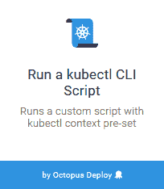](#)

这一步将瞄准`Kubernetes Admin`目标，并运行下面的脚本，该脚本将 YAML 保存到一个文件中，然后使用`kubectl`来应用 YAML。

```
Set-Content -Path serviceaccount.yml -Value @"
---
kind: Namespace
apiVersion: v1
metadata:
  name: httpd-development
---
apiVersion: v1
kind: ServiceAccount
metadata:
  name: httpd-deployer
  namespace: httpd-development
---
kind: Role
apiVersion: rbac.authorization.k8s.io/v1
metadata:
  namespace: httpd-development
  name: httpd-deployer-role
rules:
- apiGroups: ["", "extensions", "apps"]
  resources: ["deployments", "replicasets", "pods", "services", "ingresses", "secrets", "configmaps"]
  verbs: ["get", "list", "watch", "create", "update", "patch", "delete"]
- apiGroups: [""]
  resources: ["namespaces"]
  verbs: ["get"]    
---
kind: RoleBinding
apiVersion: rbac.authorization.k8s.io/v1
metadata:
  name: httpd-deployer-binding
  namespace: httpd-development
subjects:
- kind: ServiceAccount
  name: httpd-deployer
  apiGroup: ""
roleRef:
  kind: Role
  name: httpd-deployer-role
  apiGroup: ""
"@

kubectl apply -f serviceaccount.yml 
```

bash 脚本非常相似。

```
cat >serviceaccount.yml <<EOL
---
kind: Namespace
apiVersion: v1
metadata:
  name: httpd-development
---
apiVersion: v1
kind: ServiceAccount
metadata:
  name: httpd-deployer
  namespace: httpd-development
---
kind: Role
apiVersion: rbac.authorization.k8s.io/v1
metadata:
  namespace: httpd-development
  name: httpd-deployer-role
rules:
- apiGroups: ["", "extensions", "apps"]
  resources: ["deployments", "replicasets", "pods", "services", "ingresses", "secrets", "configmaps"]
  verbs: ["get", "list", "watch", "create", "update", "patch", "delete"]
- apiGroups: [""]
  resources: ["namespaces"]
  verbs: ["get"]    
---
kind: RoleBinding
apiVersion: rbac.authorization.k8s.io/v1
metadata:
  name: httpd-deployer-binding
  namespace: httpd-development
subjects:
- kind: ServiceAccount
  name: httpd-deployer
  apiGroup: ""
roleRef:
  kind: Role
  name: httpd-deployer-role
  apiGroup: ""
EOL

kubectl apply -f serviceaccount.yml 
```

[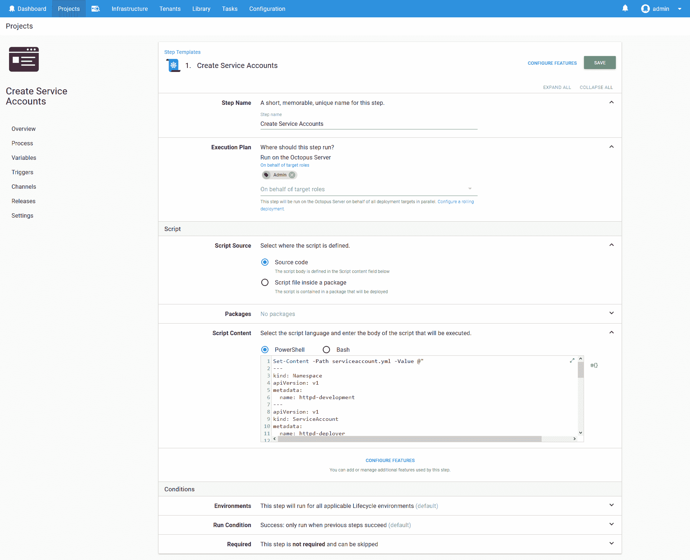](#)

一旦这个脚本运行，就会创建一个名为`httpd-deployer`的服务帐户。这个服务帐户被自动分配一个令牌，我们可以使用这个令牌向 Kubernetes 集群进行身份验证。我们可以运行第二个脚本来获取这个令牌。

```
$user="httpd-deployer"
$namespace="httpd-development"
$data = kubectl get secret $(kubectl get serviceaccount $user -o jsonpath="{.secrets[0].name}" --namespace=$namespace) -o jsonpath="{.data.token}" --namespace=$namespace
[System.Text.Encoding]::ASCII.GetString([System.Convert]::FromBase64String($data)) 
```

使用下面的脚本可以在 bash 中运行相同的功能。

```
user="httpd-deployer"
namespace="httpd-development"
kubectl get secret $(kubectl get serviceaccount $user -o jsonpath="{.secrets[0].name}" --namespace=$namespace) -o jsonpath="{.data.token}" --namespace=$namespace | base64 --decode 
```

我们在这里检索令牌作为脚本步骤的一部分，只是为了进行演示。在日志输出中显示令牌有安全风险，应该谨慎操作。相反，这些相同的脚本可以在本地运行，以防止令牌保存在日志文件中。

参见[脚本 Kubernetes 目标](#scripting-kubernetes-targets)一节，了解自动创建这些帐户的过程，而不在日志文件中留下令牌的解决方案。

在我们部署脚本之前，我们需要确保项目正在使用`Kubernetes Admin`生命周期。

[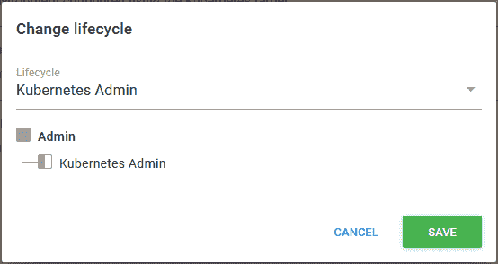](#)

我们现在可以运行脚本，它将创建服务帐户并显示令牌。该令牌看起来像这样:

```
eyJhbGciOiJSUzI1NiIsInR5cCI6IkpXVCJ9.eyJpc3MiOiJrdWJlcm5ldGVzL3NlcnZpY2VhY2NvdW50Iiwia3ViZXJuZXRlcy5pby9zZXJ2aWNlYWNjb3VudC9uYW1lc3BhY2UiOiJodHRwZC1kZXZlbG9wbWVudCIsImt1YmVybmV0ZXMuaW8vc2VydmljZWFjY291bnQvc2VjcmV0Lm5hbWUiOiJodHRwZC1kZXBsb3llci10b2tlbi0ycG1ndCIsImt1YmVybmV0ZXMuaW8vc2VydmljZWFjY291bnQvc2VydmljZS1hY2NvdW50Lm5hbWUiOiJodHRwZC1kZXBsb3llciIsImt1YmVybmV0ZXMuaW8vc2VydmljZWFjY291bnQvc2VydmljZS1hY2NvdW50LnVpZCI6IjliZGQzYWQ0LTk5ZTktMTFlOC04ODdmLTQyMDEwYTgwMDA5MyIsInN1YiI6InN5c3RlbTpzZXJ2aWNlYWNjb3VudDpodHRwZC1kZXZlbG9wbWVudDpodHRwZC1kZXBsb3llciJ9.DDiMDOmznf4S8ClHO30RvSZNGHN_7WYk9-FABaLkSC-mIunWtJHiT_lEovbUToogM0fnG1ISueundAZ6tsRRY-eVwefLvhgy1Ync2QlLwaqeoUenGt1d36lH5YFb7gYmon2UD54DGEdYNzafI1TLWi3DS1apjSUc3kWh54HfZXSeQmCE7fGu4wNoJz3WU1MEQZx8KqM9__lVDxtPGmE2pyZX6OYBXoAQv9-cfs_1GP009exfkVWbVYdDFDoEko21KDAORjyKu4ow4KvVXOXzcfgCKe_UlYyuLg0A6NRyc8lDj4D34R1crIPvqWmXVy5BMK4ENchhYEC62nsInptZAg 
```

[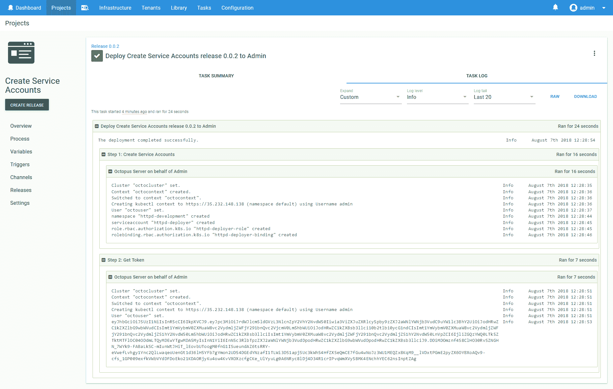](#)

## HTTPD 发展目标

现在，我们已经拥有了创建目标所需的一切，该目标将用于在`Development`环境中部署 HTTPD 应用程序。

我们首先用上面返回的令牌在 Octopus 中创建一个令牌帐户。

[](#)

然后我们在一个名为`Httpd-Development`的新 Kubernetes 目标中使用这个令牌。

注意这里的`Target Roles`包括一个名为`Httpd`的角色，它与正在部署的应用程序的名称相匹配，并且`Kubernetes namespace`被设置为`httpd-development`。我们创建的服务帐户只有部署到`httpd-development`名称空间的权限，并且只用于将 HTTPD 应用程序部署到`Development`环境中。

因此，这个目标代表应用程序和环境的交集，使用一个命名空间和一个有限的服务帐户来实施权限边界。这是我们将在每个应用程序和环境中反复重复的模式。

[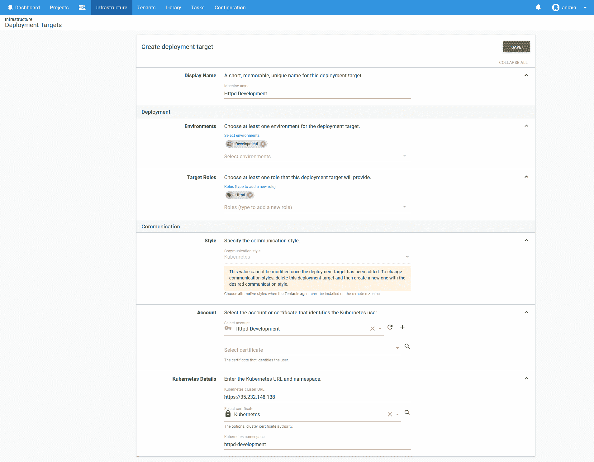](#)

既然我们有了要部署的目标，让我们部署我们的第一个应用程序吧！

## HTTPD 应用程序

`Deploy Kubernetes containers`步骤提供了将应用程序部署到 Kubernetes 集群的自以为是的过程。这一步实现了一个标准模式，用于创建 Kubernetes 资源的集合，这些资源协同工作以提供可重复的、有弹性的部署。

[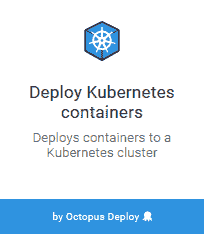](#)

我们将部署的应用程序是 HTTPD。这是一个来自 Apache 的流行的 web 服务器，虽然我们不会做任何超过显示静态文本作为网页的事情，但 HTTPD 是一个有用的例子，因为大多数部署到 Kubernetes 的应用程序都会像 HTTPD 一样暴露 HTTP 端口。

该步骤被赋予一个名称，并以一个角色为目标。我们这里的目标角色是为了匹配我们正在部署的应用程序的名称而创建的角色。在选择`Httpd`角色时，我们确保该步骤将使用我们的 Kubernetes 目标，该目标被配置为部署 HTTPD 应用程序。

[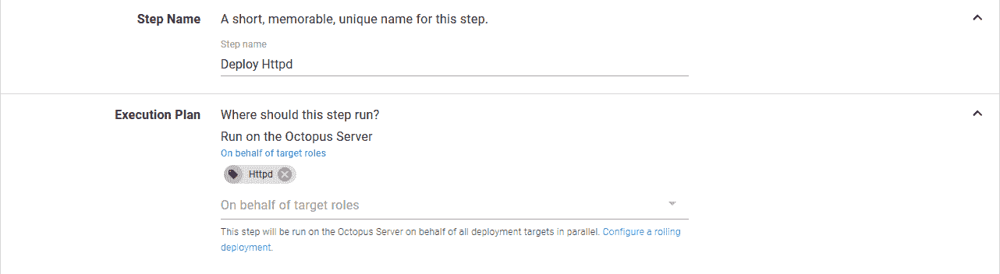](#)

`Deployment`部分用于配置将在 Kubernetes 中创建的部署资源的细节。

从现在开始，我将使用术语“资源”(例如，部署资源或 Pod 资源)来区分在 Kubernetes 集群中创建的资源(也就是说，如果您直接使用`kubectl`工具，您将使用的资源)和 Octopus 概念或一般操作，如部署事物。这可能会导致类似“单击 Deploy 按钮来部署部署资源”这样的句子，但是请不要因此而反对我。

`Deployment name`字段定义了分配给部署资源的名称。这些名称是命名空间资源中 Kubernetes 资源的唯一标识。这很重要，因为这意味着要在 Kubernetes 中创建新的独特资源，它必须有一个惟一的名称。当我们稍后选择部署策略时，这将非常重要，所以请记住这一点。

`Replicas`字段定义了这个部署资源将创建多少个 Pod 资源副本。在本例中，我们将保持在`1`。

`Progression deadline in seconds`字段配置 Kubernetes 等待部署资源完成的时间。如果部署资源在此时间内未完成(这可能是由于 Docker 映像下载缓慢、对 Pod 资源的准备情况检查失败、集群中的资源不足等)，则部署资源的部署将被视为失败。

`Labels`字段允许将通用键/值对分配给该步骤创建的资源。在后台，这些标签将应用于该步骤创建的部署、Pod、服务、入口、配置映射、机密和容器资源。正如我们前面提到的，这一步是固执己见的，其中一个观点是标签应该定义一次，并应用于作为部署的一部分创建的所有资源。

[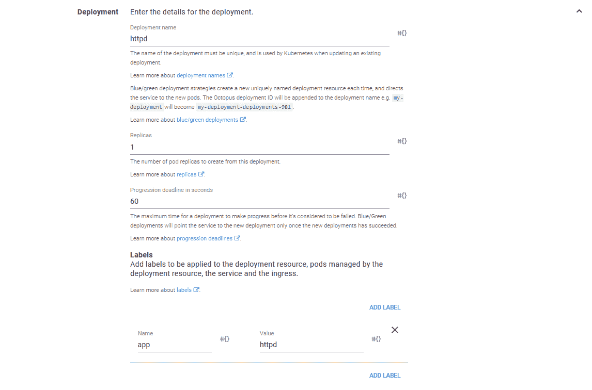](#)

## 部署策略

Kubernetes 为它管理的资源提供了一个强大的声明性模型。当直接使用`kubectl`命令时，可以描述资源的期望状态(通常在 YAML)并将该资源“应用”到 Kubernetes 集群中。Kubernetes 然后将资源的期望状态与集群中资源的当前状态进行比较，并进行必要的更改以将集群资源更新到期望状态。

有时，这种更改就像更新标签这样的属性一样简单。但是在其他情况下，期望的状态需要重新部署整个应用程序。

Kubernetes 本身提供了两种部署策略来尽可能平滑地重新部署应用程序:重新创建和滚动更新。

重新创建策略将在创建新的 Pod 资源之前删除任何现有的 Pod 资源。滚动更新策略将逐步替换 Pods 资源。你可以在 [Octopus 文档](https://octopus.com/docs/deployment-examples/kubernetes-deployments/deploy-container#deployment-strategy)中读到更多关于这些部署策略的信息。

Octopus 提供了第三种部署策略，称为蓝/绿。该策略将为每个部署创建全新的部署资源，当部署资源成功时，流量将被切换。

蓝/绿部署策略为那些负责管理 Kubernetes 部署的人提供了一些有趣的可能性，所以我们将选择这个策略。

[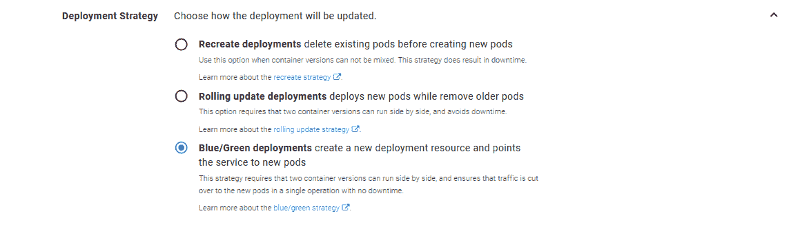](#)

## 卷和配置图

卷为容器资源提供了一种访问外部数据的方式。Kubernetes 为卷提供了很大的灵活性，它们可以是磁盘、网络共享、节点上的目录、GIT 存储库等等。

对于这个例子，我们想要获取存储在 ConfigMap 资源中的数据，并将其公开为容器资源中的一个文件。ConfigMap 资源很方便，因为 Kubernetes 确保了它们的高可用性，它们可以跨容器资源共享，并且易于创建。

因为它们非常方便，所以该步骤可以将 ConfigMap 资源视为部署的一部分。这确保了组成部署的容器资源始终能够访问与其相关联的 ConfigMap 资源。这一点很重要，因为您不希望在应用程序版本 2 正在推出的过程中，应用程序版本 1 引用配置映射资源版本 2。如果这没有多大意义，请不要担心，稍后我们将看到它的实际应用。

这正是我们将为此演示配置的内容。`Volume type`被设置为`Config Map`，它被赋予一个`Name`，我们选择`Reference the config map created as port of this step`选项来指示稍后将在该步骤中定义的 ConfigMap 资源是卷所指向的。

ConfigMap 卷项目提供了一种将 ConfigMap 资源值映射到文件名的方法。在本例中，我们已经将`Key`设置为`index`并将路径设置为`index.html`，这意味着当该卷被装入容器资源时，我们希望将名为`index`的 ConfigMap 资源值公开为名为`index.html`的文件。

[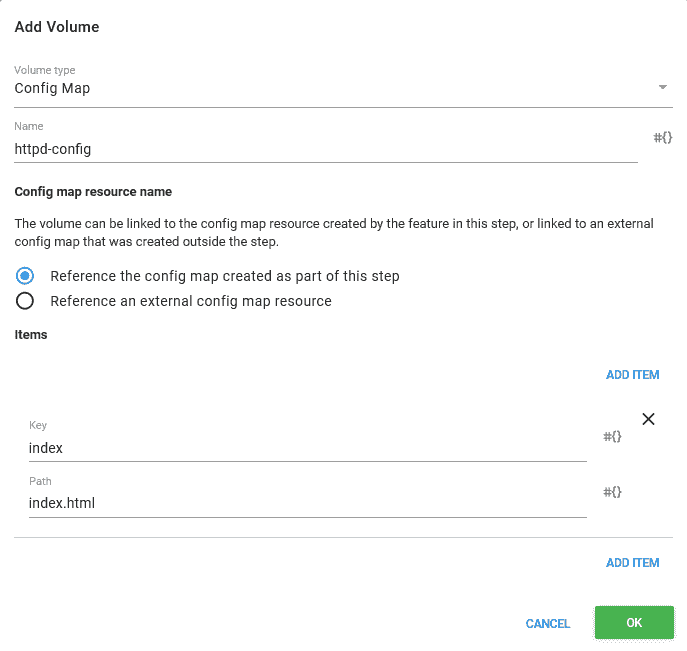](#)

## 集装箱

下一步是配置容器资源。这是我们将配置 HTTPD 应用程序的地方。

我们首先配置容器资源将使用的 Docker 映像。这里，我们从之前创建的 Docker 提要中选择了`httpd`图像。

[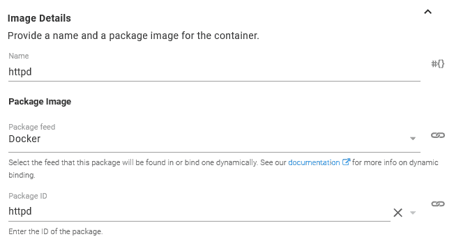](#)

为了访问 HTTPD，我们需要公开一个端口。作为 web 服务器，HTTPD 接受端口 80 上的流量。可以对端口进行命名以使它们更容易使用，因此我们将这个端口称为`web`。

[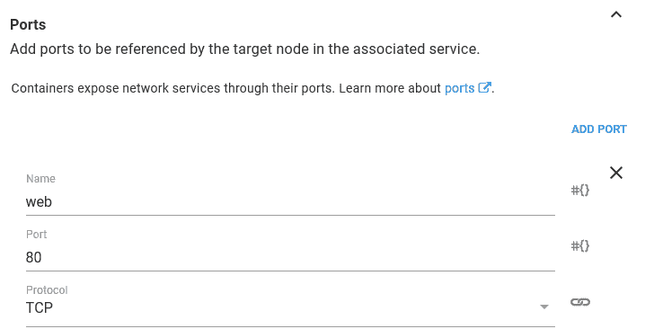](#)

最后一项配置是在一个目录中挂载我们之前定义的 ConfigMap 卷。HTTPD Docker 映像已经构建为提供来自`/usr/local/apache2/htdocs`目录的内容。如果您还记得，我们配置了 ConfigMap 卷，以将名为`index`的 ConfigMap 资源的值公开为名为`index.html`的文件。因此，通过在`/usr/local/apache2/htdocs`目录下挂载这个卷，这个容器资源将拥有一个名为`/usr/local/apache2/htdocs/index.html`的文件，其中包含 ConfigMap 资源中值的内容。

[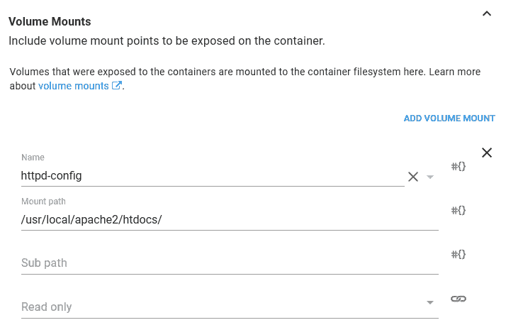](#)

主步骤 UI 中总结了每个容器的配置，因此您可以一目了然地查看。

[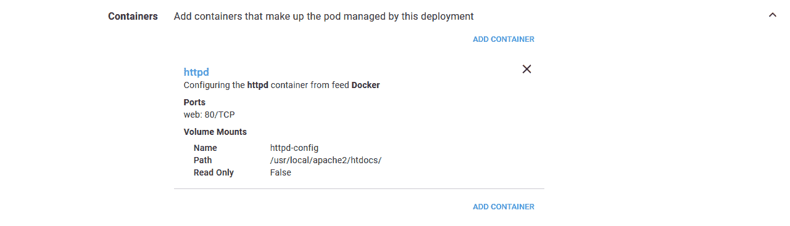](#)

## 配置图

我们已经讨论了很多关于由该步骤创建的 ConfigMap 资源，所以现在是时候配置它了。

`Config Map Name`部分定义了 ConfigMap 资源的名称(或者，从技术上讲，是名称的一部分——稍后会详细介绍)。`Config Map Items`定义了构成 ConfigMap 资源的键/值对。

如果您还记得，我们将这个 ConfigMap 资源公开为一个卷，该卷定义了一个项目，该项目将名为`index`的 ConfigMap 资源值映射到名为`index.html`的文件。所以这里我们创建了一个名为`index`的项目，该项目的值就是最终将成为`index.html`文件内容的内容。

[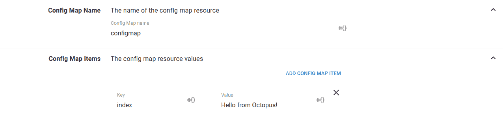](#)

## 服务

我们现在很快就可以部署和访问应用程序了。因为很高兴看到一些进展，我们将在这里走一点捷径，用我们可用的最快选项向世界展示我们的应用程序。

为了与 HTTPD 应用程序通信，我们需要通过服务资源获取我们在容器资源上公开的端口(端口 80，我们称之为`web`)。为了从外部访问服务资源，我们将创建一个负载平衡器服务资源。

通过部署负载平衡器服务资源，我们的云提供商将为我们创建一个网络负载平衡器。不同的云提供商创建的网络负载平衡器的类型和配置方式各不相同，但一般来说，默认情况下是创建一个具有公共 IP 地址的网络负载平衡器。

每当您向外界公开应用程序时，都必须考虑增加像防火墙这样的安全性。

`Service Name`部分定义了服务资源的名称。

[](#)

`Service Type`部分是我们将服务资源配置为`Load balancer`的地方。在此部分中，其他字段可以留空。

[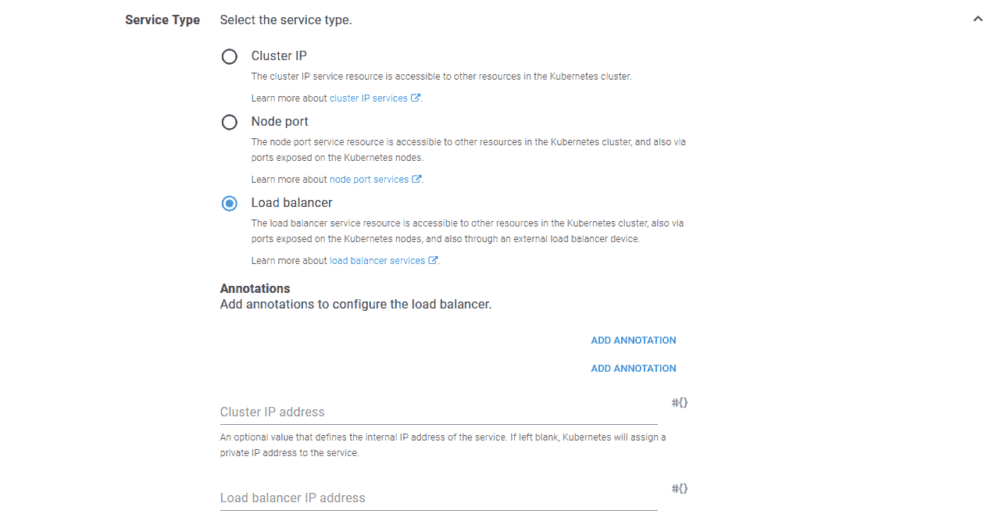](#)

`Service Ports`部分是传入端口映射到容器资源端口的地方。在本例中，我们公开了服务资源上的端口 80，并将其定向到容器资源上的`web`端口(也是端口 80，但这些值不需要匹配)。

[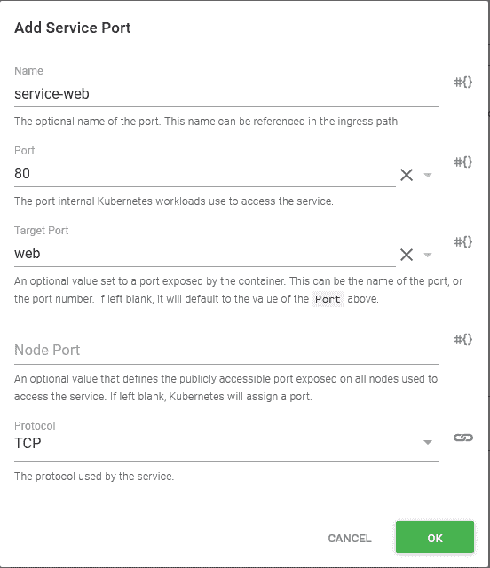](#)

主 UI 中总结了这些端口，以便快速查看。

[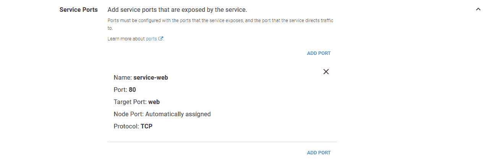](#)

至此，所有的基础工作都已完成，我们可以部署应用程序了。

## 第一次部署

当您创建这个项目的部署时，Octopus 允许您定义将要包含的 Docker 映像的版本。如果您回头看看容器资源的配置，您会注意到我们从未指定版本，只指定了图像名称。这是有意的，因为 Octopus 预计大多数部署将涉及新的 Docker 镜像版本，而 Kubernetes 资源的配置将保持静态。

这意味着在日常部署中唯一要做的决定是 Docker 映像的版本，您可以利用 Octopus 的特性，如[通道](https://octopus.com/docs/deployment-process/channels)来进一步定制在部署过程中如何选择映像版本。

[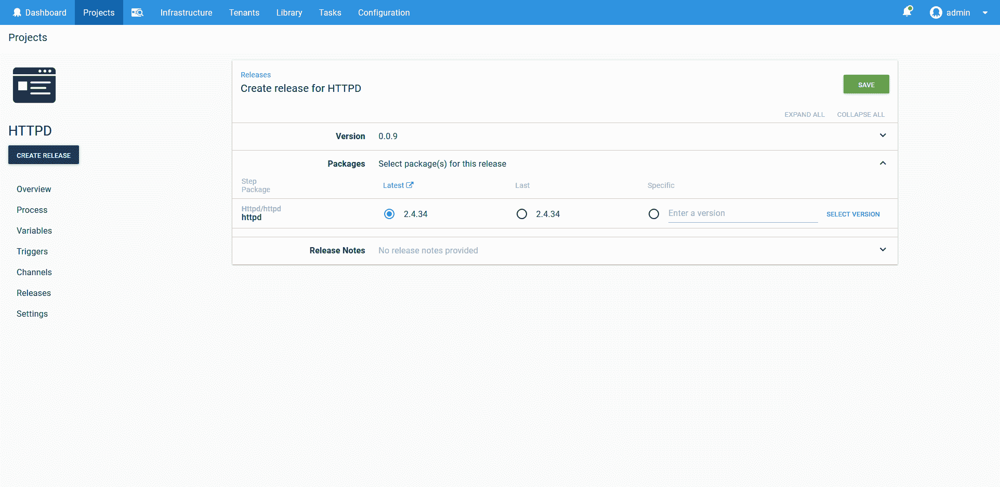](#)

因此我们的部署成功了。

[](#)

进入 Google Cloud 控制台，我们可以看到一个名为`httpd-deployments-841`的部署资源已经创建。该名称是我们在步骤`httpd`中定义的部署资源名称和`deployments-841`的 Octopus 部署的唯一标识符的组合。创建这个名称是因为蓝/绿部署策略要求每个部署创建的部署资源是唯一的。

[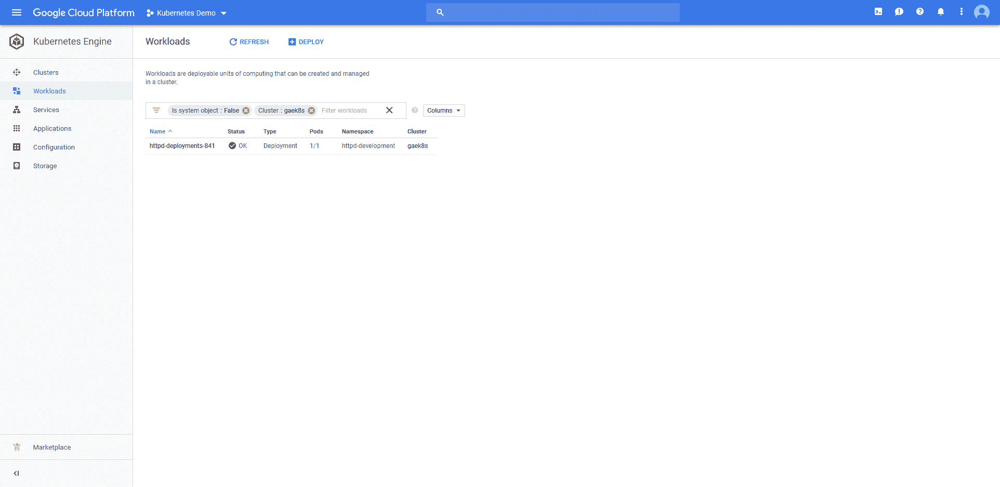](#)

部署还创建了一个名为`httpd`的服务资源。请注意，它的类型是`Load balancer`，并且有一个公共 IP 地址。

[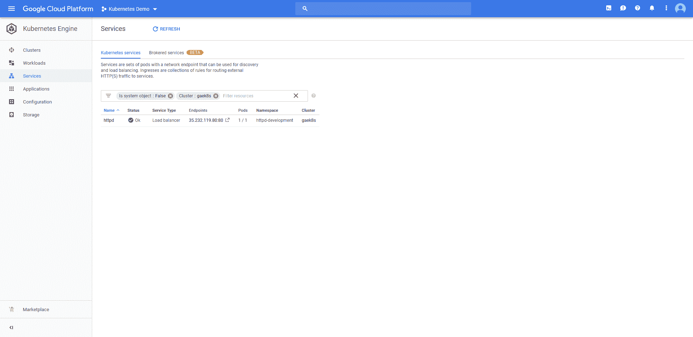](#)

还创建了名为`configmap-deployments-841`的配置映射资源。与部署资源一样，ConfigMap 资源的名称是我们在步骤中定义的名称和 Octopus 添加的惟一部署名称的组合。与部署资源不同，由该步骤创建的 ConfigMaps 将始终具有这样的唯一名称(部署资源仅具有针对蓝/绿部署附加的唯一部署名称)。

【T2 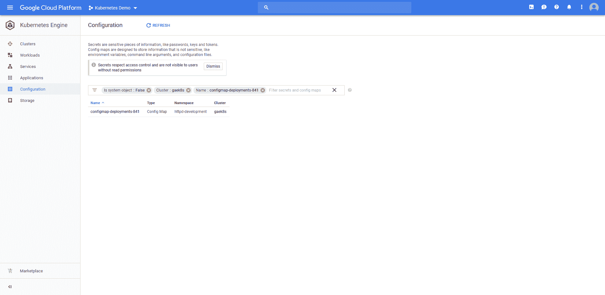

所有这些都会导致 HTTPD 将配置映射资源的内容作为服务资源的公共 IP 地址下的网页来提供。

[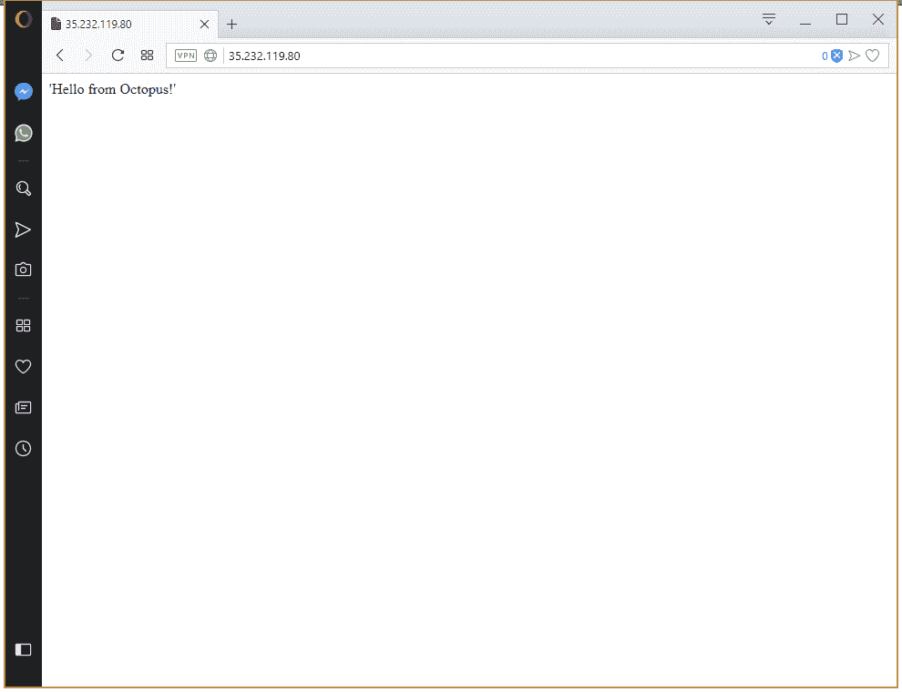](#)

如果你已经做到了这一步，祝贺你！但是您可能想知道为什么我们必须配置这么多东西才能显示一个静态网页。在互联网上阅读任何其他 Kubernetes 教程都会让你在 1000 字前就达到这一点...

在为 Octopus 开发这些 Kubernetes 步骤的过程中，我们发现每个人都喜欢展示如何快速地使用管理帐户将单个应用程序部署到单个环境中，并在专用的负载平衡器上公开所有内容。这很好，但并不代表现实世界部署所面临的那种挑战。

我们在这里实现的是为跨多个环境部署多个应用程序奠定基础，将名称空间和具有有限权限的服务帐户分离开来。

所以，喘口气吧，因为我们只完成了一半。至此，我们已经通过一个负载平衡器将一个应用程序部署到了一个环境中，接下来我们将进行多环境部署。

## 那么当事情出错时会发生什么呢？

部署有时会失败。这不仅是可以预期的，而且是值得庆祝的，只要它发生在`Development`环境中。快速失败是稳健的 CD 管道的关键组成部分。

让我们回顾一下我们现在部署了什么。我们有一个指向服务资源的负载平衡器，服务资源又指向部署资源。

【T2 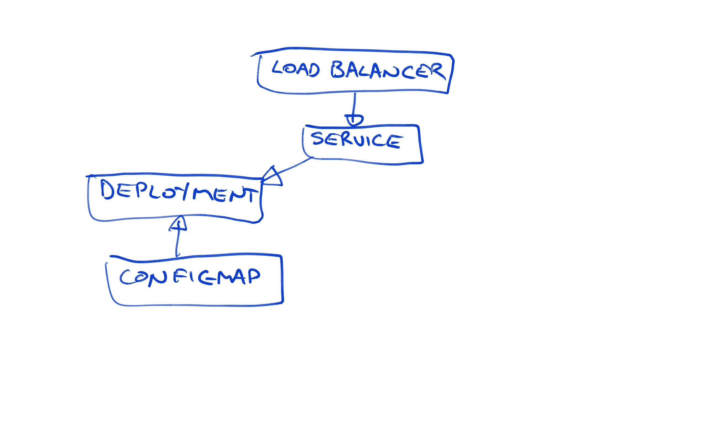

让我们模拟一次失败的部署。我们可以通过配置容器资源就绪探测器来运行一个不存在的命令来做到这一点。Kubernetes 使用就绪探测器来确定容器资源何时准备好开始接受流量，通过故意配置一个不能通过的测试，我们可以模拟一个失败的部署。

[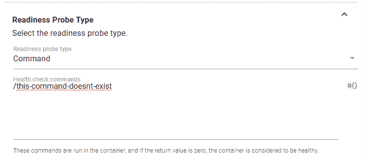](#)

作为此失败部署的一部分，我们还将更改 ConfigMap 的值。请记住，这个值就是网页中显示的内容。

[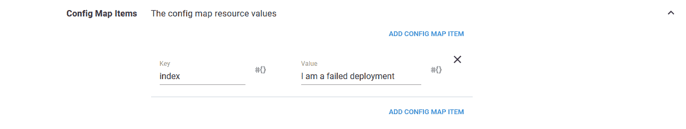](#)

不出所料，部署失败了。

[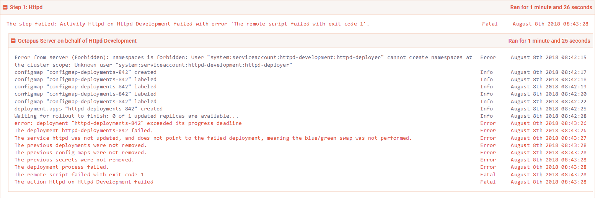](#)

那么部署失败意味着什么呢？

[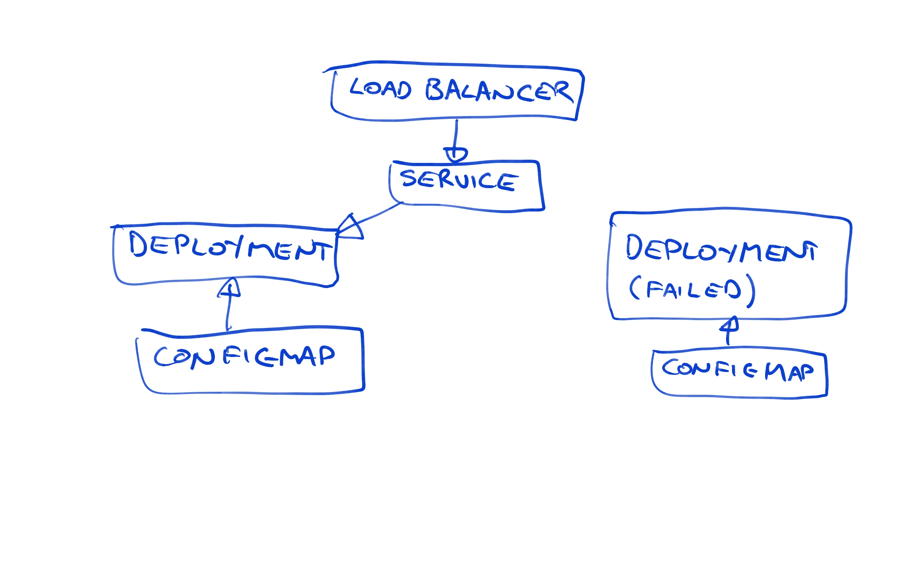](#)

因为我们使用蓝/绿部署策略，所以我们现在有两个部署资源。因为最新的一个叫`httpd-deployments-842`的已经失效，之前的一个叫`httpd-deployments-841`的还没有移除。

我们还有两个配置映射资源。同样，由于上次部署失败，以前的 ConfigMap 资源尚未删除。

实际上，失败的部署资源及其关联的 ConfigMap 资源是孤立的。它们不能从服务资源中访问，这意味着新部署对外界是不可见的。

[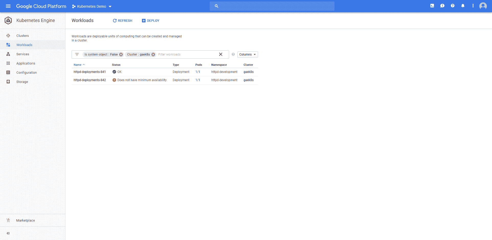](#)

[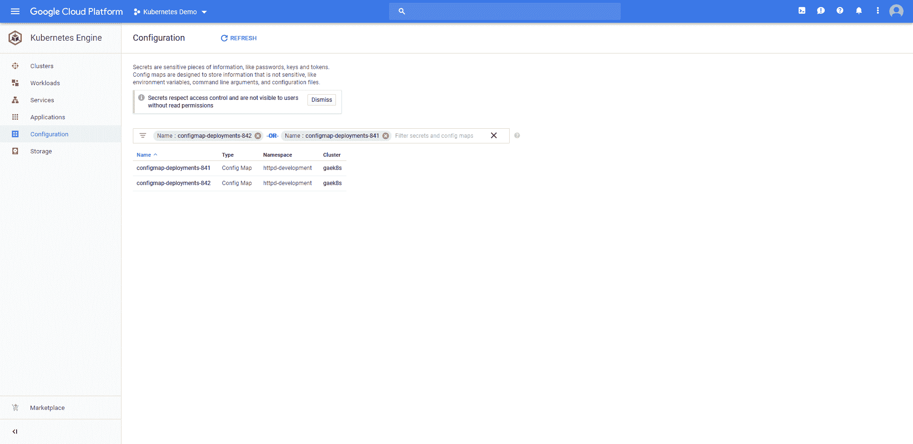](#)

因为旧资源在部署期间未被编辑，并且由于部署失败而未被删除，所以我们的上次部署仍然是实时的、可访问的，并且显示与上次成功部署时定义的文本相同的文本。

这也是这一步关于 Kubernetes 部署应该是什么的观点之一。失败的部署不应导致环境崩溃，而是让您有机会解决问题，同时保留以前的部署。

[](#)

继续并从容器资源中删除不良就绪检查。还要更改 ConfigMap 资源的值以显示新消息。

[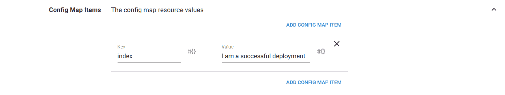](#)

这一次部署成功了。由于部署成功，以前的部署和 ConfigMap 资源已被清理，新消息显示在网页上。

[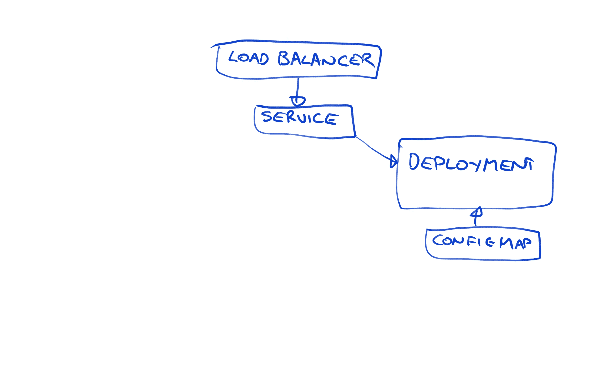](#)

[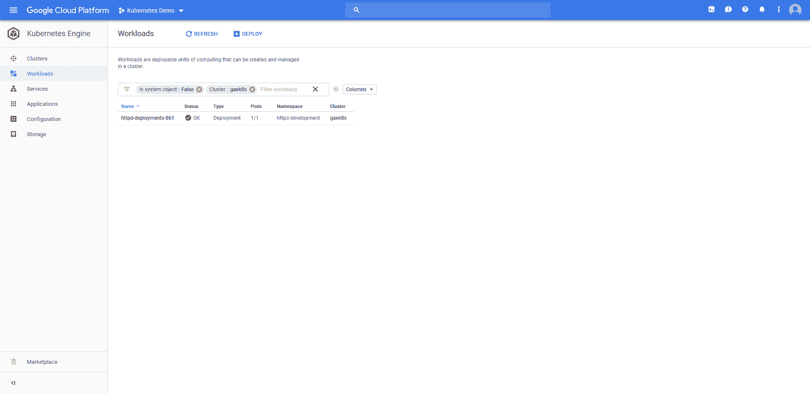](#)

[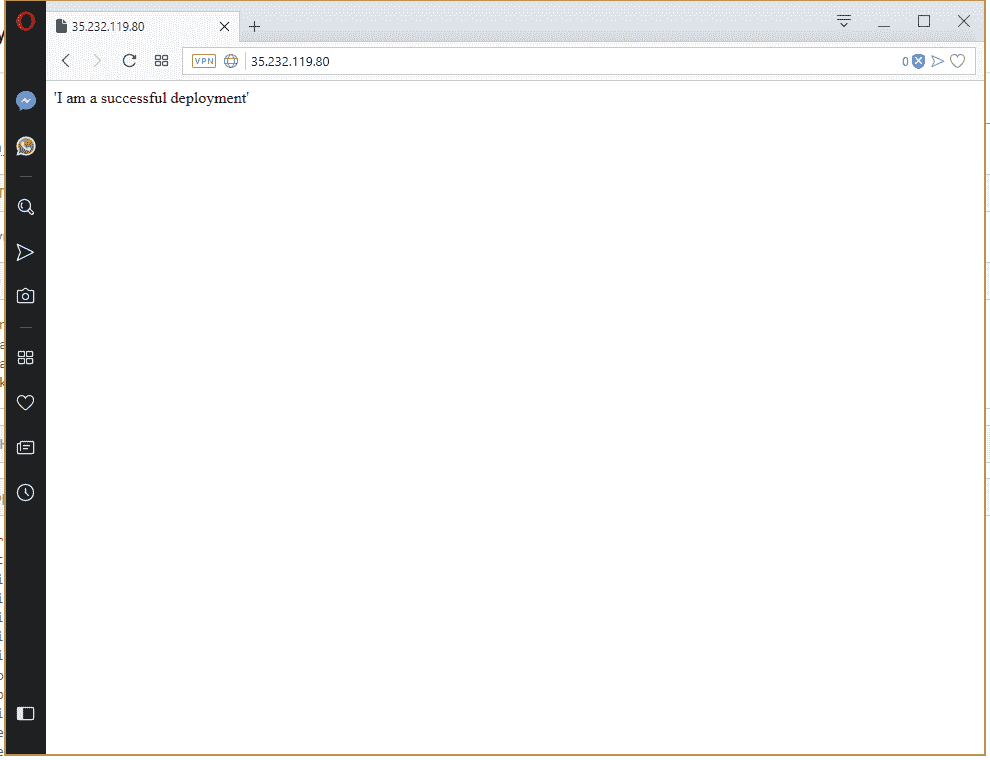](#)

通过为每个蓝/绿部署创建新的部署资源，并为每个部署创建新的 ConfigMap 资源，我们可以确保我们的 Kubernetes 集群在更新期间或部署失败后不会处于未定义的状态。

我向您承诺了一个多环境部署的示例，所以让我们继续配置我们的`Production`环境。

首先，为生产环境创建一个服务帐户。这个 YAML 与我们用于为`Development`环境创建服务帐户的代码相同，只是文本`development`被替换为`production`。

```
---
kind: Namespace
apiVersion: v1
metadata:
  name: httpd-production
---
apiVersion: v1
kind: ServiceAccount
metadata:
  name: httpd-deployer
  namespace: httpd-production
---
kind: Role
apiVersion: rbac.authorization.k8s.io/v1
metadata:
  namespace: httpd-production
  name: httpd-deployer-role
rules:
- apiGroups: ["", "extensions", "apps"]
  resources: ["deployments", "replicasets", "pods", "services", "ingresses", "secrets", "configmaps"]
  verbs: ["get", "list", "watch", "create", "update", "patch", "delete"]
- apiGroups: [""]
  resources: ["namespaces"]
  verbs: ["get"]     
---
kind: RoleBinding
apiVersion: rbac.authorization.k8s.io/v1
metadata:
  name: httpd-deployer-binding
  namespace: httpd-production
subjects:
- kind: ServiceAccount
  name: httpd-deployer
  apiGroup: ""
roleRef:
  kind: Role
  name: httpd-deployer-role
  apiGroup: "" 
```

同样，获得令牌的 Powershell 是相同的，除了`development`现在是`production`。

```
$user="httpd-deployer"
$namespace="httpd-production"
$data = kubectl get secret $(kubectl get serviceaccount $user -o jsonpath="{.secrets[0].name}" --namespace=$namespace) -o jsonpath="{.data.token}" --namespace=$namespace
[System.Text.Encoding]::ASCII.GetString([System.Convert]::FromBase64String($data)) 
```

bash 脚本也是如此。

```
user="httpd-deployer"
namespace="httpd-production"
kubectl get secret $(kubectl get serviceaccount $user -o jsonpath="{.secrets[0].name}" --namespace=$namespace) -o jsonpath="{.data.token}" --namespace=$namespace | base64 --decode 
```

我不会重复运行这些脚本、创建令牌帐户或创建目标的细节，所以请回头参考[HTTPD 开发服务帐户](#the-httpd-development-service-account)了解更多细节。

您希望最终配置一个如下所示的目标。

[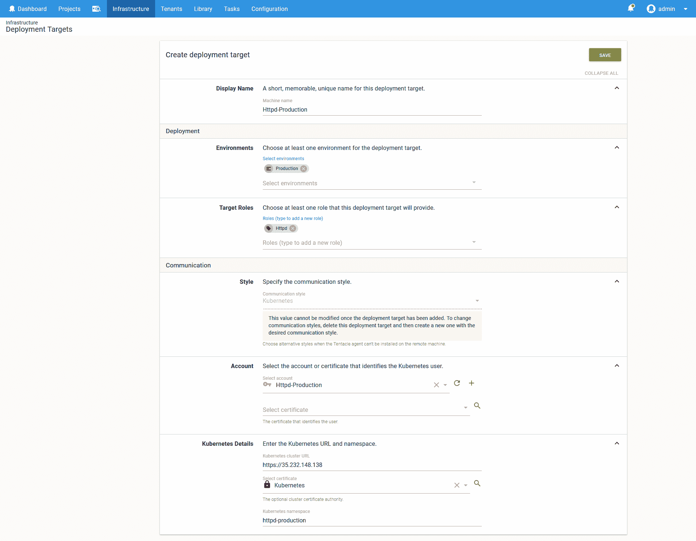](#)

现在继续将 Octopus 部署到`Production`环境中。

这将导致使用新的公共 IP 地址创建第二个负载平衡器服务资源。

[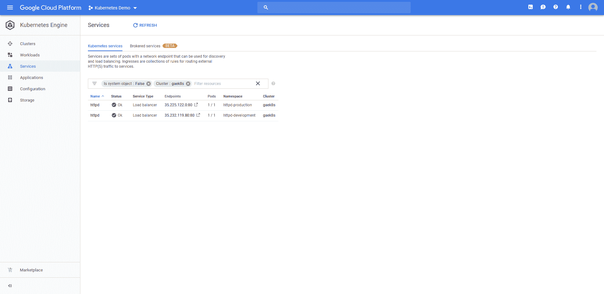](#)

我们的生产实例可以在 web 浏览器中查看。

[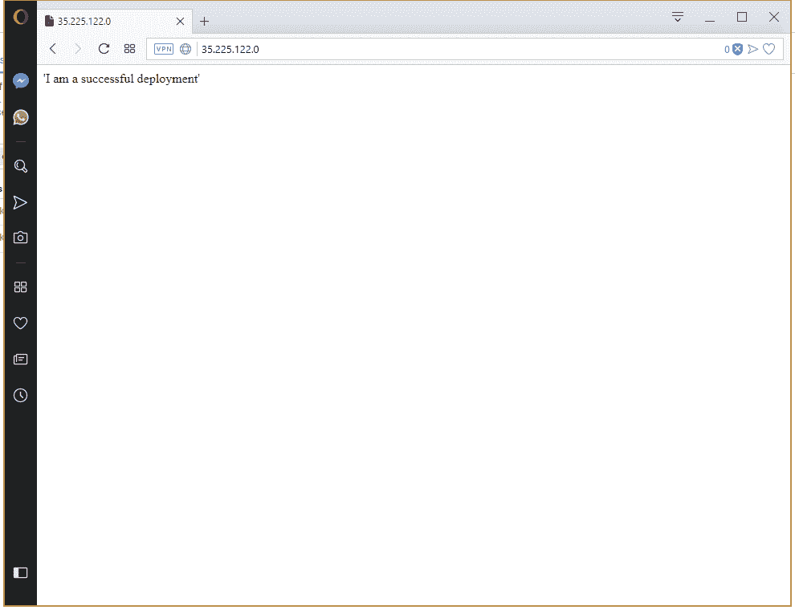](#)

让我们找点乐子，使用一个变量作为 ConfigMap 资源的值。通过将值设置为变量`#{Octopus.Environment.Name}`，我们将在网页中显示环境名称。

[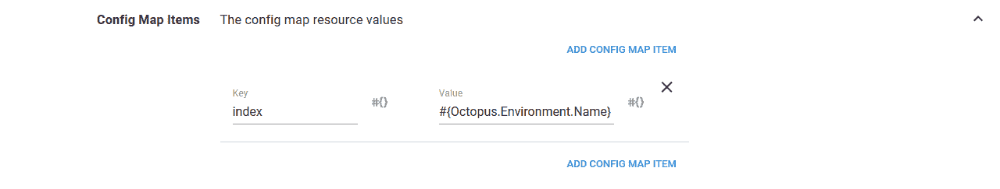](#)

将这一更改应用到生产环境中会导致环境名称显示在页面上。

[](#)

这是一个微不足道的例子，但它强调了通过配置多环境部署可以获得的强大功能。一旦配置了您的帐户、目标和环境，在环境间移动应用程序就变得简单、安全且高度可配置。

## 迁移到入口

为了方便起见，我们通过负载平衡器服务资源公开了我们的 HTTPD 应用程序。这是一个快捷的解决方案，因为 Google Cloud 负责构建一个带有公共 IP 地址的网络负载平衡器。

不幸的是，这种解决方案不能扩展到更多的应用。每一个网络负载平衡器都要花钱，而且当涉及到安全和审计时，跟踪多个公共 IP 地址可能是一件痛苦的事情。

解决方案是拥有一个单一的负载平衡器服务，它接受所有传入的请求，然后根据请求将流量定向到适当的 Pod 资源。例如，https://myapp/userservice 流量将被定向到用户微服务，而 https://myapp/cartservice 流量将被定向到 cart 微服务。

这正是入口资源为我们做的事情。单个负载平衡器服务资源会将流量定向到入口控制器资源，入口控制器资源又会将流量定向到不会产生任何额外基础架构成本的其他内部服务资源。

与大多数 Kubernetes 资源不同，入口控制器由第三方提供。一些云提供商有自己的入口控制器，但我们将使用 Nginx 入口控制器，因为它是最受欢迎的，可以在云提供商之间移植。

但是要配置 Nginx Ingress 控制器，我们首先需要设置 Helm。

## 配置舵

Helm 之于 Kubernetes，就像 Chocolatey 之于 Windows，或者 Apt/Yum 之于 Linux。Helm 提供了一种将简单和复杂的应用程序部署到 Kubernetes 集群的方法，处理所有的依赖关系，公开可用的选项，并提供升级和删除现有部署的命令。

Helm 的伟大之处在于，它已经将大量的应用程序打包到了 Helm 所谓的图表中。我们将使用这些图表中的一个来安装 Nginx 入口控制器。

## 在 Kubernetes 集群中安装 Helm

Helm 有一个服务器端组件，必须首先安装在 Kubernetes 集群本身上。云提供商有设置服务器端组件的说明，所以点击这些文档以获得使用 Helm 准备 Kubernetes 集群的说明。

## 舵馈给

为了利用舵，我们需要配置一个舵饲料。因为我们将使用标准的公共 Helm 存储库，所以我们将提要配置为访问[https://kubernetes-charts.storage.googleapis.com/](https://kubernetes-charts.storage.googleapis.com/)。

[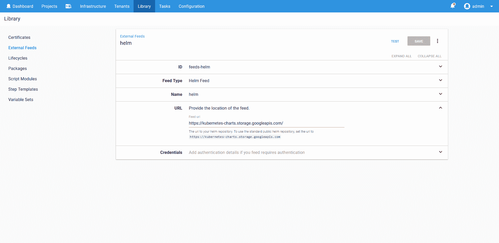](#)

## 入口控制器和多种环境

此时，我们需要决定如何部署入口控制器资源。

我们可以让一个负载平衡器服务资源将流量定向到一个入口控制器资源，这又可以跨环境定向流量。入口控制器资源可以基于请求的主机名来定向流量，因此发送到 https://myproductionapp/user service 的流量可以发送到`Production`环境，而 https://mydevelopmentapp/user service 可以发送到`Development`环境。

另一种选择是每个环境有一个入口控制器资源。在这种情况下，`Development`环境中的入口控制器资源将只向`Development`环境中的其他服务发送流量，而`Production`环境中的入口控制器资源将向`Production`服务发送流量。

这两种方法都是有效的，各有利弊。对于这个例子，我们将为每个环境部署一个入口控制器资源。

我们将把 Nginx 入口控制器资源视为一个应用部署。这意味着，就像我们在 HTTPD 部署中所做的那样，将为每个环境创建一个服务帐户和目标。

部署掌舵图时，需要调整服务帐户、角色和角色绑定资源。部署 Helm chart 包括在`kube-system`名称空间中列出和创建资源。为了支持这一点，我们创建了一个具有`kube-system`名称空间中所需权限的额外角色资源，并用另一个 RoleBinding 资源将该角色资源绑定到服务帐户资源。

这是在`nginx-development`名称空间中创建`nginx-deployer`服务帐户资源的 YAML。

```
---
kind: Namespace
apiVersion: v1
metadata:
  name: nginx-development
---
apiVersion: v1
kind: ServiceAccount
metadata:
  name: nginx-deployer
  namespace: nginx-development
---
kind: Role
apiVersion: rbac.authorization.k8s.io/v1
metadata:
  namespace: nginx-development
  name: nginx-deployer-role
rules:
- apiGroups: ["", "extensions", "apps"]
  resources: ["deployments", "replicasets", "pods", "services", "ingresses", "secrets", "configmaps"]
  verbs: ["get", "list", "watch", "create", "update", "patch", "delete"]
- apiGroups: [""]
  resources: ["namespaces"]
  verbs: ["get"]   
---
kind: RoleBinding
apiVersion: rbac.authorization.k8s.io/v1
metadata:
  name: nginx-deployer-binding
  namespace: nginx-development
subjects:
- kind: ServiceAccount
  name: nginx-deployer
  apiGroup: ""
roleRef:
  kind: Role
  name: nginx-deployer-role
  apiGroup: ""
---
kind: Role
apiVersion: rbac.authorization.k8s.io/v1
metadata:
  namespace: kube-system
  name: nginx-deployer-role
rules:
- apiGroups: [""]
  resources: ["pods", "pods/portforward"]
  verbs: ["list", "create"]
---
kind: RoleBinding
apiVersion: rbac.authorization.k8s.io/v1
metadata:
  name: nginx-deployer-development-binding
  namespace: kube-system
subjects:
- kind: ServiceAccount
  name: nginx-deployer
  apiGroup: ""
  namespace: nginx-development
roleRef:
  kind: Role
  name: nginx-deployer-role
  apiGroup: "" 
```

这是在`nginx-production`名称空间中创建`nginx-deployer`服务帐户资源的 YAML。

```
---
kind: Namespace
apiVersion: v1
metadata:
  name: nginx-production
---
apiVersion: v1
kind: ServiceAccount
metadata:
  name: nginx-deployer
  namespace: nginx-production
---
kind: Role
apiVersion: rbac.authorization.k8s.io/v1
metadata:
  namespace: nginx-production
  name: nginx-deployer-role
rules:
- apiGroups: ["", "extensions", "apps"]
  resources: ["deployments", "replicasets", "pods", "services", "ingresses", "secrets", "configmaps"]
  verbs: ["get", "list", "watch", "create", "update", "patch", "delete"]
- apiGroups: [""]
  resources: ["namespaces"]
  verbs: ["get"]     
---
kind: RoleBinding
apiVersion: rbac.authorization.k8s.io/v1
metadata:
  name: nginx-deployer-binding
  namespace: nginx-production
subjects:
- kind: ServiceAccount
  name: nginx-deployer
  apiGroup: ""
roleRef:
  kind: Role
  name: nginx-deployer-role
  apiGroup: ""
---
kind: Role
apiVersion: rbac.authorization.k8s.io/v1
metadata:
  namespace: kube-system
  name: nginx-deployer-role
rules:
- apiGroups: [""]
  resources: ["pods", "pods/portforward"]
  verbs: ["list", "create"]
---
kind: RoleBinding
apiVersion: rbac.authorization.k8s.io/v1
metadata:
  name: nginx-deployer-production-binding
  namespace: kube-system
subjects:
- kind: ServiceAccount
  name: nginx-deployer
  apiGroup: ""
  namespace: nginx-production
roleRef:
  kind: Role
  name: nginx-deployer-role
  apiGroup: "" 
```

为服务帐户获取令牌的过程是相同的，创建令牌 Octopus 帐户和目标也是如此。

创建帐户、名称空间和目标后，我们将在 Octopus 中配置以下目标列表。

[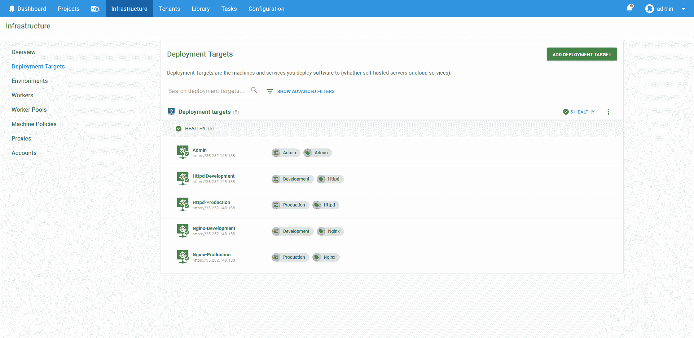](#)

## 配置舵变量

我们可以通过`Run a Helm Update`步骤部署 Nginx 舵图。

从舵馈入中选择`nginx-ingress`图表。

[](#)

将`Kubernetes Release Name`设置为`nginx-#{Octopus.Environment.Name | ToLower}`。我们已经利用了 Octopus 变量替换来确保 Helm 版本在每个环境中都有一个唯一的名称。

[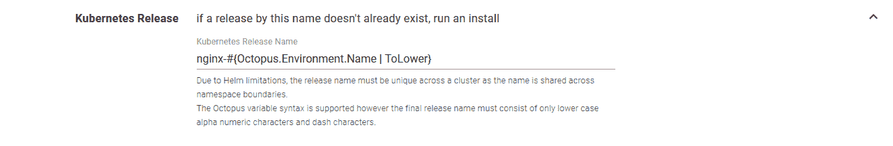](#)

舵图可以用参数定制。Nginx Helm 图表记录了它支持的参数[这里](https://github.com/helm/charts/tree/master/stable/nginx-ingress#configuration)。特别是，我们想要定义`controller.ingressClass`参数，并为每个环境更改它。Ingress 类用于确定哪个 Ingress 控制器将配置哪个规则，我们将使用它来区分`Development`环境和`Production`环境中流量的 Ingress 资源规则。

在`Raw Values YAML`部分，添加以下 YAML。请注意，我们再次使用了变量替换来确保每个环境都有一个适用于它的唯一值。

```
controller:
  ingressClass: "nginx-#{Octopus.Environment.Name | ToLower}" 
```

[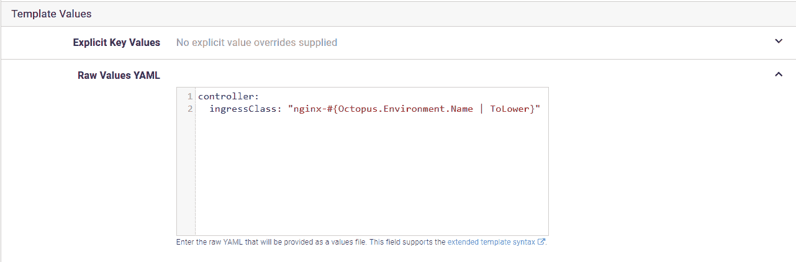](#)

保存这些更改，并记住将生命周期更改为`Application`。

[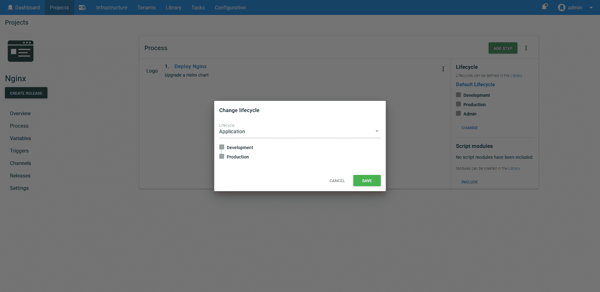](#)

现在将舵图部署到`Development`环境中。

[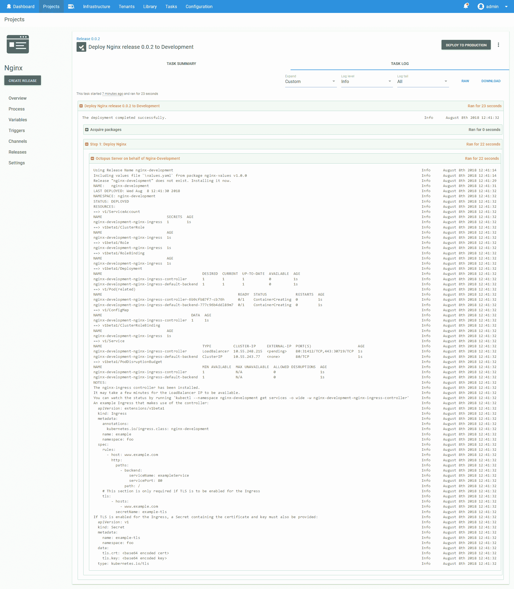](#)

Helm 为我们提供了一个例子，说明如何创建与新部署的入口控制器资源一起工作的入口资源。

```
The nginx-ingress controller has been installed.
It may take a few minutes for the LoadBalancer IP to be available.
You can watch the status by running 'kubectl --namespace nginx-development get services -o wide -w nginx-development-nginx-ingress-controller'
An example Ingress that makes use of the controller:
  apiVersion: extensions/v1beta1
  kind: Ingress
  metadata:
    annotations:
      kubernetes.io/ingress.class: nginx-development
    name: example
    namespace: foo
  spec:
    rules:
      - host: www.example.com
        http:
          paths:
            - backend:
                serviceName: exampleService
                servicePort: 80
              path: /
    # This section is only required if TLS is to be enabled for the Ingress
    tls:
        - hosts:
            - www.example.com
          secretName: example-tls 
```

特别是，注释非常重要。

```
annotations:
  kubernetes.io/ingress.class: nginx-development 
```

还记得我们在部署舵图时是如何设置`controller.ingressClass`参数的吗？这个注释就是那个属性所控制的。这意味着入口资源必须专门设置`kubernetes.io/ingress.class: nginx-development`注释，以供该入口控制器资源考虑。这就是我们如何区分开发和生产入口控制器资源的规则。

继续将部署推进到`Production`环境中。

我们现在可以在 Kubernetes 集群中看到 Nginx 部署资源。

[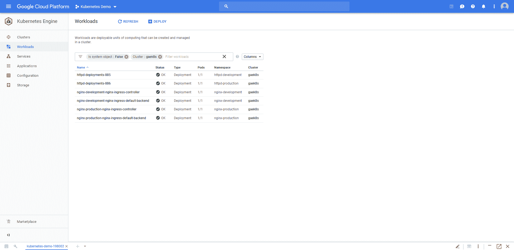](#)

这些 Nginx 部署资源可以通过新的负载平衡器服务资源进行访问。

[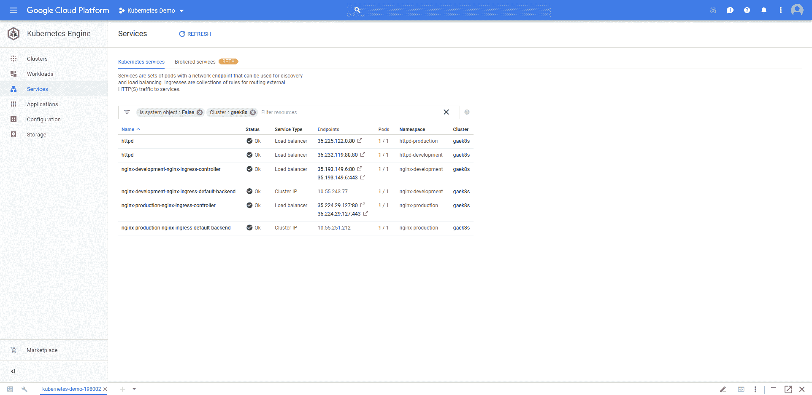](#)

我们现在准备通过入口控制器连接到 HTTPD 应用程序，而不是通过它们自己的网络负载平衡器。

## 配置入口

回到 HTTPD 容器部署步骤，我们需要将`Service Type`从`Load balancer`更改为`Cluster IP`。这是因为入口控制器资源可以在内部将流量定向到 HTTPD 服务资源。不再需要公开访问 HTTPD 服务资源，群集 IP 服务资源提供了我们需要的一切。

[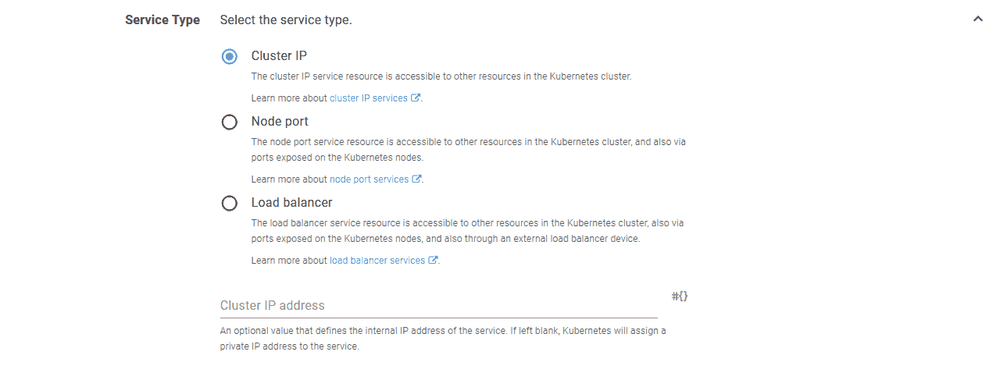](#)

我们现在需要配置入口资源。

从定义`Ingress Name`开始。

[](#)

入口资源支持许多不同的入口控制器，这些控制器可通过注释获得。这些是键/值对，通常包含特定于实现的值。因为我们已经部署了 Nginx 入口控制器，所以我们定义的许多注释都是特定于 Nginx 的。

不过，第一个注释是跨入口控制器资源实现共享的。就是我们之前讲过的`kubernetes.io/ingress.class`标注。我们将这个注释设置为`nginx-#{Octopus.Environment.Name | ToLower}`。这意味着当部署在`Development`环境中时，这个注释将被设置为`nginx-development`，而当部署到`Production`环境中时，它将被设置为`nginx-production`。这就是我们如何针对特定环境的入口控制器资源。

将`kubernetes.io/ingress.allow-http`注释设置为`true`以允许不安全的 HTTP 流量，将`nginx.ingress.kubernetes.io/ssl-redirect`设置为`false`以防止 Nginx 将 HTTP 流量重定向到 HTTPS。

[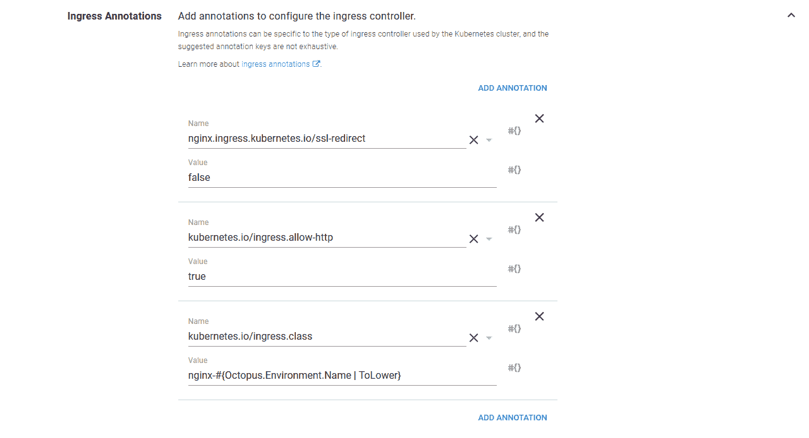](#)

启用 HTTP 流量有安全风险，此处仅用于演示目的。

最后要配置的部分是`Ingress Host Rules`。这是我们将传入请求映射到公开容器资源的服务资源的地方。在我们的例子中，我们想要公开服务资源端口的`/httpd`路径，它映射到我们的容器资源上的端口 80。

`Host`字段留空，这意味着它将捕获所有主机的请求。

[](#)

继续将它部署到`Development`环境中。您将得到这样的错误。

```
The Service "httpd" is invalid: spec.ports[0].nodePort: Invalid value: 30245: may not be used when `type` is 'ClusterIP' 
```

[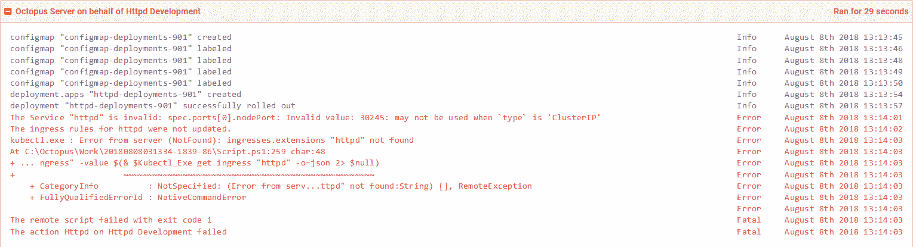](#)

引发此错误是因为我们将定义了`nodePort`属性的负载平衡器服务资源更改为不支持`nodePort`属性的群集 IP 服务资源。Kubernetes 非常善于知道如何更新现有资源以匹配新的配置，但在这种情况下，它不知道如何执行这种更改。

最简单的解决方案是删除服务资源并重新运行部署。因为我们已经在 Octopus 中完全定义了部署过程，所以我们可以安全地删除和重新创建这些资源，因为我们知道没有任何未记录的设置已经应用到我们可能要删除的集群。

[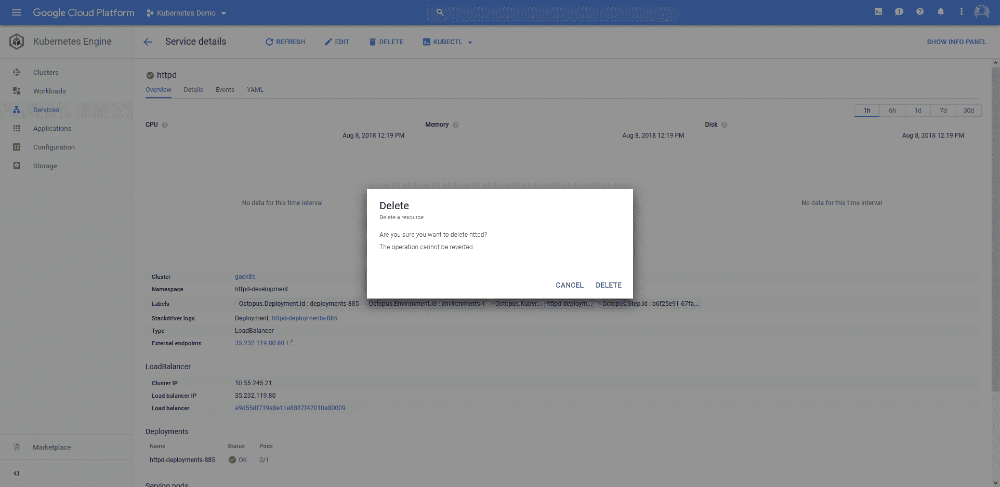](#)

这一次部署成功了，我们成功地部署了入口资源。

让我们打开通过入口控制器资源公开的 URL。

[](#)

我们得到了 404。这里出了什么问题？

## 管理 URL 映射

这里的问题是，我们打开了一个像 http://35.193.149.6/httpd 这样的 URL，然后通过同样的路径到达 HTTPD 服务。我们的 HTTPD 服务在`httpd`路径下没有内容可提供。它的根路径中只有从 ConfigMap 资源映射的`index.html`文件。

[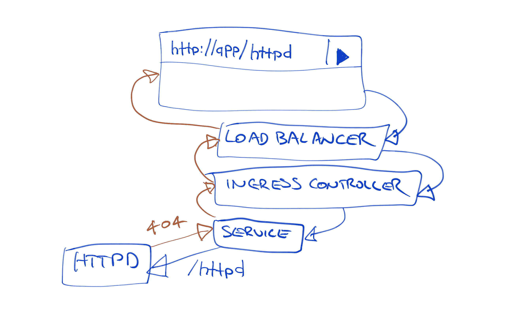](#)

幸运的是，这种路径不匹配很容易解决。通过将`nginx.ingress.kubernetes.io/rewrite-target`注释设置为`/`，我们可以配置 Nginx 将它在路径`/httpd`上收到的请求传递到路径`/`。因此，当我们在浏览器中访问 URL[http://35.193.149.6/httpd](http://35.193.149.6/httpd)时，HTTPD 服务看到对根路径的请求。

[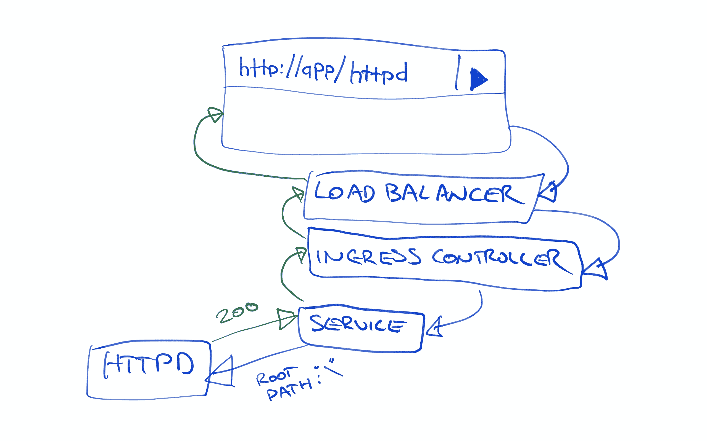](#)

[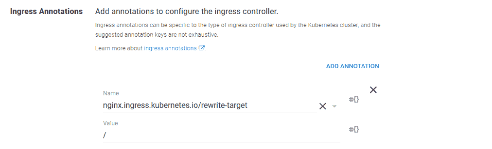](#)

将项目重新部署到`Development`环境中。一旦部署完成，URL[http://35.193.149.6/httpd](http://35.193.149.6/httpd)将返回显示环境名称的自定义网页。

[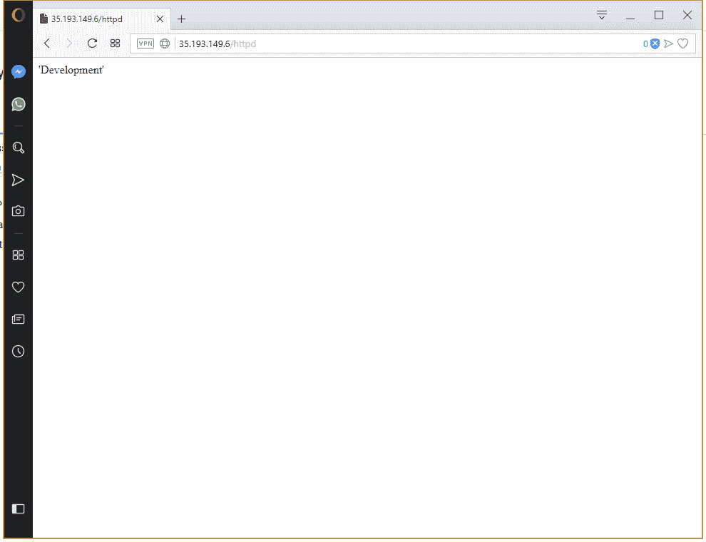](#)

既然我们已经让`Development`环境如我们所期望的那样工作了，那么将部署推送到`Production`环境(记住删除旧的服务资源，否则将再次抛出`nodePort`错误)。这一次，部署立即生效。

[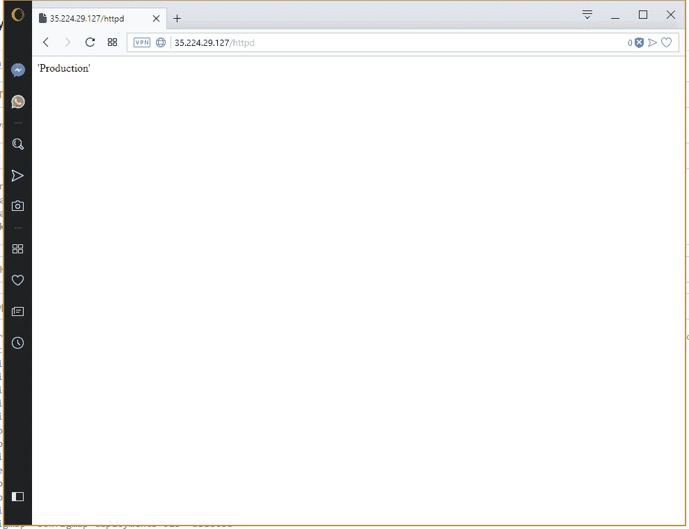](#)

`nginx.ingress.kubernetes.io/rewrite-target`注释在简单的情况下有效，但是当返回的内容是链接到 CSS 和 JavaScript 文件的 HTML 页面时，这些链接可能是相对于基本路径的，因为提供内容的应用程序不知道使用的原始路径。

在某些情况下，这可以用`nginx.ingress.kubernetes.io/add-base-url: true`注释来纠正。这将把一个`<base>`元素插入到返回的 HTML 的头部。[更多信息参见 Nginx 文档](https://kubernetes.github.io/ingress-nginx/user-guide/nginx-configuration/annotations/#rewrite)。

## 输出变量

使用 Octopus 执行 Kubernetes 部署的一个好处是，您的部署过程可以与更广泛的生态系统集成。这是通过访问为该步骤创建的每个资源生成的输出变量来完成的。这些参数可以在后面的步骤中使用。

通过将 Octopus 项目中的`OctopusPrintEvaluatedVariables`变量设置为`True`，可以看到部署期间所有可用的变量。更多细节见[文档](https://octopus.com/docs/support/debug-problems-with-octopus-variables#DebugproblemswithOctopusvariables-Writethevariablestothedeploymentlog)。

在我们的例子中，输出变量是(用步骤的名称替换`step name`):

*   章鱼。动作[步骤名称].输出.入口
*   章鱼。操作[步骤名称].Output.ConfigMap
*   章鱼。操作[步骤名称].输出.部署
*   章鱼。动作[步骤名称].输出.服务

这些变量包含创建的 Kubernetes 资源的 JSON 表示。例如，通过在脚本步骤中解析这些 JSON 字符串，我们可以显示一个指向网络负载平衡器的链接，该平衡器公开了我们的 Kubernetes 服务。

```
$IngressParsed = ConvertFrom-Json -InputObject $OctopusParameters["Octopus.Action[Deploy Httpd].Output.Ingress"]
Write-Host "Access the ingress load balancer at http://$($IngressParsed.status.loadBalancer.ingress.ip)" 
```

[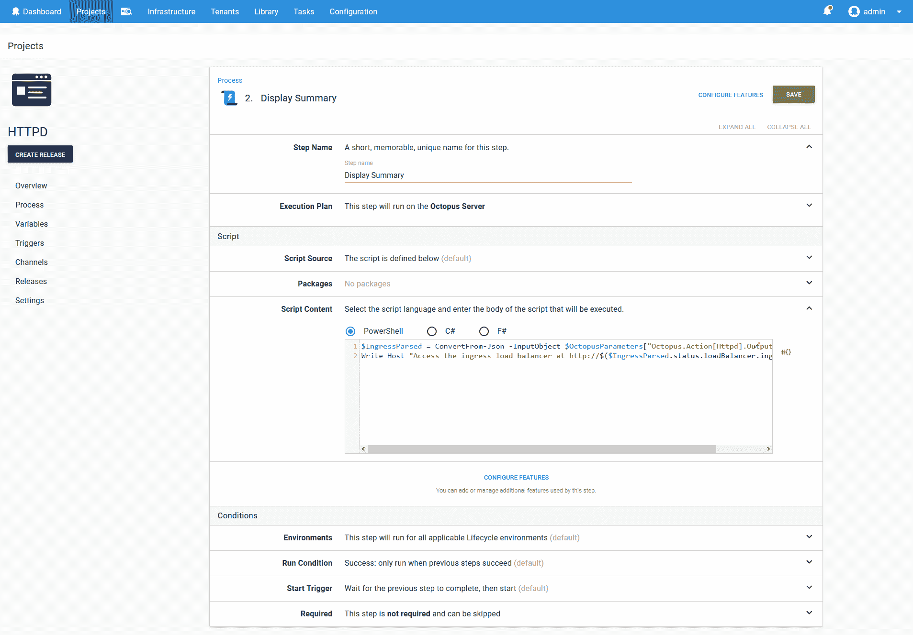](#)

## 一些有用的提示和技巧

### 查看资源 YAML

您可能已经注意到 Octopus 步骤确实暴露了可以在部署资源上定义的每一个可能的选项。

如果您需要该步骤没有提供的定制级别，您可以找到在日志文件中创建的资源的 YAML。这些 YAML 文件可以通过`Run a kubectl CLI script`步骤手动复制、编辑和部署。

[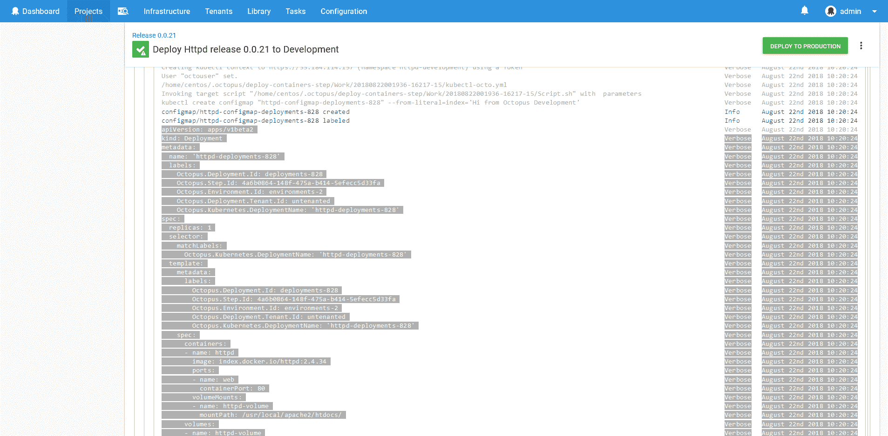](#)

### 即席脚本

管理多个 Kubernetes 帐户和集群的挑战之一是在运行快速查询和一次性维护脚本时不断在它们之间切换。最好的做法是不要用管理员用户运行脚本，但是我想我们都曾以管理员的身份运行过那个卑鄙的命令，只是为了完成工作。而且很多都是用一个有点太宽泛的删除命令烧掉的...

幸运的是，一旦如本文所述在 Octopus 中配置了目标，使用`Script Console`运行这些局限于单个名称空间的特定脚本就变得很容易了。

您可以访问`Script Console`到`Tasks -> Script Console`。选择反映您正在使用的名称空间的 Kubernetes 目标，并在提供的编辑器中编写一个脚本。

【T2 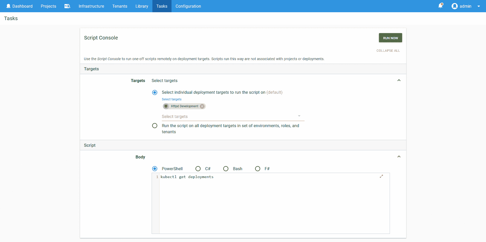

该脚本将在运行`Run a kubectl CLI Script`步骤时创建的相同 kubectl 上下文中运行。这意味着您的即席脚本将被包含到目标的名称空间中(当然假设服务帐户具有正确的权限)，从而限制了任意命令的潜在损害。

[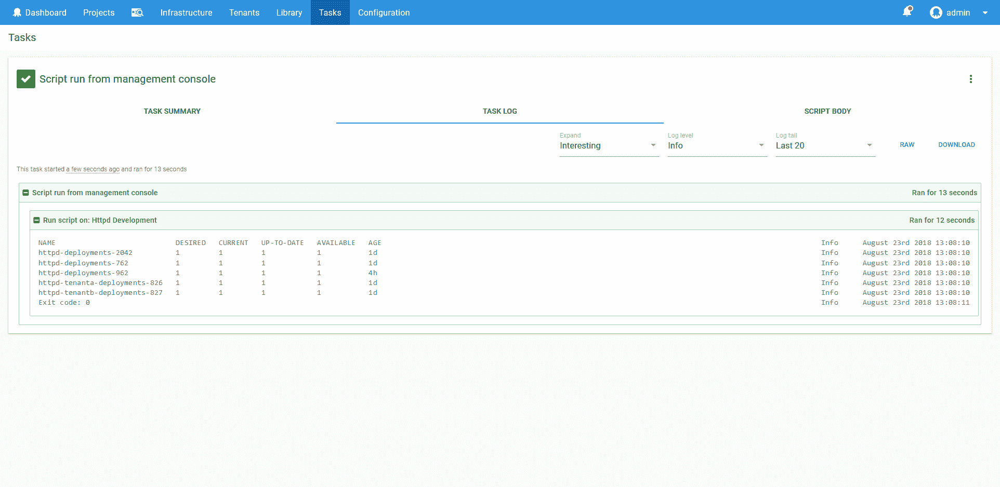](#)

脚本控制台还具有保存谁运行了什么命令的历史记录的优势，为任务关键型系统提供了审计跟踪。

### 编写 Kubernetes 目标脚本

如果您正在管理一个大型 Kubernetes 集群，那么创建帐户和目标可能会非常耗时。幸运的是，这个过程可以自动化，所以 Kubernetes 名称空间和服务帐户资源以及 Octopus 帐户和目标都是用一个脚本创建的。

创建一个针对现有 Kubernetes 管理目标(即使用 Kubernetes 管理凭证设置的目标)的`Run a kubectl CLI Script`步骤。

定义以下项目变量:

*   KubernetesUrl-Kubernetes 集群 Url。

将以下代码粘贴为脚本体。

```
# The account name is the project, environment and tenant
$projectNameSafe = $($OctopusParameters["Octopus.Project.Name"].ToLower() -replace "[^A-Za-z0-9]","")
$accountName = if (![string]::IsNullOrEmpty($OctopusParameters["Octopus.Deployment.Tenant.Id"])) {
    $($OctopusParameters["Octopus.Project.Name"] -replace "[^A-Za-z0-9]","") + "-" + `
    $($OctopusParameters["Octopus.Deployment.Tenant.Name"] -replace "[^A-Za-z0-9]","") + "-" + `
    $($OctopusParameters["Octopus.Environment.Name"] -replace "[^A-Za-z0-9]","")
} else {
    $($OctopusParameters["Octopus.Project.Name"] -replace "[^A-Za-z0-9]","") + "-" + `
    $($OctopusParameters["Octopus.Environment.Name"] -replace "[^A-Za-z0-9]","")
}

# The namespace is the acocunt name, but lowercase
$namespace = $accountName.ToLower()
#Save the namespace for other steps
Set-OctopusVariable -name "Namespace" -value $namespace
Set-OctopusVariable -name "AccountName" -value $accountName

Set-Content -Path serviceaccount.yml -Value @"
---
kind: Namespace
apiVersion: v1
metadata:
  name: $namespace
---
apiVersion: v1
kind: ServiceAccount
metadata:
  name: $projectNameSafe-deployer
  namespace: $namespace
---
kind: Role
apiVersion: rbac.authorization.k8s.io/v1
metadata:
  namespace: $namespace
  name: $projectNameSafe-deployer-role
rules:
- apiGroups: ["", "extensions", "apps"]
  resources: ["deployments", "replicasets", "pods", "services", "ingresses", "secrets", "configmaps", "namespaces"]
  verbs: ["get", "list", "watch", "create", "update", "patch", "delete"]   
---
kind: RoleBinding
apiVersion: rbac.authorization.k8s.io/v1
metadata:
  name: $projectNameSafe-deployer-binding
  namespace: $namespace
subjects:
- kind: ServiceAccount
  name: $projectNameSafe-deployer
  apiGroup: ""
roleRef:
  kind: Role
  name: $projectNameSafe-deployer-role
  apiGroup: ""
"@

kubectl apply -f serviceaccount.yml

$data = kubectl get secret $(kubectl get serviceaccount "$projectNameSafe-deployer" -o jsonpath="{.secrets[0].name}" --namespace=$namespace) -o jsonpath="{.data.token}" --namespace=$namespace
$Token = [System.Text.Encoding]::ASCII.GetString([System.Convert]::FromBase64String($data))

New-OctopusTokenAccount `
    -name $accountName `
    -token $Token `
    -updateIfExisting

New-OctopusKubernetesTarget `
    -name $accountName `
    -clusterUrl $KubernetesUrl `
    -octopusRoles "Target Role" `
    -octopusAccountIdOrName $accountName `
    -namespace $namespace `
    -updateIfExisting `
    -skipTlsVerification True 
```

然后，这个脚本将创建 Kubernetes 资源，获取令牌，并创建 Octopus 令牌帐户和 Kubernetes 目标。

您还可以允许在部署过程中提供项目变量，或者将这个脚本保存为一个[步骤模板](https://octopus.com/docs/deployment-process/steps/custom-step-templates)，以便于重用。

## 摘要

在本文中，我们看到了如何使用 Octopus 管理 Kubernetes 集群中的多环境部署。在中，每个应用程序和环境都被配置为一个单独的命名空间，具有匹配的服务帐户，该帐户只对该命名空间具有权限。然后将名称空间和服务帐户配置为 Kubernetes 目标，这代表了 Kubernetes 集群中的权限边界。

然后使用蓝/绿策略执行部署，我们看到失败的部署如何将最后一次成功的部署保留在原位，同时可以调试失败的资源。

我们还研究了如何使用 Helm 跨环境部署应用程序，这是通过部署 nginx-ingress 图表实现的。

最终结果是一个可重复的部署过程，该过程强调在`Development`环境中测试变更，并在准备就绪时将变更推送到`Production`环境中。

我希望你喜欢这篇博文，如果你对 Kubernetes 的功能有任何建议或意见，请留下评论。这些步骤处于预览状态，因此非常感谢您的反馈。