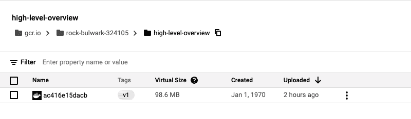
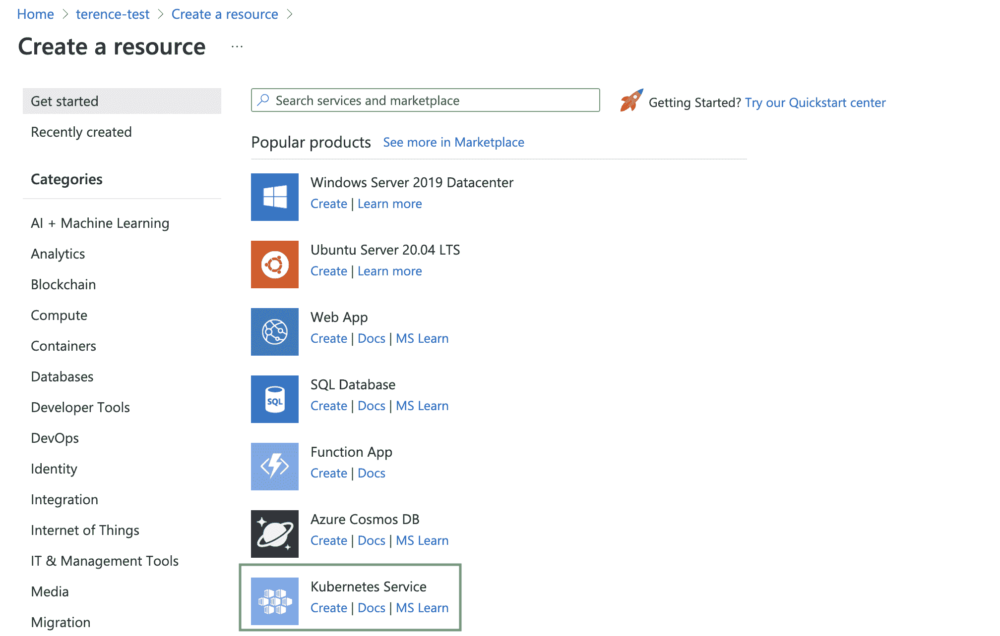
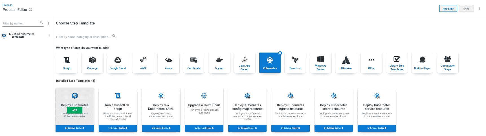
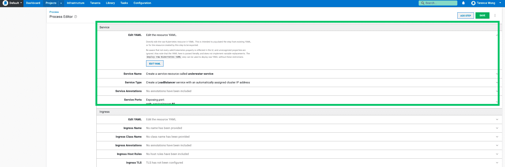
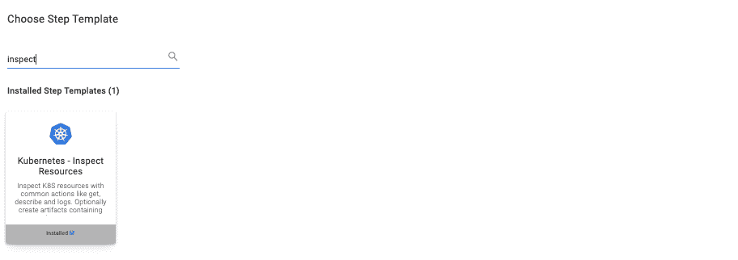
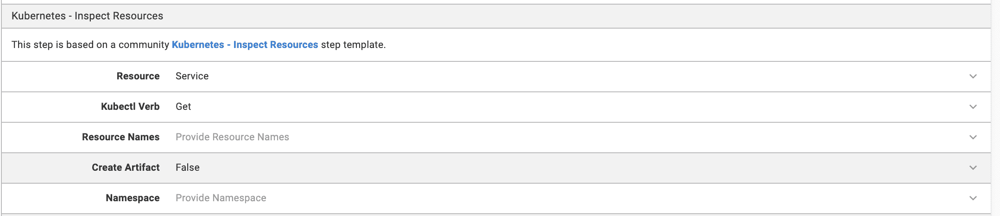
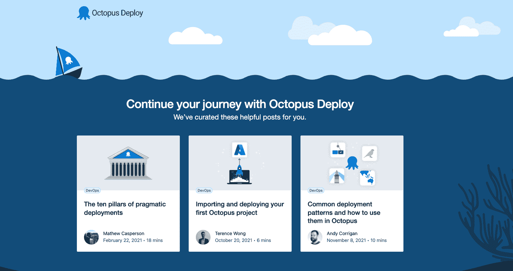

# 使用 Docker、Google、Azure 和 Octopus - Octopus Deploy 构建和部署 Java 应用程序

> 原文：<https://octopus.com/blog/deploying-java-app-docker-google-azure>

持续集成(CI)过程通常包括构建映像并将其推送到容器注册中心。然后，持续交付(CD)工具接管并部署到一个端点，如 web 应用程序。在我们的 [CI 系列](https://octopus.com/blog/tag/CI%20Series)中，我们探索了实现这一目标的各种方法。

为了演示其中一个过程，我构建了一个 Maven Java 项目，并在 Google 容器注册中心(GCR)上托管了这个映像。

您可以通过 Octopus 访问 GCR，并将 Java 应用程序部署到 Azure Kubernetes 服务(AKS)。

## 先决条件

要跟进这篇文章，你需要:

## 章鱼水下应用

Octopus underwater 应用程序是用户创建第一个部署的登录页面。它包括帮助您继续 Octopus Deploy 之旅的帖子链接。

你可以在 [GitHub](https://github.com/OctopusSamples/octopus-underwater-app) 上找到 web 应用库。

对于不同的用例，存储库被分成不同的分支。对于这篇文章，使用水下应用 java 分支。

## 构建并推送注册中心

您使用命令行构建 Java 项目，并使用 gcloud 将映像推送到 GCR。

首先，配置 gcloud 工具指向您的`PROJECT_ID`:

```
gcloud config set project <PROJECT_ID> 
```

克隆您将用来构建和部署到 Azure 的 Java 项目存储库:

```
git clone https://github.com/terence-octo/octopus-underwater-app
cd octopus-underwater-app
git checkout underwater-app-java 
```

使用`run`命令并访问`http://localhost:8080/`在本地测试应用程序

```
chmod +x mvnw
./mvnw spring-boot:run 
```

当您运行 package 步骤时，它会为应用程序构建可部署的目标 JAR:

```
./mvnw package 
```

接下来，启用容器注册表来存储容器映像:

```
gcloud services enable containerregistry.googleapis.com
export GOOGLE_CLOUD_PROJECT=`gcloud config list --format="value(core.project)"` 
```

运行以下命令，使用正确的设置创建 config.json:

```
gcloud auth configure-docker 
```

jib 工具创建图像并将其推送到容器注册表:

```
./mvnw com.google.cloud.tools:jib-maven-plugin:build -Dimage=gcr.io/$GOOGLE_CLOUD_PROJECT/octopus-underwater-app:latest 
```

通过进入[集装箱注册主页](https://cloud.google.com/container-registry)确认图像存在于 GCR 上。

[](#)

## 正在从 Azure 检索用于 Octopus 部署的凭据

您需要检索一些凭证以传递给 Octopus Deploy。

按照我们文档中的步骤来[添加 Azure 服务主体到 Octopus Deploy](https://octopus.com/docs/infrastructure/accounts/azure) 。

## 创建 Azure Kubernetes 集群

接下来，切换到 Microsoft Azure 来托管您的 Kubernetes 集群。Octopus Deploy 与云无关，因此它可以与跨多个云提供商的部署一起工作。

1.  通过转到您的资源组并创建一个 Kubernetes 服务来创建一个新的 Kubernetes 集群。
2.  为集群命名，并接受所有默认选项。

[](#)

## 章鱼步

### 添加部署目标

1.  转到**基础设施**，然后**部署目标**，然后**添加部署目标**，然后 **Kubernetes 集群**。
2.  使用之前设置的 Azure 服务原则填写字段。
3.  为部署分配唯一的角色。

### 添加外部源

为了让 Octopus 访问存储在 GCR 的图像，您需要启用 [Google 容器注册表提要](https://octopus.com/docs/packaging-applications/package-repositories/guides/google-container-registry)。

### 设置部署步骤

在您的项目中，添加**部署 Kubernetes 容器**步骤。

[](#)

### YAML 文件

点击**编辑 YAML** 框，将下面的 YAML 文件粘贴到框中。YAML 文件填充 Octopus UI 中的各种设置。您必须用您的 google PROJECT_ID 替换 PROJECT_ID。使用前面设置的 Google 外部提要凭证，您还可以使用 UI 手动选择容器图像。

```
apiVersion: apps/v1
kind: Deployment
metadata:
  name: java-web-underwater
  labels:
    app: java-web-app
spec:
  selector:
    matchLabels:
      app: java-web-app
  replicas: 1
  strategy:
    type: RollingUpdate
  template:
    metadata:
      labels:
        app: java-web-app
    spec:
      containers:
        - name: java-web-app
          image: gcr.io/<PROJECT_ID>/octopus-underwater-app
          ports:
            - containerPort: 80 
```

### 服务

将以下 YAML 粘贴到步骤的**服务**部分。这将通过 Octopus 客户端创建一个 Azure 服务。

```
 apiVersion: v1
kind: Service
metadata:
  name: underwater-service
spec:
  type: LoadBalancer
  ports:
    - name: web
      port: 80
      targetPort: 8080
      protocol: TCP
  selector:
    app: java-web-app 
```

[](#)

### 部署到 Azure

1.  点击**保存**。
2.  点击 **Create Release** ，点击各个步骤，将应用部署到 Azure。

您可以通过 runbooks 设置对 Kubernetes 资源的监控。

转到您的项目仪表板，然后**运行手册**，然后**添加运行手册**，然后**定义您的运行手册流程**，然后**添加步骤**，然后 **Kubernetes - Inspect 资源**。

[](#)

分配您为部署目标设置的角色。您可以通过设置**资源**和**库对象动词**来复制`kubectl get service`命令。

[](#)

点击**保存**，然后**运行**。

操作手册现在可以跨团队共享。这意味着监控可以在组织级别完成，而不是在本地机器上单独完成。

转到任务日志，查看您刚刚创建的`underwater-service`。在**外部 IP** 下找到 IP 地址。在浏览器地址栏输入这个地址，你就会看到章鱼水下应用。

[](#)

## 结论

在这篇文章中，你构建了章鱼水下应用程序，并将图片推送到 GCR。您使用 Octopus Deploy 来引用这个映像，并将该映像部署到 AKS。

阅读我们的[持续集成系列](https://octopus.com/blog/tag/CI%20Series)的其余部分。

愉快的部署！