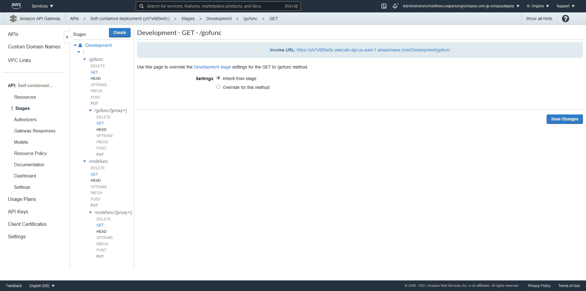
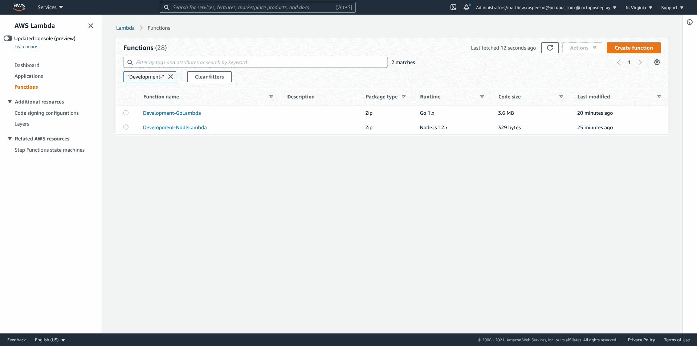
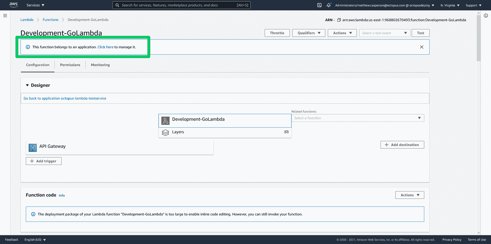
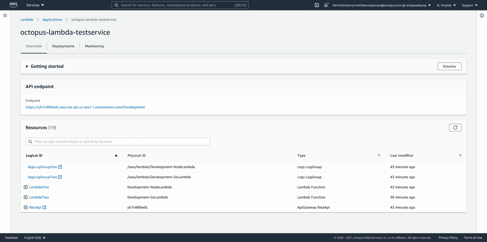
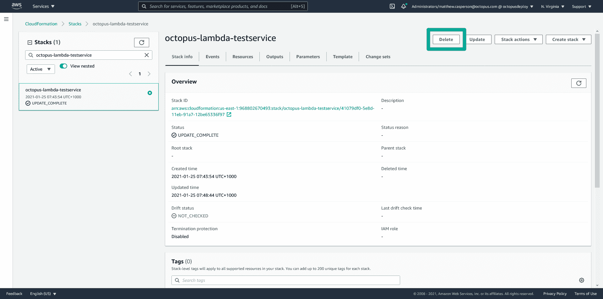
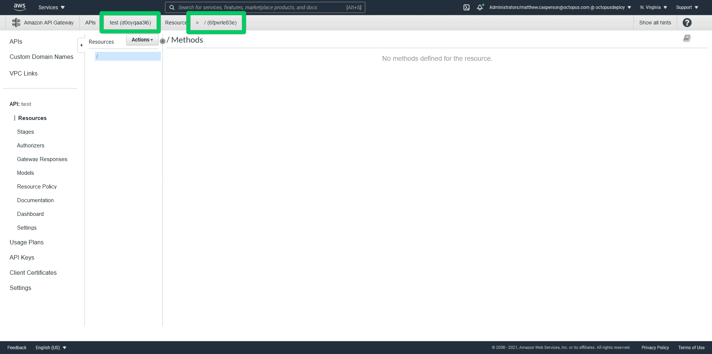
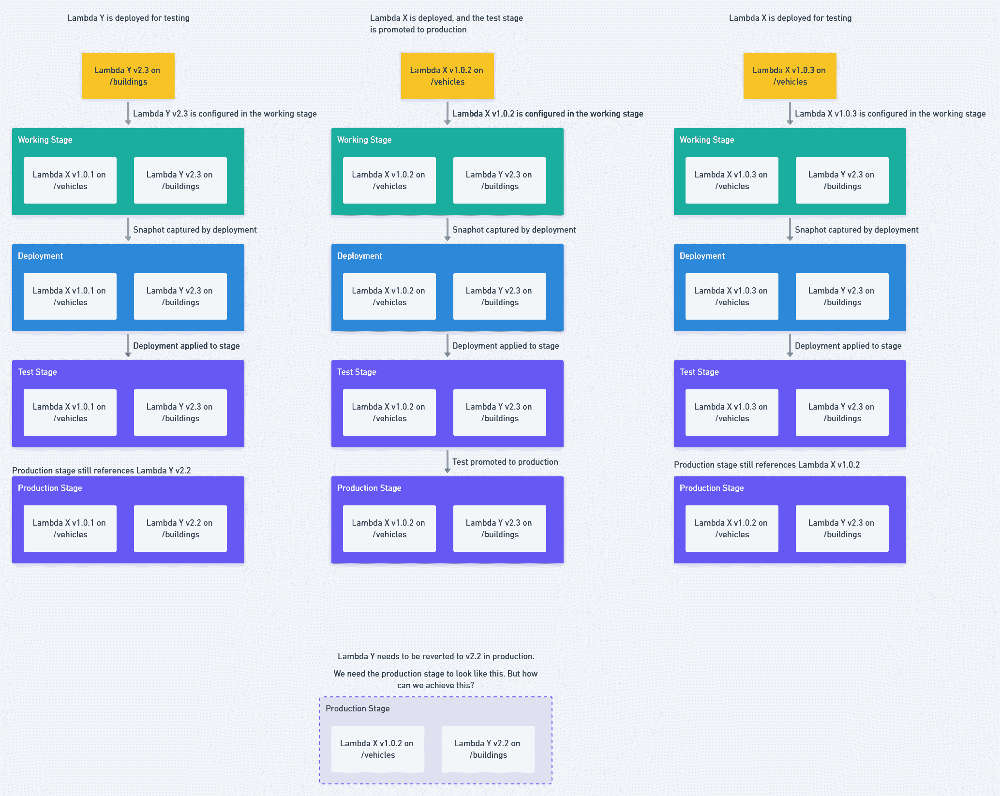
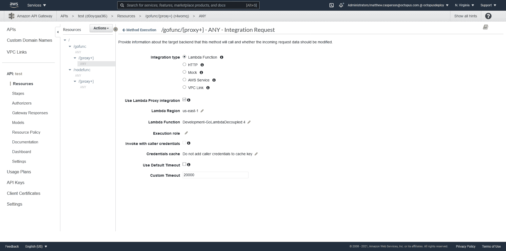
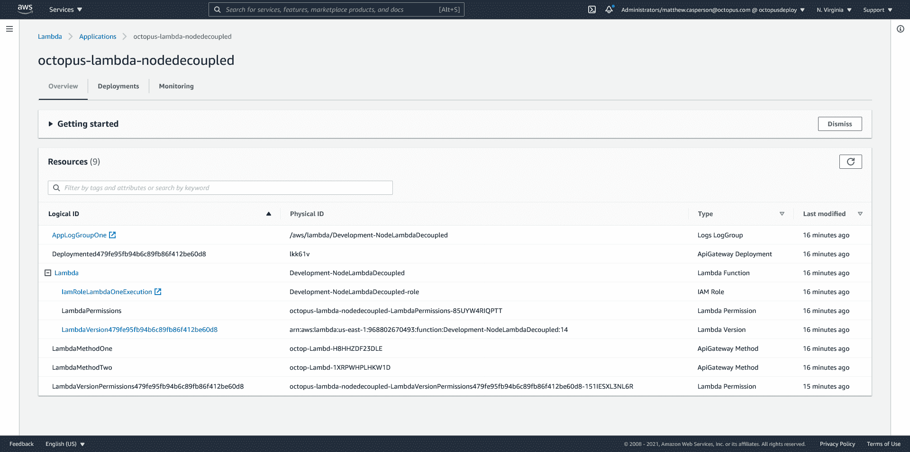
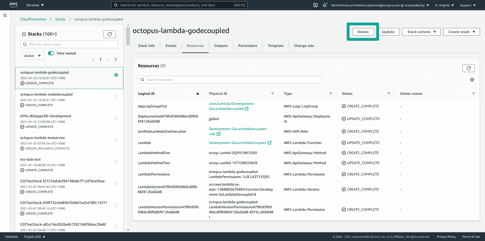

# 跨环境部署 AWS Lambdas-Octopus Deploy

> 原文：<https://octopus.com/blog/deploying-lambdas>

[](#)

无服务器是从管理物理机或虚拟机稳步转变的最新版本。术语“无服务器”有点误导，因为仍然有服务器在运行代码。但是无服务器的承诺是你不必再考虑服务器。像 AWS Lambda 这样的无服务器平台为您处理创建、销毁、更新和公开这些服务器，让您专注于运行您的代码。

无服务器模式对于某些类型的工作负载非常有吸引力。不经常运行的代码，比如由文件上传或添加数据库行触发的函数，作为 Lambda 托管非常方便。您甚至会发现，Lambdas 可以以经济高效且可扩展的方式处理更多传统工作负载，如网站托管。

如今，部署无服务器应用程序是微不足道的。CLI 工具和 IDE 插件使您只需一个命令或点击，就可以从代码进入生产。不过，最终这种部署将需要一个更健壮的过程，允许不写代码的团队一起批量修改和验证。满足这些需求的传统解决方案是拥有多个环境，并在进入生产环境之前通过内部测试环境进行部署。

在这篇博文中，我们将深入探讨如何在 CloudFormation 中表达多环境无服务器部署，并以可靠的方式进行。

## 示例应用程序

在这个例子中，我们将部署两个非常简单的 Lambda 应用程序，它们只是在响应体中返回它们接收到的输入对象。

第一个是用 Go 写的，可以在[https://github.com/OctopusSamples/GoLambdaExample](https://github.com/OctopusSamples/GoLambdaExample)找到。

第二个是用 Node.js 写的，可以在[https://github.com/OctopusSamples/NodeLambdaExample](https://github.com/OctopusSamples/NodeLambdaExample)找到。

## 独立和分离的部署

在这篇文章中，我们将考虑两种类型的无服务器部署。

自包含风格将所有 Lambda 函数和触发它们的服务(在我们的例子中是 API Gateway)包装成一个单一的 CloudFormation 模板，为每个环境创建独立和隔离的基础设施栈。

独立部署具有以下优势:

*   万物作为一个整体被创造和毁灭。
*   部署作为一个组进展到下一个环境。
*   即使应用程序有多个 Lambdas，也很容易推断已部署应用程序的状态。

虽然自包含部署很容易创建，但它也有缺点，即您不能独立地部署单独的 Lambdas。无服务器平台非常适合微服务，为了充分利用微服务，您必须能够独立开发和部署每个微服务。

分离式风格提供了微服务部署所需的灵活性。在解耦部署中，每个 Lambda 都是独立部署的，同时仍然由单个共享 API 网关公开。

分离部署具有以下优势:

*   每个 Lambda 管理自己的部署生命周期。
*   一个共享的 API 网关允许 Lambdas 通过相对 URL 进行交互。
*   共享主机名使得管理 HTTPS 证书更加容易。

## 创建自包含部署

自包含部署涉及使用以下资源创建单个 CloudFormation 模板:

### `AWS::ApiGateway::RestApi`资源

`AWS::ApiGateway::RestApi`资源创建一个 REST API。

API Gateway 提供了多种 API，其中[REST API](https://docs.aws.amazon.com/apigateway/latest/developerguide/apigateway-rest-api.html)是第一种，也是最可配置的。[HTTP API](https://docs.aws.amazon.com/apigateway/latest/developerguide/http-api.html)是另一个选项，但是我们在这里不会使用 HTTP API。

下面的代码片段创建了 REST API 资源:

```
 "RestApi": {
      "Type": "AWS::ApiGateway::RestApi",
      "Properties": {
        "Description": "My API Gateway",
        "Name": "Self-contained deployment",
        "EndpointConfiguration": {
          "Types": [
            "REGIONAL"
          ]
        }
      }
    } 
```

## `AWS::Logs::LogGroup`资源

为了帮助调试和监控我们的 Lambda 函数，我们创建了一个 CloudWatch 日志组。

日志组的名称基于 Lambda 的名称。[这个名称是不可配置的](https://stackoverflow.com/a/39233203/157605)，因此我们从环境名称和服务名称构建日志组名称，这两个名称组合起来创建 Lambda 的名称:

```
 "AppLogGroupOne": {
      "Type": "AWS::Logs::LogGroup",
      "Properties": {
        "LogGroupName": { "Fn::Sub": "/aws/lambda/${EnvironmentName}-NodeLambda" }
      }
    } 
```

## `AWS::IAM::Role`资源

为了让我们的 Lambda 拥有与日志组交互的权限，我们需要一个 IAM 角色来授予访问权限:

```
 "IamRoleLambdaOneExecution": {
      "Type": "AWS::IAM::Role",
      "Properties": {
        "AssumeRolePolicyDocument": {
          "Version": "2012-10-17",
          "Statement": [
            {
              "Effect": "Allow",
              "Principal": {
                "Service": [
                  "lambda.amazonaws.com"
                ]
              },
              "Action": [
                "sts:AssumeRole"
              ]
            }
          ]
        },
        "Policies": [
          {
            "PolicyName": { "Fn::Sub": "${EnvironmentName}-NodeLambda-policy" },
            "PolicyDocument": {
              "Version": "2012-10-17",
              "Statement": [
                {
                  "Effect": "Allow",
                  "Action": [
                    "logs:CreateLogStream",
                    "logs:CreateLogGroup",
                    "logs:PutLogEvents"
                  ],
                  "Resource": [
                    {
                      "Fn::Sub": "arn:${AWS::Partition}:logs:${AWS::Region}:${AWS::AccountId}:log-group:/aws/lambda/${EnvironmentName}-NodeLambda*:*"
                    }
                  ]
                }
              ]
            }
          }
        ],
        "Path": "/",
        "RoleName": { "Fn::Sub": "${EnvironmentName}-NodeLambda-role" },
      }
    } 
```

## `AWS::Lambda::Function`资源

这是我们创建 Lambda 本身的地方。

Lambda 示例应用程序已经上传到 S3。如果你正在复制这个模板，那么`S3Bucket`和`S3Key`必须被改变以反映你上传 Lambda 代码的位置。

这个 Lambda 将使用上面创建的 IAM 角色执行:

```
 "LambdaOne": {
      "Type": "AWS::Lambda::Function",
      "Properties": {
        "Code": {
          "S3Bucket": "deploy-lambda-blog",
          "S3Key": "nodelambdaexample.zip"
        },
        "Environment": {
          "Variables": {}
        },
        "FunctionName": { "Fn::Sub": "${EnvironmentName}-NodeLambda" },
        "Handler": "index.handler",
        "MemorySize": 128,
        "PackageType": "Zip",
        "Role": {
          "Fn::GetAtt": [
            "IamRoleLambdaOneExecution",
            "Arn"
          ]
        },
        "Runtime": "nodejs12.x",
        "Timeout": 20
      }
    } 
```

## `AWS::Lambda::Permission`资源

为了让 REST API 执行 Lambda，需要授予它访问权限。

有两种方法授予 API 网关对 Lambda 的访问权限: [IAM 角色或基于资源的策略](https://docs.aws.amazon.com/IAM/latest/UserGuide/id_roles_compare-resource-policies.html)。我们在这里选择使用基于资源的策略，因为如果您手动集成两个系统，这就是 API 网关控制台授予自己对 Lambda 的访问权限的方式:

```
 "LambdaOnePermissions": {
      "Type": "AWS::Lambda::Permission",
      "Properties": {
        "FunctionName": {
          "Fn::GetAtt": [
            "LambdaOne",
            "Arn"
          ]
        },
        "Action": "lambda:InvokeFunction",
        "Principal": "apigateway.amazonaws.com",
        "SourceArn": {
          "Fn::Join": [
            "",
            [
              "arn:",
              {
                "Ref": "AWS::Partition"
              },
              ":execute-api:",
              {
                "Ref": "AWS::Region"
              },
              ":",
              {
                "Ref": "AWS::AccountId"
              },
              ":",
              {"Ref": "RestApi"},
              "/*/*"
            ]
          ]
        }
      }
    } 
```

## `AWS::ApiGateway::Resource`资源

API 网关公开的路径中的元素称为资源。例如，`/vehicles/cars/car1`的 URL 路径由三个资源组成:`vehicles`、`cars`和`car1`。

资源可以用`{proxy+}`语法匹配整个剩余路径。

下面的模板创建了两个资源，它们组合起来匹配路径`/nodefunc/{proxy+}`:

```
 "ResourceOne": {
      "Type": "AWS::ApiGateway::Resource",
      "Properties": {
        "RestApiId": {"Ref": "RestApi"},
        "ParentId": { "Fn::GetAtt": ["RestApi", "RootResourceId"] },
        "PathPart": "nodefunc"
      }
    },
    "ResourceTwo": {
      "Type": "AWS::ApiGateway::Resource",
      "Properties": {
        "RestApiId": {"Ref": "RestApi"},
        "ParentId": {
          "Ref": "ResourceOne"
        },
        "PathPart": "{proxy+}"
      }
    } 
```

## `AWS::ApiGateway::Method`资源

为了响应资源上的 HTTP 请求，我们需要公开一个方法。

当调用 Lambda 时，API Gateway 可以选择使用[代理集成](https://docs.aws.amazon.com/apigateway/latest/developerguide/api-gateway-set-up-simple-proxy.html)。

在代理集成选项出现之前，从 API Gateway 调用 Lambda 需要大量的样板文件配置来连接 HTTP 请求和 Lambda 执行。HTTP 请求在请求的 URL、查询字符串、头和 HTTP 主体中公开了一系列信息。然后，HTTP 响应可以包括状态代码、标头和正文。另一方面，我们有一个 Lambda，它接受单个对象作为输入，返回单个对象作为输出。这意味着在调用 Lambda 时，API Gateway 必须配置为将 HTTP 调用中的各种输入编组到单个对象中，并将 Lambda 的响应解组到 HTTP 响应中。在实践中，对每个方法都进行了相同的配置，导致了大量的重复工作。

创建代理集成是为了给这个常见问题提供一个勾选框解决方案。启用代理集成后，API Gateway 将传入的 HTTP 请求整理成一个由 Lambda 使用的[标准对象，并期望返回一个具有特定形状的](https://docs.amazonaws.cn/en_us/apigateway/latest/developerguide/set-up-lambda-proxy-integrations.html#api-gateway-simple-proxy-for-lambda-input-format)[对象](https://docs.amazonaws.cn/en_us/apigateway/latest/developerguide/set-up-lambda-proxy-integrations.html#api-gateway-simple-proxy-for-lambda-output-format)，由此生成 HTTP 响应。

更“传统”的方法是将一个 API 网关阶段与一个 Lambda 别名相匹配，阶段和别名都表示环境中的进展。然而，Lambda 别名有很大的局限性，我认为这使得它们根本不适合解决环境发展的常见用例。你可以在博客文章[中读到更多关于为什么你不应该使用 Lambda 别名来定义环境](https://octopus.com/blog/multi-environment-lambda-deployments)的内容。所以我们避免使用别名，并为每个环境部署一个新的 Lambda。

下面是代理集成的两种方法:

```
 "LambdaOneMethodOne": {
      "Type": "AWS::ApiGateway::Method",
      "Properties": {       
        "AuthorizationType": "NONE", 
        "HttpMethod": "ANY",
        "Integration": {          
          "IntegrationHttpMethod": "POST",          
          "TimeoutInMillis": 20000,
          "Type": "AWS_PROXY",
          "Uri": {
            "Fn::Join": [
              "",
              [
                "arn:",
                {
                  "Ref": "AWS::Partition"
                },
                ":apigateway:",
                {
                  "Ref": "AWS::Region"
                },
                ":lambda:path/2015-03-31/functions/",
                "arn:aws:lambda:",
                {
                  "Ref": "AWS::Region"
                },
                ":",
                {
                  "Ref": "AWS::AccountId"
                },
                ":function:",
                { "Fn::Sub": "${EnvironmentName}-NodeLambda" },
                "/invocations"
              ]
            ]
          }
        },        
        "ResourceId": {
          "Ref": "ResourceOne"
        },
        "RestApiId": {"Ref": "RestApi"}
      }
    },
    "LambdaOneMethodTwo": {
      "Type": "AWS::ApiGateway::Method",
      "Properties": {        
        "AuthorizationType": "NONE",
        "HttpMethod": "ANY",
        "Integration": {          
          "IntegrationHttpMethod": "POST",          
          "TimeoutInMillis": 20000,
          "Type": "AWS_PROXY",
          "Uri": {
            "Fn::Join": [
              "",
              [
                "arn:",
                {
                  "Ref": "AWS::Partition"
                },
                ":apigateway:",
                {
                  "Ref": "AWS::Region"
                },
                ":lambda:path/2015-03-31/functions/",
                "arn:aws:lambda:",
                {
                  "Ref": "AWS::Region"
                },
                ":",
                {
                  "Ref": "AWS::AccountId"
                },
                ":function:",
                { "Fn::Sub": "${EnvironmentName}-NodeLambda" },
                "/invocations"
              ]
            ]
          }
        },        
        "ResourceId": {
          "Ref": "ResourceTwo"
        },
        "RestApiId": {"Ref": "RestApi"}
      }
    } 
```

## `AWS::ApiGateway::Deployment`资源

上面描述的资源和方法已经被配置在一种工作阶段中。此配置不会暴露给流量，直到在部署中被捕获并升级到某个阶段。

请注意，我们在资源名称上附加了一个随机字符串。部署是不可变的，因此每次这个 CloudFormation 模板被发布到一个堆栈时，我们都会创建一个新的部署资源:

```
 "Deployment93b7b8be299846a5b609121f6fca4952": {
      "Type": "AWS::ApiGateway::Deployment",
      "Properties": {
        "RestApiId": {"Ref": "RestApi"}
      },
      "DependsOn": [
        "LambdaOneMethodOne",
        "LambdaOneMethodTwo"
      ]
    } 
```

## `AWS::ApiGateway::Stage`资源

这个过程的最后一步是创建一个阶段，并通过引用部署资源“提升”工作阶段:

```
 "Stage": {
      "Type": "AWS::ApiGateway::Stage",
      "Properties": {
        "CanarySetting": {
          "DeploymentId": {"Ref": "Deployment93b7b8be299846a5b609121f6fca4952"},
          "PercentTraffic": 0
        },
        "DeploymentId": {"Ref": "Deployment93b7b8be299846a5b609121f6fca4952"},
        "RestApiId": {"Ref": "RestApi"},
        "StageName": {"Fn::Sub": "${EnvironmentName}"}
      }
    } 
```

## 完整的模板

部署第二个 Go Lambda 与我们在上面部署的 Node Lambda 非常相似，所以我们不会再讨论所有的资源。

下面的模板是自包含的 CloudFormation 模板的完整副本，其中一个参数定义了构建阶段 URL 的环境名称和输出变量。

环境名称的默认值已使用包含当前环境名称的 Octopus 系统变量进行了配置。这意味着该模板很容易作为 Octopus 中的**部署 AWS CloudFormation 模板**步骤的一部分进行部署:

```
{
  "Parameters" : {
    "EnvironmentName" : {
      "Type" : "String",
      "Default" : "#{Octopus.Environment.Name}"
    }
  },
  "Resources": {
    "RestApi": {
      "Type": "AWS::ApiGateway::RestApi",
      "Properties": {
        "Description": "My API Gateway",
        "Name": "Self-contained deployment",
        "EndpointConfiguration": {
          "Types": [
            "REGIONAL"
          ]
        }
      }
    },
    "AppLogGroupOne": {
      "Type": "AWS::Logs::LogGroup",
      "Properties": {
        "LogGroupName": { "Fn::Sub": "/aws/lambda/${EnvironmentName}-NodeLambda" }
      }
    },
    "IamRoleLambdaOneExecution": {
      "Type": "AWS::IAM::Role",
      "Properties": {
        "AssumeRolePolicyDocument": {
          "Version": "2012-10-17",
          "Statement": [
            {
              "Effect": "Allow",
              "Principal": {
                "Service": [
                  "lambda.amazonaws.com"
                ]
              },
              "Action": [
                "sts:AssumeRole"
              ]
            }
          ]
        },
        "Policies": [
          {
            "PolicyName": { "Fn::Sub": "${EnvironmentName}-NodeLambda-policy" },
            "PolicyDocument": {
              "Version": "2012-10-17",
              "Statement": [
                {
                  "Effect": "Allow",
                  "Action": [
                    "logs:CreateLogStream",
                    "logs:CreateLogGroup",
                    "logs:PutLogEvents"
                  ],
                  "Resource": [
                    {
                      "Fn::Sub": "arn:${AWS::Partition}:logs:${AWS::Region}:${AWS::AccountId}:log-group:/aws/lambda/${EnvironmentName}-NodeLambda*:*"
                    }
                  ]
                }
              ]
            }
          }
        ],
        "Path": "/",
        "RoleName": { "Fn::Sub": "${EnvironmentName}-NodeLambda-role" },
      }
    },
    "LambdaOne": {
      "Type": "AWS::Lambda::Function",
      "Properties": {
        "Code": {
          "S3Bucket": "deploy-lambda-blog",
          "S3Key": "nodelambdaexample.zip"
        },
        "Environment": {
          "Variables": {}
        },
        "FunctionName": { "Fn::Sub": "${EnvironmentName}-NodeLambda" },
        "Handler": "index.handler",
        "MemorySize": 128,
        "PackageType": "Zip",
        "Role": {
          "Fn::GetAtt": [
            "IamRoleLambdaOneExecution",
            "Arn"
          ]
        },
        "Runtime": "nodejs12.x",
        "Timeout": 20
      }
    },
    "LambdaOnePermissions": {
      "Type": "AWS::Lambda::Permission",
      "Properties": {
        "FunctionName": {
          "Fn::GetAtt": [
            "LambdaOne",
            "Arn"
          ]
        },
        "Action": "lambda:InvokeFunction",
        "Principal": "apigateway.amazonaws.com",
        "SourceArn": {
          "Fn::Join": [
            "",
            [
              "arn:",
              {
                "Ref": "AWS::Partition"
              },
              ":execute-api:",
              {
                "Ref": "AWS::Region"
              },
              ":",
              {
                "Ref": "AWS::AccountId"
              },
              ":",
              {"Ref": "RestApi"},
              "/*/*"
            ]
          ]
        }
      }
    },
    "ResourceOne": {
      "Type": "AWS::ApiGateway::Resource",
      "Properties": {
        "RestApiId": {"Ref": "RestApi"},
        "ParentId": { "Fn::GetAtt": ["RestApi", "RootResourceId"] },
        "PathPart": "nodefunc"
      }
    },
    "ResourceTwo": {
      "Type": "AWS::ApiGateway::Resource",
      "Properties": {
        "RestApiId": {"Ref": "RestApi"},
        "ParentId": {
          "Ref": "ResourceOne"
        },
        "PathPart": "{proxy+}"
      }
    },
    "LambdaOneMethodOne": {
      "Type": "AWS::ApiGateway::Method",
      "Properties": {      
        "AuthorizationType": "NONE",  
        "HttpMethod": "ANY",
        "Integration": {          
          "IntegrationHttpMethod": "POST",          
          "TimeoutInMillis": 20000,
          "Type": "AWS_PROXY",
          "Uri": {
            "Fn::Join": [
              "",
              [
                "arn:",
                {
                  "Ref": "AWS::Partition"
                },
                ":apigateway:",
                {
                  "Ref": "AWS::Region"
                },
                ":lambda:path/2015-03-31/functions/",
                "arn:aws:lambda:",
                {
                  "Ref": "AWS::Region"
                },
                ":",
                {
                  "Ref": "AWS::AccountId"
                },
                ":function:",
                { "Fn::Sub": "${EnvironmentName}-NodeLambda" },
                "/invocations"
              ]
            ]
          }
        },        
        "ResourceId": {
          "Ref": "ResourceOne"
        },
        "RestApiId": {"Ref": "RestApi"}
      }
    },
    "LambdaOneMethodTwo": {
      "Type": "AWS::ApiGateway::Method",
      "Properties": {      
        "AuthorizationType": "NONE",  
        "HttpMethod": "ANY",
        "Integration": {          
          "IntegrationHttpMethod": "POST",          
          "TimeoutInMillis": 20000,
          "Type": "AWS_PROXY",
          "Uri": {
            "Fn::Join": [
              "",
              [
                "arn:",
                {
                  "Ref": "AWS::Partition"
                },
                ":apigateway:",
                {
                  "Ref": "AWS::Region"
                },
                ":lambda:path/2015-03-31/functions/",
                "arn:aws:lambda:",
                {
                  "Ref": "AWS::Region"
                },
                ":",
                {
                  "Ref": "AWS::AccountId"
                },
                ":function:",
                { "Fn::Sub": "${EnvironmentName}-NodeLambda" },
                "/invocations"
              ]
            ]
          }
        },        
        "ResourceId": {
          "Ref": "ResourceTwo"
        },
        "RestApiId": {"Ref": "RestApi"}
      }
    },
    "AppLogGroupTwo": {
      "Type": "AWS::Logs::LogGroup",
      "Properties": {
        "LogGroupName": { "Fn::Sub": "/aws/lambda/${EnvironmentName}-GoLambda" }
      }
    },
    "IamRoleLambdaTwoExecution": {
      "Type": "AWS::IAM::Role",
      "Properties": {
        "AssumeRolePolicyDocument": {
          "Version": "2012-10-17",
          "Statement": [
            {
              "Effect": "Allow",
              "Principal": {
                "Service": [
                  "lambda.amazonaws.com"
                ]
              },
              "Action": [
                "sts:AssumeRole"
              ]
            }
          ]
        },
        "Policies": [
          {
            "PolicyName": { "Fn::Sub": "${EnvironmentName}-GoLambda-policy" },
            "PolicyDocument": {
              "Version": "2012-10-17",
              "Statement": [
                {
                  "Effect": "Allow",
                  "Action": [
                    "logs:CreateLogStream",
                    "logs:CreateLogGroup",
                    "logs:PutLogEvents"
                  ],
                  "Resource": [
                    {
                      "Fn::Sub": "arn:${AWS::Partition}:logs:${AWS::Region}:${AWS::AccountId}:log-group:/aws/lambda/${EnvironmentName}-GoLambda*:*"
                    }
                  ]
                }
              ]
            }
          }
        ],
        "Path": "/",
        "RoleName": { "Fn::Sub": "${EnvironmentName}-GoLambda-role" },
      }
    },
    "LambdaTwo": {
      "Type": "AWS::Lambda::Function",
      "Properties": {
        "Code": {
          "S3Bucket": "deploy-lambda-blog",
          "S3Key": "golambdaexample.zip"
        },
        "Environment": {
          "Variables": {}
        },
        "FunctionName": { "Fn::Sub": "${EnvironmentName}-GoLambda" },
        "Handler": "GoLambdaExample",
        "MemorySize": 128,
        "PackageType": "Zip",
        "Role": {
          "Fn::GetAtt": [
            "IamRoleLambdaTwoExecution",
            "Arn"
          ]
        },
        "Runtime": "go1.x",
        "Timeout": 20
      }
    },
    "LambdaTwoPermissions": {
      "Type": "AWS::Lambda::Permission",
      "Properties": {
        "FunctionName": {
          "Fn::GetAtt": [
            "LambdaTwo",
            "Arn"
          ]
        },
        "Action": "lambda:InvokeFunction",
        "Principal": "apigateway.amazonaws.com",
        "SourceArn": {
          "Fn::Join": [
            "",
            [
              "arn:",
              {
                "Ref": "AWS::Partition"
              },
              ":execute-api:",
              {
                "Ref": "AWS::Region"
              },
              ":",
              {
                "Ref": "AWS::AccountId"
              },
              ":",
              {"Ref": "RestApi"},
              "/*/*"
            ]
          ]
        }
      }
    },
    "ResourceThree": {
      "Type": "AWS::ApiGateway::Resource",
      "Properties": {
        "RestApiId": {"Ref": "RestApi"},
        "ParentId": { "Fn::GetAtt": ["RestApi", "RootResourceId"] },
        "PathPart": "gofunc"
      }
    },
    "ResourceFour": {
      "Type": "AWS::ApiGateway::Resource",
      "Properties": {
        "RestApiId": {"Ref": "RestApi"},
        "ParentId": {
          "Ref": "ResourceThree"
        },
        "PathPart": "{proxy+}"
      }
    },
    "LambdaTwoMethodOne": {
      "Type": "AWS::ApiGateway::Method",
      "Properties": {     
        "AuthorizationType": "NONE",   
        "HttpMethod": "ANY",
        "Integration": {          
          "IntegrationHttpMethod": "POST",          
          "TimeoutInMillis": 20000,
          "Type": "AWS_PROXY",
          "Uri": {
            "Fn::Join": [
              "",
              [
                "arn:",
                {
                  "Ref": "AWS::Partition"
                },
                ":apigateway:",
                {
                  "Ref": "AWS::Region"
                },
                ":lambda:path/2015-03-31/functions/",
                "arn:aws:lambda:",
                {
                  "Ref": "AWS::Region"
                },
                ":",
                {
                  "Ref": "AWS::AccountId"
                },
                ":function:",
                { "Fn::Sub": "${EnvironmentName}-GoLambda" },
                "/invocations"
              ]
            ]
          }
        },        
        "ResourceId": {
          "Ref": "ResourceThree"
        },
        "RestApiId": {"Ref": "RestApi"}
      }
    },
    "LambdaTwoMethodTwo": {
      "Type": "AWS::ApiGateway::Method",
      "Properties": {      
        "AuthorizationType": "NONE",  
        "HttpMethod": "ANY",
        "Integration": {          
          "IntegrationHttpMethod": "POST",          
          "TimeoutInMillis": 20000,
          "Type": "AWS_PROXY",
          "Uri": {
            "Fn::Join": [
              "",
              [
                "arn:",
                {
                  "Ref": "AWS::Partition"
                },
                ":apigateway:",
                {
                  "Ref": "AWS::Region"
                },
                ":lambda:path/2015-03-31/functions/",
                "arn:aws:lambda:",
                {
                  "Ref": "AWS::Region"
                },
                ":",
                {
                  "Ref": "AWS::AccountId"
                },
                ":function:",
                { "Fn::Sub": "${EnvironmentName}-NodeLambda" },
                "/invocations"
              ]
            ]
          }
        },        
        "ResourceId": {
          "Ref": "ResourceFour"
        },
        "RestApiId": {"Ref": "RestApi"}
      }
    },
    "Deployment93b7b8be299846a5b609121f6fca4952": {
      "Type": "AWS::ApiGateway::Deployment",
      "Properties": {
        "RestApiId": {"Ref": "RestApi"}
      },
      "DependsOn": [
        "LambdaOneMethodOne",
        "LambdaOneMethodTwo"
      ]
    },
    "Stage": {
      "Type": "AWS::ApiGateway::Stage",
      "Properties": {
        "CanarySetting": {
          "DeploymentId": {"Ref": "Deployment93b7b8be299846a5b609121f6fca4952"},
          "PercentTraffic": 0
        },
        "DeploymentId": {"Ref": "Deployment93b7b8be299846a5b609121f6fca4952"},
        "RestApiId": {"Ref": "RestApi"},
        "StageName": {"Fn::Sub": "${EnvironmentName}"}
      }
    }
  },
  "Outputs": {
    "StageURL": {
      "Description": "The url of the stage",
      "Value": {
        "Fn::Join": [
          "",
          [
            "https://",
            {"Ref": "RestApi"},
            ".execute-api.",
            {
              "Ref": "AWS::Region"
            },
            ".amazonaws.com/",
            {
              "Ref": "Stage"
            },
            "/"
          ]
        ]
      }
    }
  }
} 
```

## 部署独立的 Lambdas

通过 Octopus 将上面的模板部署到一个名为**开发**的环境中，会创建一个 API 网关，其中包含一个名为**开发**的阶段，资源层次会创建路径`/gofunc/*`和`nodefunc/*`:

[](#)

我们还有两个 Lambda，称为 **Development-GoLambda** 和 **Development-NodeLambda** :

[](#)

已经编写了 Lambdas 来返回 API Gateway 在响应体中作为输入传递的对象。这允许我们检查 API Gateway 通过其代理集成构建的对象的详细信息:

[](#)

如果我们将这个自包含的 Lambda 部署提升到一个新环境，我们将创建第二个 API 网关，它有自己的 stage 和另外两个 Lambda。每个环境都由自己的 CloudFormation 堆栈定义，我们创建的任何资源都不会在环境之间共享。

通过 CloudFormation 模板部署 Lambda 堆栈的一个好处是，它被认为是一个[应用](https://docs.aws.amazon.com/lambda/latest/dg/deploying-lambda-apps.html):

[](#)

应用仪表板提供了组成堆栈的各个资源的集中视图:

[](#)

为了清理环境，我们删除了 CloudFormation 堆栈:

[](#)

在这篇文章的开头，我们提到了自包含部署的以下好处:

*   万物作为一个群体被创造和毁灭。
*   部署作为一个组进展到下一个环境。
*   即使应用程序有多个 Lambdas，也很容易推断已部署应用程序的状态。

我们现在可以看到将部署堆栈定义为单个自包含的 CloudFormation 模板是如何提供这些好处的。

然而，自包含部署的一个显著缺点是所有 Lambdas 的生命周期彼此紧密耦合。在我们的例子中，您不能独立于 Go Lambda 部署节点 Lambda。当你的栈变得越来越复杂，单个团队开始对每个 Lambda 负责时，这就成了一个问题。

随着您的堆栈发展成为真正的微服务架构，您需要分离每个 Lambda 的部署。一种方法是将每个 Lambda 拆分成它自己的自包含部署。但是，扩展多个自包含部署几乎肯定需要一个服务发现层来应对每个 API 网关实例暴露的独特 URL 的激增。

另一种方法是将每个 Lambda 部署到一个共享 API 网关实例中。这样，每个 Lambda 都可以使用相对 URL 来访问兄弟 Lambda。这就是我们所说的分离部署。

## 创建分离的部署

分离部署在以下方面不同于自包含部署:

*   API 网关被认为是共享资源，并且是在 Lambdas 的部署之外创建的。
*   API 网关资源(即 URL 中的路径元素)被视为共享资源。例如，你可能有两辆兰博达响应路径**/汽车**。一个 Lambda 将响应 HTTP POST 方法，第二个响应 HTTP DELETE 方法。在这种情况下，Lambda 都不能声明对资源的独占所有权。
*   这些阶段被视为共享资源。

让我们看看这在实践中是如何工作的。我们从现有的 API 网关 REST API 开始。我们需要 API ID 和根资源的 ID:

[](#)

我们需要构建构成 URL 路径的资源。因为这些资源不再只有一个所有者，所以我们不需要在 CloudFormation 模板中表示它们。下面我们创建资源，通过 CLI 公开节点 Lambda:

```
RESULT=`aws apigateway create-resource --rest-api-id d0oyqaa3l6 --parent-id 6fpwrle83e --path-part nodefunc`
ID=`jq -r  '.id' <<< "${RESULT}"`
aws apigateway create-resource --rest-api-id d0oyqaa3l6 --parent-id $ID --path-part {proxy+} 
```

然后，我们可以部署 Lambda 并创建附加到上面创建的资源的方法。这里的代码类似于自包含部署，但是通过参数提供了 API 网关和资源 id，因为这些资源是在 CloudFormation 模板之外创建的:

```
{
  "Parameters" : {
    "EnvironmentName" : {
      "Type" : "String",
      "Default" : "#{Octopus.Environment.Name}"
    },
    "ResourceOne" : {
      "Type" : "String"
    },
    "ResourceTwo" : {
      "Type" : "String"
    },
    "ApiGatewayId" : {
      "Type" : "String"
    }
  },  
  "Resources": {
    "AppLogGroupOne": {
      "Type": "AWS::Logs::LogGroup",
      "Properties": {
        "LogGroupName": { "Fn::Sub": "/aws/lambda/${EnvironmentName}-NodeLambdaDecoupled" }
      }
    },
    "IamRoleLambdaOneExecution": {
      "Type": "AWS::IAM::Role",
      "Properties": {
        "AssumeRolePolicyDocument": {
          "Version": "2012-10-17",
          "Statement": [
            {
              "Effect": "Allow",
              "Principal": {
                "Service": [
                  "lambda.amazonaws.com"
                ]
              },
              "Action": [
                "sts:AssumeRole"
              ]
            }
          ]
        },
        "Policies": [
          {
            "PolicyName": { "Fn::Sub": "${EnvironmentName}-NodeLambdaDecoupled-policy" },
            "PolicyDocument": {
              "Version": "2012-10-17",
              "Statement": [
                {
                  "Effect": "Allow",
                  "Action": [
                    "logs:CreateLogStream",
                    "logs:CreateLogGroup",
                    "logs:PutLogEvents"
                  ],
                  "Resource": [
                    {
                      "Fn::Sub": "arn:${AWS::Partition}:logs:${AWS::Region}:${AWS::AccountId}:log-group:/aws/lambda/${EnvironmentName}-NodeLambdaDecoupled*:*"
                    }
                  ]
                }
              ]
            }
          }
        ],
        "Path": "/",
        "RoleName": { "Fn::Sub": "${EnvironmentName}-NodeLambdaDecoupled-role" }
      }
    },
    "Lambda": {
      "Type": "AWS::Lambda::Function",
      "Properties": {
        "Description": "Octopus Release #{Octopus.Release.Number}",
        "Code": {
          "S3Bucket": "deploy-lambda-blog",
          "S3Key": "nodelambdaexample.zip"          
        },
        "Environment": {
          "Variables": {}
        },
        "FunctionName": { "Fn::Sub": "${EnvironmentName}-NodeLambdaDecoupled" },
        "Handler": "index.handler",
        "MemorySize": 128,
        "PackageType": "Zip",
        "Role": {
          "Fn::GetAtt": [
            "IamRoleLambdaOneExecution",
            "Arn"
          ]
        },
        "Runtime": "nodejs12.x",
        "Timeout": 20
      }
    },
    "LambdaPermissions": {
      "Type": "AWS::Lambda::Permission",
      "Properties": {
        "FunctionName": {
          "Fn::GetAtt": [
            "Lambda",
            "Arn"
          ]
        },
        "Action": "lambda:InvokeFunction",
        "Principal": "apigateway.amazonaws.com",
        "SourceArn": {
          "Fn::Join": [
            "",
            [
              "arn:",
              {
                "Ref": "AWS::Partition"
              },
              ":execute-api:",
              {
                "Ref": "AWS::Region"
              },
              ":",
              {
                "Ref": "AWS::AccountId"
              },
              ":",
              {
                "Fn::Sub": "${ApiGatewayId}"
              },
              "/*/*"
            ]
          ]
        }
      }
    },
    "LambdaMethodOne": {
      "Type": "AWS::ApiGateway::Method",
      "Properties": {      
        "AuthorizationType": "NONE",  
        "HttpMethod": "ANY",
        "Integration": {          
          "IntegrationHttpMethod": "POST",          
          "TimeoutInMillis": 20000,
          "Type": "AWS_PROXY",
          "Uri": {
            "Fn::Join": [
              "",
              [
                "arn:",
                {
                  "Ref": "AWS::Partition"
                },
                ":apigateway:",
                {
                  "Ref": "AWS::Region"
                },
                ":lambda:path/2015-03-31/functions/",
                "arn:aws:lambda:",
                {
                  "Ref": "AWS::Region"
                },
                ":",
                {
                  "Ref": "AWS::AccountId"
                },
                ":function:",
                { "Fn::Sub": "${EnvironmentName}-NodeLambdaDecoupled" },
                "/invocations"
              ]
            ]
          }
        },        
        "ResourceId": {
          "Fn::Sub": "${ResourceOne}"
        },
        "RestApiId": {
          "Fn::Sub": "${ApiGatewayId}"
        }
      }
    },
    "LambdaMethodTwo": {
      "Type": "AWS::ApiGateway::Method",
      "Properties": {      
        "AuthorizationType": "NONE",  
        "HttpMethod": "ANY",
        "Integration": {          
          "IntegrationHttpMethod": "POST",          
          "TimeoutInMillis": 20000,
          "Type": "AWS_PROXY",
          "Uri": {
            "Fn::Join": [
              "",
              [
                "arn:",
                {
                  "Ref": "AWS::Partition"
                },
                ":apigateway:",
                {
                  "Ref": "AWS::Region"
                },
                ":lambda:path/2015-03-31/functions/",
                "arn:aws:lambda:",
                {
                  "Ref": "AWS::Region"
                },
                ":",
                {
                  "Ref": "AWS::AccountId"
                },
                ":function:",
                { "Fn::Sub": "${EnvironmentName}-NodeLambdaDecoupled" },
                "/invocations"
              ]
            ]
          }
        },        
        "ResourceId": {
          "Fn::Sub": "${ResourceTwo}"
        },
        "RestApiId": {
          "Fn::Sub": "${ApiGatewayId}"
        }
      },
      "DependsOn": [
        "LambdaVersion479fe95fb94b6c89fb86f412be60d8"
      ]
    },
    "Deploymented479fe95fb94b6c89fb86f412be60d8": {
      "Type": "AWS::ApiGateway::Deployment",
      "Properties": {
        "RestApiId": {
          "Fn::Sub": "${ApiGatewayId}"
        },
        "Description": "Octopus Release #{Octopus.Release.Number}"
      },
      "DependsOn": [
        "LambdaMethodOne",
        "LambdaMethodTwo"
      ]
    },
  },
  "Outputs": {
    "DeploymentId": {
      "Description": "The Deployment ID",
      "Value": {
        "Ref": "Deploymented479fe95fb94b6c89fb86f412be60d8"
      }
    }
  }
} 
```

和以前一样，我们需要创建一个阶段来公开 API 网关配置。然而，这次 stage 是在一个单独的 CloudFormation 模板中创建的。

贡献给共享 API 网关的每个 Lambda 部署将部署一个更新的模板，用一个新的`DeploymentId`属性定义阶段。这意味着 CloudFormation 堆栈名称必须能够从 API 网关 ID 和阶段名称中重新创建。例如，您可以创建一个名为**APIG-d0oyqaa3l 6-开发**的堆栈，为 ID 为 **d0oyqaa3l6** 的 API 网关定义名为**开发**的阶段。

以下是该阶段的云形成模板:

```
{
  "Parameters" : {
    "EnvironmentName" : {
      "Type" : "String",
      "Default" : "#{Octopus.Environment.Name}"
    },
    "DeploymentId" : {
      "Type" : "String",
      "Default" : "#{Octopus.Action[Deploy Lambda].Output.AwsOutputs[DeploymentId]}"
    },
    "ApiGatewayId" : {
      "Type" : "String"
    }
  },
  "Resources": {
    "Stage": {
      "Type": "AWS::ApiGateway::Stage",
      "Properties": {
        "DeploymentId": {"Fn::Sub": "${DeploymentId}"},
        "RestApiId": {"Fn::Sub": "${ApiGatewayId}"},
        "StageName": {"Fn::Sub": "${EnvironmentName}"}
      }
    }
  }
} 
```

## 部署分离的 Lambdas

在我们研究解耦部署如何工作之前，让我们考虑一个非常重要的问题，即我们期望每个环境有一个 API 网关和阶段。这是类似于 serverless.io 这样的工具所采取的[设计决策。](https://github.com/serverless/serverless/issues/2445#issuecomment-257479953)

### 为什么要将我们自己限制在每个环境的一个阶段呢？

工作阶段(我称之为 API Gateway 控制台中的 **Resources** 视图)累积变更，工作阶段的当前状态基本上是由不可变的`AWS::ApiGateway::Deployment`资源作为快照捕获的。

当您拥有代表多个环境的多个阶段时，将部署从测试环境推进到生产环境意味着使用分配给测试阶段的`AWS::ApiGateway::Deployment`资源的 ID 来更新生产阶段。

重要的是，API Gateway 中没有将工作阶段重置为先前部署的状态、进行隔离更改，然后将隔离的更改提升回阶段的概念。这意味着当您有代表多个环境的多个阶段时，您必须假设对工作阶段的每个更改都可以在部署中被捕获，并提升到生产中。

实际上，这也意味着将部署提升到新阶段意味着了解前一阶段或环境，检查前一阶段以找到分配给它的部署，然后用前一阶段的部署 ID 更新下一阶段。

这使得常见的部署场景变得复杂。例如，如何在生产中回滚单个 Lambda？

我们想要做的是用生产阶段的状态重置工作阶段，在工作阶段部署旧的 Lambda 版本，用新的`AWS::ApiGateway::Deployment`资源拍摄工作阶段的快照，并将该`AWS::ApiGateway::Deployment`资源提升到生产阶段。对于 GIT 这样的源代码控制工具，这是开发人员想当然的工作流。

然而，因为我们不能用生产阶段的状态来重置工作阶段，所以我们首先必须将旧的 Lambda 版本部署到工作阶段的任何当前状态，用新的`AWS::ApiGateway::Deployment`资源来快照工作阶段，然后通过开发、测试和生产阶段来促进这种变化。实际上，这意味着我们只是将工作阶段的每个开发 Lambda 版本提升到生产阶段，因为我们试图将单个 Lambda 角色还原。

人们很容易想到，我们可以简单地将旧的`AWS::ApiGateway::Deployment`资源分配给生产阶段。但是，如果在您意识到您需要回滚 Lambda 之前，其他几个团队已经将他们的 Lambda 版本投入生产了，那该怎么办呢？现在，没有一个`AWS::ApiGateway::Deployment`资源具有 Lambda 版本和 API 网关设置的正确组合，我们可以回滚到:

[](#)

特性分支部署也使`AWS::ApiGateway::Deployment`资源进入生产的过程变得复杂。创建临时 URL 来测试特性分支 Lambda 部署和主线 Lambda 部署是很好的。但是因为任何处于工作状态的东西都可能被快照到一个`AWS::ApiGateway::Deployment`资源中并提升到生产环境中，所以您很可能会发现您的临时特性分支部署是公开的。

无法将 API Gateway 工作阶段恢复到先前已知的良好状态、进行孤立的更改，以及将该更改升级到某个阶段，这使得回滚或热修复等常见部署模式实际上无法用于多个阶段。此外，工作阶段的每一个变更都是生产部署的候选，这意味着特性分支变得很危险。

通过确保每个环境由具有单个阶段的单个 API 网关表示，我们可以假设工作阶段包含相关公共阶段的最后已知状态。这意味着我们可以通过部署单个 Lambda 的旧版本来回滚单个 Lambda，通过跳过代表早期环境的 API 网关和阶段来执行热修复部署，并通过不将功能分支 Lambda 部署到生产工作阶段来确保功能分支部署不会出现在生产中。

### 演示分离部署

通过解耦部署，每个单独的 Lambda 部署栈现在都可以将自己插入到一个共享的 API 网关中。最终结果与自包含部署没有区别，这正是我们想要的，因为最终用户不应该看到自包含或解耦部署之间的任何差异。这也意味着分离的部署共享单个域，具有证书等通用设置:

[](#)

与自包含部署一样，AWS 将通过 CloudFormation 模板创建的资源识别为应用程序。对于分离部署，我们只能看到单独的 Lambda 资源，而看不到 API 网关:

[](#)

我们还可以通过删除相关的 CloudFormation 堆栈来清理任何资源:

[](#)

在本文的开头，我们提到了解耦部署的以下优势:

*   每个 Lambda 管理自己的部署生命周期。
*   一个共享的 API 网关允许 Lambdas 通过相对 URL 进行交互。
*   共享主机名使得管理 HTTPS 证书更加容易。

我们现在可以看到解耦部署如何有助于共享 API 网关，给予每个 Lambda 自己的部署生命周期，同时仍然保留共享域名。我们现在有了一个部署策略，允许独立部署微服务，而不改变呈现给最终用户的内容。

## 结论

无服务器平台的承诺是，您不再需要担心什么服务器或操作系统正在运行您的应用程序。这使得在高度可伸缩和安全的环境中启动和运行您的第一批 Lambdas 变得非常容易。

随着您的 Lambdas 数量和复杂性的增长，常见的部署问题，如环境、热修复、功能分支和独立的微服务生命周期变得至关重要。

不幸的是，AWS 提出的解决方案，特别是 Lambda 别名和 API 网关阶段，并不能很好地解决这些模式。帖子[为什么不应该使用 Lambda 别名来定义环境](https://octopus.com/blog/multi-environment-lambda-deployments)描述了别名如何无法将安全性、性能和日志记录等问题分开，而这篇帖子解释了为什么 API 网关阶段不支持热修复和特性分支。

然而，由于环境与 API 网关和 stage 之间的一对一关系，以及环境与 Lambdas 之间的一对多关系，我们可以设计一个无服务器的部署过程，它可以跨许多环境扩展，同时支持常见的部署模式。

在这篇文章中，我们展示了自包含的、解耦的无服务器部署，并强调了使用 CloudFormation 制作这些部署的许多好处。示例模板为任何希望设计可大规模管理的无服务器部署的人提供了基础。

愉快的部署！