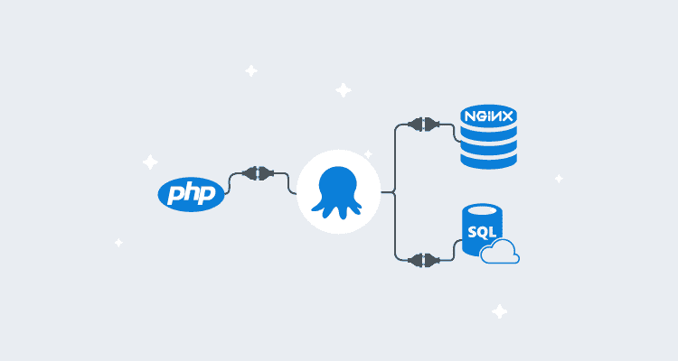
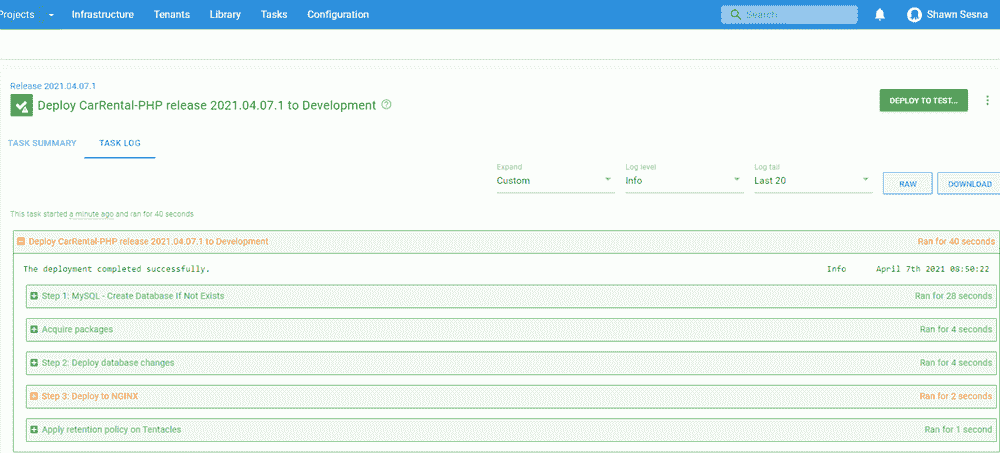

# 用 Octopus 部署 PHP 应用程序

> 原文：<https://octopus.com/blog/deploying-php>

[](#)

PHP 是基于网络的应用程序中最流行的语言。这种流行导致了广泛的产品，这些产品将部署您的 PHP 代码，但不一定是您的整个堆栈。应用程序通常包括 web 前端以外的组件，如数据库、API，甚至容器化的微服务。

在这篇文章中，我演示了如何将 PHP 应用程序部署到使用 MySQL 作为数据库后端的 NGINX web 服务器上。

## 示例应用程序

我为这个帖子选择的示例应用程序是[租车项目](https://projectnotes.org/php/car-rental-project-in-php-and-mysqli-with-source-code/)。

只需对单个文件稍加修改，这个应用程序就可以开箱即用，非常适合这个演示。源代码包含一个 MySQL 数据库脚本，该脚本将创建表模式并用数据播种数据库。我将在这篇文章的后面讨论需要做的修改。下面是[修改项目](https://bitbucket.org/octopussamples/carrental/src/main/)的链接。

## 构建您的 PHP 应用程序

PHP 是一种脚本语言，这意味着它不需要编译就可以部署。然而，在 PHP 应用程序中使用构建服务器有一些好处:

*   如果您的 PHP 应用程序使用 [Composer](https://getcomposer.org/) 作为依赖项管理器，您可以将它包含在应用程序的构建中，以便在构建运行时收集最新版本的依赖项。
*   使用构建服务器 Octopus Deploy 插件来简化集成，例如:
    *   打包应用程序
    *   将包推送到 Octopus Deploy 服务器或第三方包解决方案(Nexus、Artifactory 等)。)
    *   将构建信息推送到 Octopus 部署
    *   创建版本
    *   部署和/或推广版本

对于这篇文章，我选择 Jenkins 作为我的构建服务器，有三个步骤:

*   打包 web 前端
*   打包数据库脚本
*   将包推送到 Octopus 部署

### 打包 web 前端

首先，让我们看一下我为这个项目所做的修改。如前所述，汽车租赁应用程序使用 MySQL 作为其数据库后端。数据库连接信息位于`src/includes/config.php`中。使用 Octostache 和模板中的[替代变量](https://octopus.com/docs/projects/steps/configuration-features/substitute-variables-in-templates#:%7E:text=The%20Substitute%20Variables%20in%20Files,Octopus%20Variables%20into%20any%20file.)功能，我们可以参数化连接信息:

```
<?php 
// DB credentials.
define('DB_HOST','#{MySQL.Server.Name}:#{MySQL.Server.Port}');
define('DB_USER','#{MySQL.Admin.User.Name}');
define('DB_PASS','#{MySQL.Admin.User.Password}');
define('DB_NAME','#{Project.Database.Name}');
// Establish database connection.
try
{
$dbh = new PDO("mysql:host=".DB_HOST.";dbname=".DB_NAME,DB_USER, DB_PASS,array(PDO::MYSQL_ATTR_INIT_COMMAND => "SET NAMES 'utf8'",PDO::MYSQL_ATTR_SSL_CA => '/var/www/html/DigiCertGlobalRootG2.crt.pem',PDO::MYSQL_ATTR_SSL_VERIFY_SERVER_CERT => false));
}
catch (PDOException $e)
{
exit("Error: " . $e->getMessage());
}
?> 
```

对于这个演示，我使用 Azure MySQL PaaS，它需要一个到数据库的 SSL 连接。我需要将以下内容添加到 PDO 期权组件数组中(如上所示):

```
PDO::MYSQL_ATTR_SSL_CA => '/var/www/html/DigiCertGlobalRootG2.crt.pem'
PDO::MYSQL_ATTR_SSL_VERIFY_SERVER_CERT => false 
```

使用 Octopus Deploy Jenkins 插件，打包应用程序进行部署很容易。只需选择**Octopus Deploy:Package application**步骤并填写以下内容:

*   Octopus Deploy CLI:选择在`Global Tool Configuration`中配置的 Octopus Deploy CLI
*   包 ID:包的名称，即`CarRental.PHP.Web`
*   版本号:包的版本号
*   包格式:Zip 或 Nuget
*   包基础文件夹:对于我的回购，它是`${WORKSPACE}/src`
*   包输出文件夹:`${WORKSPACE}`

### 打包数据库脚本

源代码中包含一个脚本，该脚本创建模式并用数据填充数据库。数据库脚本文件是专门为使用 Flyway 数据库迁移产品而命名的:

*   Octopus Deploy CLI:选择`Global Tool Configuration`中配置的 Octopus Deploy CLI
*   包 ID:包的名称，即`CarRental.PHP.Db`
*   版本号:包的版本号
*   包格式:Zip 或 Nuget
*   包基础文件夹:对于我的回购，它是`${WORKSPACE}`
*   包输出文件夹:`${WORKSPACE}`
*   包包含路径:`**/sql/*.*`

### 将包推送到 Octopus 部署

使用**Octopus Deploy:Push packages**插件步骤，您可以在一个步骤中将 web 和数据库包推送到 Octopus Deploy:

*   Octopus Deploy CLI:选择在`Global Tool Configuration`中配置的 Octopus Deploy CLI
*   Octopus Deploy Server:选择要推送的 Octopus Deploy server(在 **管理詹金斯➜配置系统** 中定义)
*   空间:选择要推进到的空间(如果留空，则使用默认值)
*   包路径:`/.zip`

我们的 PHP 应用程序现在已经打包好，可以部署了。

## 部署 PHP 应用程序

包准备好了，我们就可以定义我们的部署过程了。

这篇文章假设您已经熟悉创建 Octopus Deploy 项目，所以我不会涉及这一部分。如果你不熟悉这个话题，看看我们的[入门](https://octopus.com/docs/getting-started)指南。

我们的部署流程将包括以下步骤:

*   如果 MySQL 数据库不存在，则创建它
*   Flyway 数据库迁移(使用执行容器)
*   部署到 NGINX

### 创建 MySQL 数据库

如果数据库还不存在，这一步将在 MySQL 服务器上创建一个数据库。这一步只需要填写几个输入:

*   服务器:MySQL 服务器的名称或 IP 地址
*   用户名:有足够权限创建数据库的用户名
*   密码:用户帐户的密码
*   数据库名称:要创建的数据库的名称
*   端口:MySQL 监听的端口(默认为 3306)
*   使用 SSL:连接到 MySQL 时是否使用 SSL(这对于我来说是必须的，因为我使用的是 Azure MySQL PaaS)

### Flyway 数据库迁移

在这篇文章中，我使用了新创建的 [Flyway 模板](https://library.octopus.com/step-templates/ccebac39-79a8-4ab4-b55f-19ea570d9ebc/actiontemplate-flyway-database-migrations)，它可以与[执行容器](https://octopus.com/docs/projects/steps/execution-containers-for-workers)一起使用。

*   执行位置:在工作线程上运行一次
*   工人池:包含安装了 Docker 的工人的池
*   容器图像:`octopuslabs/flyway-workertools:latest`(您必须配置外部 feed 才能使用 Docker Hub)

该步骤需要以下信息:

*   飞行路线包:`CarRental.PHP.Db`
*   飞航命令:`Migrate`
*   -Url: JDBC 连接 Url，即 jdbc:mysql:// `<ServerName>` : `<Port>` / `<DatabaseName>` }？server time zone = UTC&use SSL = true
*   -用户:可以更新数据库的用户
*   -Password:用户帐户的密码

### 将汽车租赁部署到 NGINX

第三步也是最后一步是将汽车租赁 PHP 应用程序部署到 NGINX web 服务器上。选择 NGINX 内置步骤模板，向流程添加一个步骤:

[](#)

点击**配置功能**并启用:

*   **定制部署脚本**
*   **替换模板中的变量**

[](#)

#### 包装详情

在**封装细节**部分，选择`CarRental.PHP.Web`封装。

#### 自定义部署脚本

在部署后脚本窗口中添加以下内容:

```
nginx -s reload 
```

确保为脚本选择适当的语言。我选择 Bash，因为我要在 Linux 上部署 NGINX。

【T2 

#### 模板中的替代变量

指定包含数据库连接信息的`config.php`文件的位置，以便用**目标文件**输入:`includes/config.php`中的适当值进行更新

[](#)

#### NGINX Web 服务器

本节将定义 NGINX 步骤的设置。在这篇文章中，我填写了绑定和位置。

##### 粘合剂

对于这个示例应用程序，我只需要一个绑定:

*   协议:http
*   端口:8088(或者您希望的任何端口)
*   IP 地址:*

##### 位置

要配置 NGINX 来运行我们的 PHP 应用程序，我们需要定义三个位置:

```
Location: = /
Directives:

- index = `index.html`

Location: /
Directives:

- root = #{Octopus.Action.Package.InstallationDirectoryPath}/
- try_files = $uri /index.php$is_args$args

Location: ~ [^/]\.php(/|$)
Directives:

- fastcgi_split_path_info = ^(.+?\.php)(/.*)$
- fastcgi_pass = unix:/run/php/php7.2-fpm.sock
- fastcgi_index = index.php
- include = fastcgi.conf
- root = #{Octopus.Action.Package.InstallationDirectoryPath}/
- fastcgi_param = ENVIRONMENT_NAME #{Octopus.Environment.Name} 
```

[](#)

我们现在已经配置了将 PHP 应用程序部署到 NGINX 的步骤。剩下的工作就是创建一个版本并进行部署。

### 部署

部署您的版本后，您应该会收到类似于以下内容的输出:

[](#)

您可能会注意到 NGINX 步骤显示警告，但是，这是正常的。NGINX 将信息消息写入 stderr 流，Octopus 将其解释为可能的错误，并标记为警告。

[](#)

访问我们的服务器，我们可以看到我们的 PHP 应用程序已经启动并运行。

[](#)

## 结论

世界上大多数人都在 PHP 上运行他们的应用程序。在这篇文章中，我演示了如何使用 Octopus Deploy 通过数据库后端轻松部署 PHP 应用程序。

愉快的部署！