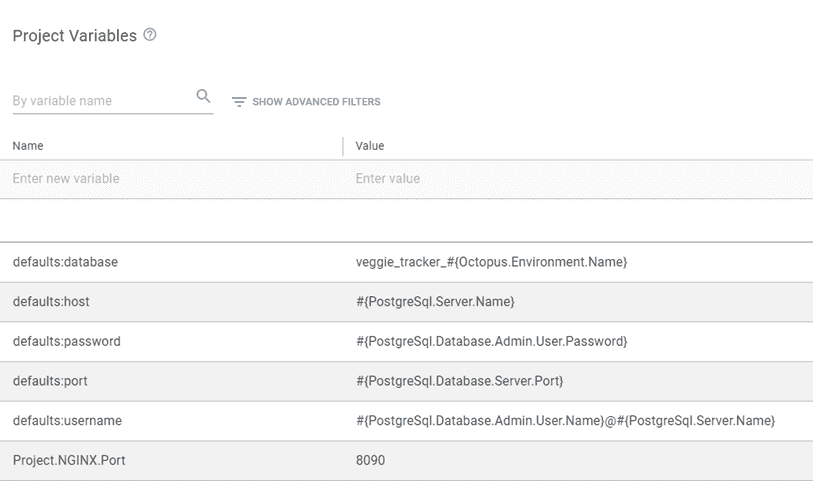
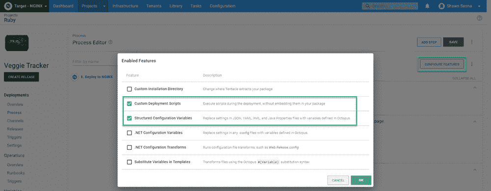

# 部署 Ruby web 应用程序——Octopus Deploy

> 原文：<https://octopus.com/blog/deploying-ruby>

Twitter、Airbnb、Shopify 和 GitHub 是科技行业的知名企业。除了一眼就能认出来，它们还有一些共同之处；都是用红宝石写的。

在这篇文章中，我演示了如何使用 Octopus Deploy 部署用 Ruby 编写的 web 应用程序，包括数据库迁移。

## 示例应用程序

在这篇文章中，我使用的是 [Veggie Tracker](https://github.com/morinoko/veggie_tracker) 示例应用程序。

此示例包括用于创建数据库和执行数据库迁移的 web 应用程序和代码。通过对项目的一些修改，我让这个应用程序在我的本地环境中运行得相当快(修改后的版本见 [GitHub](https://github.com/OctopusSamples/VeggieTracker) )。

### Ruby 应用服务器和 Web 服务器

对于 Ruby 来说，理解**应用服务器**和 **Web 服务器**之间的区别很重要。

应用服务器运行 Ruby 应用程序，并且通常在没有 Web 服务器的情况下工作。这种方法的缺点是应用服务器只能服务于它正在运行的应用程序，而不能像 Web 服务器那样处理多个应用程序。

此外，应用服务器通常不处理请求压缩或 SSL/TLS 之类的事情。出于这个原因，Ruby web 应用程序最典型的配置是在应用程序服务器前面有一个类似 Apache 或 NGINX 的 web 服务器。

### 选择应用服务器

当用 Ruby 语言开发时，你有许多应用服务器可供选择，例如 Unicorn、Thin、Puma、Passenger 等。

Veggie Tracker 应用程序的原始应用服务器叫做 **Shotgun** 。该项目的自述文件指出，您只需从命令行运行`Shotgun`就可以让应用程序在您的本地机器上运行。如果您在 Linux 上开发，这是可行的。

虽然我的服务器是 Linux，但我的开发机器是 Windows，所以我需要既能用于 Windows 又能用于 Linux 的东西。Puma 应用服务器兼容 Linux 和 Windows。切换到**美洲狮**就像从 Gemfile 中移除散弹枪并添加`Puma`一样简单。

#### 配置 Puma 用于套接字

在这篇文章中，我希望 Puma 使用套接字而不是服务器上的另一个端口。要配置 Puma 使用套接字，您需要在`config`子文件夹中创建一个包含以下内容的`puma.rb`文件:

```
# Change to match your CPU core count
#workers 2

# Min and Max threads per worker
threads 1, 6

app_dir = File.expand_path("../..", __FILE__)
shared_dir = "#{app_dir}/shared"

# Default to production
rails_env = ENV['RAILS_ENV'] || "production"
environment rails_env

# Set up socket location
bind "unix://#{shared_dir}/sockets/puma.sock"

# Logging
stdout_redirect "#{shared_dir}/logs/puma.stdout.log", "#{shared_dir}/logs/puma.stderr.log", true

# Set master PID and state locations
pidfile "#{shared_dir}/pids/puma.pid"
state_path "#{shared_dir}/pids/puma.state"
activate_control_app

on_worker_boot do
  require "active_record"
  ActiveRecord::Base.connection.disconnect! rescue ActiveRecord::ConnectionNotEstablished
  ActiveRecord::Base.establish_connection(YAML.load_file("#{app_dir}/config/database.yml")[rails_env])
end 
```

上面的代码被配置为与它将要被部署到的 Linux NGINX 服务器一起工作。请删除此文件，以便在 Windows 上本地运行它。

#### 配置 database.yml

最初的应用程序被配置为使用 **SqlLite** 作为数据库，然而，它可以很容易地被修改为使用类似于 **Postgres** 的东西。有两个修改来实现这一点:

**1。**在`Gemfile`中增加对 Postgres gem 的引用:

```
gem 'pg' 
```

**2。**在`config`文件夹中创建一个`database.yml`文件:

```
# If you want to change this file, please keep the changes in your working
# copy by using
#
#     git update-index --skip-worktree config/database.yml
#
# or just use DATABASE_URL, in which case Rails will happily skip the whole
# file.
#
# See https://github.com/coopdevs/timeoverflow/wiki/Keeping-your-local-files
# for more information
#

defaults: &defaults
  adapter: postgresql
  username: 'postgres'  # default is null
  database: 'veggietracker'
  password: 'mypassword'
  host: 'my posgresl server'
  port: 5432

development:
  <<: *defaults

test:
  <<: *defaults

staging:
  <<: *defaults

production:
  <<: *defaults 
```

`database.yml`文件允许您根据定义的环境覆盖连接属性。然而，在这篇文章中，我配置了`database.yml`文件来继承`defaults`的所有内容，因为我将在 Octopus Deploy 中使用[结构化配置变量](https://octopus.com/docs/projects/steps/configuration-features/structured-configuration-variables-feature)特性。

## 构建 Ruby 应用程序

由于 Ruby 是一种脚本语言，所以不需要构建应用程序。然而，在 Ruby 应用程序中使用构建服务器有明显的优势:

*   为应用程序执行收集所有相关的 gem
*   使用构建服务器 Octopus Deploy 插件或集成以便于集成，例如:
    *   打包应用程序
    *   将包推送到 Octopus Deploy 服务器或第三方包解决方案(Nexus、Artifactory 等)。)
    *   将构建信息推送到 Octopus 部署
    *   创建版本
    *   部署和/或推广版本

在这篇文章中，我使用 GitHub Actions 作为构建服务器。下面是执行以下操作的 YAML:

*   配置 GitHub 操作以使用 Ruby
*   设置软件包版本号
*   安装依赖 gem，将 gem 放在**供应商**子文件夹中——这允许应用程序包含它需要的所有依赖项，而不需要直接在服务器上安装 gem
*   配置 GitHub 操作以使用 Octopus CLI
*   创建工件文件夹
*   打包 VeggieTracker 应用程序并将归档文件放在 artifacts 文件夹中
*   将 VeggieTracker 工件推送到 Octopus 部署服务器

```
# This is a basic workflow to help you get started with Actions

name: CI

# Controls when the action will run. 
on:
  # Triggers the workflow on push or pull request events but only for the main branch
  push:
    branches: [ main ]
  pull_request:
    branches: [ main ]

  # Allows you to run this workflow manually from the Actions tab
  workflow_dispatch:

# A workflow run is made up of one or more jobs that can run sequentially or in parallel
jobs:
  # This workflow contains a single job called "build"
  build:
    # The type of runner that the job will run on
    runs-on: ubuntu-latest

    # Steps represent a sequence of tasks that will be executed as part of the job
    steps:
      # Checks-out your repository under $GITHUB_WORKSPACE, so your job can access it
      - uses: actions/checkout@v2

      - name: Setup Ruby
        uses: ruby/setup-ruby@v1
        with:
          ruby-version: 2.6

      # Set the build version number
      - name: Set Version
        run: echo "PACKAGE_VERSION=$(date +'%Y.%m.%d').$GITHUB_RUN_NUMBER" >> $GITHUB_ENV

      - name: Install dependencies
        run: |
          # Set the default gem installation path to a directory alongside the Ruby application code.
          # This allows the dependencies to be packaged with the application.
          export WORKSPACE="$(pwd)"
          export GEM_HOME="$WORKSPACE/vendor"
          export GEM_PATH="$WORKSPACE/vendor"
          export PATH="$PATH:$WORKSPACE/vendor/bin"

          # Install the specific version of Bundler defined in the Gemfile.lock file
          gem install bundler -v "$(grep -A 1 "BUNDLED WITH" Gemfile.lock | tail -n 1)"

          # Use bundler to install the other dependencies
          bundle install

      # Install Octopus action
      - name: Install Octopus CLI
        uses: OctopusDeploy/install-octopus-cli-action@v1.1.1
        with:
          version: latest

      # Create artifacts folder
      - name: Create artifacts folder
        run: mkdir "$GITHUB_WORKSPACE/artifacts"

      # Package VeggieTracker.Web
      - name: Package Flyway
        run: |
          octo pack --id="VeggieTracker.Web" --format="Zip" --version="$PACKAGE_VERSION" --basePath="$GITHUB_WORKSPACE" --outFolder="$GITHUB_WORKSPACE/artifacts"

      # Push packages to octopus deploy
      - name: Push packages to Octopus
        run: |
          octo push --package="$GITHUB_WORKSPACE/artifacts/VeggieTracker.Web.$PACKAGE_VERSION.zip" --server="${{ secrets.OCTOPUS_SERVER_URL }}" --apiKey="${{ secrets.OCTOPUS_API_KEY }}" --space="${{ secrets.OCTOPUS_SERVER_SPACE }}" 
```

构建完成后，我们可以专注于在 Octopus Deploy 中创建部署。

## 使用 Octopus Deploy 部署 VeggieTracker

这篇文章假设你熟悉用 Octopus Deploy 创建项目。

Veggie Tracker 应用程序的部署过程由一个包含多个组件的步骤组成，我将在后面介绍这些组件。

### 变量

在定义我们的流程之前，让我们创建要在部署中使用的变量:

*   `Project.NGINX.Port` -端口 NGINX 将监听。
*   `defaults:database`-veggie tracker 应用程序的数据库名称。
*   `defaults:host`-PostgreSQL 服务器的主机名或 IP 地址。
*   `defaults:password`-PostgreSQL 用户帐户的密码。
*   `defaults:port`-PostgreSQL 服务器监听的端口号。
*   `defaults:username`-PostgreSQL 服务器上帐户的用户名。

[](#)

以`defaults:`开头的变量是与**结构化配置变量**功能一起使用的变量。

### 过程

添加一个**部署到 NGINX** 的步骤。

[](#)

点击**配置功能**按钮，启用**自定义部署脚本**和**结构化配置变量**功能。

[](#)

#### 包装详情

在**包裹详情**部分，选择蔬菜跟踪者。Web 包。

#### 自定义部署脚本

作为部署过程的一部分，我们将运行两个脚本。

##### 部署脚本

Ruby 应用程序数据库更新的一种流行方法是在代码中定义数据库更新。Veggie Tracker 应用程序包括一个名为 **db** 的文件夹，它使用代码定义数据库结构。

为了执行数据库创建和迁移，将下面的代码放在**部署脚本**窗口中。确保选择 **Bash** 作为要使用的语言。

```
# Ensure the bin files are executable
sudo chmod +x -R "#{Octopus.Action[Deploy to Nginx].Output.Package.InstallationDirectoryPath}/vendor/bin"

# Set variables
ROOTDIR=#{Octopus.Action[Deploy to Nginx].Output.Package.InstallationDirectoryPath | Replace "%" "%%"}
export GEM_HOME="${ROOTDIR}/vendor"
export GEM_PATH="${ROOTDIR}/vendor"

# Install platform specific gems
gem install bcrypt
gem install bond
gem install nio4r
gem install pg
gem install puma

# Run database migrations
${ROOTDIR}/vendor/bin/rake db:create
${ROOTDIR}/vendor/bin/rake db:migrate 
```

这个脚本安装了一些 Ruby Gems。这是必需的，因为 GitHub Actions 使用基于 Ubuntu 的容器来执行构建。这个平台被标识为`x86_64-linux`，而 Ubuntu VM 被标识为`x86_64-linux-gnu`。虽然很相似，但编译器生成了不同的不兼容的二进制文件。

受此影响的宝石在构建日志中用`Installing X with native extensions`标识出来，这些宝石需要在目标平台上重新构建。

##### 部署后脚本

NGINX 步骤配置 NGINX 来服务 Puma Ruby 应用服务器，但是我们需要一些东西来启动 Puma，尤其是在重启之后。

以下脚本将 Puma 应用服务器配置为作为 Linux 服务启动:

```
SYSTEMD_CONF=/etc/systemd/system
SERVICE_USER=$(whoami)
ENVIRONMENT=#{Octopus.Environment.Name}

# This is used to generate the systemd filename, so we remove any chars that might be problematic for filenames
APPNAME=#{Octopus.Action[Deploy to Nginx].Package.PackageId | Replace "[^a-zA-Z0-9]" -}-#{Octopus.Environment.Name}
# This path is referenced by the systemd service in multiple places, and systemd treats the % char as special,
# so it is escaped with a second % char
ROOTDIR=#{Octopus.Action[Deploy to Nginx].Output.Package.InstallationDirectoryPath | Replace "%" "%%"}
SYSTEMD_SERVICE_FILE=${SYSTEMD_CONF}/${APPNAME}.service

# Application systemd service configuration
echo "Creating ${APPNAME} systemd service configuration"
cat > "${APPNAME}.service" <<-EOF
[Unit]
Description=${APPNAME} service
After=network.target

[Service]
# Expose the gems that were bundled up with the application package
Environment="GEM_PATH=${ROOTDIR}/vendor"
Environment="GEM_HOME=${ROOTDIR}/vendor"
Environment="PATH=${PATH}:${ROOTDIR}/vendor/bin"
WorkingDirectory=${ROOTDIR}
User=${SERVICE_USER}
Group=${SERVICE_USER}
#ExecStart=${ROOTDIR}/vendor/bin/puma -C ${ROOTDIR}/config/puma.rb #-e ${ENVIRONMENT}
ExecStart=${ROOTDIR}/vendor/bin/puma
Restart=always
RestartSec=10
SyslogIdentifier=${APPNAME}
[Install]
WantedBy=multi-user.target
EOF
sudo mv "${APPNAME}.service" ${SYSTEMD_CONF}/${APPNAME}.service

# Ensure the bin files are executable
chmod +x -R "#{Octopus.Action[Deploy to Nginx].Output.Package.InstallationDirectoryPath}/vendor/bin"

# Any changes to a system file are picked up by reloading the systemd daemon
sudo systemctl daemon-reload
# Enable the service so it starts on boot
sudo systemctl enable "${APPNAME}.service"
# Start or restart the service to pick up any changes
sudo systemctl restart "${APPNAME}.service" 
```

#### 结构化配置变量

我们将使用**结构化配置变量**特性来替换`database.yml`中的值，以便连接到数据库服务器。这个文件位于我们应用程序的`config`文件夹中。

对于**目标文件**，输入`config/database.yml`。

[](#)

#### NGINX Web 服务器

现在我们为 NGINX 定义绑定和位置等项目。

##### 粘合剂

删除缺省绑定，并用项目变量中配置的端口变量替换它。

[](#)

##### 位置

我们的应用程序需要定义两个位置。这两个位置都有一些也将被应用的指令。点击**添加位置**开始。

###### 位置/

第一个位置是`/`，需要两条指令。

点击**添加指令**按钮，输入以下内容:

[](#)

###### 位置@应用程序

第二个地点是`@app`。这个位置需要用一个指令配置为`http://unix:#{Octopus.Action.Package.InstallationDirectoryPath}/shared/sockets/puma.sock`的反向代理。

*   指令:`proxy_set_header`
*   数值:`Host $http_host`

[](#)

位置确定后，我们就完成了部署过程。您可以创建一个版本并进行部署。

[](#)

Linux 上的一些程序将信息消息写入 stderr 流。Octopus 将这些解释为可能的错误，并以红色显示。看到这样的消息很正常。

打开浏览器，我们可以看到部署的应用程序正在运行。

[](#)

## 结论

在这篇文章中，我演示了如何将一个用 Ruby 编写的 web 应用程序部署到 NGINX web 服务器上，包括数据库迁移。

愉快的部署！