# 使用 Octopus Deploy - Octopus Deploy 部署 SQL Server DACPAC

> 原文：<https://octopus.com/blog/deploying-sql-server-dacpac-octopus>

数据库管理员(DBA)常常一提到自动化数据库部署就畏缩不前。他们的工作是确保服务器和数据库保持可用和健康，不受他们控制的进程会让他们紧张。引入自动对数据库结构或数据进行大规模修改的过程似乎与他们的职责形成了鲜明的对比。但是，使用带有 Octopus Deploy 的 DACPAC 来自动部署到 SQL Server 可以帮助您完成开发运维之旅。

这篇文章向您展示了如何使用 DACPAC 和 Octopus Deploy 从项目创建到部署自动化数据库更新到 Microsoft SQL Server。

## 示例项目:Sakila

这篇文章将把 [Sakila](https://bitbucket.org/octopussamples/sakila/src/master/src/dacpac/mssql/) 数据库部署到一个 Microsoft SQL 服务器上。

Sakila 项目包含表、约束、存储过程、视图和用户定义的函数，以展示 Microsoft DACPAC 技术的全部功能。

Sakila Git repo 包含使用不同部署方法将 Sakila 数据库部署到多种数据库技术的源代码。这篇文章特别关注微软的 DACPAC 版本。

## 创建数据库项目

SQL Server 数据库项目类型不是 Visual Studio 自带的。要创建它，您必须安装 [SQL Server 数据工具](https://docs.microsoft.com/en-us/sql/ssdt/download-sql-server-data-tools-ssdt) (SSDT)扩展。SSDT 包含数据库项目、SQL Server Reporting Services(SSRS)项目和 SQL Server Integration Services(SSIS)项目的项目类型。

安装完扩展后，创建一个新项目，并选择 SQL Server 类别、SQL Server 数据库项目类型。

[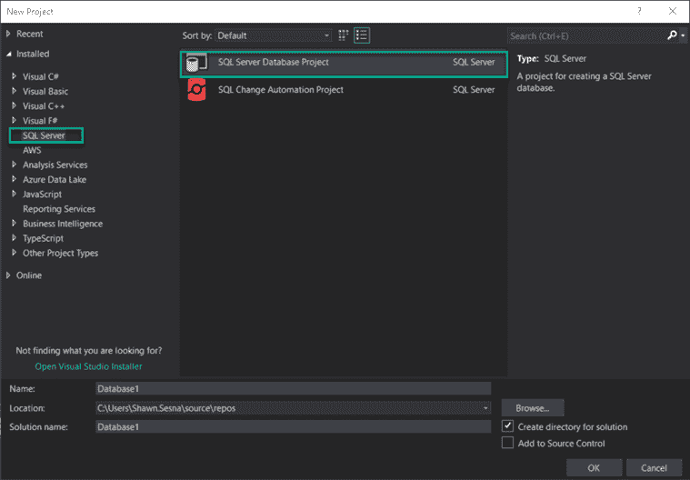](#)

右键点击**解**空间，选择**导入**，然后选择**数据库...**连接到现有数据库:

[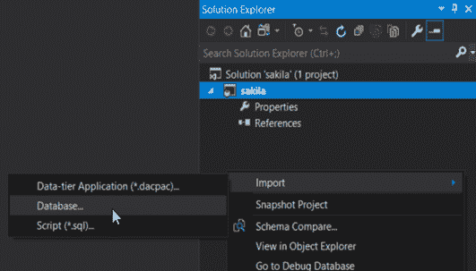](#)

配置一个连接，然后点击**开始**。

[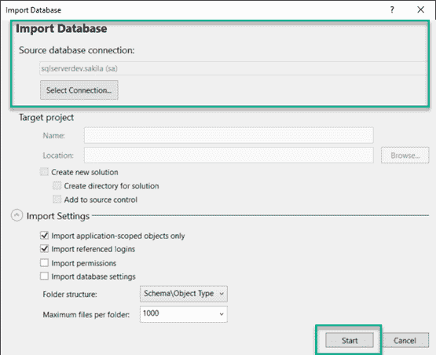](#)

该过程完成后，您的项目应该如下所示:

[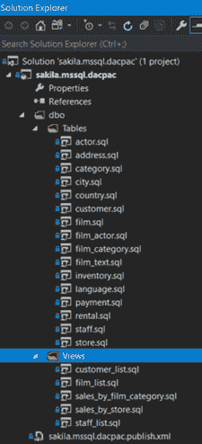](#)

## 创建构建

在创建生成之前，首先确保您的生成代理已配置为生成 SQL Server 数据库项目。除了 SSRS 项目之外，MSBuild 无法生成 SSDT 项目。您的生成代理至少需要满足以下要求:

[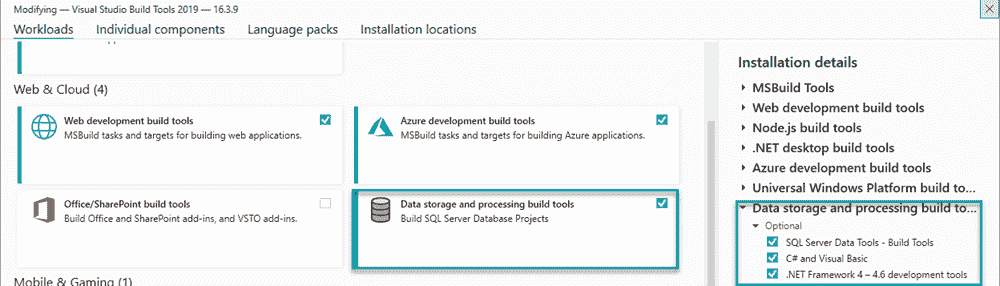](#)

本节的剩余部分使用 Microsoft Azure DevOps 来配置构建。如果您使用的是不同的构建服务器，只要构建代理安装了上述工具，您就应该能够做同样的事情。

构建将包括以下步骤:

*   构建 DACPAC 解决方案
*   打包文件
*   推送构建信息
*   将包装推到包装进料口

### 构建 DACPAC 解决方案

向您的构建管道添加一个 **Visual Studio 构建**步骤。将 clean 设置为`true`将确保在进行后续构建时，文件夹中没有任何剩余的工件。

```
- task: VSBuild@1
  inputs:
    solution: 'dacpac\mssql\sakila.mssql.dacpac.sln'
    msbuildArgs: '/p:OutDir=$(build.stagingdirectory)'
    clean: true 
```

### 打包文件

将 Octopus 步骤的**包应用程序添加到管道中。这将压缩`.dacpac`文件，以便 Octopus Deploy 可以部署它。包括。dacpac 文件和发布配置文件 XML 文件。**

```
- task: OctopusPack@4
  inputs:
    PackageId: 'sakila.dacpac'
    PackageFormat: 'Zip'
    PackageVersion: '$(Build.BuildNumber)'
    SourcePath: '$(build.stagingdirectory)'
    OutputPath: '$(Build.ArtifactStagingDirectory)'
    Include: |
      sakila.mssql.dacpac.dacpac
      sakila.mssql.dacpac.publish.xml 
```

### 推送构建信息

查看与这个构建相关联的提交和工作项是很有用的。将**推送包构建信息添加到 Octopus 部署**。

```
- task: OctopusMetadata@4
  inputs:
    OctoConnectedServiceName: 'Local Octopus Deploy'
    Space: 'Spaces-1'
    PackageId: 'sakila.dacpac'
    PackageVersion: '$(Build.BuildNumber)'
    Replace: 'false' 
```

使用 Azure DevOps assistant，您可以配置此步骤中使用的`OctoConnectedServiceName`。

### 将包装推到包装进料口

构建过程的最后一步是将包推送到存储库。这篇文章将使用 Octopus Deploy 的内置库，但是也支持其他外部提要类型，包括 Azure DevOps、Artifactory、Nexus 等等。

```
- task: OctopusPush@4
  inputs:
    OctoConnectedServiceName: 'Local Octopus Deploy'
    Space: 'Spaces-1'
    Package: '$(Build.ArtifactStagingDirectory)\*.zip'
    Replace: 'false' 
```

完整的 YAML 管道将类似于此:

```
trigger:
- master

pool: Default

steps:
- task: VSBuild@1
  inputs:
    solution: 'dacpac\mssql\sakila.mssql.dacpac.sln'
    msbuildArgs: '/p:OutDir=$(build.stagingdirectory)'
    clean: true

- task: OctopusMetadata@4
  inputs:
    OctoConnectedServiceName: 'Local Octopus Deploy'
    Space: 'Spaces-1'
    PackageId: 'sakila.dacpac'
    PackageVersion: '$(Build.BuildNumber)'
    Replace: 'false'
- task: OctopusPack@4
  inputs:
    PackageId: 'sakila.dacpac'
    PackageFormat: 'Zip'
    PackageVersion: '$(Build.BuildNumber)'
    SourcePath: '$(build.stagingdirectory)'
    OutputPath: '$(Build.ArtifactStagingDirectory)'
    Include: |
      sakila.mssql.dacpac.dacpac
      sakila.mssql.dacpac.publish.xml
- task: OctopusPush@4
  inputs:
    OctoConnectedServiceName: 'Local Octopus Deploy'
    Space: 'Spaces-1'
    Package: '$(Build.ArtifactStagingDirectory)\*.zip'
    Replace: 'false' 
```

## 创建部署流程

这篇文章假设你知道如何创建一个 Octopus 项目，但并不涉及这个主题。

DACPAC 部署流程包括以下步骤:

*   **(可选)如果数据库不存在，则创建数据库**:有些人喜欢将此活动放在操作手册中，而不是作为部署过程的一部分。
*   将 DACPAC 部署到 SQL Server。

### (可选)如果数据库不存在，则创建该数据库

这一步连接到一个 SQL server 并创建一个数据库(如果它不存在的话)。点击**添加步骤**，选择 **SQL -如果不存在则创建数据库**。该步骤可以在工作机上运行。

[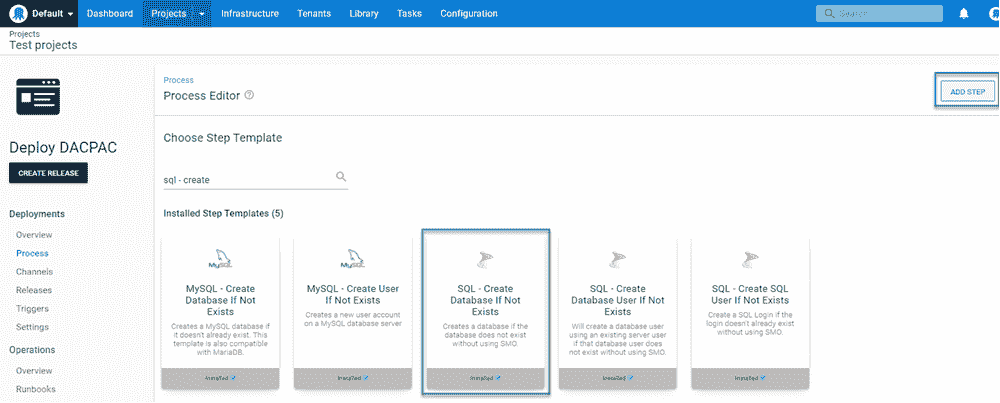](#)

填写模板字段:

*   **SQL Server** :服务器名称。
*   **SQL 登录** : SQL 认证用户名，如果使用 Active Directory 认证，则留空。
*   **SQL 密码**:SQL 认证账户的密码，如果使用 Active Directory 认证，则留空。
*   **要创建的数据库**:要创建的数据库名称。
*   **命令超时**:等待创建数据库命令完成的秒数。
*   Azure 数据库版本:如果你正在使用 Azure SQL，选择要创建的版本。如果留空(并使用 Azure SQL)，Azure 将默认为 Standard。

### 将 DACPAC 部署到 SQL Server

有几个 DACPAC 社区步骤模板可供选择:

*   **SQL - Deploy DACPAC** :这个版本的模板是在 Octopus Deploy 的 Workers 特性可用之前创建的。该模板必须在目标上执行，并且需要一个**部署包**步骤，首先将 DACPAC 部署到目标上。
*   **SQL-Deploy DAC PAC from Package Parameter**:该模板与 Worker 兼容，使用内置的包选择器。此外，该模板可以动态下载 SQL PowerShell 模块(如果选择的话),并且不需要在工作机器上安装任何附加软件。
*   **SQL-Deploy DACPAC from Referenced Package**:该模板使用两个包，一个包含执行 DACPAC 部署所需的二进制文件，另一个是 DAC PAC 本身。
*   **SQL-Deploy DAC PAC with AAD Auth support**:这是最新的可用模板，包含使用 Azure Active Directory 认证数据库服务器的能力(这篇博文演示了[如何配置步骤模板](https://octopus.com/blog/classes-in-custom-step-templates))。

所有四个模板在如何部署 DACPAC 方面包含相同的基本功能，但是，它们是单独开发的，以避免给使用模板的人带来破坏性的变化。这篇文章使用了最新的模板，**SQL Deploy DAC PAC with AAD support**。

所有四个模板都支持使用 SQL CMD 变量。因为可以有 N 个 SQL CMD 变量，所以模板中没有输入字段来定义它们。相反，模板代码在 Octopus 变量集合中查询以特定约定命名的变量:

*   `SqlCmdVariable.Variable1`
*   `my.sqlcmdvariable.variable2`

[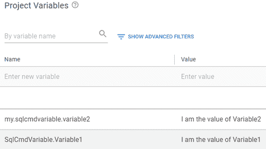](#)

在部署过程中，当被添加时，您会看到如下内容:

[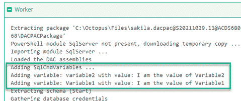](#)

[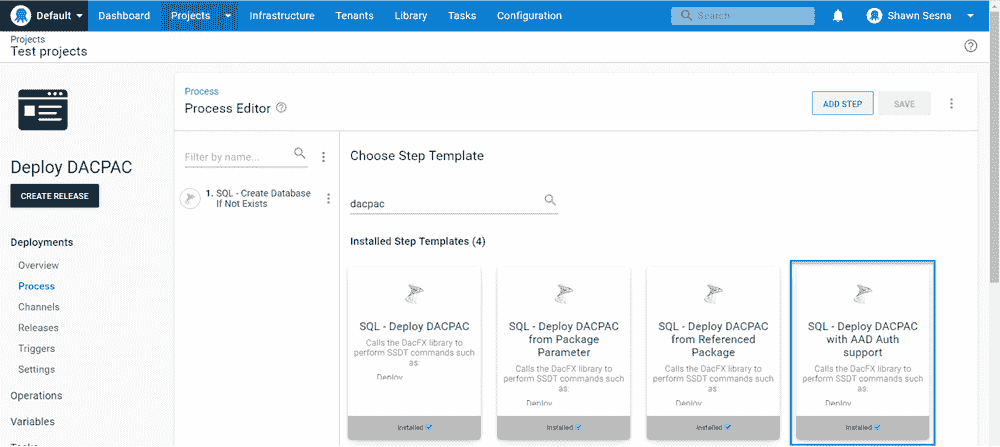](#)

填写模板字段:

*   **dapacpackagename**:包中`.dacpac`文件的名称。对于这个帖子，是`sakila.mssql.dacpac.dacpac`。
*   **(可选)发布概要文件名**:发布概要 XML 文件的名称。对于这个帖子，它是`sakila.mssql.dacpac.publish.xml`。
*   **报告**:勾选这个框，生成一个 HTML 报告，报告将要进行的更改。
*   **脚本**:勾选此框，生成一个包含将要执行的 SQL 的`.sql`文件。
*   **展开**:勾选此框进行展开。
*   **将目标数据库提取到 dacpac** :勾选此框，将目标数据库提取到 dacpac，并将其作为工件添加。
*   **目标服务器名称**:数据库服务器的名称。
*   **目标数据库**:要部署到的数据库的名称。
*   **目标数据库 DAC 版本**:该列表是查找。dll 文件，选择 SQL Server PowerShell 模块来动态加载该模块。
*   **认证类型**:认证选项列表，本帖使用 SQL 认证。
*   **用户名** : SQL 认证用户名。
*   **密码**:SQL 认证用户的密码。
*   **启用多子网故障转移**:是否使用多子网故障转移。
*   **附加部署贡献者**:如果使用`SqlPackage.exe /p:AdditionalDeploymentContributors=[what you would put here]`命令行，您将添加的选项。
*   **附加部署贡献者参数**:如果使用`SqlPackage.exe /p:AdditionalDeploymentContributorArguments=[what you would put here]`命令行，您将添加的选项。
*   **DACPAC 包**:要部署的包。
*   **命令超时**:以秒为单位的超时，主要用于长时间运行的脚本。

[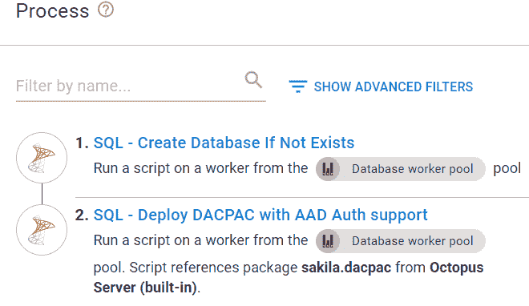](#)

您的部署将如下所示:

[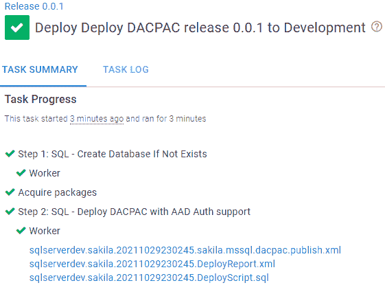](#)

使用类似 SQL Server Management Studio (SSMS)的工具，您可以看到数据库已经更新:

[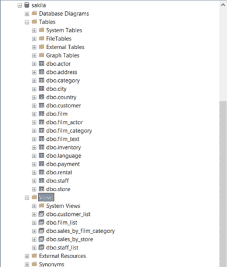](#)

## 结论

这篇文章向您展示了从项目创建到部署如何部署 DACPAC。请务必查看我们的[示例实例](https://samples.octopus.app/app#/Spaces-106/projects/dacpac-azure-sql/deployments/process)中的一个示例。该示例部署到 Azure SQL 数据库服务器。

愉快的部署！