# 使用 Octopus - Octopus Deploy 部署 SQL Server Integration Services(SSIS)包

> 原文：<https://octopus.com/blog/deploying-ssis>

[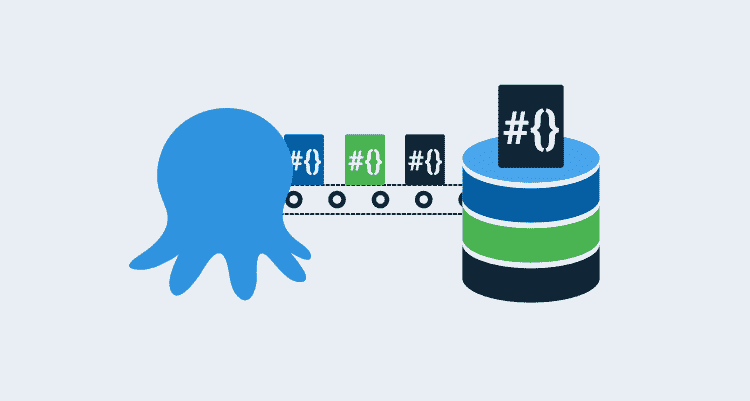](#)

当您想到自动化应用程序部署时，通常想到的是自动化部署 web 代码、容器和/或数据库。在本系列中，我将演示如何自动化支持组件，如 SQL Server Integration Services(SSIS)包和 SQL Server Reporting Services(SSRS)报表。

* * *

提取、转换和加载(ETL)流程通常由数据库管理员(DBA)或集成专家部署。在较低级别的环境中，允许开发人员直接部署到 SSIS 服务器并不罕见，但是当涉及到较高级别的环境时，比如生产环境，他们通常是手动完成的。DBA 有时可以运行脚本进行部署，但是它通常不包含在自动化应用程序部署的工具中。使用 Octopus Deploy，可以将 ETL 部署添加到部署堆栈中。

## 打造 SSIS 套餐

为了在部署过程中包含我们的 SSIS 包，您首先需要构建项目来生产用于部署的工件。没有一个流行的构建服务器可以开箱即用地构建 SSIS，并且需要一些配置。所有构建服务器的步骤大致相同。

您的 SSIS 项目**必须**在项目部署模型中，包部署模型将不适用于此解决方案。

### 配置生成代理

MSBuild 不知道如何生成 SSIS 项目类型。为了执行构建，您需要配置构建代理。

#### 可视化工作室

要构建 SSIS 项目，我们需要在构建代理上安装 Visual Studio。Visual Studio 的社区版应该够用了。

请咨询社区版的 EULA，以确保您或您的组织可以使用它。

在我们的构建代理上有了 Visual Studio 之后，我们需要安装一个名为 SQL Server 数据工具(SSDT)的扩展。安装完成后，我们的构建代理将能够进行构建。dtsproj 项目。

### 构建 SSIS 任务

默认情况下，大多数(如果不是全部的话)构建服务器没有构建 SSIS 的任务。您需要安装或配置自定义任务来执行构建。

#### azure devo PS/Team Foundation Server

Azure DevOps (ADO)或 Team Foundation Server (TFS)的市场有社区创建的几个任务。如果你用的是 ADO/TFS，我建议用这个:

[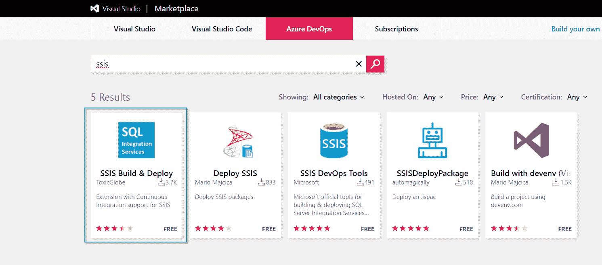](#)

#### 团队城市

TeamCity 没有可用于执行构建的插件，但是 Pavel Hofman 有一篇关于如何在 TeamCity 上配置构建 SSIS 项目的很棒的[博客文章](https://blog.codetitans.pl/post/howto-setup-ssis-project-to-build-via-teamcity/)。

#### 詹金斯

与 TeamCity 类似，Jenkins 没有任何插件可用于执行 Visual Studio 构建。然而，执行类似于 TeamCity 解决方案的步骤应该会产生相同的结果。

### 构建项目

在这篇文章中，我使用 Azure DevOps 来执行构建。

#### 构建任务

填写构建任务详细信息:

[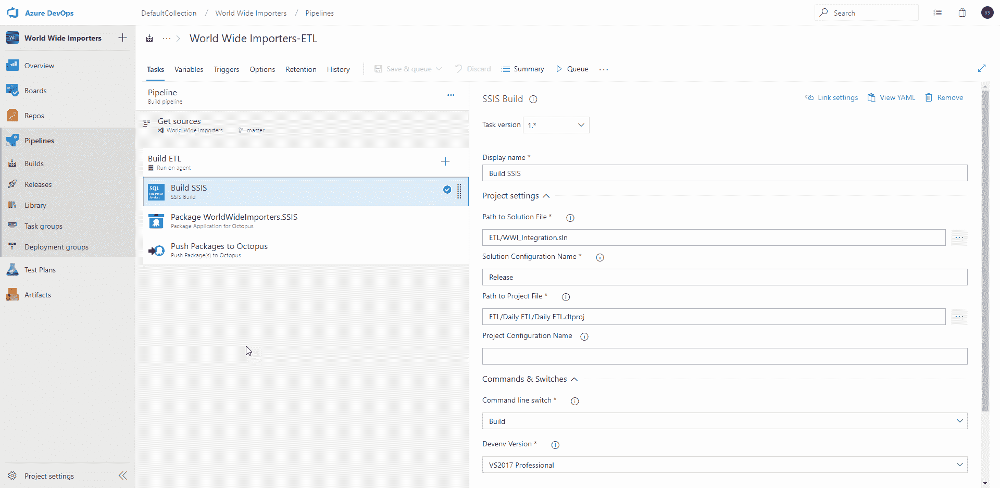](#)

#### 包装工件

SSIS 项目建成后，将产生一个。ispac 文件，其中包含部署所需的组件。。ispac 不像。拉链还是。nupkg，所以需要一个额外的步骤将其打包成支持的格式。对于 ADO、TeamCity 和 Jenkins，Octopus Deploy 具有插件或扩展，其中包含执行以下操作的步骤:

[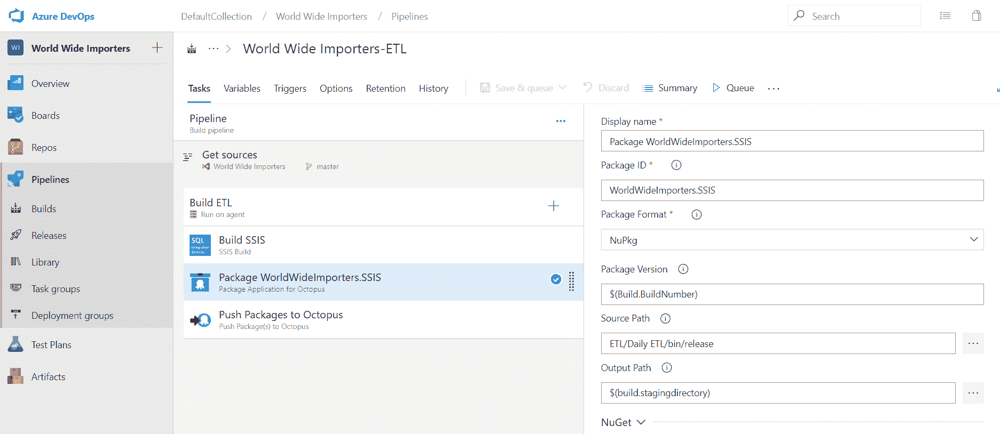](#)

#### 将工件推送到存储库

之后。ispac 文件已经打包，您需要打包它并将其发送到一个存储库，例如:

*   Octopus 部署内置存储库
*   艺术工厂
*   关系
*   ADO/TFS 知识库

[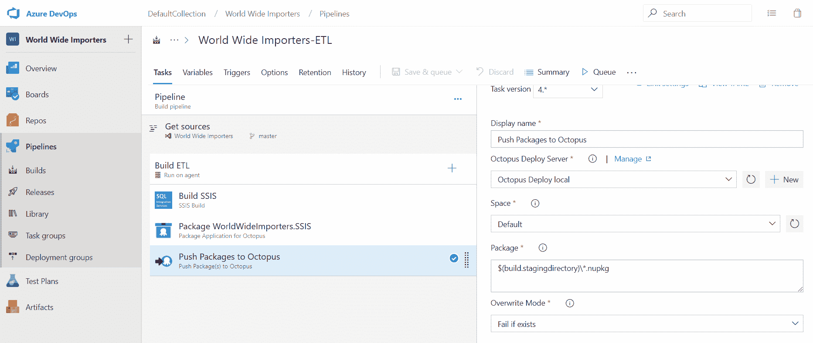](#)

## 章鱼部署

现在我们已经准备好了包，我们可以创建和配置我们的 Octopus Deploy 项目了。

### 创建项目

要创建我们的项目，请单击**项目**和**添加项目**:

[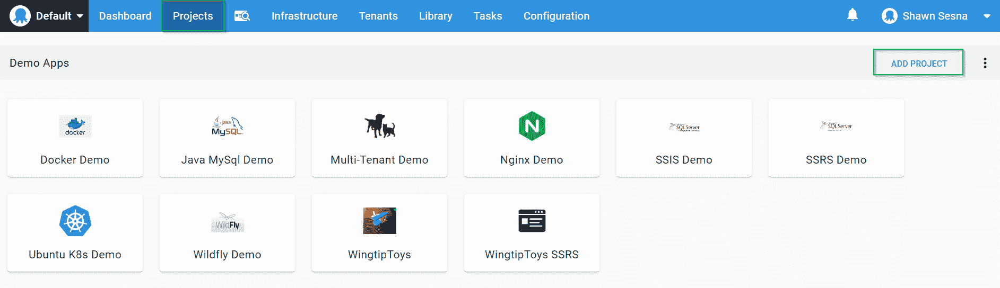](#)

#### 添加 SSIS 部署步骤

用于部署 SSIS 包的唯一步骤模板在社区步骤库中。点击**添加步骤**:

[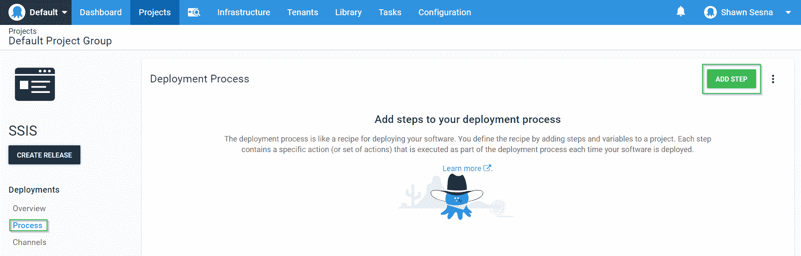](#)

按 SSIS 过滤将显示可用的 SSIS 步骤模板。对于这个演示，我使用`Deploy ispac SSIS project from Referenced Package`。该模板将允许我们使用工作进程进行部署，而不是在 SSIS 服务器上安装代理。

[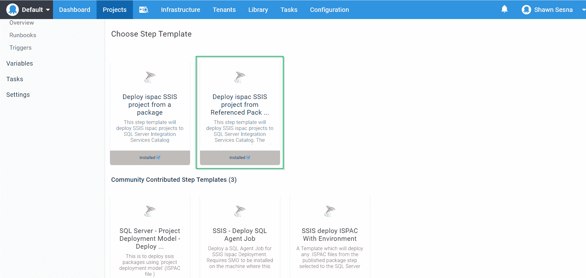](#)

#### 填写步骤细节

这一步允许我们在部署目标或工作者上运行这一步。在这个演示中，我使用了一个工人，所以我们不需要在 SSIS 服务器上安装触手。展开`Execution Location`部分并选择`Run once on a worker`。

[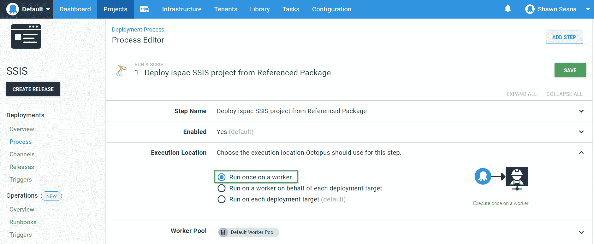](#)

现在填写参数:

*   **数据库服务器名称(\实例)**:要连接的 SSIS 服务器的名称。(即 SSISServer1 或 SSISServer1\Instance1)。
*   **SQL 认证用户名(可选)**:SQL 账户用户名。留空以使用集成身份验证。
*   **SQL 认证密码(可选)**:SQL 账户的密码。留空以使用集成身份验证。
*   **启用 SQL CLR**:SQL Server 的 SSISDB 特性要求启用 SQL CLR。如果该功能尚未启用，请将其设置为 true。
*   **目录名称**:ssis db 的目录名称，建议不要更改该值。只有在尚未安装 SSISDB 功能的情况下，才需要这样做。
*   **目录密码**:ssis db 目录的密码。只有在尚未安装 SSISDB 功能的情况下，才需要这样做。
*   **文件夹名称**:SSISDB 目录中放置 SSIS 项目的文件夹名称。
*   **项目名称**:SSIS 项目名称。该名称必须与 Visual Studio 中的项目名称完全匹配。
*   **使用环境**:如果要在 SSISDB 中使用环境变量，设置为 true。
*   **环境名**:要使用的环境名。
*   **将项目参数引用到环境变量**:设置为 true，将项目变量链接到环境变量。
*   **将包参数引用到环境变量**:设置为 true，将包变量链接到环境变量。
*   **使用全限定变量名**:为真时，包变量名必须用`dtsx_name_without_extension.variable_name`表示。
*   **为连接管理器属性使用自定义过滤器**:自定义过滤器应包含正则表达式，用于在自动映射期间进行设置时忽略属性。
*   **连接管理器属性的自定义过滤器**:在自动映射过程中过滤连接管理器属性的正则表达式。当`UseCustomFilter`设置为真时使用该字符串。
*   **包 ID** :用于部署的包的 ID。
*   **包 Feed ID** :包所在的 Feed 的 ID。

[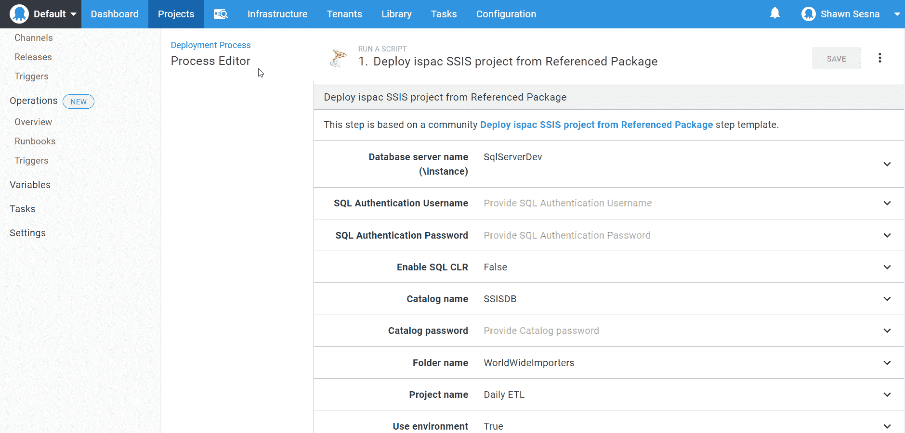](#)

[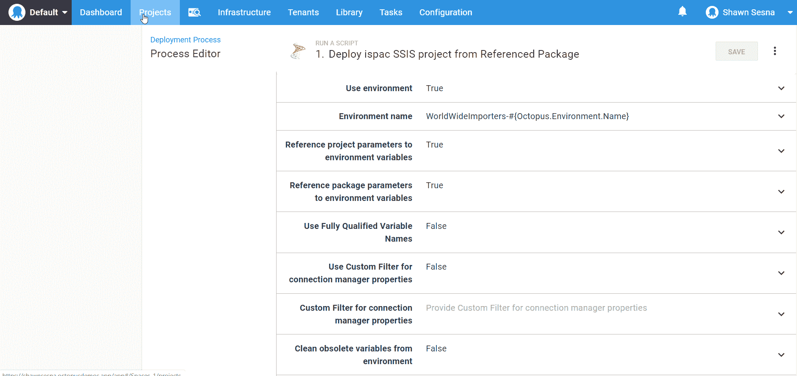](#)

[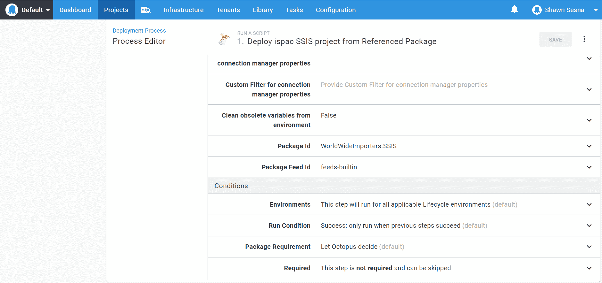](#)

填写完表单后，我们现在可以部署我们的包了。

### 部署

让我们创建我们的发布。点击**创建释放**按钮:

[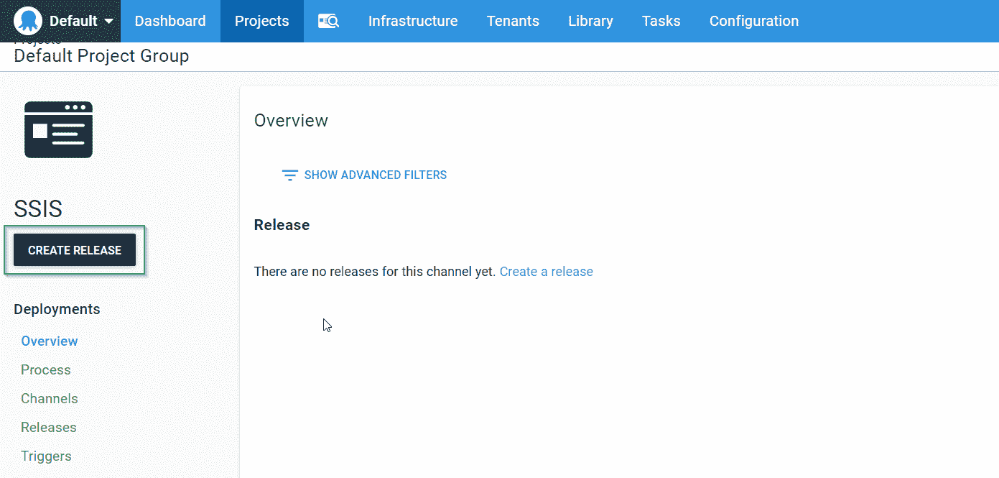](#)

点击**保存**:

[T35【](#)

选择要部署到的环境:

[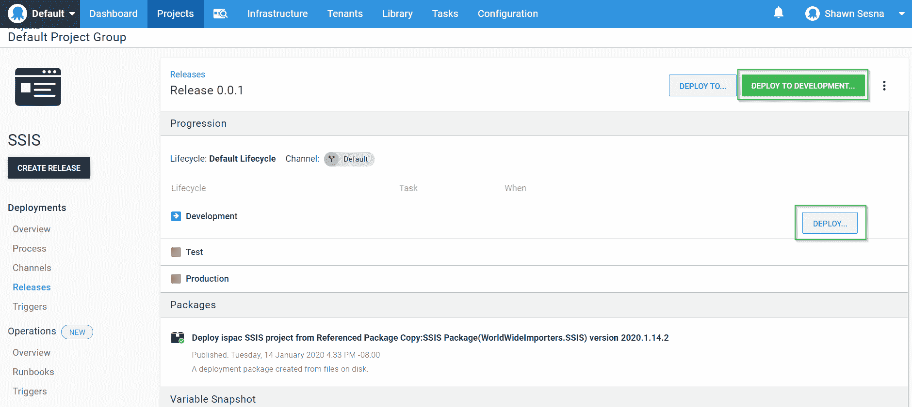](#)

然后确认部署:

[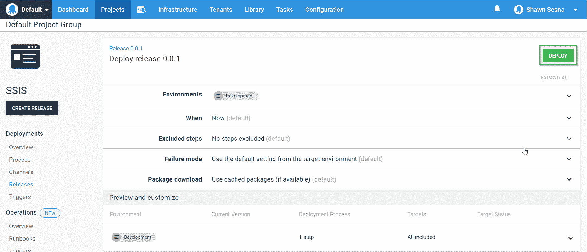](#)

我们的包已经部署:

[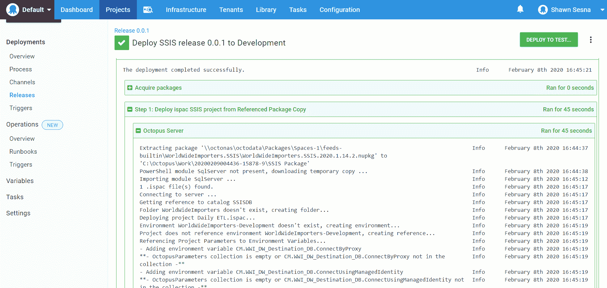](#)

#### 部署日志

如果您已经将项目参数引用到环境变量中，您会在部署日志中注意到如下内容:

```
- Adding environment variable CM.WWI_Source_DB.ConnectionString
**- OctopusParameters collection is empty or CM.WWI_Source_DB.ConnectionString not in the collection -** 
```

这条消息表明您已经引用了一个环境变量的项目参数，但是在 Octopus Deploy 项目变量中没有找到变量`CM.WWI_Source_DB.ConnectionString`。这意味着您可以创建一个同名的 Octopus Deploy 项目变量来控制从一个环境到另一个环境的值，就像部署应用程序一样。

#### 查看结果

让我们使用 SQL Server Management Studio (SSMS)来看看我们的 SSISDB:

[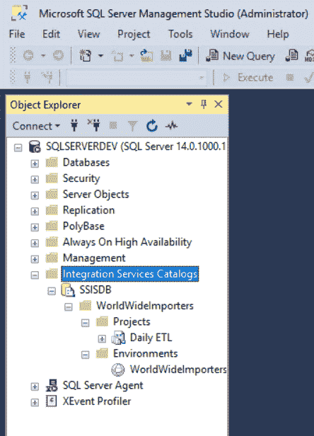](#)

打开环境，我们看到我们的变量已经创建:

[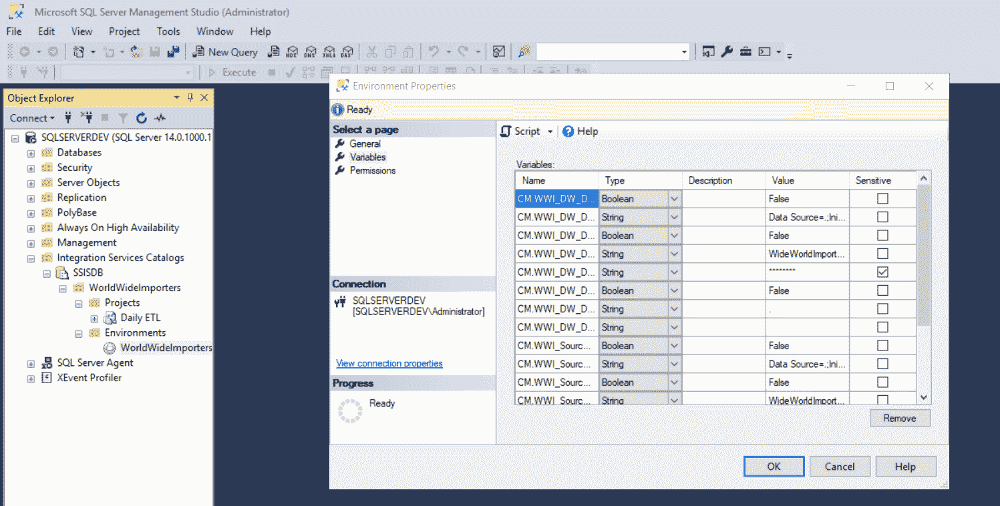](#)

## 结论

在这篇文章中，我演示了如何使用 Octopus Deploy 部署 SSIS 包。使用这种方法，您现在可以使用相同的工具来包含支持应用程序组件。