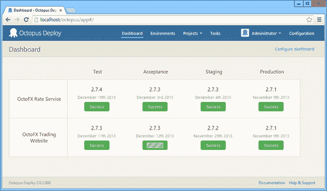
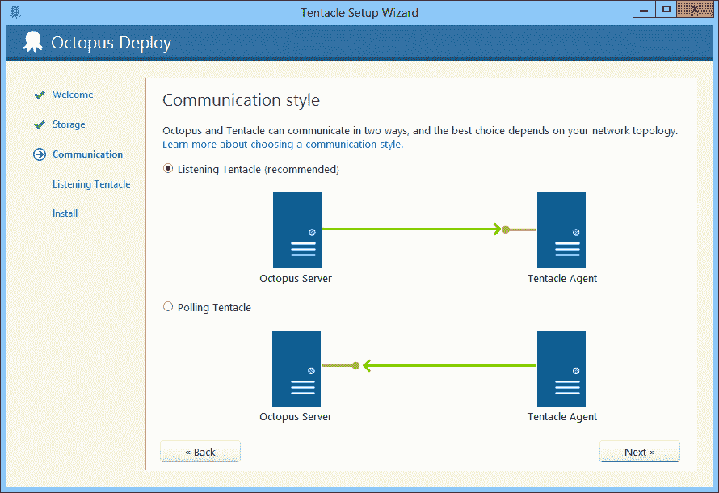
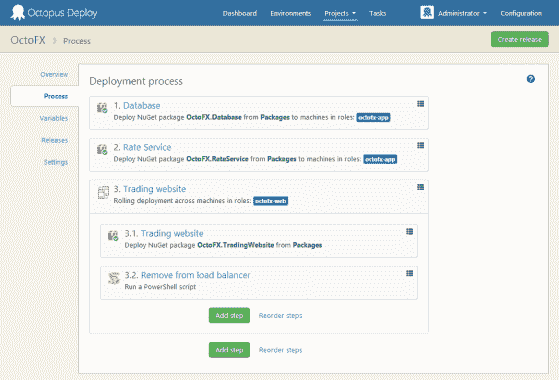
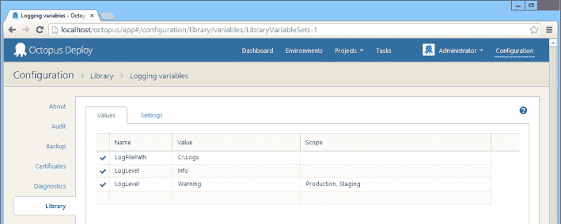

# Octopus Deploy 2.0 已经发布！-章鱼部署

> 原文：<https://octopus.com/blog/2.0>

昨天，我们发货了 **[章鱼部署 2.0](http://octopusdeploy.com/downloads)** 。这是 Octopus 2.0 的正式、非测试版、公开、发布到网络的版本。呜哇！

Octopus 2.0 的开发工作始于去年 5 月。你能相信吗？我们并不只是添加一些功能和改变配色方案，而是着手[开发一个真正的 2.0 版本](http://octopusdeploy.com/blog/octopus-2.0-vision)。我们在制作 Octopus 1.0 的过程中学到了很多东西，我们想对产品的架构和一些核心概念做一些根本性的改变。

## REST API

影响最大的变化是决定开发一个全面的 REST API。Octopus 1.0 的用户界面是在 ASP.NET MVC 中构建的。对于 2.0，我们删除了几乎所有的代码——控制器和视图——而是从头构建了一个 REST API。然后，我们使用 Angular JS 在该 API 之上构建了 UI。现在，你可以在 UI 中做的任何事情都可以通过 API 来完成。事实上，很长一段时间 2.0 代码根本没有 UI；我们构建了一套端到端运行的 API 测试，使用 REST API 执行 Octopus 的所有功能。

## 投票触角

另一个巨大的变化是章鱼和触须之间的通讯栈。在 1.0 版本中，我们使用 WCF——触须监听，章鱼连接。

在 2.0 中，我们现在支持触须在[监听](http://docs.octopusdeploy.com/display/OD/Listening+Tentacles)或[轮询](http://docs.octopusdeploy.com/display/OD/Polling+Tentacles)模式下。为了实现这一点，我们开发了一个基于消息和参与者的通信栈，在传输层使用 HTTP 和 SSL 来交换消息。对于与服务器网络的双向安全通信来说，这是一个非常强大的机制，我希望以后能更多地使用这个特性。

## 更轻松的 Windows 服务和 ASP.NET/IIS 部署

我们添加了一些新的约定和特性来处理 [Windows 服务](http://docs.octopusdeploy.com/display/OD/Windows+Services)和 [IIS/ASP。NET 应用程序部署](http://docs.octopusdeploy.com/display/OD/IIS+Websites+and+Application+Pools)。

## 加密的数据库和变量

章鱼数据库现在被加密了，我们也增加了对 T2 加密变量的支持。如果您将连接字符串或密码存储在变量中，现在可以用一种安全的方式来实现。

同时，我们也让[在项目](https://octopusdeploy.com/blog/new-in-2.0/library-variable-sets)之间共享变量成为可能。

## 引导失败

当出现问题时，您现在可以选择重试或跳过失败的步骤，而不是简单地部署失败。

## 滚动部署

[滚动部署](http://docs.octopusdeploy.com/display/OD/Rolling+deployments)让您能够在一台服务器上运行一系列步骤，然后在另一台服务器上开始执行步骤。这使得部署到停机时间有限的 web 服务器群这样的场景变得更加容易。

## 新的安全模式

我们重新审视了我们的权限模型，并试图构建一个同样安全，但更有用的东西。[团队](http://docs.octopusdeploy.com/display/OD/Managing+users+and+teams)是一个新概念，它允许您指定一组用户及其权限，范围是环境和/或项目。

## 可配置仪表板

是的，您现在终于可以[更改显示在仪表板上的内容](https://i.octopus.com/blog/migrated/2013-12-23_14_44_58-Dashboard_Configuration_-_Octopus_Deploy_ysfo44.png)。

## 失败步骤，以及在包下载之前运行的步骤

我们对管理部署步骤的方式进行了一些大的改变。现在，您可以在下载软件包之前运行 PowerShell 和手动步骤(例如，如果您需要建立 VPN)，或者指定仅在失败时运行的步骤(例如，发送电子邮件)。

## 变量编辑器改进

在 1.0 中，一个变量一次只能作用于一个环境、机器、角色或步骤。现在，变量可以同时作用于多个级别。这大大减少了所需变量的数量。我们还对 UX 做了一些改进，比如一次编辑多个变量，一次删除多个变量，以及一系列其他的 UI 更改。

## 摘要

因为有太多的东西被改变了，我们也做了很多其他的改进。安装程序改头换面了，发布创建页面有了一些新特性，我们在项目列表页面添加了图表来显示活动，还有很多其他的东西。

如果你目前使用的是 1.6，你绝对应该[升级](http://docs.octopusdeploy.com/display/OD/Upgrading+from+Octopus+1.6)。我希望你喜欢使用章鱼 2.0 就像我们喜欢构建它一样！