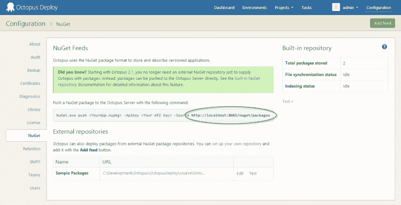
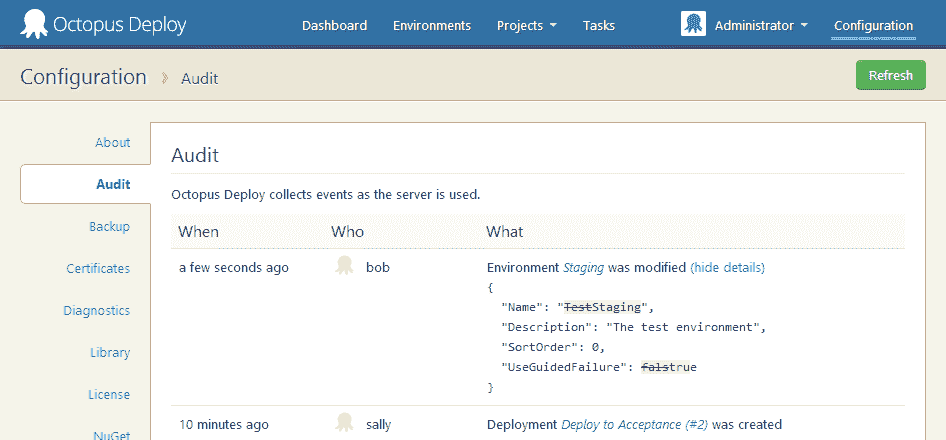
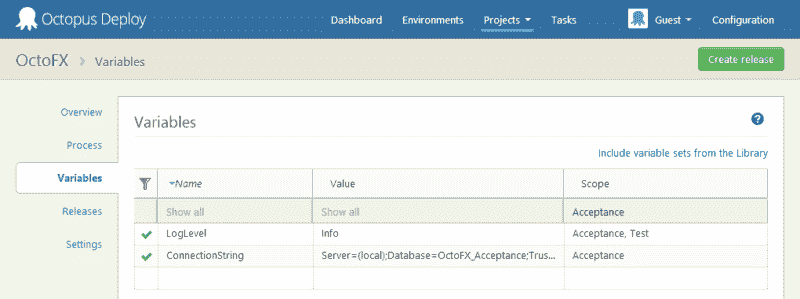
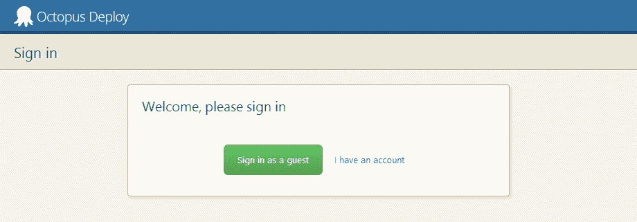
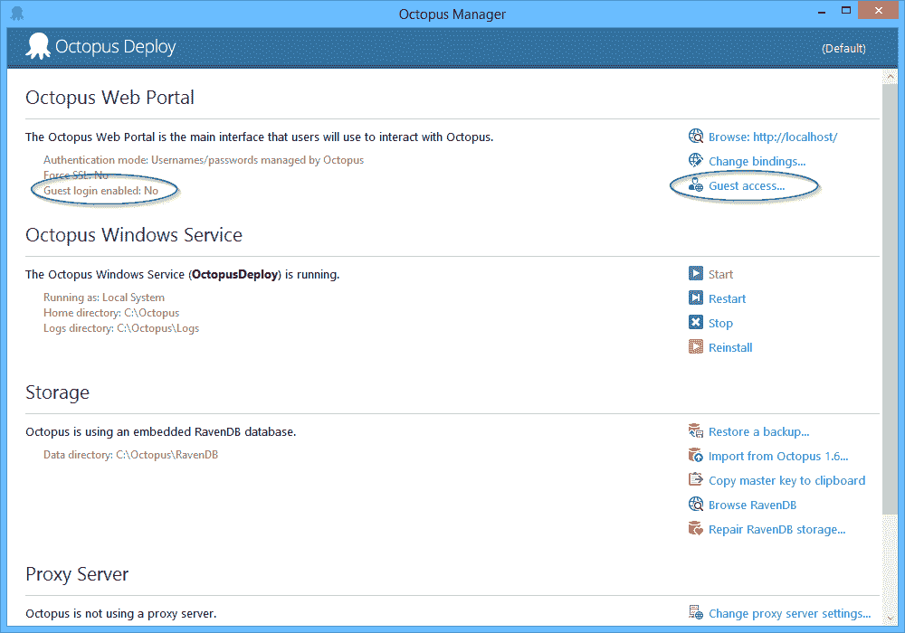
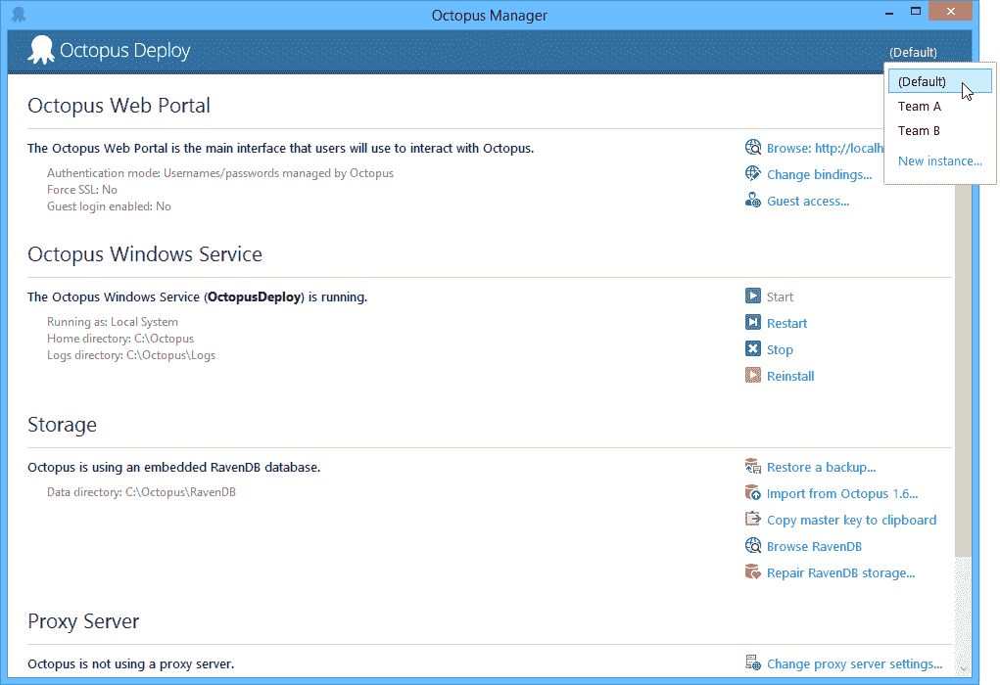

# Octopus 2.1 的新特性- Octopus 部署

> 原文：<https://octopus.com/blog/2.1>

今天我们发布了章鱼部署 2.1 的预览版。Octopus 2.0 仅在一周前发布，在那一周，我认为我们已经做了很多。让我们看看 2.1 有什么新功能。

## 内置的 NuGet 存储库

Octopus 现在附带了一个内置的 NuGet 存储库，你可以将应用程序包推送到这个存储库。这个知识库是基于优秀的 [NuGet。Lucene](https://github.com/themotleyfool/NuGet.Lucene) ，使它成为比使用文件共享更快的选择。该存储库是只写的；你可以使用 NuGet.exe*推送* NuGet 包给它，但是你不能像标准的 NuGet feed 一样查询它。

当然，您可以继续使用其他外部 NuGet 包存储库；当你正在设置一个 Octopus 服务器，并且没有你想要使用的现有存储库时，这个存储库只是提供了一个很好的缺省值。

## 详细审计

为了提高责任性和透明度，[审计日志](http://docs.octopusdeploy.com/display/OD/Auditing)现在在查看文档更改时会显示不同的更改内容。例如，这里我们可以看到是 Bob 将测试环境重命名为 Staging。淘气的鲍勃！

(有趣的是，自从 Octopus 2.0 发布以来，我们实际上一直在捕捉这些信息，但直到现在我们还没有一个 UI 来显示活动细节)

## 变量编辑器改进

我们有很多人要求这样做:你现在可以在变量编辑器中排序和过滤变量。

## 作为客人登录

有时你可能希望允许人们在没有用户帐户的情况下登录 Octopus。我们引入了[作为访客](http://docs.octopusdeploy.com/display/OD/Guest+login)登录的功能。

当然，默认情况下**是禁用的。**您可以从 Octopus Manager 中启用它:

来宾用户始终是只读的。您可以通过为他们分配角色来限制他们可以查看的环境和项目。

## 多实例管理

你知道吗，你可以在一台机器上运行多个 Octopus 服务器和触手，每个都有自己的数据库、配置、Windows 服务等等。以前只能通过命令行管理这些实例，但现在我们可以直接从 Octopus 和触手管理器管理实例。

## 其他变化

2.1 还包括许多小的 bug 修复和微小的增强，比如克隆项目的能力。[阅读完整的发行说明](http://octopusdeploy.com/downloads/2.1.1.1171)看看还有什么变化。愉快的部署！