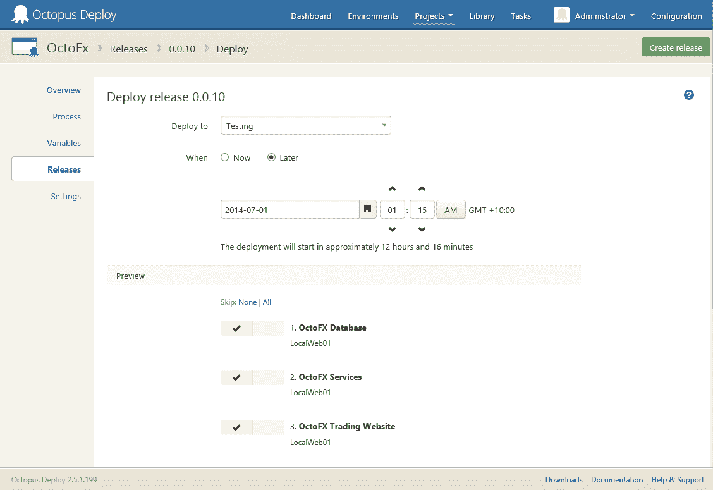
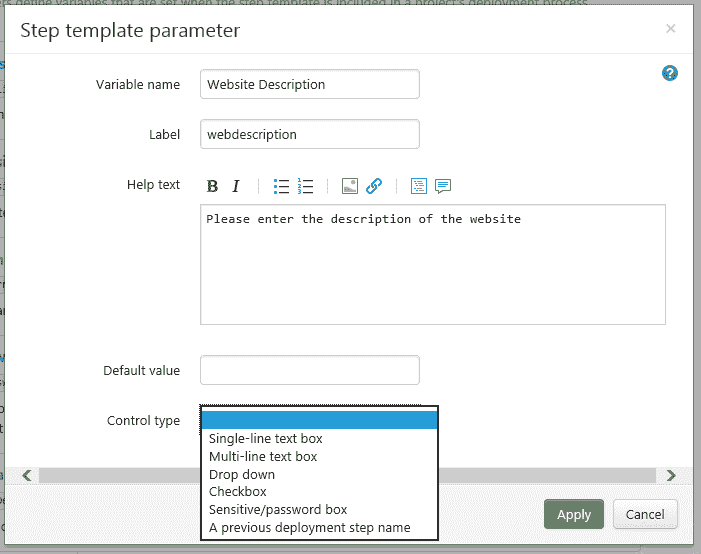

# Octopus 2.5 的新特性- Octopus 部署

> 原文：<https://octopus.com/blog/2.5>

作为预发布版本提供的 [Octopus Deploy 2.5](http://octopusdeploy.com/downloads/2.5.1) 已经上架(可以这么说)。关闭不到 50 个 GitHub 问题，让我们看看引擎盖下是什么。

## 计划部署

您是那些不得不在深夜起床运行部署的系统管理员之一吗？这是你的特色。现在，您可以躺在床上，等待计划的部署为您运行。

如您所见，您现在可以计划部署运行的时间。

提交时,“任务”页面会显示部署已排队以及何时运行。

您还可以在项目仪表板上查看排队部署。

## 有组织的任务页面，包括过滤

以前在任务页面上很难找到已经运行的特定任务，只是按日期提供所有任务的列表。但不是现在。现在，您可以选择环境、项目或活动类型，并过滤列表。它在页面顶部列出一个组中的所有活动任务，下面是可过滤和可搜索的已完成任务列表。

## Octo.exe 现在显示出进步

现在，当使用 Octo.exe 进行部署时，您可以传递`--progress`参数，这会将部署输出到控制台。

## 步骤模板更新

第一个步骤模板发生了变化:现在您可以查看步骤模板的使用位置，以及它在项目中是否是最新的。

我们还更新了步骤模板变量。它们现在允许自定义字段类型和类型化参数。

## 部署不再试图过时的触角

以前，如果触手没有与 Octopus 服务器匹配的版本，部署将继续。已通过停止部署并给出错误消息纠正了此问题。

# 突破性变化！

在这个版本中有两个突破性的变化值得注意。

## 重大变化:内部 NuGet 存储库不再被监视

那些使用内置 NuGet 存储库的人，我们不再监视文件夹的变化，因为这导致了一些锁定问题。如果您使用 API 或 nuget.exe 将文件推送到存储库，这种变化应该不会影响您。如果你使用 XCOPY，它会有效果。使用外部馈送将是唯一的选择。不过，我们会在每次重启八达通服务器服务时刷新存储库索引。

## 重大变化:部署中使用的所有机器都需要唯一的 SQUID

如果部署检测到两台或多台机器具有相同的 SQUID，部署将停止，直到重复的机器从机器目标中删除。

# 现在就去看看吧！

我们已经更新了[章鱼现场演示](https://demo.octopusdeploy.com/)使用 2.5！所以去看看吧！