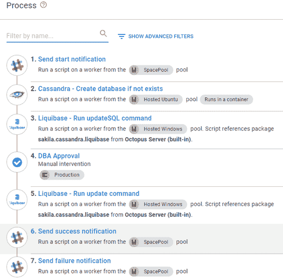
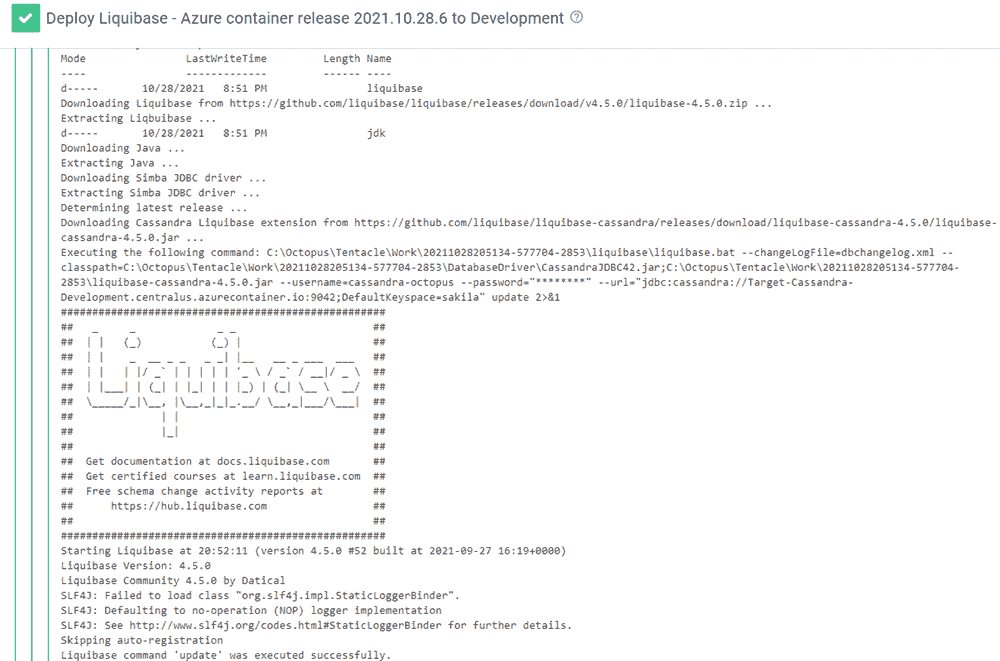
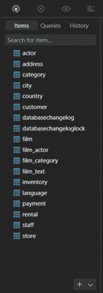

# 将数据库更改部署到 Cassandra - Octopus 部署

> 原文：<https://octopus.com/blog/deploying-to-cassandra>

NoSQL 仍然是数据库世界的颠覆者。像 MongoDB、Couchbase、Azure Cosmos DB 和 Amazon DynamoDB 这样的名字是 NoSQL 实现最容易识别的名字。然而，我们越来越多地听到客户谈论 Cassandra。

这篇文章向您展示了如何使用 Octopus Deploy 和 [Liquibase](https://liquibase.org) 将数据库更改部署到 Cassandra 服务器。

## 示例项目:Sakila

这篇文章使用了 [Sakila](https://bitbucket.org/octopussamples/sakila/src/master/) 示例项目。Sakila 项目包含使用不同数据库部署技术将 Sakila 数据库部署到不同数据库服务器的示例。

[Cassandra](https://bitbucket.org/octopussamples/sakila/src/master/src/liquibase/cassandra/) 文件夹包含一个 XML 文件，该文件是为使用 Liquibase 产品在 keyspace 中创建表而构建的。

<details><summary>dbchangelog.xml</summary></details>

```
<?xml version="1.1" encoding="UTF-8" standalone="no"?>
<databaseChangeLog  xmlns:ext="http://www.liquibase.org/xml/ns/dbchangelog-ext" xmlns:pro="http://www.liquibase.org/xml/ns/pro" xmlns:xsi="http://www.w3.org/2001/XMLSchema-instance" xsi:schemaLocation="http://www.liquibase.org/xml/ns/dbchangelog-ext http://www.liquibase.org/xml/ns/dbchangelog/dbchangelog-ext.xsd http://www.liquibase.org/xml/ns/pro http://www.liquibase.org/xml/ns/pro/liquibase-pro-3.9.xsd http://www.liquibase.org/xml/ns/dbchangelog http://www.liquibase.org/xml/ns/dbchangelog/dbchangelog-3.9.xsd">
    <changeSet author="Shawn.Sesna (generated)" id="1603898648791-1">
        <createTable tableName="category">
            <column name="category_id" type="int">
                <constraints nullable="false" primaryKey="true" primaryKeyName="PK_category_category_id"/>
            </column>
            <column name="name" type="varchar">
                <constraints nullable="false"/>
            </column>
            <column name="last_update" type="date">
                <constraints nullable="false"/>
            </column>
        </createTable>
    </changeSet>
    <changeSet author="Shawn.Sesna (generated)" id="1603898648791-2">
        <createTable tableName="language">
            <column  name="language_id" type="int">
                <constraints nullable="false" primaryKey="true" primaryKeyName="PK_language_language_id"/>
            </column>
            <column name="name" type="varchar">
                <constraints nullable="false"/>
            </column>
            <column name="last_update" type="date">
                <constraints nullable="false"/>
            </column>
        </createTable>
    </changeSet>
    <changeSet author="Shawn.Sesna (generated)" id="1603898648791-3">
        <createTable tableName="address">
            <column  name="address_id" type="int">
                <constraints nullable="false" primaryKey="true" primaryKeyName="PK_address_address_id"/>
            </column>
            <column name="address" type="varchar">
                <constraints nullable="false"/>
            </column>
            <column name="address2" type="varchar"/>
            <column name="district" type="varchar">
                <constraints nullable="false"/>
            </column>
            <column name="city_id" type="int">
                <constraints nullable="false"/>
            </column>
            <column name="postal_code" type="varchar"/>
            <column name="phone" type="varchar">
                <constraints nullable="false"/>
            </column>
            <column name="last_update" type="date">
                <constraints nullable="false"/>
            </column>
        </createTable>
    </changeSet>
    <changeSet author="Shawn.Sesna (generated)" id="1603898648791-4">
        <createTable tableName="film">
            <column  name="film_id" type="int">
                <constraints nullable="false" primaryKey="true" primaryKeyName="PK_film_film_id"/>
            </column>
            <column name="title" type="varchar">
                <constraints nullable="false"/>
            </column>
            <column name="description" type="varchar"/>
            <column name="release_year" type="int"/>
            <column name="language_id" type="int">
                <constraints nullable="false"/>
            </column>
            <column name="original_language_id" type="int"/>
            <column name="rental_duration" type="int">
                <constraints nullable="false"/>
            </column>
            <column name="rental_rate" type="decimal">
                <constraints nullable="false"/>
            </column>
            <column name="length" type="int"/>
            <column name="replacement_cost" type="decimal">
                <constraints nullable="false"/>
            </column>
            <column name="rating" type="varchar"/>
            <column name="special_features" type="varchar"/>
            <column name="last_update" type="date">
                <constraints nullable="false"/>
            </column>
        </createTable>
    </changeSet>
    <changeSet author="Shawn.Sesna (generated)" id="1603898648791-5">
        <createTable tableName="staff">
            <column  name="staff_id" type="int">
                <constraints nullable="false" primaryKey="true" primaryKeyName="PK_staff_staff_id"/>
            </column>
            <column name="first_name" type="varchar">
                <constraints nullable="false"/>
            </column>
            <column name="last_name" type="varchar">
                <constraints nullable="false"/>
            </column>
            <column name="address_id" type="int">
                <constraints nullable="false"/>
            </column>
            <column name="picture" type="blob"/>
            <column name="email" type="varchar"/>
            <column name="store_id" type="int">
                <constraints nullable="false"/>
            </column>
            <column name="active" type="boolean">
                <constraints nullable="false"/>
            </column>
            <column name="username" type="varchar">
                <constraints nullable="false"/>
            </column>
            <column name="password" type="varchar"/>
            <column name="last_update" type="date">
                <constraints nullable="false"/>
            </column>
        </createTable>
    </changeSet>
    <changeSet author="Shawn.Sesna (generated)" id="1603898648791-6">
        <createTable tableName="store">
            <column  name="store_id" type="int">
                <constraints nullable="false" primaryKey="true" primaryKeyName="PK_store_store_id"/>
            </column>
            <column name="manager_staff_id" type="int">
                <constraints nullable="false"/>
            </column>
            <column name="address_id" type="int">
                <constraints nullable="false"/>
            </column>
            <column name="last_update" type="date">
                <constraints nullable="false"/>
            </column>
        </createTable>
    </changeSet>
    <changeSet author="Shawn.Sesna (generated)" id="1603898648791-7">
        <createTable tableName="rental">
            <column  name="rental_id" type="int">
                <constraints nullable="false" primaryKey="true" primaryKeyName="PK_rental_rental_id"/>
            </column>
            <column name="rental_date" type="date">
                <constraints nullable="false"/>
            </column>
            <column name="inventory_id" type="int">
                <constraints nullable="false"/>
            </column>
            <column name="customer_id" type="int">
                <constraints nullable="false"/>
            </column>
            <column name="return_date" type="date"/>
            <column name="staff_id" type="int">
                <constraints nullable="false"/>
            </column>
            <column name="last_update" type="date">
                <constraints nullable="false"/>
            </column>
        </createTable>
    </changeSet>
    <changeSet author="Shawn.Sesna (generated)" id="1603898648791-8">
        <createTable tableName="city">
            <column  name="city_id" type="int">
                <constraints nullable="false" primaryKey="true" primaryKeyName="PK_city_city_id"/>
            </column>
            <column name="city" type="varchar">
                <constraints nullable="false"/>
            </column>
            <column name="country_id" type="int">
                <constraints nullable="false"/>
            </column>
            <column name="last_update" type="date">
                <constraints nullable="false"/>
            </column>
        </createTable>
    </changeSet>
    <changeSet author="Shawn.Sesna (generated)" id="1603898648791-9">
        <createTable tableName="film_actor">
            <column name="actor_id" type="int">
                <constraints nullable="false" primaryKey="true" primaryKeyName="PK_film_actor_actor_id"/>
            </column>
            <column name="film_id" type="int">
                <constraints nullable="false" primaryKey="true" primaryKeyName="PK_film_actor_actor_id"/>
            </column>
            <column name="last_update" type="date">
                <constraints nullable="false"/>
            </column>
        </createTable>
    </changeSet>
    <changeSet author="Shawn.Sesna (generated)" id="1603898648791-10">
        <createTable tableName="film_category">
            <column name="film_id" type="int">
                <constraints nullable="false" primaryKey="true" primaryKeyName="PK_film_category_film_id"/>
            </column>
            <column name="category_id" type="int">
                <constraints nullable="false" primaryKey="true" primaryKeyName="PK_film_category_film_id"/>
            </column>
            <column name="last_update" type="date">
                <constraints nullable="false"/>
            </column>
        </createTable>
    </changeSet>
    <changeSet author="Shawn.Sesna (generated)" id="1603898648791-11">
        <createTable tableName="film_text">
            <column name="film_id" type="int">
                <constraints nullable="false" primaryKey="true" primaryKeyName="PK_film_text_film_id"/>
            </column>
            <column name="title" type="varchar">
                <constraints nullable="false"/>
            </column>
            <column name="description" type="varchar"/>
        </createTable>
    </changeSet>
    <changeSet author="Shawn.Sesna (generated)" id="1603898648791-12">
        <createTable tableName="actor">
            <column  name="actor_id" type="int">
                <constraints nullable="false" primaryKey="true" primaryKeyName="PK_actor_actor_id"/>
            </column>
            <column name="first_name" type="varchar">
                <constraints nullable="false"/>
            </column>
            <column name="last_name" type="varchar">
                <constraints nullable="false"/>
            </column>
            <column name="last_update" type="date">
                <constraints nullable="false"/>
            </column>
        </createTable>
    </changeSet>
    <changeSet author="Shawn.Sesna (generated)" id="1603898648791-13">
        <createTable tableName="inventory">
            <column  name="inventory_id" type="int">
                <constraints nullable="false" primaryKey="true" primaryKeyName="PK_inventory_inventory_id"/>
            </column>
            <column name="film_id" type="int">
                <constraints nullable="false"/>
            </column>
            <column name="store_id" type="int">
                <constraints nullable="false"/>
            </column>
            <column name="last_update" type="date">
                <constraints nullable="false"/>
            </column>
        </createTable>
    </changeSet>
    <changeSet author="Shawn.Sesna (generated)" id="1603898648791-14">
        <createTable tableName="customer">
            <column  name="customer_id" type="int">
                <constraints nullable="false" primaryKey="true" primaryKeyName="PK_customer_customer_id"/>
            </column>
            <column name="store_id" type="int">
                <constraints nullable="false"/>
            </column>
            <column name="first_name" type="varchar">
                <constraints nullable="false"/>
            </column>
            <column name="last_name" type="varchar">
                <constraints nullable="false"/>
            </column>
            <column name="email" type="varchar"/>
            <column name="address_id" type="int">
                <constraints nullable="false"/>
            </column>
            <column name="active" type="boolean">
                <constraints nullable="false"/>
            </column>
            <column name="create_date" type="date">
                <constraints nullable="false"/>
            </column>
            <column name="last_update" type="date"/>
        </createTable>
    </changeSet>
    <changeSet author="Shawn.Sesna (generated)" id="1603898648791-15">
        <createTable tableName="country">
            <column  name="country_id" type="int">
                <constraints nullable="false" primaryKey="true" primaryKeyName="PK_country_country_id"/>
            </column>
            <column name="country" type="varchar">
                <constraints nullable="false"/>
            </column>
            <column name="last_update" type="date">
                <constraints nullable="false"/>
            </column>
        </createTable>
    </changeSet>
    <changeSet author="Shawn.Sesna (generated)" id="1603898648791-16">
        <createTable tableName="payment">
            <column  name="payment_id" type="int">
                <constraints nullable="false" primaryKey="true" primaryKeyName="PK_payment_payment_id"/>
            </column>
            <column name="customer_id" type="int">
                <constraints nullable="false"/>
            </column>
            <column name="staff_id" type="int">
                <constraints nullable="false"/>
            </column>
            <column name="rental_id" type="int"/>
            <column name="amount" type="decimal">
                <constraints nullable="false"/>
            </column>
            <column name="payment_date" type="date">
                <constraints nullable="false"/>
            </column>
            <column name="last_update" type="date"/>
        </createTable>
    </changeSet>
 </databaseChangeLog> 
```

在本文中，您使用构建服务器或 [Octopus 命令行界面(CLI)](https://octopus.com/docs/octopus-rest-api/octopus-cli) 将 dbchangelog.xml 文件打包成. zip 包以进行部署。

Cassandra 部署流程

## 本文假设您知道如何创建 Octopus 项目并向部署过程添加步骤。如果你是 Octopus 的新手，可以考虑阅读我们的[入门文档](https://octopus.com/docs/getting-started)来熟悉这些概念。

在之前的文章中， [Liquibase - Apply changeset](https://library.octopus.com/step-templates/6a276a58-d082-425f-a77a-ff7b3979ce2e/actiontemplate-liquibase-apply-changeset) 模板被用来更新数据库。然而，这个模板只包含了 Liquibase 产品的一小部分功能，已经被替换为 [Liquibase - Run 命令](https://library.octopus.com/step-templates/36df3e84-8501-4f2a-85cc-bd9eb22030d1/actiontemplate-liquibase-run-command)。

**Liquibase - Run 命令**更加灵活，已经实现了许多可用于 Liquibase 产品的命令。这个模板还有更多的**数据库类型**选项，包括**雪花**和**卡珊德拉**。

Cassandra 的部署过程如下所示:

**发送开始通知**

*   **Cassandra -如果数据库不存在，则创建数据库**
*   **Liquibase -运行更新 SQL 命令**
*   **数据库管理员批准**
*   **Liquibase -运行更新命令**
*   **发送成功通知**
*   **发送失败通知**
*   [](#)

发送开始通知

### **发送开始通知**步骤使用[Slack-Send Simple Notification](https://library.octopus.com/step-templates/99e6f203-3061-4018-9e34-4a3a9c3c3179/actiontemplate-slack-send-simple-notification)社区步骤模板，在 Slack 中发送消息让渠道知道部署已经开始。

**挂钩网址**:您的 Slack 账户的挂钩链接

*   **通道手柄**:要置入的通道
*   **图标网址**:发布时使用的图标网址
*   **用户名**:发帖用户的姓名
*   **职称**:职务职称
*   **消息**:帖子详细消息
*   **颜色**:颜色为帖
*   卡桑德拉-创建数据库(如果不存在)

### 卡桑德拉的数据库被称为**键空间**。 [Cassandra - Create database 如果不存在的话](https://library.octopus.com/step-templates/8ab26143-22d7-4e2f-83a8-f0e2d74a4de2/actiontemplate-cassandra-create-database-if-not-exists)模板自动在 Cassandra 服务器上创建**键空间**。

**服务器名称**:Cassandra 服务器的名称或 IP 地址

*   **端口**:卡桑德拉端口正在监听
*   **(可选)用户名**:具有创建密钥空间足够权限的用户名
*   **(可选)密码**:有足够权限创建密钥空间的用户密码
*   **服务器模式**:网络拓扑或简单
*   **键空间**:要创建的键空间的名称
*   **复制品数量**:要创建的复制品数量
*   Liquibase -运行 updateSQL 命令

### Liquibase 中的`updateSQL`命令分析更改日志，并生成一个包含运行`update`命令时将执行的 SQL 的文件。该文件随后作为工件上传到章鱼服务器。

**专业许可证密钥**:某些 Liquibase 命令需要专业许可证密钥。

*   **数据库类型**:您要部署到的数据库服务器*的类型。
*   *数据库技术列表并不是利基市场可以部署的完整列表，只是章鱼部署已经过测试。覆盖下拉列表将导致失败，因为模板不知道如何构造 JDBC 连接字符串。

**命令**:命令下拉列表*。如果命令不存在，可通过点击链( [](#) )图标并输入所需命令来覆盖下拉菜单。

*   *这不是 Liquibase 可用命令的完整列表，只是那些用 Octopus Deploy 测试过的命令。

**附加开关** : Liquibase 具有可提供的附加开关，例如设置 loglevel(例如，`--logLevel=debug`)。

*   **更改日志文件名**:这是包含 Liquibase 更改日志的文件。
*   **变更集包**:包含变更日志的包。
*   **服务器名称**:要连接的服务器的名称或 IP 地址。
*   **服务器端口**:服务器监听的端口。
*   **数据库名称**:要更新的数据库名称(在 Cassandra 的情况下为 keyspace)。
*   **用户名**:用于更新的可选用户名。如果省略用户名和密码，将使用工人/触手的身份。
*   **密码**:可选用户名的密码。
*   **连接查询字符串参数**:有些数据库服务器需要设置额外的连接参数。在 Cassandra 的例子中，你可以输入[；AuthMech=1](https://downloads.datastax.com/jdbc/cql/2.0.4.1004/Simba%20Cassandra%20JDBC%20Install%20and%20Configuration%20Guide.pdf#page=31) 如果你想使用用户名/密码。
*   **数据库驱动路径**:数据库驱动所在的文件夹。在需要扩展驱动的情况下，使用一个`;`作为分隔符(Cassandra 需要一个)。如果您使用**下载 Liquibase** 选项，请留空。
*   **可执行文件路径**:liqui base . bat 所在的位置
*   **下载 Liquibase** :如果您的软件包中没有包含 Liquibase 产品，使用此选项动态下载 Liquibase、所选`Database type`的驱动程序和扩展，以及运行 Liquibase 的 Java。
*   **Liquibase 版本**:默认情况下**下载 Liquibase** 下载最新版本。使用此选项下载特定版本的 Liquibase。
*   DBA 批准

### 这一步是可选的，取决于您的 DBA 对自动化部署过程的信心。它暂停您的部署，并允许 DBA 查看由 **Liquibase - Run updateSQL 命令**步骤生成的 SQL 文件，并批准或拒绝部署。

Liquibase -运行更新命令

### 这个步骤使用与 **Liquibase - Run updateSQL 命令**相同的模板，但是使用`update`命令而不是`updateSQL`。

发送成功通知

### 该步骤使用与**发送开始通知**相同的模板，并在部署成功执行时执行。

发送失败通知

### 这个步骤使用与 **Send start notification** 相同的模板，仅在部署失败时向 Slack 发送消息。

部署结果

## 部署完成后，您会看到类似这样的内容:

[](#)

使用类似于 [TablePlus](https://tableplus.com/) 的工具，您可以连接到 Cassandra 服务器，并查看用 dbchangelog.xml 文件中的表填充的密钥空间。

[](#)

结论

## 这篇文章演示了如何使用 Octopus Deploy 和 Liquibase 自动部署到 Cassandra 数据库服务器。

愉快的部署！

愉快的部署！