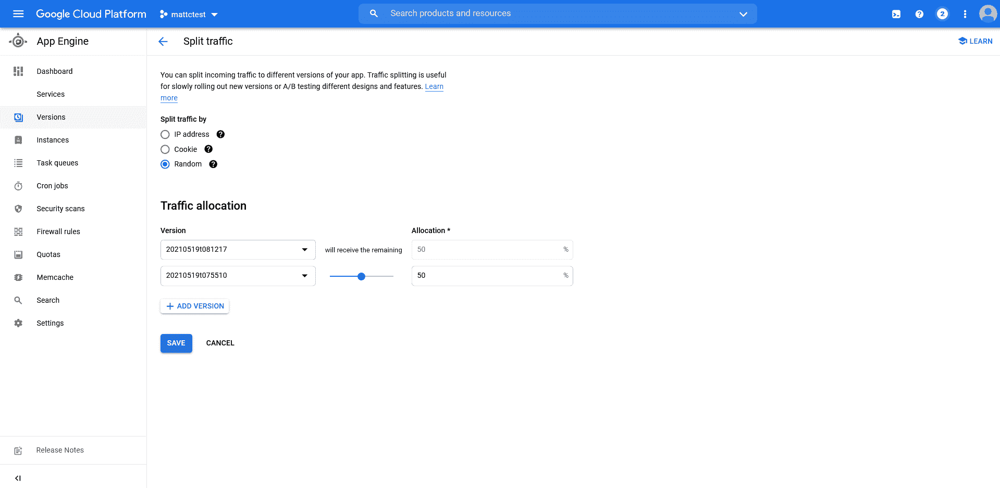

# 部署到 Google 应用引擎- Octopus Deploy

> 原文：<https://octopus.com/blog/deploying-to-google-app-engine>

谷歌应用引擎(GAE)是由谷歌云平台(GCP)提供的最初的平台即服务(PaaS)产品之一。

GAE 托管着用各种不同语言编写的 web 应用程序。它还提供网络路由、作业调度、持久数据存储和任务队列。

在本文中，我将介绍如何将一个示例应用程序部署到 GAE，并操纵网络来实现常见的部署场景，如蓝/绿、金丝雀和特性分支部署。

## 简单的部署

GAE 为 Java 提供了两种部署:

*   部署由 GAE 编译的源代码
*   部署已编译的应用程序

允许 GAE 编译您的源代码是很方便的，尽管在这个例子中我使用了一个已经被我们的 CI 系统编译过的 JAR 文件。

在 GAE，部署已编译应用程序的能力是 Java 独有的。Node、Python、Ruby 和 PHP 等其他运行时通常不会生成编译后的应用程序。Go 是一个明显的例外，在这种情况下，你需要部署你的源代码，让 GAE 为你编译。

我们的示例应用程序是一个简单的 Java Spring web 应用程序，名为 Random Quotes。这个应用程序的源代码可以在 GitHub 中找到[。这个应用程序生成一个自包含的 JAR 文件来托管应用程序和一个内置的 web 服务器。](https://github.com/OctopusSamples/RandomQuotes-Java)

要部署应用程序，您需要在 GCP 项目中创建一个相应的 GAE 应用程序资源。以下步骤显示了通过 web 控制台创建的应用程序资源。第一步是选择托管应用程序资源的位置:

[](#)

然后定义将托管您的 web 应用程序的环境:

[](#)

在创建 GAE 实例时，提供了一些关于后续步骤的说明。

[](#)

该过程的最终结果是创建了下图所示的**应用程序**:

[](#)

每个项目只能有一个应用程序资源。如果您尝试创建另一个应用程序，比如在不同的地区，您会看到如下错误:

```
ERROR: (gcloud.app.create) The project [mattctest] already contains an App Engine application. You can deploy your application using `gcloud app deploy`. 
```

创建应用程序资源后，您就可以部署 web 应用程序了。一个应用程序资源可以承载许多服务，其中每个服务运行您自己的应用程序。

服务是在一个名为`app.yaml`的文件中定义的(有点混乱)。下面是一个示例`app.yaml`文件，您可以使用它来定义和部署您的 Java web 应用程序:

```
runtime: java11
service: default
instance_class: F2 
```

运行时是定义将承载您的代码的平台的必需属性。我找不到一个明确的运行时列表，但是`java`、`java8`和`java11`都包含在文档和示例的不同地方。我在这里使用`java11`，因为 Java 11 是 GAE [第二代](https://cloud.google.com/appengine/docs/standard/runtimes)的一部分。

部署到 GAE 的第一个服务必须被称为`default`，所以我在`service`字段中定义了这个名称。

如果您尝试使用非默认名称部署服务，您会得到以下错误:

```
The first service (module) you upload to a new application must be the 'default' service (module). 
```

您还需要使用比默认情况下提供的稍微大一点的[实例](https://cloud.google.com/appengine/docs/standard#instance_classes)。这是在`instance_class`属性中定义的。F2 实例提供了 512MB 的内存，这是您的 web 应用程序所需要的。

使用以下命令编译 Java 应用程序:

```
./mvnw package 
```

这将在`target`目录下创建一个 JAR 文件。

在编写本文时，示例应用程序的版本是 0.1.9，所以 JAR 文件被称为`target/randomquotes.0.1.9.jar`。

要部署 web 应用程序，请运行以下命令，替换项目名称以匹配您的环境:

```
gcloud app deploy .\target\randomquotes.0.1.9.jar --appyaml .\app.yaml --project mattctest 
```

然后部署编译后的应用程序。部署日志将类似 https://[project name]. UC . r . appspot . com/的 URL 返回到实时服务，您可以在 web 浏览器中打开该服务:

[](#)

## 部署功能分支

一种常见的部署模式是让特性分支与主线分支并行部署。为了模拟这种情况，部署 web 应用程序的 [blueheader](https://github.com/OctopusSamples/RandomQuotes-Java/tree/blueheader) 分支，它会将横幅的背景颜色更改为蓝色。

这个分支的`app.yaml`文件如下所示:

```
runtime: java11
service: blueheader
instance_class: F2

env_variables:
  SERVER_SERVLET_CONTEXT_PATH: "/blueheader" 
```

我给这个服务起了一个新名字，以匹配特性分支的名字。我还定义了`SERVER_SERVLET_CONTEXT_PATH`环境变量，将其设置为`/blueheader`。这定义了 web 应用程序期望从中接收流量的上下文路径。这允许您测试一些流量路由规则，这意味着您可以从类似 https://[project name]. UC . r . appspot . com/blue header 的 URL(与 https://blue header-dot-[project name]. UC . r . appspot . com 的唯一服务 URL 相反)访问新服务。

为了将子目录`blueheader`路由到新服务，创建一个名为`displatch.yaml`的文件，包含以下内容。这些调度规则定义了如何将流量从 URL 路由到服务:

```
dispatch:
  - url: "*/"
    service: default

  - url: "*/blueheader"
    service: blueheader

  - url: "*/blueheader/*"
    service: blueheader 
```

这是通过以下命令部署的:

```
gcloud app deploy dispatch.yaml --project mattctest 
```

现在可以在 URL https://[project name]. UC . r . appspot . com/blue header 打开功能分支:

[](#)

## 流量分割、金丝雀和蓝/绿部署

现在，让我们看看如何使用流量分流来实施淡黄色和蓝/绿色部署。

为此，您需要将`pom.xml`文件中的应用程序版本升级到`0.1.10`:

```
<?xml version="1.0" encoding="UTF-8"?>
<project  xmlns:xsi="http://www.w3.org/2001/XMLSchema-instance"
         xsi:schemaLocation="http://maven.apache.org/POM/4.0.0 https://maven.apache.org/xsd/maven-4.0.0.xsd">
    <version>0.1.10</version>
    ...
</project> 
```

然后，使用以下命令重新打包该应用程序:

```
./mvnw package 
```

使用以下命令部署新版本:

```
gcloud app deploy .\target\randomquotes.0.1.10.jar --appyaml .\app.yaml --project mattctest --no-promote 
```

`--no-promote`选项确保这个新版本不接收任何流量，所以打开 https://[project name]. UC . r . appspot . com/还是会显示之前版本的 web app。

在**版本**选项卡中，有一个按钮叫做**分流**:

[](#)

单击此按钮允许您在服务版本之间定向流量。在下面的截图中，你可以看到流量在最新的两个版本之间对半分割。您已经随机分割了流量，因为这允许您刷新 URL 并查看两个版本。但是，如果您正在执行生产 canary 部署，您可能会基于 cookie 或 IP 地址将用户定向到同一版本，这样每个请求就不会被路由到随机版本:

[](#)

现在对 https://[project name]. UC . r . appspot . com/的请求 50%返回 0.1.9 版本，50%返回 0.1.10 版本。

金丝雀部署是通过逐渐增加新版本服务的流量来实现的。完成任何测试后，蓝/绿部署只需将流量 100%切换到新版本。您可以使用类似 https://[version]-dot-[project name]. UC . r . appspot . com/的 URL 测试任何流量分流规则之外的特定版本。

## 结论

Google App Engine 为托管 web 应用程序提供了一个灵活的平台。网络路由和流量分流功能允许执行复杂的部署流程，如功能分支、金丝雀和蓝/绿。

在这篇博文中，我部署了一个简单的 Java web 应用程序，并演示了如何执行高级部署模式。

愉快的部署！