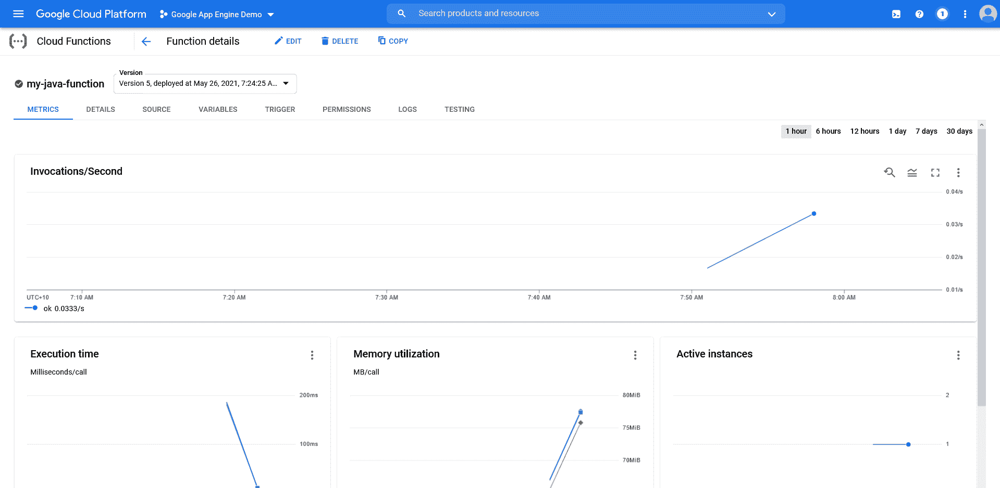
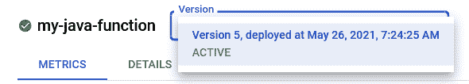

# 部署到谷歌云功能-八达通部署

> 原文：<https://octopus.com/blog/deploying-to-google-cloud-functions>

谷歌云功能(GCF)是谷歌的功能即服务(FaaS)平台。它允许简单的应用程序按需运行，以响应通过外部源(如 HTTP 请求)触发的事件，或者来自其他谷歌云平台(GCP)服务触发的事件(如文件上传到 bucket)。

GCF 支持用以下语言编写的函数:

*   节点. js
*   计算机编程语言
*   去
*   Java 语言(一种计算机语言，尤用于创建网站)
*   。网络核心
*   红宝石
*   服务器端编程语言（Professional Hypertext Preprocessor 的缩写）

像 [Google App Engine (GAE)](https://octopus.com/blog/deploying-to-google-app-engine) 一样，GCF 大多期望原始源代码被上传到平台。Java 应用程序有一个例外，它支持 JAR 文件的[部署。但是其他编译语言像 Go 和 C#需要上传源代码，GCF 会负责下载依赖项和编译代码。](https://cloud.google.com/functions/docs/concepts/java-deploy#deploy_from_a_jar)

在本文中，我将演示如何将一个简单的 Java 应用程序部署到 GCF，并探索高级部署模式的选项。

## 示例应用程序

我们的示例应用程序为随机报价 web 应用程序实现了一个 API。源代码可以在 [GitHub](https://github.com/OctopusSamples/RandomQuotesAPI-Java-Google-Cloud-Functions) 上找到。该 API 唯一的工作是返回一个 JSON blob，其中有一段作者的名言。这个 JSON 的一个例子如下所示:

```
{
    "quote": "Everything should be made as simple as possible, but not simpler.", 
    "author": "Albert Einstein", 
    "appVersion": "1.0.22", 
    "environmentName": "Google Cloud Functions", 
    "quoteCount": "0" 
} 
```

JSON 还包括生成响应的函数的版本，以及一个指示该函数实例被调用次数的计数器。计数器允许您跟踪 GCF 是否为您的请求创建了一个新的函数实例，或者重用了一个现有的实例。

这个 API 将由一个简单的 web 应用程序使用。为了方便起见，前端已经发布为 Docker 映像，您可以使用下面的命令运行它，其中`Your GCP Project ID`将被替换为该函数已经部署到的 GCP 项目的 ID:

```
docker run \
    -p 8080:8080 \
    -e APIENDPOINT=https://us-central1-[Your GCP Project ID].cloudfunctions.net/my-java-function \
    octopussamples/randomquotesgo 
```

然后可以在 http://localhost:8080/index . html 打开 web 应用程序。

## 部署功能

正如简介中提到的，GCF 主要希望您部署函数源代码，而不是编译好的应用程序。这很方便，因为它允许您直接部署 Git 存储库的内容。

GitHub 通过在每次[发布](https://github.com/OctopusSamples/RandomQuotesAPI-Java-Google-Cloud-Functions/releases)时捕获 zip 文件中的代码，使这变得特别容易。这为您提供了强大的工作流程，其中:

1.  Git 存储库标记有给定的版本
2.  GitHub 用相关的 zip 文件创建一个版本
3.  您将源代码包上传到 GCF

下载并提取最新的[版本](https://github.com/OctopusSamples/RandomQuotesAPI-Java-Google-Cloud-Functions/releases)。然后，您可以使用以下命令部署它:

```
gcloud functions deploy my-java-function \
    --entry-point com.octopus.RandomQuotes \
    --runtime java11 \
    --trigger-http \
    --allow-unauthenticated 
```

`--entry-point`参数定义了响应触发器而运行的类。运行时用`--runtime`参数定义。您需要使用`--trigger-http`参数通过 HTTP 来执行这个函数。

最后，您允许匿名用户使用`--allow-unauthenticated`参数来执行这个函数。

部署该功能后，它会显示在 GCP 控制台中:

[](#)

## 高级部署策略

GCP 提供的其他平台，如谷歌应用引擎和谷歌云运行，提供了部署修订或版本的能力，每个版本都有独特的端点。

[Google App Engine](https://octopus.com/blog/deploying-to-google-app-engine) 具有原生功能，可以在版本之间分割流量，同时提供特定于版本的 URL，如 https://[version]-dot-[project name]. UC . r . appspot . com/允许独立访问各个版本。

[Google Cloud Run](https://octopus.com/blog/deploying-to-google-cloud-run) 允许通过标签部署已命名的修订版，流量可以在标签之间分割，并且可以通过类似 https://[tagname]-randomquotes-5od2layuca-ts.a.run.app/.的 URL 直接访问已标记的修订版

GCF 不提供类似的功能。控制台提供了一个下拉列表，显示功能修订，但是根据我的经验，这个列表只显示失败的部署。在下面的屏幕截图中，您可以看到一个具有多个部署的功能，版本列表仅显示最新版本:

[](#)

这意味着不能直接与以前版本的函数交互，也不能同时运行两个版本。任何部署策略，如蓝/绿、金丝雀或功能分支，都依赖于部署具有唯一名称的功能，并通过辅助负载平衡服务将流量导向这些功能。

## 结论

对于任何希望快速部署简单应用程序的人来说，Google Cloud Functions 是一个方便的解决方案，无论是通过 HTTP 支持面向公众的交互，还是对 GCP 生态系统中的事件做出响应。

与 GCP 提供的其他应用托管平台不同，云功能提供了非常简单的版本和网络选项。这意味着高级部署策略必须通过命名约定在外部进行编排。然而，对于更传统的部署，这种缺乏灵活性可能是一种福气，因为功能部署需要很少的努力，尤其是当您考虑到 Google 会为您编译代码时。

愉快的部署！