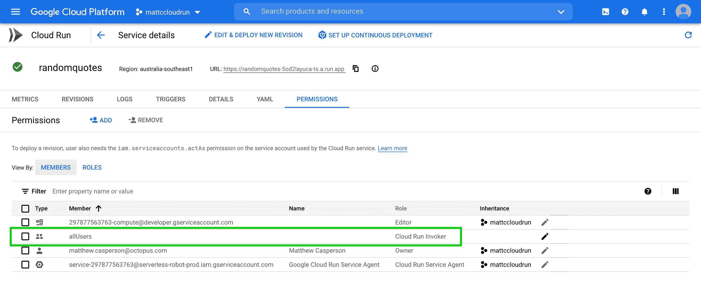
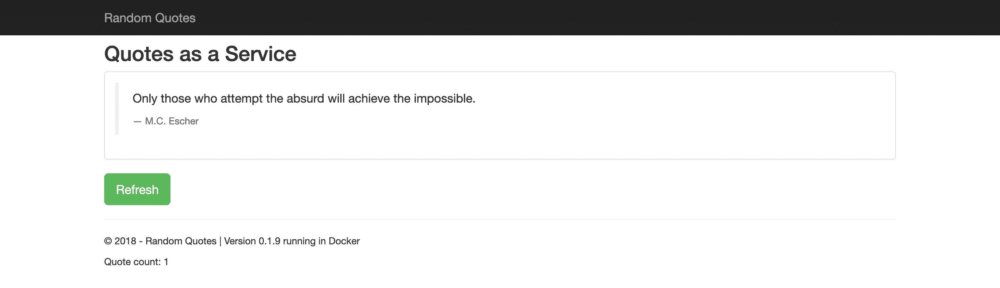
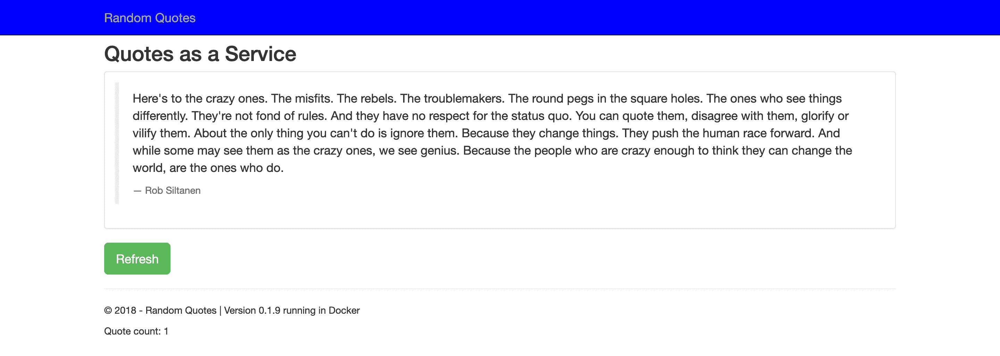
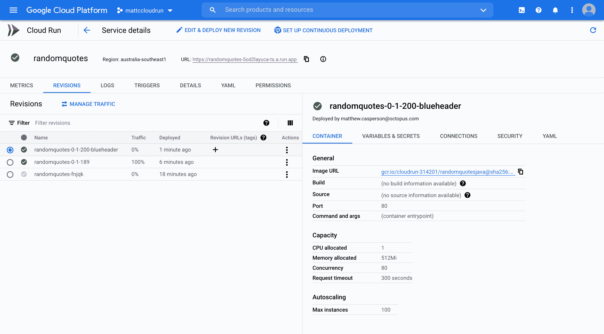
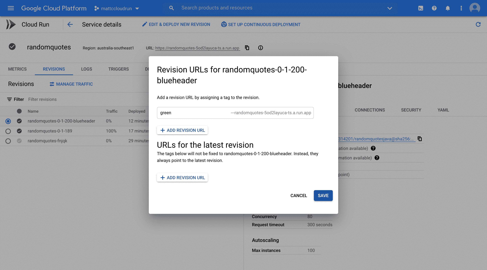

# 部署到 Google Cloud Run - Octopus 部署

> 原文：<https://octopus.com/blog/deploying-to-google-cloud-run>

Google Cloud Run 是谷歌云平台(GCP)上相对较新的平台即服务(PaaS)产品。它允许您运行和缩放容器图像，同时只为处理请求的时间付费。

在本文中，我将介绍如何在 Cloud Run 中部署一个示例应用程序，并使用流量整形规则来执行部署策略，如 feature branches、canary 和 blue/green。

## 部署示例应用程序

让我们从部署一个名为[随机报价](https://github.com/OctopusSamples/RandomQuotes-Java)的示例应用程序开始。这个 Java Spring web 应用程序已经被推送到 Docker Hub，我在撰写本文时使用的最新标签是`octopussamples/randomquotesjava:0.1.189`。

当部署到 Cloud Run 时，您需要从将 Docker 映像推送到 Google 容器注册中心(GCR)开始。云运行不支持外部注册表。

使用传统的`docker` CLI 工具，您可以使用以下命令拉和推映像，确保用包含您的云运行服务的项目 ID 替换`cloudrun-314201`:

```
docker pull octopussamples/randomquotesjava:0.1.189
docker tag octopussamples/randomquotesjava:0.1.189 gcr.io/cloudrun-314201/randomquotesjava:0.1.189
docker push gcr.io/cloudrun-314201/randomquotesjava:0.1.189 
```

其他像`skopeo`这样的工具复制 Docker 图片更方便。以下命令会将映像从 Docker Hub 注册表直接复制到 GCR:

```
skopeo copy docker://octopussamples/randomquotesjava:0.1.189 docker://gcr.io/cloudrun-314201/randomquotesjava:0.1.189 
```

如果您尝试从外部注册表引用 Docker 映像，您会收到以下错误:

```
ERROR: (gcloud.beta.run.services.replace) Expected a Container Registry image path like [region.]gcr.io/repo-path[:tag and/or @digest] or an Artifact Registry image path like [region-]docker.pkg.dev/repo-path[:tag and/or @digest], but obtained octopussamples/randomquotesjava:0.1.189 
```

接下来，在名为`service.yaml`的文件中定义服务 YAML 资源。

如果你熟悉库伯内特，YAML 的结构看起来会很熟悉。它遵循所有 Kubernetes 资源使用的`apiVersion`、`kind`、`metadata`和`spec`布局。事实上，您在这里定义的服务是 [Knative](https://knative.dev/docs/reference/api/serving-api/) 的一部分，因为 Cloud Run 是 Knative 服务的托管实现:

```
apiVersion: serving.knative.dev/v1
kind: Service
metadata:
  name: randomquotes
spec:
  template:
    spec:
      containers:
        - image: gcr.io/cloudrun-314201/randomquotesjava:0.1.189
          ports:
            - name: http1
              containerPort: 80 
```

*   属性定义了服务的名称。
*   属性引用了我们复制到 GCR 的 Docker 图像。
*   可以将`spec.template.spec.containers[0].ports.name`属性设置为`h2c`来表示端口由 HTTP2 公开，或者设置为`http1`来表示端口由 HTTP1 公开。
*   `spec.template.spec.containers[0].ports.containerPort`属性定义了容器公开的接收 web 流量的端口。

要部署此服务，请运行命令:

```
gcloud beta run services replace service.yaml --platform managed 
```

部署服务后，您会收到一个类似于`https://randomquotes-5od2layuca-ts.a.run.app`的 URL，可以用来访问它。打开 URL 可能会导致显示以下错误:

[](#)

解决方案是给`allUsers`用户`Cloud Run Invoker`权限:

[](#)

然后，您可以打开您的 web 应用程序:

[](#)

## 功能分支部署

要部署从功能分支创建的映像，首先将其复制到 GCR。这里您有一个带有标签`0.1.200-blueheader`的特征分支图像，您可以使用命令将它复制到 GCR:

```
skopeo copy docker://octopussamples/randomquotesjava:0.1.200-blueheader docker://gcr.io/cloudrun-314201/randomquotesjava:0.1.200-blueheader 
```

分配给服务的 URL 基于服务名称。在下面的 YAML 中，您需要更改服务名称以包含要素分支名称:

```
apiVersion: serving.knative.dev/v1
kind: Service
metadata:
  name: randomquotes-blueheader
spec:
  template:
    spec:
      containers:
        - image: gcr.io/cloudrun-314201/randomquotesjava:0.1.200-blueheader
          ports:
            - name: http1
              containerPort: 80 
```

同样，使用以下命令部署该服务:

```
gcloud beta run services replace service.yaml --platform managed 
```

返回的 URL 将类似于`https://randomquotes-blueheader-5od2layuca-ts.a.run.app`。

通过重命名服务，您现在可以将功能分支与主线部署并行运行:

[](#)

## 淡黄色和蓝/绿色部署

要执行淡黄色或蓝绿色部署，您可以使用服务修订。修订的名称在`spec.template.metadata.name`属性中定义。它必须以服务名为前缀，并且只能使用小写字母、数字或破折号。

这里我们定义了一个名为`randomquotes-0-1-189`的版本:

```
apiVersion: serving.knative.dev/v1
kind: Service
metadata:
  name: randomquotes
spec:
  template:
    metadata:
      name: randomquotes-0-1-189
    spec:
      containers:
        - image: gcr.io/cloudrun-314201/randomquotesjava:0.1.189
          ports:
            - name: http1
              containerPort: 80 
```

默认情况下，此修订版在部署时将接收 100%的流量。

现在让我们部署一个新版本:

```
apiVersion: serving.knative.dev/v1
kind: Service
metadata:
  name: randomquotes
spec:
  template:
    metadata:
      name: randomquotes-0-1-200-blueheader
    spec:
      containers:
        - image: gcr.io/cloudrun-314201/randomquotesjava:0.1.200-blueheader
          ports:
            - name: http1
              containerPort: 80
  traffic:
  - revisionName: randomquotes-0-1-200-blueheader
    percent: 0
  - revisionName: randomquotes-0-1-189
    percent: 100 
```

此新版本已被设置为不接收流量，而是将 100%的流量重定向到以前的版本:

【T2 

如果您认为以前的版本是蓝绿色部署的蓝色部分，则新版本将是绿色部分。您可以通过为其指定标签来访问此新版本:

[](#)

这个新版本可以通过一个类似`https://green---randomquotes-5od2layuca-ts.a.run.app/`的 URL 打开，在将任何主要流量导向它之前进行测试。

金丝雀部署可以通过逐渐将更多流量导向绿色堆栈来实现。以下命令将 10%的流量导向新版本:

```
gcloud run services update-traffic randomquotes --platform managed --to-revisions=randomquotes-0-1-200-blueheader=10,randomquotes-0-1-189=90 
```

可以重复此命令，直到 100%的流量都被定向到新版本。在更传统的蓝/绿部署中，在新堆栈上的任何测试完成后，100%的流量会立即切换到新版本。

测试完成后，我们可以用下面的命令删除`green`标签:

```
gcloud run services update-traffic randomquotes --platform managed --remove-tags green 
```

## 结论

Google Cloud Run 是一个部署网络应用的便捷平台，只有在处理请求时才会产生费用。云运行提供自动扩展来处理传入的请求，流量路由规则允许您实施蓝/绿和金丝雀风格的部署。

这篇文章介绍了如何将 Docker 镜像复制到 GCR，然后部署一个服务。我们操纵修订版和流量规则来实现蓝/绿和金丝雀部署。我们还研究了如何使用标签来访问一个没有流量的版本。

愉快的部署！