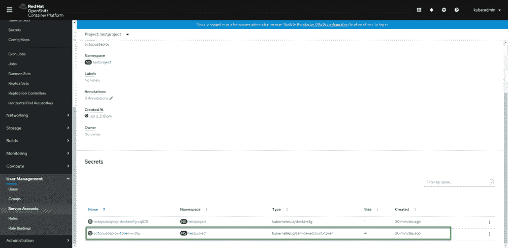
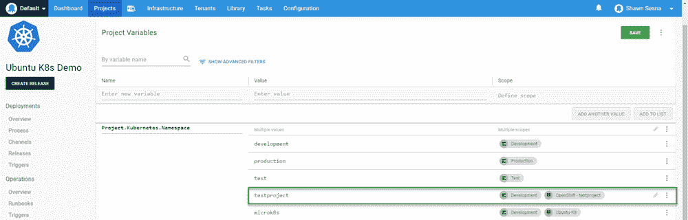
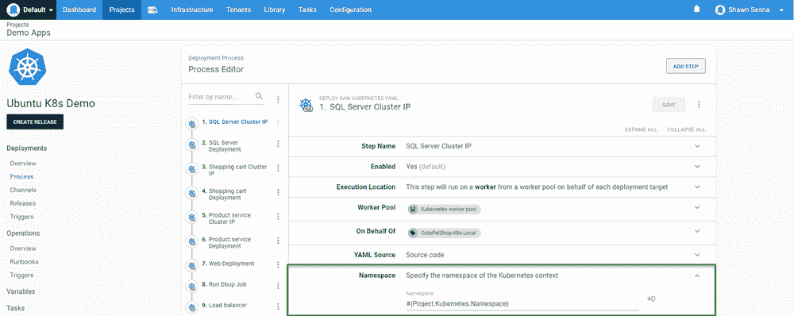
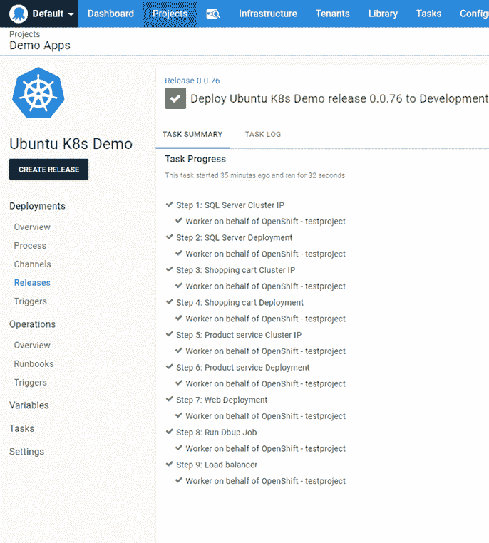
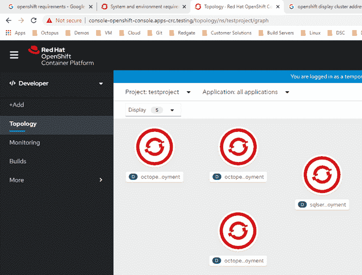

# 使用 Octopus Deploy - Octopus Deploy 部署到 Red Hat OpenShift

> 原文：<https://octopus.com/blog/deploying-to-openshift-with-octopus-deploy>

[](#)

在之前的一篇文章中，我写了使用 Octopus Deploy 部署到由 Rancher 管理的 Kubernetes (K8s)集群。在这篇文章中，我将讨论一个类似的主题，如何部署到 Red Hat OpenShift。

## 红帽 OpenShift

和 Rancher 一样，Red Hat OpenShift 也是一个 K8s 管理平台。然而，这是相似性的终点，这两种产品是非常不同的。运行 OpenShift 的系统需求并不是无足轻重的。至少有三个主节点，每个主节点至少有 4 个 vCPUs 和 16 GB RAM。工作节点需要更少的资源:1 个 vCPU 和 8gb RAM。

OpenShift 有一个精简版，设计用于在笔记本电脑上运行，用于开发和试用目的，称为 CodeReady Containers (CRC)。我在这篇文章中使用的是 CRC 版本，因为我的虚拟机管理程序没有足够的剩余资源来托管完整版本的 OpenShift。即使它是一个精简版，CRC 仍然具有相同的整体功能。

### 使用 CRC

本节分享了我在使用 CRC 时学到的一些经验。如果您不打算使用它，可以跳过这一部分。

要下载 CRC，您需要一个红帽帐户。

CRC 有三种类型:

*   Windows (Hyper-V)
*   macOS (HyperKit)
*   Linux (Libvirt)

在这篇文章中，我使用的是 Windows Hyper-V 版本。

#### Hyper-V 虚拟交换机

Windows CRC 下载是一个单一的。exe 文件。这个文件负责创建和配置 VM，以便在笔记本电脑上运行 OpenShift。我使用 CRC 发现的一件事是，它专门使用 Hyper-V 中的默认虚拟交换机。一段时间前，Windows 禁用了编辑默认虚拟交换机的功能，因此它永久地停留在使用网络地址转换(NAT)上。然而，我确实发现了 CRC 的一个未被广泛宣传的功能，如果您创建一个名为`crc`的虚拟交换机，虚拟机的配置将使用该虚拟交换机。

#### CRC 将 DNS 服务器更改为自身

Red Hat 的人员试图通过一个包罗万象的解决方案来帮助您学习 OpenShift 产品，从而使事情变得尽可能简单。这包括更改您的网络设置，将 DNS 服务器更改为自身，以便您可以解析内置 DNS 条目。我承认，在一切都准备好的时候，我没有对这些消息给予足够的关注，然后我挠头了一会儿，试图找出为什么我的本地 DNS 条目不再工作了。在我弄明白这一点之后，很容易就可以在笔记本电脑本地复制 DNS 条目，这样外部机器就可以与 OpenShift 集群进行交互。

### OpenShift 透视图

OpenShift 的接口有两种模式，称为透视图:

显示的选项会根据您使用的透视图而变化。管理员透视图显示了与操作和管理相关的选项，而开发人员透视图只显示了开发人员关心的选项。

### 创建项目

OpenShift 使用项目来帮助您组织您需要的资源，并将所有东西放在一起。项目由应用程序的所有组件组成，可以从项目屏幕进行监控。要创建项目，请执行以下操作:

1.  确保您已经选择了管理员视角。
2.  如果您切换了视角，请等待显示更新(如果您使用 CRC，这可能需要几秒钟)。
3.  从管理员的角度，点击蓝色的**创建项目**按钮。
4.  给你的项目命名，然后点击**创建**。

#### 创建服务帐户

为了部署到 OpenShift，我们需要向 Octopus Deploy 提供它可以用来连接到 OpenShift 的凭证。每个 OpenShift 项目都有一个可以定义服务帐户的部分。创建项目后:

1.  展开**用户管理**。
2.  点击**服务账户**。
3.  点击**创建服务账户**。

#### 创建角色绑定

创建服务帐户后，我们需要给它一个角色，以便它可以在集群上创建资源。

我在使用 UI 获得正确的权限时遇到了一些困难，但是我发现使用命令行**oc.exe**工具可以让我给我的服务帐户提供正确的权限:

```
C:\Users\Shawn.Sesna\.kube>oc.exe policy add-role-to-user cluster-admin -z octopusdeploy 
```

通过运行以下命令确保您在正确的项目中，

```
C:\Users\Shawn.Sesna\.kube>oc project <project name> 
```

#### 服务帐户令牌

OpenShift 将自动为您的服务帐户创建一个令牌。该令牌是服务帐户从 Octopus Deploy 向 OpenShift 进行身份验证的方式。要检索令牌的值，请执行以下操作:

1.  点击**服务账户**。
2.  点击`octopusdeploy`(或任何您命名的名称)。
3.  向下滚动到**机密**部分。
4.  点击带有`kubernetes.io/service-account-token`的`type`的条目。

[](#)

通过单击令牌右侧的复制到剪贴板图标来复制令牌值。

#### 群集 URL

我们需要来自 OpenShift 的最后一条信息是集群的 URL。使用`oc.exe`命令行工具，我们可以通过`status`命令快速检索我们需要的 URL:

```
C:\Users\Shawn.Sesna\.kube>oc.exe status
In project testproject on server https://api.crc.testing:6443 
```

## 将 OpenShift 连接到 Octopus 部署

将 OpenShift 连接到 Octopus Deploy 的过程与其他 K8s 集群相同。首先，创建一个帐户，然后添加一个 K8s 集群目标。

### 创建一个帐户

在我们可以连接我们的 OpenShift K8s 目标之前，我们必须创建一个帐户来验证它。在 Octopus 门户网站中，导航至**基础设施**选项卡，并点击**账户**:

1.  点击**添加账户**。
2.  选择**令牌**。
3.  输入账户值，点击**保存**。

现在我们已经创建了一个帐户，我们准备创建我们的 Kubernetes 目标。

### 添加 K8s 集群

要添加 OpenShift K8s 集群:

1.  导航至 **基础设施➜部署目标** 。
2.  点击**添加部署目标**。
3.  点击 **KUBERNETES 集群**类别。
4.  然后在 Kubernetes 集群上点击**添加**。

Kubernetes 部署目标表单的两个最重要的部分是:

*   证明
*   Kubernetes 详细信息

#### 证明

我们将为 OpenShift 集群使用的身份验证类型是 token。

#### Kubernetes 详细信息

这就是我们使用从**oc.exe**`status`命令中获取的 URL 的地方:https://api.crc.testing:6443。我的集群正在使用自签名证书，因此我选择了**跳过 TLS 验证**。

[T31](#)

将“名称空间”框留空。

点击**保存**就完成了。

通过观察**任务**选项卡中的初始健康检查来验证连接。

## 部署到 OpenShift

在这篇文章的开始，我们在 OpenShift 中创建了这个项目。项目名是我们部署到的 K8s 名称空间。这很重要，因为当我们为部署创建步骤时，我们需要确保指定要部署到哪个名称空间。

就像在 Rancher 帖子中一样，我使用了来自《Hello World》之外的[帖子中的相同部署过程:构建一个真实世界的 Kubernetes CI/CD 管道](https://octopus.com/blog/build-a-real-world-kubernetes-cicd-pipeline)帖子。我给`Project.Kubernetes.Namespace`变量添加了一个值`testproject`,以将它限定在我们的新目标范围内:

[](#)

该值将用于我们的部署步骤:

[](#)

### 执行部署

我必须对负载平衡器资源的 YAML 做一个小的更改。OpenShift 不喜欢使用外部 IP:

```
Forbidden: externalIPs have been disabled 
```

在我注释掉它之后，我能够成功地部署:

[](#)

在 OpenShift 中，我们可以看到我们所有的资源确实都是被创建的:

[](#)

## 结论

在这篇文章中，我演示了如何将 Red Hat OpenShift 与 Octopus Deploy 集成。愉快的部署！