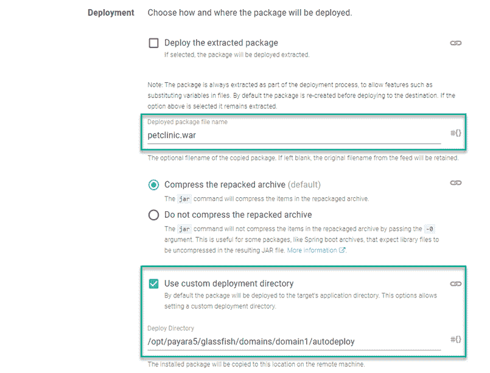
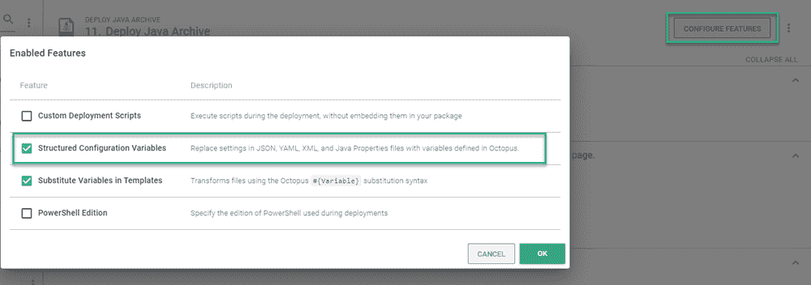
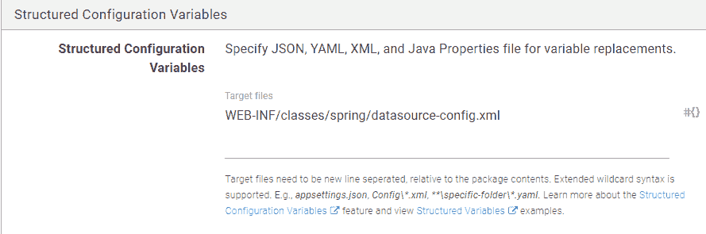
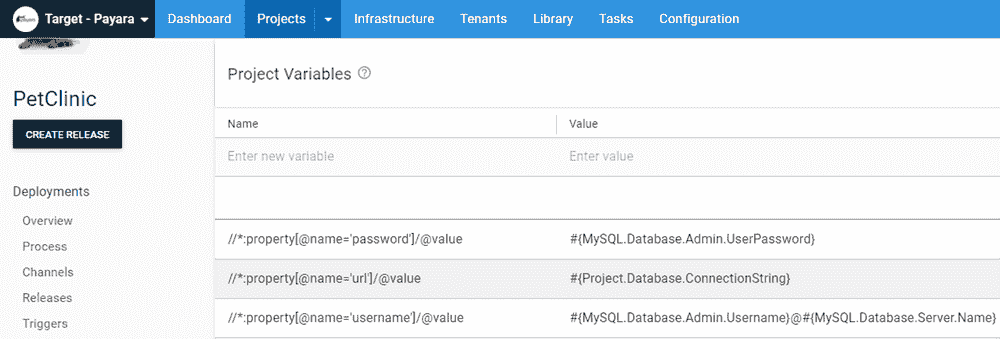
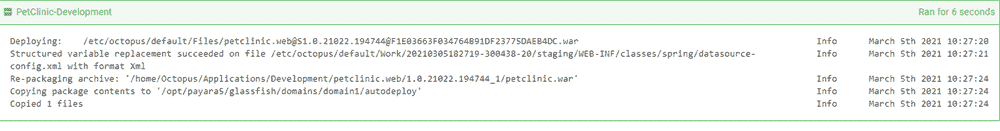
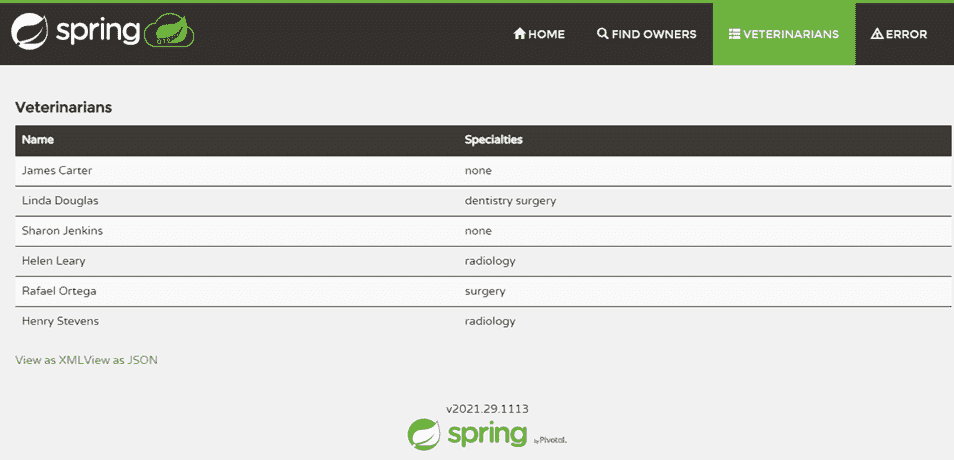

# 部署到 Payara - Octopus 部署

> 原文：<https://octopus.com/blog/deploying-to-payara>

[](#)

当您用 Java 开发应用程序时，您可以选择更多的 web 服务器来部署。Octopus Deploy 内置了对 Tomcat 和 Wildfly (JBoss)的支持，但是也支持其他服务器技术。

在这篇文章中，我演示了如何将 Java 应用程序 PetClinic 部署到 Payara web 服务器上。

## 基础设施

在这篇文章中，我在 Azure 中设置了一个 MySQL PaaS 服务器作为我的数据库后端，并为 Payara 设置了一个 Ubuntu VM。我用一个 [runbook](https://octopus.com/docs/runbooks) 自动提供这些资源，因此它们可以根据我的需要上下旋转(参见我们的[示例实例了解详细信息](https://samples.octopus.app/app#/Spaces-642))。我选择了 Linux 操作系统来运行 web 服务器，但 Payara 也会在 Windows 上运行。

下面是 Azure Resource Manager (ARM)模板和 Bash automation 脚本的代码，用于安装 Octopus 触手和 Payara 服务器:

### MySQL PaaS 模板代码

```
{
    "$schema": "http://schema.management.azure.com/schemas/2014-04-01-preview/deploymentTemplate.json#",
    "contentVersion": "1.0.0.0",
    "parameters": {
        "administratorLogin": {
            "type": "string"
        },
        "administratorLoginPassword": {
            "type": "securestring"
        },
        "location": {
            "type": "string"
        },
        "serverName": {
            "type": "string"
        },
        "skuCapacity": {
            "type": "int"
        },
        "skuFamily": {
            "type": "string"
        },
        "skuName": {
            "type": "string"
        },
        "skuSizeMB": {
            "type": "int"
        },
        "skuTier": {
            "type": "string"
        },
        "version": {
            "type": "string"
        },
        "backupRetentionDays": {
            "type": "int"
        },
        "geoRedundantBackup": {
            "type": "string"
        },
        "previewFeature": {
            "type": "string",
            "defaultValue": ""
        },
        "tags": {
            "type": "object",
            "defaultValue": {}
        },
        "storageAutoGrow": {
            "type": "string",
            "defaultValue": "Disabled"
        },
        "infrastructureEncryption": {
            "type": "string",
            "defaultValue": "Disabled"
        }
    },
    "resources": [
        {
            "apiVersion": "2017-12-01-preview",
            "kind": "",
            "location": "[parameters('location')]",
            "name": "[parameters('serverName')]",
            "properties": {
                "version": "[parameters('version')]",
                "administratorLogin": "[parameters('administratorLogin')]",
                "administratorLoginPassword": "[parameters('administratorLoginPassword')]",
                "storageProfile": {
                    "storageMB": "[parameters('skuSizeMB')]",
                    "backupRetentionDays": "[parameters('backupRetentionDays')]",
                    "geoRedundantBackup": "[parameters('geoRedundantBackup')]",
                    "storageAutoGrow": "[parameters('storageAutoGrow')]"
                },
                "previewFeature": "[parameters('previewFeature')]",
                "infrastructureEncryption": "[parameters('infrastructureEncryption')]"
            },
            "sku": {
                "name": "[parameters('skuName')]",
                "tier": "[parameters('skuTier')]",
                "capacity": "[parameters('skuCapacity')]",
                "size": "[parameters('skuSizeMB')]",
                "family": "[parameters('skuFamily')]"
            },
            "tags": "[parameters('tags')]",
            "type": "Microsoft.DBforMySQL/servers"
        }
    ],
    "variables": {}
} 
```

### 触手和 Payara 自动化脚本

```
#!/bin/bash

# Install Octpous listening tentacle
serverUrl="#{Global.Base.Url}"   # The url of your Octous server
thumbprint="#{Global.Server.Thumbprint}"       # The thumbprint of your Octopus Server
apiKey="#{Global.Api.Key}"           # An Octopus Server api key with permission to add machines
name="PetClinic-#{Octopus.Environment.Name}"      # The name of the Tentacle at is will appear in the Octopus portal
publicHostName="#{Global.Environment.Prefix}#{Octopus.Space.Name | Replace " "}.#{Azure.Location.Abbr}.cloudapp.azure.com"      # The url to the tentacle
environment="#{Octopus.Environment.Name}"  # The environment to register the Tentacle in
role="PetClinic-Web"   # The role to assign to the Tentacle
configFilePath="/etc/octopus/default/tentacle-default.config"
applicationPath="/home/Octopus/Applications/"
spaceName="#{Octopus.Space.Name}"

sudo apt install --no-install-recommends gnupg curl ca-certificates apt-transport-https && \
curl -sSfL https://apt.octopus.com/public.key | sudo apt-key add - && \
sudo sh -c "echo deb https://apt.octopus.com/ stable main > /etc/apt/sources.list.d/octopus.com.list" && \
sudo apt update && sudo apt install tentacle -y

sudo /opt/octopus/tentacle/Tentacle create-instance --config "$configFilePath"
sudo /opt/octopus/tentacle/Tentacle new-certificate --if-blank
sudo /opt/octopus/tentacle/Tentacle configure --port 10933 --noListen False --reset-trust --app "$applicationPath"
sudo /opt/octopus/tentacle/Tentacle configure --trust $thumbprint
echo "Registering the Tentacle $name with server $serverUrl in environment $environment with role $role"
sudo /opt/octopus/tentacle/Tentacle register-with --server "$serverUrl" --apiKey "$apiKey" --name "$name" --env "$environment" --role "$role" --space "$spaceName" --publicHostName "$publicHostName"
sudo /opt/octopus/tentacle/Tentacle service --install --start

# Install JDK
sudo apt update
sudo apt install default-jdk -y

# Install Payara
wget --content-disposition 'https://info.payara.fish/cs/c/?cta_guid=b9609f35-f630-492f-b3c0-238fc55f489b&placement_guid=7cca6202-06a3-4c29-aee0-ca58af60528a&portal_id=334594&redirect_url=APefjpGt1aFvHUflpzz7Lec8jDz7CbeIIHZmgORmDSpteTCT2XjiMvjEzeY8yte3kiHi7Ph9mWDB7qUDEr96P0JS8Ev2ZFqahif2huSBfQV6lt4S6YUQpzPMrpHgf_n4VPV62NjKe8vLZBLnYkUALyR2mkrU3vWe7ME9XjHJqYPsHtxkHn-W7bYPFgY2LjEzKIYrdUsCviMgGrUh_LIbLxCESBa0N90vzaWKjK5EwZT021VaPP0jgfgvt0gF2UdtBQGcsTHrAlrb&hsutk=c279766888b67917a591ec4e209cb29a&canon=https%3A%2F%2Fwww.payara.fish%2Fall_downloads&click=5bad781c-f4f5-422d-ba2b-5e0c2bff7098&utm_referrer=https%3A%2F%2Fwww.google.co.za%2F&__hstc=229474563.c279766888b67917a591ec4e209cb29a.1519832301251.1521408251653.1521485598794.4&__hssc=229474563.7.1521485598794&__hsfp=2442083907' --output-document=payara.zip
sudo apt install unzip
sudo unzip payara.zip -d /opt

# Create password files
cat > newpassword.txt <<EOF
AS_ADMIN_PASSWORD=
AS_ADMIN_NEWPASSWORD=#{Payara.Admin.User.Password}
EOF

cat > password.txt <<EOF
AS_ADMIN_PASSWORD=#{Payara.Admin.User.Password}
EOF

# Change admin password
sudo /opt/payara5/bin/asadmin --user admin --passwordfile $PWD/newpassword.txt change-admin-password

# Create service
sudo /opt/payara5/bin/asadmin create-service --name payara

# Start the server (service creation does not start automatically)
sudo /opt/payara5/bin/asadmin start-domain

# Enable remote management
sudo /opt/payara5/bin/asadmin --user admin --passwordfile $PWD/password.txt enable-secure-admin 
```

### Azure MySQL PaaS 故障排除

我在 PaaS MySQL 服务器上遇到了一些问题。它们和我的解决方案一起列在下面，以帮助您避免这些问题。

#### 防火墙

我使用 Azure 向导为 MySQL PaaS 服务器生成 ARM 模板。该向导不包含任何安全组(防火墙)选项，因此在配置服务器时，没有任何东西可以连接到它。使用 Azure 命令行界面(CLI)，我打开了防火墙，允许 Octopus Deploy workers 和 Payara VM 与之对话:

```
az mysql server firewall-rule create --resource-group <your resource group> --server-name '<your server name>' --name AllowAllAzureIps --start-ip-address <start range> --end-ip-address <end range> 
```

#### 您没有超级权限，并且启用了二进制日志记录

如果您的应用程序的数据库部署包含任何函数或存储过程，您可能会遇到错误`You do not have the SUPER privilege and binary logging is enabled`。MySQL 的 PaaS 版本不允许您创建这些类型的对象，直到您打开`log_bin_trust_function_creators`:

```
az mysql server configuration set --resource-group <your resource group> --server-name "<your server name>" --name log_bin_trust_function_creators --value "ON" 
```

#### 其他 JDBC 查询字符串参数

在我部署了。首先，有几个额外的 querystring 参数可以让应用程序连接到数据库:

```
?useSSL=true&serverTimezone=UTC 
```

#### 用户名

Azure MySQL PaaS 要求用户名也包含主机名，因此用户名如下所示:

```
username@hostname 
```

## Octopus Deploy

这篇文章假设你熟悉在 Octopus Deploy 中创建项目。

### 过程

PetClinic 应用程序是一个带有 MySQL 后端的 Spring Boot Java 应用程序。要部署应用程序:

1.  如果数据库不存在，请创建它。
2.  使用 [Flyway](https://flywaydb.org/) 部署数据库。
3.  将 PetClinic 应用程序部署到 Payara。

这篇文章是专门关于 Payara 的，所以我们将把重点放在部署到 Payara 上。

#### 部署到帕亚拉

Octopus Deploy 包含用于部署到 Tomcat 和 Wildfly 的特定模板。然而，Payara 包含一个自动部署特性，使得创建 Payara 模板变得没有必要。通过放置。war 文件，Payara 会自动将应用程序部署到服务器上。

##### 添加部署 Java 归档步骤

在您的 Octopus 部署项目中，向您的流程添加一个**部署 Java 归档**步骤。

##### 配置部署 Java 归档文件步骤

在 **Package Details** 下，确保 **Deployment** 部分已展开(默认情况下应该在新添加的步骤上)。

为了给包重新命名，使其更加用户友好，使用**部署包文件名**选项指定一个新名称。请注意，文件名会影响应用程序的 URL。

如果**部署的包文件名**为空，它将使用原始文件名，Payara 服务器上的 URL 将类似于`http://PayaraServer/petclinic.web.1.0.21022.194744`。

我输入了`petclinic.war`，所以我的网址看起来像`http://PayaraServer/petclinic`。

为了利用 Payara 的自动部署特性，勾选框**使用定制部署目录**。自动部署文件夹位于域的子文件夹中。如果你已经看过了触手和 Payara 自动化脚本，你会注意到我把 Payara 安装到了`/opt/payara5`，所以自动部署的完整路径是`/opt/payara5/glassfish/domains/domain1/autodeploy`。

[](#)

我还启用了[结构化配置变量](https://octopus.com/docs/projects/steps/configuration-features/structured-configuration-variables-feature)特性来更新数据库连接信息。为此:

1.  点击**配置功能**按钮。
2.  勾选`Structured Configuration Variables`框。

[](#)

包含数据库信息的文件是`WEB-INF/classes/spring/datasource-config.xml`。

[](#)

##### 配置变量

最后，为 datasource-config.xml 文件创建项目变量。我需要更换三个部件:

我使用以下变量:

[](#)

变量的`Name`是 XPath 表达式，它替换了必要的组件。

### 部署

部署到开发环境，我们可以看到**结构化配置变量**特性被应用，文件被复制到`/opt/payara5/glassfish/domains/domain1/autodeploy`。

[](#)

如果我们导航到 Payara 服务器，我们可以看到 PetClinic 应用程序已经部署，并且正在提取数据。

[](#)

## 结论

没有具体的步骤模板，很容易认为 Octopus Deploy 不支持 Payara。我希望这篇文章证明了它确实是受支持的，并且易于部署。

愉快的部署！