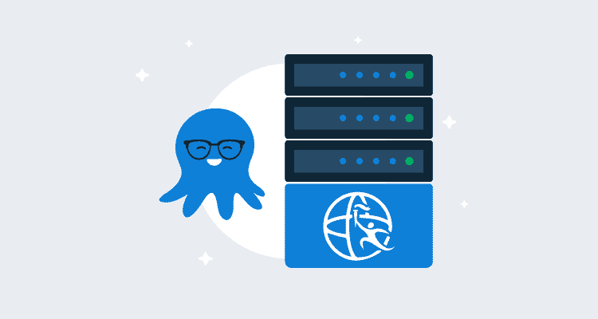
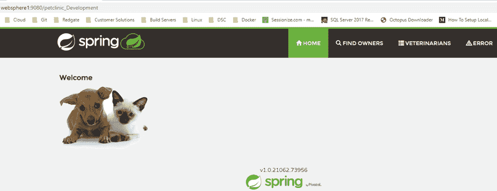

# 部署到 IBM WebSphere Liberty-Octopus Deploy

> 原文：<https://octopus.com/blog/deploying-to-websphere-liberty>

[](#)

在评估软件时，很容易忽略一个选项，因为它没有列出您使用的特定堆栈。然而，仅仅因为它没有被列出，并不意味着它不受支持。

对于基于 Java 的应用程序，Octopus Deploy 包括了部署到 Tomcat 和 Wildfly (JBoss)的具体步骤。这是两种最流行的选择，但是还有更多 web 服务器技术可用。

Web 服务器，比如 Payara 和 IBM WebSphere Liberty，会在应用程序被放在特定的文件夹中时自动部署它。没有必要为这些特定的服务器类型编写步骤模板。

在本文中，我将演示如何将 PetClinic 应用程序部署到 IBM WebSphere Liberty web 服务器上。

## IBM WebSphere Liberty

IBM WebSphere Liberty 是一种由 IBM 开发的基于 Java 的应用程序的 web 服务器技术。这个服务器既有[付费](https://www.ibm.com/cloud/websphere-liberty/pricing)又有[开源](https://openliberty.io/)变种。当应用程序放在服务器的特定文件夹中时，这两种变体具有相同的自动应用程序部署选项。此外，Liberty 可用于 Windows 和 Linux 操作系统。在这篇文章中，我使用的是 Windows。

### 建立

要安装 Liberty，只需下载并解压即可。除了安装 Java，这就是设置所需的全部内容。

### 创建服务器

将服务器软件提取到文件夹后，打开终端并导航到`bin`文件夹。我的情况是`c:\wlp\bin`。

在那里，运行下面的命令(无论在 Windows 还是 Linux 上，这个命令都是一样的):

```
server create <Name> 
```

这将在`usr\servers`文件夹中创建一个您给它起的名字的文件夹。我给我的宠物诊所打了电话(`c:\wlp\usr\servers\petclinic`)。

运行以下命令启动服务器:

```
server start <Name> 
```

最后，在你的自由服务器上安装章鱼触手。

这篇文章假设你对 Octopus 有一定的了解，但不包括触手安装。

关于如何将 Liberty 设置为作为服务运行，请参考 IBM 文档:

## 章鱼部署

在这个演示中，我将部署 Java PetClinic 应用程序。这个应用程序使用一个 MySQL 数据库后端，所以我的部署过程将包括创建数据库(如果不存在)、部署数据库更改以及最后将 Java 应用程序部署到 IBM WebSphere Liberty 的步骤。

### 过程

部署过程包括以下步骤:

*   MySQL:如果数据库不存在，则创建数据库
*   MySQL:如果不存在，则创建用户
*   参考包中的飞行路线信息
*   DBA 批准(手动干预步骤)
*   从引用的包进行快速迁移
*   将 PetClinic 部署到 WebSphere Liberty

这篇文章的重点是部署到 IBM WebSphere Liberty，并将涵盖这一步骤。

#### 部署 Java 归档文件

部署到 IBM WebSphere Liberty 使用 Octopus Deploy 的内置步骤`Deploy a Java Archive`。编辑您的流程并点击**添加步骤**并选择**部署 Java 归档**:

[](#)

选择您希望部署的角色和包，并滚动到**部署**部分。选定的包将包含包的版本号。

如果想名字更有用，就填`Deployed package file name`。在我的例子中，我希望包含环境名，所以我使用了`petclinic_#{Octopus.Environment.Name}.war`:

[](#)

如前所述，如果将应用程序放在名为 **dropins** 的特定文件夹中，IBM WebSphere Liberty 将自动部署该应用程序。 **dropins** 文件夹直接位于我们之前创建的服务器文件夹之外；`c:\wlp\usr\servers\petclinic\dropins`。

要将我们的文件放在这个特定的文件夹中，我们需要启用**使用定制部署目录**特性，并指定放在哪里:

[](#)

PetClinic 应用程序需要用数据库服务器、用户名和密码细节更新的`WEB-INF/classes/spring/datasource-config.xml`文件。为此，我们将使用**结构化配置变量**特性。滚动到该步骤的顶部，点击**配置功能**。启用**结构化配置变量**功能，点击**确定**:

[](#)

滚动到刚刚添加到表单的**结构化配置变量**部分，输入`WEB-INF/classes/spring/datasource-config.xml`作为值:

[](#)

配置此功能后，定义以下项目变量:

*   `//*:property[@name='password']/@value`:用户账号密码
*   `//*:property[@name='username']/@value`:MySQL 连接的用户名
*   `//*:property[@name='url']/@value` : JDBC 到 MySQL 的连接字符串

### 部署

定义好流程后，我们现在可以将应用程序部署到服务器上了。部署完成后，您应该会看到 PetClinic web 应用程序部署的以下输出:

[](#)

WebSphere Liberty 的默认端口是`9080`。导航到`http://websphere1:9080/petclinic_Development`显示我们的应用程序已经部署:

[](#)

## 结论

在这篇文章中，我展示了将基于 Java 的应用程序部署到 IBM WebSphere Liberty web 服务器是多么容易。希望这有帮助。

愉快的部署！