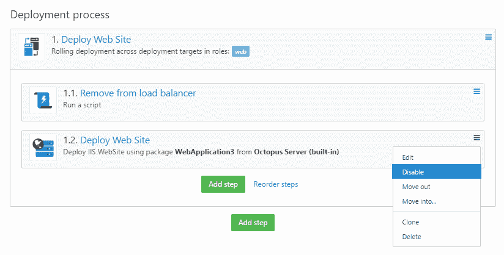
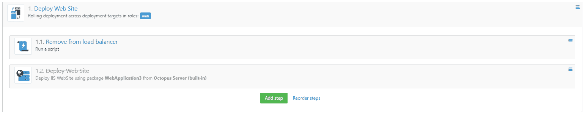
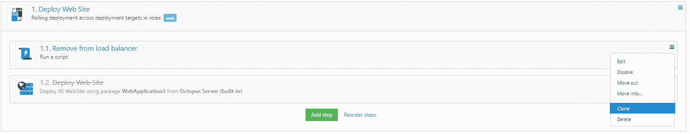
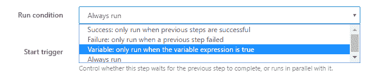
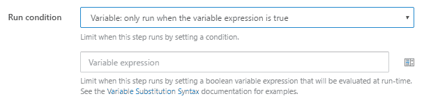

# 部署流程增强更新- Octopus 部署

> 原文：<https://octopus.com/blog/deployment-process-uservoice-update>

我们的 [2017 年路线图](https://octopus.com/blog/roadmap-2017)的重要组成部分之一是我们的用户之声目标:

> 到 2017 年底:
> 
> *   Octopus 将实现超过 200 票的所有用户语音项目

作为这一年的开始，项目建模团队(在一些团队成员的帮助下)实施并发布了以下 3 个 UserVoice 项目，我们希望这些项目能让您的部署过程变得更加简单:

## 允许步骤被“禁用”或“不活动”

虽然这项功能实际上是在 2016 年 11 月推出的，但我们想在这篇文章中提到它，因为它是客户要求最高的功能之一。

此功能允许您在配置项目部署过程时禁用任何可能导致部署问题的步骤，或者您可能只是想暂时阻止该步骤在部署时运行。以前，您要么必须删除该步骤，将它分配给不做任何事情的角色，要么在部署时跳过它，这不是最干净或最用户友好的解决方案！

现在，我们在该步骤的上下文菜单中添加了一个选项，允许您禁用该步骤，以便在消除新步骤的任何缺陷的同时仍然可以执行部署。

要禁用一个步骤，从步骤上下文菜单中选择`Disable`选项

一旦禁用了某个步骤，它将不会包含在禁用该步骤时创建的任何发布的部署计划中

要再次启用禁用的步骤，只需从步骤上下文菜单中选择`Enable`选项

## 步骤的克隆

这是一个在[蓝鳍](http://bluefin.teapotcoder.com/) Chrome 扩展中可用的功能，但是由于不是所有的组织都允许安装浏览器扩展/插件，或者可能你没有使用 Chrome，我们决定将该功能引入 Octopus，以便我们所有的客户都可以利用该功能。

要克隆一个步骤，您只需从步骤上下文菜单中选择`Clone`选项

这将复制您想要克隆的步骤，并将其添加到正在克隆的步骤下面

## 允许步骤的运行条件基于变量

该特性允许您在运行时定制您的部署流程**，为您提供了基于 [Octopus 变量表达式](https://octopus.com/docs/projects/variables/variable-substitutions#binding-variables)的**布尔**结果有条件**运行**或**跳过**动作的选项。**

一旦您选择了`Variable: only run when then variable expression is true`选项，您将会得到一个额外的字段，您可以在其中输入`Octopus Variable Expression`

根据变量的*真值*运行步骤:

`#{VariableToCheck}`(如果要检查任何不是`undefined`、空、`0`或`False`的值)或`#{if VariableToCheck == "ValueToCheckAgainst"}true{/if}`(如果要检查特定值)

基于变量的 *falsy* 值运行步骤:

`#{if VariableToCheck != "ValueToCheckAgainst"}true{/if}`

仅在所有先前步骤成功时运行一个步骤，并基于变量的*真值*:

`#{unless Octopus.Deployment.Error}#{VariableToCheck}#{/unless}`

如果前面的任何步骤失败，运行一个步骤，并基于变量的*真值*:

`#{if Octopus.Deployment.Error}#{VariableToCheck}#{/if}`

## 最后

我们今年有了一个良好的开端，我们前面还有一长串其他出色的增值功能。我们真的很兴奋，并期待着解决这些高度要求的功能。

我们真的很感谢我们所有的客户输入-所以请确保您添加您的投票到您最喜爱的功能请求！