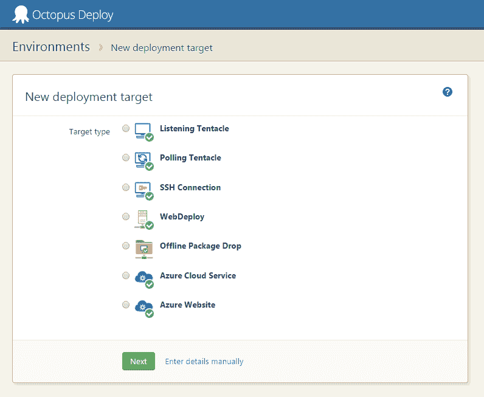
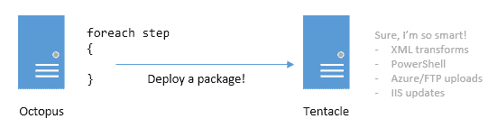
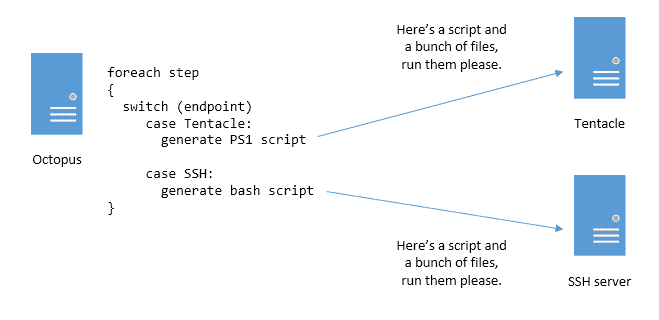

# Octopus 3.0 (RFC)中的部署目标- Octopus 部署

> 原文：<https://octopus.com/blog/deployment-targets-in-octopus-3>

在这篇文章中，我想讨论一下我们对触手所做的一些改变，以及作为 Octopus 3.0 一部分的总体部署目标。

**概要:**

*   多种类型的“机器”(监听和轮询触角、SSH、Azure 网站、Azure 云服务、WebDeploy、离线 drops)
*   像贝壳一样的触手
*   开源触手
*   不再支持 FTP 部署

## 多种类型的机器(部署目标)

Octopus 和触手是一起设计的，并且假设 Octopus 将部署到的唯一类型的“目标”将总是运行触手。2013 年，我们增加了对 Azure 云服务和 FTP 站点的支持，两者都是为了处理无法安装触手的情况。这些没有出现在 environments 页面上，没有参与运行状况检查，并且不可能并行部署到多个环境中(例如，上传到多个 FTP 存储库)。

我们最常见的一些功能需求是添加对新类型部署目标的支持:特别是对部署到 Linux 服务器的支持，对部署到 Azure 网站的更好支持，以及通过创建可以手动执行的包来部署到“离线”机器的能力。

为此，我们将把 Octopus 中的“机器”概念扩展到更一般的“部署目标”概念。在 environments 页面中，您可以添加不同的部署目标，而不是添加机器(这总是意味着触手可及):

以前，为了让 FTP 和 Azure 云服务步骤工作，你必须有一个特殊的[触手在 Octopus 服务器](http://docs.octopusdeploy.com/display/OD/How+to+run+steps+on+the+Octopus+Server)上运行。对于 3.0，这将不再是必需的；Octopus 将能够原生推送 Azure 网站/云服务。

如上图所示，我们添加了一些新的部署目标。 **SSH** 目标允许您使用用户名/密码认证或证书部署到任何运行 SSH 的服务器。这些可能是 Amazon AWS Linux 实例、您自己的本地 Linux 服务器、运行 OSX 的机器，甚至是 Raspberry Pi。我们将执行 bash 脚本，而不是运行 PowerShell 脚本。你可以[在我们的 RFC](http://octopusdeploy.com/blog/rfc-linux-deployments) 中读到更多关于 Linux/SSH 计划的信息。

**WebDeploy** 目标将允许您部署到任何启用了 WebDeploy 的服务器。一些第三方主机供应商，以及微软 Azure，都支持 WebDeploy。一个特定的 **Azure 网站**部署目标使用 WebDeploy 客户端，但更容易设置(一旦你将 Octopus 连接到你的 Azure 订阅，你就可以从列表中选择网站)。

**离线放置**是一个特殊的部署目标，它将捆绑执行部署所需的所有文件，并将它们放在一个文件共享上，准备好复制到 USB 驱动器并手动部署。

就像触角一样，这些机器类型可以用角色来标记，您将能够并行地部署到它们。例如，如果你在不同的地区有两个 Azure 网站，你可以给他们相同的角色，然后将该角色设置为 NuGet 包步骤的目标——然后包将被并行推送到两个站点。

根据目标的不同，部署逻辑的执行会略有不同。对于 Tentacles 和 SSH 部署，我们将在远程目标机器上执行配置转换和运行脚本。对于 Azure 网站、云服务和 WebDeploy，它们将在 Octopus 服务器上执行，然后上传。对于离线放置，它们根本不会被执行，相反，执行它们所需的代码将包含在捆绑包中。

展望未来，我们计划开发更多的目标类型，特别是 PowerShell 远程目标。这些只是章鱼 3.0 的一部分。

## 像贝壳一样的触手

我们正在做的另一个大的改变是触手目前的设计。目前，触手是一个与章鱼沟通的代理。它知道如何做很多事情:

举个例子，组成触手的 C#代码知道如何进行配置转换、修改 IIS 和其他一些事情。如果我们需要改变这些功能的工作方式，我们必须发布新版本的触手。

当我们添加 SSH 支持时，我们意识到同样的架构无法工作——SSH 所能做的就是运行命令和移动文件。配置转换的所有逻辑和约定，等等。需要从 Octopus 服务器上推过来。

将通信逻辑(事物的 SSH 方面)从部署逻辑中分离出来是一个更好的架构。因此，我们决定在 3.0 中对触须做同样的事情:触须将只知道如何通过安全连接运行命令或传输文件。所有用于部署的逻辑和工具都将从 Octopus 服务器上发送，这意味着触手升级将远不那么常见。

从 3.0 开始，除了支持轮询和监听模式之外，可以把触手看作 SSH 的面向 Windows 的版本。它只知道如何执行 PowerShell 脚本或传输文件。其他的东西——配置转换的东西，IIS 的东西——将是 PowerShell 脚本，Octopus 将确保在部署执行之前存在于 Octopus 服务器上。

## 开源触手的核心包部署组件

现在，我们将通信通道从部署引擎中分离出来，我们获得了一个新的可能性:在部署过程中，所有由触手执行的脚本和部署逻辑(以及 SSH 部署中使用的脚本和工具)现在都可以开源。我们的计划是将其作为 GitHub 项目来管理。如果你不喜欢我们在部署过程中调用的脚本，你可以派生它，构建你自己的触手包，把它放在 Octopus 服务器上，在部署过程中使用你自己的脚本/工具。这也意味着我们可以接受社区的贡献，这对支持各种 Linux 发行版特别有帮助。

## 停止支持 FTP

查看我们的使用统计数据，FTP 是最不常用的部署目标(世界上约 253 个 FTP 步骤，相比之下，36，000 个 NuGet 包步骤)，我怀疑其中大多数是针对 Azure 网站的。

由于我们正在添加原生 WebDeploy 和 Azure 网站支持，很难证明继续将 FTP 作为独立的步骤或机器类型来维护是合理的。出于这个原因，我们会反对它。我们将制作一个使用命令行 FTP 工具的步骤模板，该工具可以作为替代工具。

## 结论

我们仍然计划在三月底/四月初发布 Octopus 3.0 的预览版，即使到那时所有的部署目标还没有完全完成。同时，我们非常感谢您对我们上述计划的评论，尤其是对开源核心部署脚本/工具的评论。请在下面的评论中告诉我们！