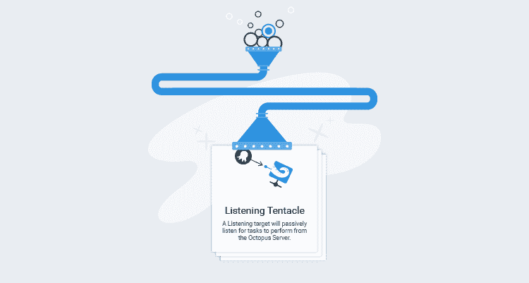
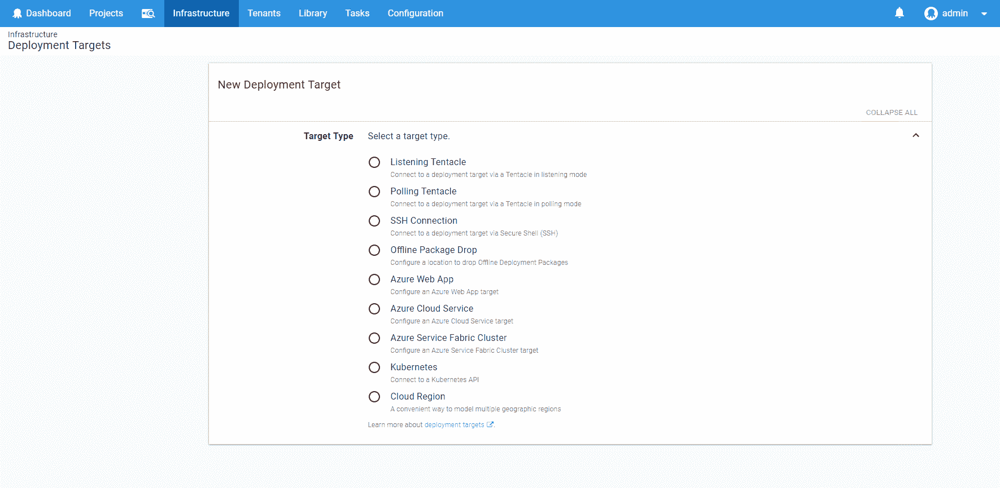
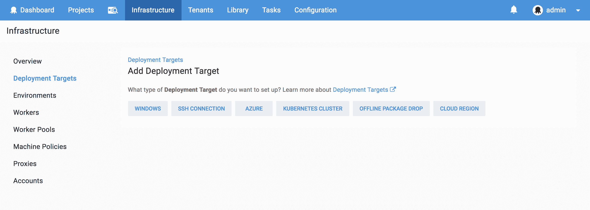
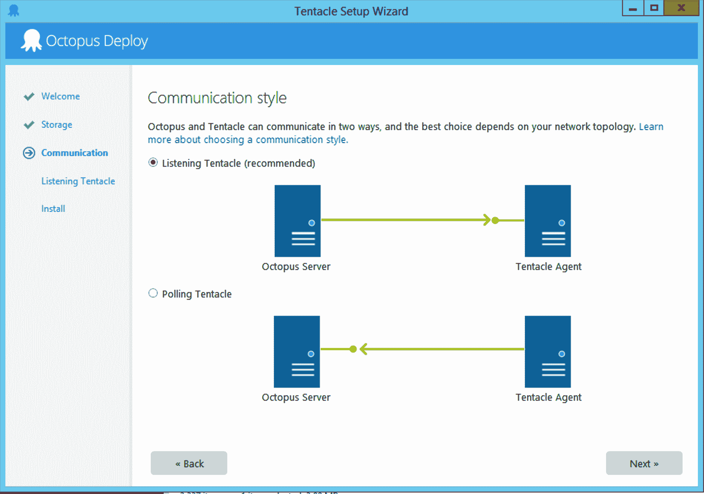
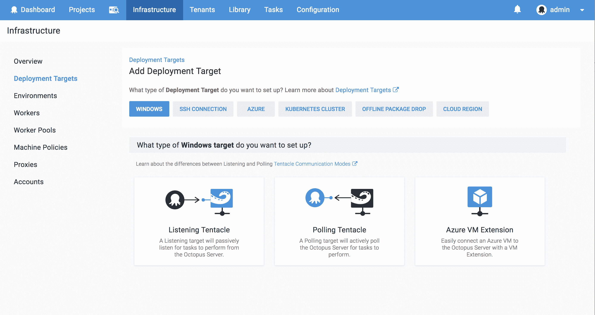
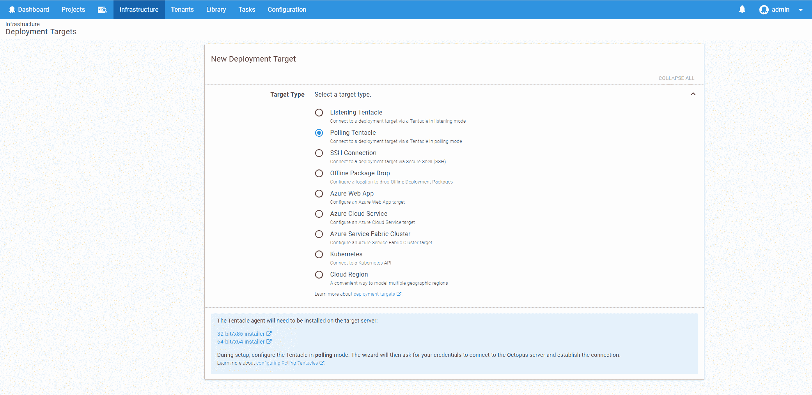
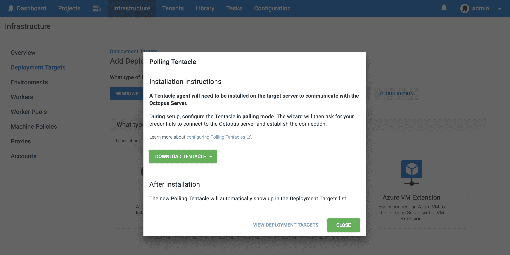

# 对添加部署目标体验和界面- Octopus Deploy 的改进

> 原文：<https://octopus.com/blog/deployment-targets-tweaks>

我们希望 Octopus 对新用户和现有用户都易于使用，但是当我们查看遥测数据时，我们看到新用户在他们的入职会议期间创建了许多环境，而没有多少部署目标。今年年初，我们围绕 onboarding 体验进行了一些可用性测试，以确定我们的用户遇到的任何痛点，作为这些测试的结果，我们最近改变了用户体验，以添加新的部署目标。让我们看看我们发现的问题，以及我们如何试图解决它们。

## 单选按钮太多

我们最近引入了不少新的部署目标类型。用户总是单击单选按钮来选择他们正在添加的部署目标的类型，但是单选按钮不能很好地适应大量的选择。感觉选项的数量达到了一个临界点，因此需要一些爱。

**解决方案**

我们本可以将单选按钮转换成卡片，然后就此不管了，但是，这并没有解决根本问题，而且仍然会相当令人沮丧。首先，我们决定将部署目标选择移动到一个单独的屏幕上，以使选择更加集中。这也为我们提供了一个对部署目标进行分类的机会，以便更好地反映我们的文档和您，即用户，在来到这个屏幕时的想法。

## 术语

可用性研究清楚地表明，我们没有做足够的工作来解释我们的术语或困难的概念，我们需要做更多的帮助。部署目标屏幕就是这样一个屏幕。我们有许多客户陷入困境，并询问轮询触角和倾听触角之间的区别。对于不知道触手是什么的新客户来说，就更困惑了。直到用户安装了触手，才看到这个解释触手是什么以及两种类型区别的图片。

**解决方案**

因为触手安装程序上的图像非常有用，作为卡设计的一部分，我们添加了这些图像和描述。

## 死胡同

在可用性测试期间，我们看到用户在添加轮询触手时，在 UI 中遇到了一个死胡同。我们没有告诉你轮询触角会自动添加到部署目标列表中。

**解决方案**

我们现在清楚地表明，安装轮询触手后，它将出现在部署目标列表中，并且我们添加了一个返回部署目标列表的链接。

## 其他改进

我们还做了许多其他的小改动，以改进不同部署目标屏幕之间的导航，并使事情更容易找到。这包括在可能的地方添加面包屑，突出触手下载按钮。

## 结论

图表，描述和及时的链接摇滚！可以说，我们对此感到兴奋，并希望它能让添加部署目标成为一种更愉快的体验。下载最新版本，看看新的用户界面和 UX，让我们知道你的想法。