# 使用 Octopus - Octopus 部署到 AWS 弹性豆茎

> 原文：<https://octopus.com/blog/deploy-to-aws-beanstalk>

[](#)

Elastic Beanstalk 是 AWS 提供的平台即服务(PaaS ),允许开发人员部署用各种语言编写的代码，例如。NET、Java、PHP、Node.js、Go、Python 和 Ruby 移植到预先配置好的基础设施上。您只需上传您的应用程序，Elastic Beanstalk 就会自动处理容量供应、负载平衡、伸缩和应用程序健康监控等细节。

Beanstalk 应用程序和 Octopus 的生命周期有许多共同之处，例如，Beanstalk 将应用程序部署到多个隔离的环境中，每个环境都可能有独特的设置。这种重叠意味着 Octopus 可以帮助部署 Beanstalk。

然而，Beanstalk 有一些我们需要考虑的独特需求，以便正确地与 Octopus 集成。在这篇博文中，我们将探索一个示例部署脚本，它允许 Octopus 将. NET 核心应用程序部署到 AWS Elastic Beanstalk。

## Beanstalk 基础设施概述

在部署到 Beanstalk 之前，我们需要了解 Beanstalk 是如何组织的。

任何 Beanstalk 基础设施的顶层都是应用程序。从概念上讲，应用程序是包含应用程序版本和环境的空间。通常，命名应用程序是为了标识它所代表的部署。在本文中，我们将部署[随机报价](https://github.com/OctopusSamples/RandomQuotes)应用程序，因此 Beanstalk 应用程序将被称为随机报价。

应用程序版本是部署到环境中的代码的副本。每个应用程序版本都有一个唯一的版本标签。不过，版本标签并不强制要求任何特定的版本化方案，只是每个版本都是唯一的。

最后，我们有环境。环境是运行代码的物理基础设施。Beanstalk 为支持的编程语言以及支持的 Docker 容器提供了多种预配置的环境平台。您还可以选择为更高级的场景创建自己的定制平台。每个环境都相互独立，可以部署任何应用程序版本。

[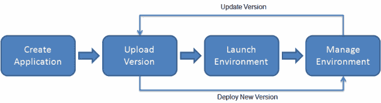](#) 

青苗部署生命周期。

## 豆茎应用程序包装要求

另一个要考虑的主要问题是 Beanstalk 期望如何为部署构建包。

Beanstalk 接受的包的类型很大程度上取决于用来创建代码的编程语言。

对于简单的部署，Beanstalk 接受一个标准的 ZIP 文件，或者对于 Java，接受一个 JAR 或 WAR 文件。这些文件与 Octopus 配合得很好，因为它们都可以存储在内置提要中，并且在部署步骤中很容易使用。

但是，在某些情况下，Beanstalk 希望接收嵌套的归档文件，并且。NET Core 部署就是需要嵌套归档的一个例子。

在...的情况下。可部署的工件是一个 ZIP 文件，包含一个 JSON 清单文件和另一个包含应用程序代码的嵌套 ZIP 文件。你可以在下面的截图中看到这些文件。文件`aws-windows-deployment-manifest.json`是 Beanstalk 清单文件，文件`site.zip`包含。NET 核心代码。

[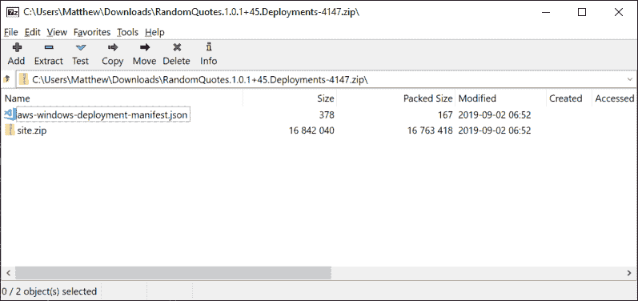](#) 

包含要部署到 Beanstalk 的. NET 核心应用程序的 ZIP 文件的内容。

我们需要记住这些嵌套的档案，以便在部署过程中充分利用 Octopus 提供的特性。

## 示例应用程序

我们正在部署的示例应用程序叫做[随机报价](https://github.com/OctopusSamples/RandomQuotes)。这是一个简单的。NET Core web 应用程序，它不一定是为部署到 Beanstalk 而设计的。

此应用程序的一般性质突出了部署到 Beanstalk 必须考虑的一些挑战，例如，如何在不维护特定于环境的工件的情况下实现特定于环境的设置。

Beanstalk 环境可以定义它们自己的环境变量集，这是配置它们运行的应用程序的特定于环境的方面的首选方式。将所有配置存储在环境变量中是 [12 因子应用](https://12factor.net/config)方法推荐的方法。

但是我们的示例应用程序仍然将配置保存在文件中，特别是 [appsettings.json](https://github.com/OctopusSamples/RandomQuotes/blob/master/RandomQuotes/appsettings.json) 文件。虽然我们可以利用`ASPNETCORE_ENVIRONMENT`环境变量来[选择适当的设置文件](https://visualstudiomagazine.com/articles/2019/03/01/managing-production-and-development.aspx)，但是对于这个部署过程，我们将在部署期间直接定制`appsettings.json`文件。

为了允许 Octopus 在部署过程中修改文件，我们可以**而不是**将编译好的代码打包到一个嵌套的 ZIP 存档中。Octopus 有许多功能可以替换文件中的值，如[变量替换](https://octopus.com/docs/deployment-process/configuration-features/substitute-variables-in-files)和 [JSON 配置变量](https://octopus.com/docs/deployment-process/configuration-features/json-configuration-variables-feature)，但这些功能都依赖于处理包含文本文件的档案，而不是额外的嵌套档案。

这意味着 Octopus 托管的打包代码将包含调用`dotnet package`生成的文件。然后由我们将这个文件重新打包到 Beanstalk 要求的嵌套归档中。

Random Quotes 利用 GitHub 动作来构建代码，你可以在这里看到工作流程。在这个工作流程中，有四个重要的工作突出了我们如何打包这个应用程序。

首先，我们构建代码:

```
- name: Build with dotnet
  run: dotnet build --configuration Release 
```

接下来，我们打包代码，将运行该应用程序所需的所有文件放入一个名为`site`的目录中:

```
- name: Publish with dotnet
  run: dotnet publish -o site --configuration Release 
```

Octo CLI 将`site`目录打包成一个 ZIP 文件:

```
- name: Pack Beanstalk App
  run: >-
    /opt/octo/Octo pack .
    --outFolder /home/runner/work/RandomQuotes/RandomQuotes
    --basePath /home/runner/work/RandomQuotes/RandomQuotes/RandomQuotes/site
    --id RandomQuotes
    --version $(cat /home/runner/work/RandomQuotes/RandomQuotes/version.txt)
    --format zip 
```

并将包推送到 Octopus 服务器:

```
- name: Push to Octopus
  run: >-
    if [[ ! -z "${{ secrets.OctopusUrl }}" && ! -z "${{ secrets.OctopusApiKey }}" ]]; then
    /opt/octo/Octo push
    --server ${{ secrets.OctopusUrl }}
    --apiKey ${{ secrets.OctopusApiKey }}
    --package /home/runner/work/RandomQuotes/RandomQuotes/RandomQuotes.$(cat /home/runner/work/RandomQuotes/RandomQuotes/version.txt).zip
    --overwrite-mode IgnoreIfExists;
    fi 
```

这个过程的最终结果是一个 ZIP 文件，其中包含运行应用程序所需的 dll 和任何其他配置文件。在下面的截图中，你可以看到这个 ZIP 文件的内容。

重要的是，这个 ZIP 文件不是我们可以以当前形式部署到 Beanstalk 的东西。创建可以部署到 Beanstalk 的归档文件是 Octopus 部署的一部分。

[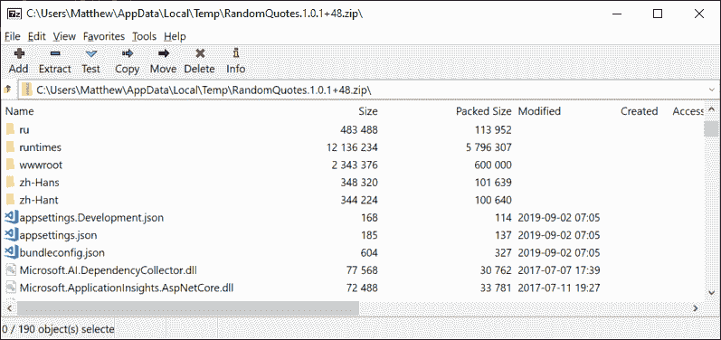](#)

## 创建 Beanstalk 应用程序

我们现在需要创建 Beanstalk 应用程序和环境。有许多方法可以创建 Beanstalk 基础设施，但是为了简单起见，我们在这里通过 AWS 控制台创建它。

所以我们有一个名为`Random Quotes`的应用程序，它有两个环境:`Development`和`Test`。

[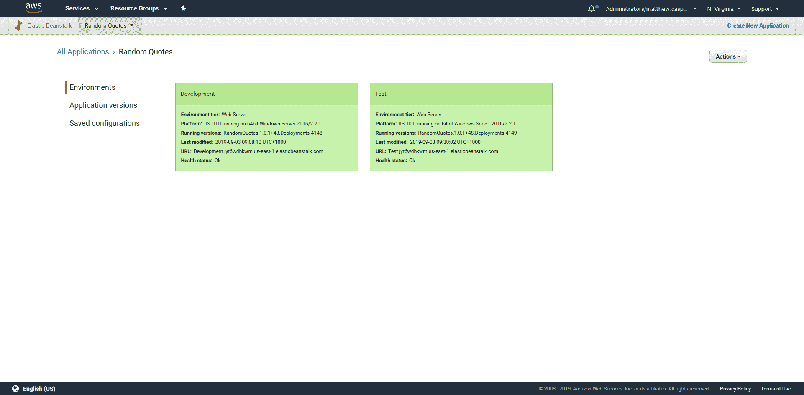](#)

## 筹备八达通项目

在我们部署任何东西之前，我们的 Octopus 项目需要配置一些变量。这是我们必须定义的变量的表格。

| 名字 | 描述 |
| --- | --- |
| `Application` | Beanstalk 应用程序的名称。 |
| `AppSettings:EnvironmentName` | `appsettings.json`文件中`EnvironmentName`属性的值。JSON 配置变量特性使用这个变量。 |
| `AWS` | 将用于执行部署的 AWS 帐户。 |
| `BucketName` | 将保存 Beanstalk 部署档案的 S3 存储桶的名称。 |
| `Environment` | Octopus 环境到 Beanstalk 环境的映射。 |

[](#)

*为 Octopus 项目定义的变量。*

## 章鱼部署

现在我们已经创建了 Beanstalk 应用程序和环境，我们的。NET 核心应用代码打包上传到 Octopus，是时候实现部署了。

Octopus 没有部署到 Beanstalk 的专用步骤，但是我们可以利用`Run an AWS CLI script`步骤使用捆绑的 AWS CLI 来执行部署。

下面的代码是执行部署的 Octopus 步骤的内容:

```
<#
.DESCRIPTION Waits for the given environment to finish any processing
.PARAMETER application The name of the Beanstalk application
.PARAMETER environment The name of the Beanstalk environment
#>
function Wait-ForEnvironmentToBeReady ($application, $environment) {
    do {
      $result = aws elasticbeanstalk describe-environments `
          --environment-names $environment `
          --application-name $application `
          --output json |
          ConvertFrom-Json |
          Select-Object -ExpandProperty Environments |
          Select-Object -First 1

      if ($null -eq $result) {
          throw "Could not find the environment $environment in the application $application"
      }

      Write-Host "Environment $environment is $($result.Status)"
      Start-Sleep 10
    } while (-not ($result.Status -in @("Ready", "Terminated")))
  }

  <#
  .DESCRIPTION Creates a new application version
  .PARAMETER application The name of the Beanstalk application
  .PARAMETER version The name of the Beanstalk application version
  .PARAMETER s3Bucket The S3 bucket that holds the application code
  .PARAMETER s3Key The S3 file of the application code
  #>
  function New-ApplicationVersion($application, $version, $s3Bucket, $s3Key) {
    Write-Host "Creating application version $version"
    aws elasticbeanstalk create-application-version `
        --application-name $application `
        --version-label $version `
        --source-bundle S3Bucket="$s3Bucket",S3Key="$s3Key" |
        Out-Null

  }

  <#
  .DESCRIPTION Uploads a file to S3
  .PARAMETER file The file to upload
  .PARAMETER s3Bucket The S3 bucket that holds the application code
  .PARAMETER s3Key The S3 file of the application code
  #>
  function Add-File($file, $s3Bucket, $s3Key) {
    Write-Host "Uploading File"
    aws s3 cp $file "s3://$s3Bucket/$s3Key" | Out-Null
  }

  <#
  .DESCRIPTION Updates a Beanstalk environment with the supplied application version
  .PARAMETER application The name of the Beanstalk application
  .PARAMETER environment The name of the Beanstalk environment
  .PARAMETER version The name of the Beanstalk application version
  #>
  function Update-Environment($application, $environment, $version) {
    Write-Host "Updating Environment $environment to $version"
    aws elasticbeanstalk update-environment `
        --application-name $application `
        --environment-name $environment `
        --version-label $version |
        Out-Null
  }

  function New-ManifestFile($name, $file) {
      Set-Content -Path "aws-windows-deployment-manifest.json" -Value @"
      {
        "manifestVersion": 1,
        "deployments": {
            "aspNetCoreWeb": [
            {
                "name": "$name",
                "parameters": {
                    "appBundle": "$file",
                    "iisPath": "/",
                    "iisWebSite": "Default Web Site"
                }
            }
            ]
        }
    }
"@
  }

  $VersionLabel = $OctopusParameters["Octopus.Action.Package[RandomQuotes].PackageId"] +
      "." +
      $OctopusParameters["Octopus.Action.Package[RandomQuotes].PackageVersion"] +
      "." +
      $OctopusParameters["Octopus.Deployment.Id"]

  New-ManifestFile "random-quotes" "site.zip"

  # Compress the extracted DotNET application code
  Compress-Archive `
      -Path "$($OctopusParameters["Octopus.Action.Package[RandomQuotes].ExtractedPath"])\*" `
      -DestinationPath "site.zip"

  # Compress the application code with the manifest file to create the Beanstalk deployment    
  Compress-Archive `
      -Path "site.zip", "aws-windows-deployment-manifest.json" `
      -DestinationPath "$VersionLabel.zip"

  # Upload the Beanstalk deployment to S3    
  Add-File "$VersionLabel.zip" $BucketName "$VersionLabel.zip"

  # Use the new file in S3 to create a Beanstalk application version
  New-ApplicationVersion $Application $VersionLabel $BucketName "$VersionLabel.zip"

  # Wait for any pending changes to the environment to finish
  Wait-ForEnvironmentToBeReady  $Application $Environment

  # Deploy the application version to the environment
  Update-Environment $Application $Environment $VersionLabel

  # Wait for the new deployment to finish
  Wait-ForEnvironmentToBeReady  $Application $Environment 
```

让我们来分解这个代码。我们将从调用组成部署过程的自定义函数开始，然后，我们将讨论函数本身。

### 创建应用程序版本标签

首先，我们创建一个应用程序版本标签。如果您还记得的话，这个标签必须是唯一的，但是除此之外不强制任何特定的格式。这段代码将创建一个包含 Octopus 包 ID、包版本和 Octopus 部署 ID 的标签。这种组合确保 Octopus 执行的任何部署都将产生唯一的版本标签。

这样做的最终结果是一个类似于`RandomQuotes.1.0.1+45.Deployments-4147`的字符串。

```
$VersionLabel = $OctopusParameters["Octopus.Action.Package[RandomQuotes].PackageId"] +
    "." +
    $OctopusParameters["Octopus.Action.Package[RandomQuotes].PackageVersion"] +
    "." +
    $OctopusParameters["Octopus.Deployment.Id"] 
```

### 创建清单文件

正如我们前面讨论的，部署到 Beanstalk 的归档文件包含一个清单文件和一个包含应用程序代码的嵌套归档文件。我们上传到 Octopus 的工件只包含编译过的。NET 代码，但不是清单文件。所以我们在这里创建了[清单文件](https://docs.aws.amazon.com/elasticbeanstalk/latest/dg/dotnet-manifest.html#dotnet-manifest-dotnetcore):

```
New-ManifestFile "random-quotes" "site.zip" 
```

`New-ManifestFile`函数保存一个名为`aws-windows-deployment-manifest.json`的 JSON 文件:

```
function New-ManifestFile($name, $file) {
    Set-Content -Path "aws-windows-deployment-manifest.json" -Value @"
    {
      "manifestVersion": 1,
      "deployments": {
          "aspNetCoreWeb": [
          {
              "name": "$name",
              "parameters": {
                  "appBundle": "$file",
                  "iisPath": "/",
                  "iisWebSite": "Default Web Site"
              }
          }
          ]
      }
  }
"@
} 
```

调用该函数的结果是一个名为`aws-windows-deployment-manifest.json`的文件，其内容如下:

```
{
  "manifestVersion": 1,
  "deployments": {
      "aspNetCoreWeb": [
      {
          "name": "random-quotes",
          "parameters": {
              "appBundle": "site.zip",
              "iisPath": "/",
              "iisWebSite": "Default Web Site"
          }
      }
      ]
  }
} 
```

### 创建 Beanstalk 部署档案

现在我们有了清单文件，我们需要将它和包含应用程序代码的嵌套存档一起添加到 ZIP 存档中。

的。NET 应用程序存档作为参考包包含在此步骤中。我们将这个包称为`RandomQuotes`，并将其设置为在部署期间提取，这意味着可以在`$OctopusParameters["Octopus.Action.Package[RandomQuotes].ExtractedPath"]`变量引用的路径下找到包的内容。

[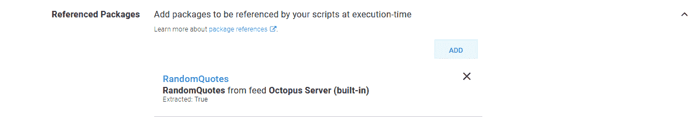](#)

*引用包的摘要。*

[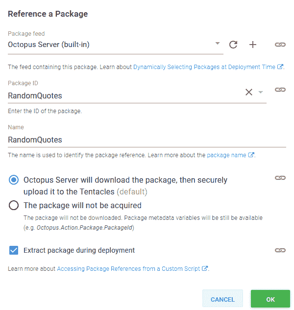](#)

*参考包的详细信息。*

因为我们已经启用了`JSON configuration variables`特性，并将其配置为处理名为`appsettings.json`的文件，所以 Octopus 变量`AppSettings:EnvironmentName`的值将替换 JSON 文件中现有的`EnvironmentName`。这样，我们就从一个通用的应用程序包中创建了一个特定于环境的部署。

您可以以同样的方式使用`substitute variables in files`功能。

[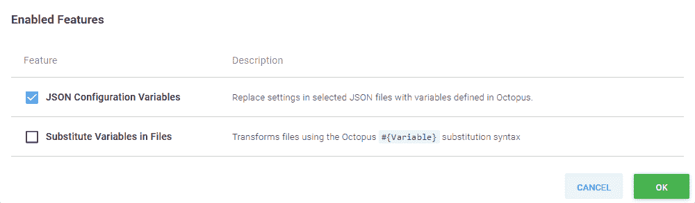](#)

*台阶特征。*

[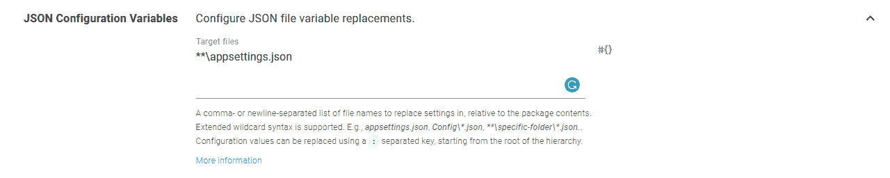](#)

*JSON 配置变量设置。*

用章鱼提取和处理了。NET 核心应用程序包，我们将文件压缩回一个名为`site.zip`的文件中:

```
# Compress the extracted DotNET application code
Compress-Archive `
    -Path "$($OctopusParameters["Octopus.Action.Package[RandomQuotes].ExtractedPath"])\*" `
    -DestinationPath "site.zip" 
```

接下来，我们创建第二个归档文件，包含 Beanstalk 清单文件和。NET 核心应用程序档案:

```
# Compress the application code with the manifest file to create the Beanstalk deployment    
Compress-Archive `
    -Path "site.zip", "aws-windows-deployment-manifest.json" `
    -DestinationPath "$VersionLabel.zip" 
```

这样做的最终结果是一个类似于`RandomQuotes.1.0.1+45.Deployments-4147.zip`的文件。

## 把文件上传到 S3

Beanstalk 应用程序档案首先被上传到 S3。大多数 AWS 服务使用 S3 作为使用应用程序代码的舞台，Beanstalk 也不例外。

```
# Upload the Beanstalk deployment to S3    
Add-File "$VersionLabel.zip" $BucketName "$VersionLabel.zip" 
```

`Add-File`函数是对 AWS CLI 上传文件的简单调用:

```
function Add-File($file, $s3Bucket, $s3Key) {
  Write-Host "Uploading File"
  aws s3 cp $file "s3://$s3Bucket/$s3Key" | Out-Null
} 
```

### 创建应用程序版本

使用 S3 中的代码，我们可以创建一个新的应用程序版本，将工件与版本标签相关联。

变量`$Application`和`$BucketName`由 Octopus 提供，并映射到项目变量的值。

```
# Use the new file in S3 to create a Beanstalk application version
New-ApplicationVersion $Application $VersionLabel $BucketName "$VersionLabel.zip" 
```

AWS CLI 用于使用我们上传到 S3 的文件，并为其分配一个版本标签。完成后，我们的 Beanstalk 应用程序将有一个新的应用程序版本，可以部署到一个环境中:

```
function New-ApplicationVersion($application, $version, $s3Bucket, $s3Key) {
  Write-Host "Creating application version $version"
  aws elasticbeanstalk create-application-version `
      --application-name $application `
      --version-label $version `
      --source-bundle S3Bucket="$s3Bucket",S3Key="$s3Key" |
      Out-Null
} 
```

### 等待环境处于就绪状态

如果由于某种原因 Beanstalk 环境已经被更新了(可能是通过 AWS 控制台进行的更改)，我们需要等待它进入`Ready`状态。我们通过调用`Wait-ForEnvironmentToBeReady`来做到这一点。

变量`$Environment`由 Octopus 提供，映射到当前部署环境范围内的变量值。

```
Wait-ForEnvironmentToBeReady  $Application $Environment 
```

`Wait-ForEnvironmentToBeReady`功能轮询环境描述并等待状态为`Ready`或`Terminated`:

```
function Wait-ForEnvironmentToBeReady ($application, $environment) {
    do {
      $result = aws elasticbeanstalk describe-environments `
          --environment-names $environment `
          --application-name $application `
          --output json |
          ConvertFrom-Json |
          Select-Object -ExpandProperty Environments |
          Select-Object -First 1

      if ($null -eq $result) {
          throw "Could not find the environment $environment in the application $application"
      }

      Write-Host "Environment $environment is $($result.Status)"
      Start-Sleep 10
    } while (-not ($result.Status -in @("Ready", "Terminated")))
  } 
```

### 创建应用程序版本并更新环境

我们现在在 Beanstalk 中创建了一个新的应用程序版本，所以下一步是将其部署到一个环境中。对`Update-Environment`的调用是部署到 Beanstalk 的地方:

```
# Deploy the application version to the environment
Update-Environment $Application $Environment $VersionLabel 
```

在 Beanstalk 中，用应用程序版本“更新”环境是我们部署新代码的方式:

```
function Update-Environment($application, $environment, $version) {
  Write-Host "Updating Environment $environment to $version"
  aws elasticbeanstalk update-environment `
      --application-name $application `
      --environment-name $environment `
      --version-label $version |
      Out-Null
} 
```

### 等待部署完成

我们最后一次调用`Wait-ForEnvironmentToBeReady`来等待新的应用程序版本被部署到环境中。通话结束后，部署就完成了:

```
# Wait for the new deployment to finish
Wait-ForEnvironmentToBeReady  $Application $Environment 
```

## 执行部署

让我们继续执行到`Dev`环境的部署。

[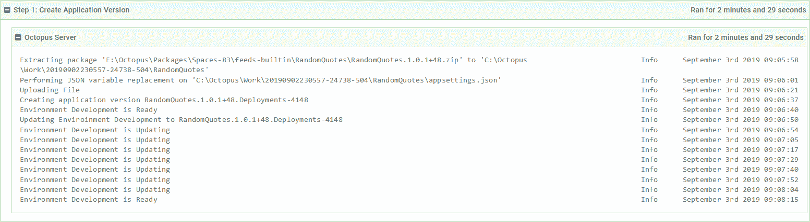](#)

*部署日志。*

日志消息`Performing JSON variable replacement on 'C:\Octopus\Work\20190902230557-24738-504\RandomQuotes\appsettings.json'`显示 Octopus 已经成功处理了`appsettings.json`文件，并注入了我们想要覆盖的值。

豆茎应用程序包被上传到 S3。

[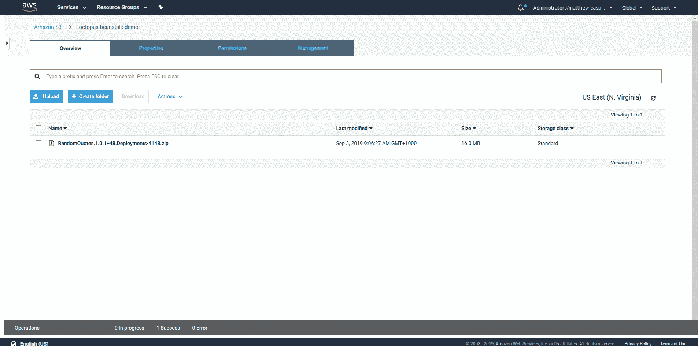](#)

*S3 水桶。*

应用程序版本已创建。

[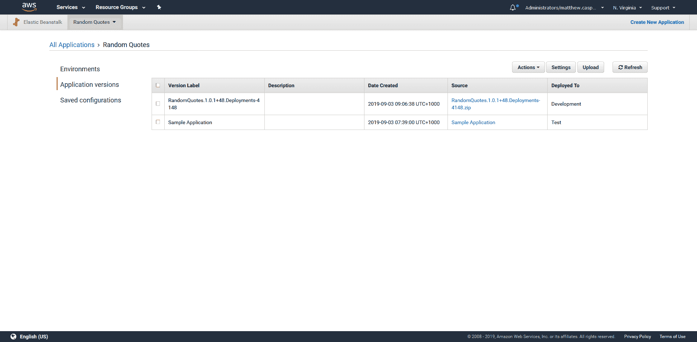](#)

*应用程序版本。*

最后，使用新的应用程序版本更新了环境。

[](#)

*环境。*

如果我们打开最终部署的应用程序，我们可以看到它显示了我们部署到的名为`Dev`的环境。这与`appsettings.json`文件中的默认值有细微的变化，该文件将环境列为`DEV`(全部大写)。

[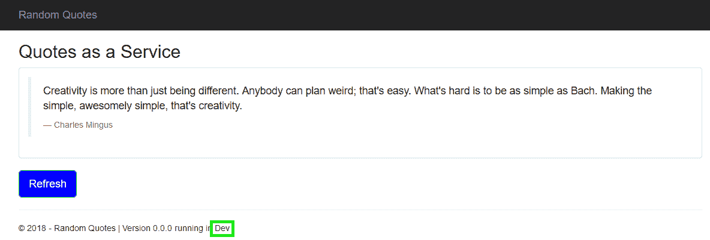](#)

*开发环境中部署的应用程序。*

将部署提升到`Test`环境使得替换更加清晰。

[T32](#)

*测试环境中部署的应用程序。*

## 结论

在本文中，我们讨论了 Beanstalk 服务的高级架构，然后实现了一个定制的 PowerShell 脚本，该脚本通过以下方式将应用程序部署到 Beanstalk:

*   创建一个 Beanstalk 清单文件。
*   创建一个 Beanstalk 档案，包括。NET 核心应用程序档案和清单文件。
*   把文件上传到 S3。
*   从 S3 的文件创建应用程序版本。
*   用应用程序版本更新环境。

我们构建这个过程是为了让我们利用 Octopus 的特性，比如 JSON 配置变量。这意味着我们可以部署特定于环境的应用程序，而不仅仅依赖于环境变量。