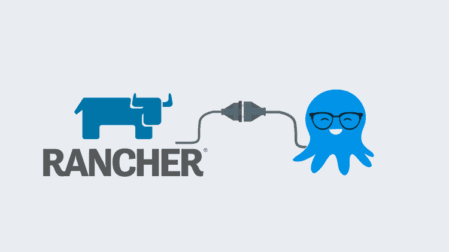
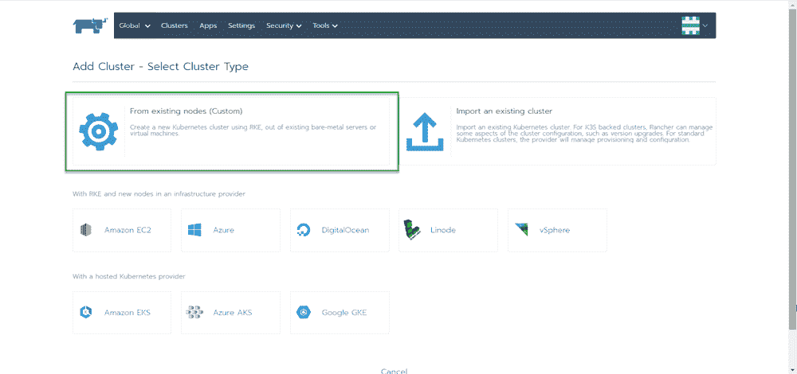
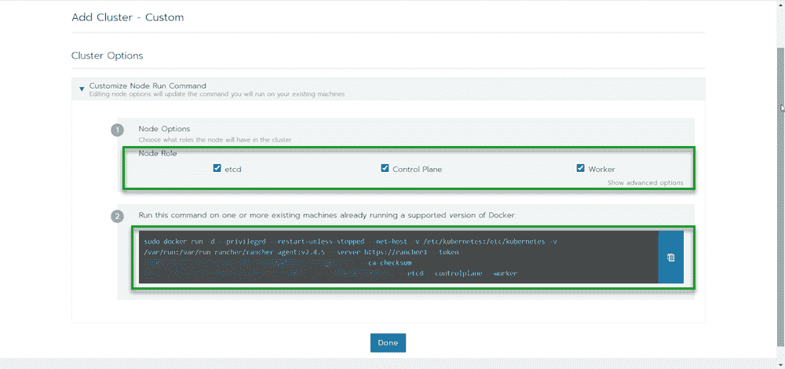
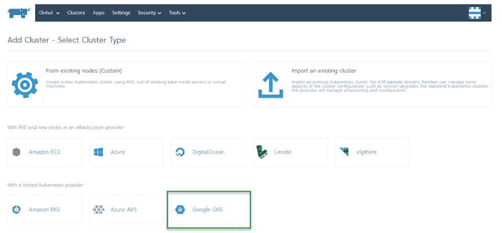
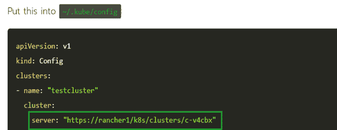
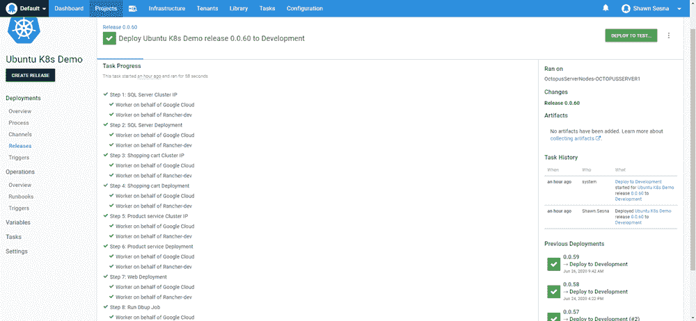

# 部署到牧场主与章鱼部署-章鱼部署

> 原文：<https://octopus.com/blog/deploy-to-rancher-with-octopus>

[](#)

从命令行管理 Kubernetes 既麻烦又乏味，尤其是当您有多个集群需要管理时。为了减轻这一负担，已经开发了一些工具来轻松地创建和管理 Kubernetes 集群。牧场主就是一个例子。在本文中，我将向您展示如何将由 Rancher 管理的 Kubernetes 集群添加到 Octopus Deploy 中，作为您可以部署到的部署目标。

## Rancher 入门

Rancher 是独一无二的，因为你可以在任何地方安装它。Rancher 在 Docker 容器中运行，并且可以在安装了 Docker 的任何地方运行。这是您开始工作所需的全部内容:

```
$ sudo docker run -d --restart=unless-stopped -p 80:80 -p 443:443 rancher/rancher 
```

当然，还有更高级的高可用性安装和一系列其他的[选项](https://rancher.com/docs/rancher/v2.x/en/installation/)，但是对于测试 Rancher，这就是你所需要的。

当容器启动并运行时，用浏览器连接到它并设置`admin`密码。设置密码后，您就可以创建集群了。

## 创建集群

牧场主可以与:

*   内部基础设施
*   云基础设施提供商:
    *   亚马逊 EC2
    *   蔚蓝的
    *   数字海洋
    *   利诺德
    *   vShere
*   云构建服务:
    *   亚马逊弹性库柏服务(EKS)
    *   蓝色库柏服务(AK)
    *   谷歌 Kubernetes 引擎(GKE)

在本文中，我创建了两个 Kubernetes (K8s)集群来演示使用 Rancher 和 Octopus Deploy 的多功能性；一个在内部，一个使用云 Kubernetes 服务。

### 第一组

Rancher 使创建集群的过程变得非常简单和容易。在 UI 中，点击**添加集群**。

我为我的本地集群创建了三个 Ubuntu 虚拟机，所以我从现有节点(自定义)中选择了**作为我的第一个集群:**

 **[](#)

我在下一个屏幕上给这个集群命名，接受默认值，然后点击 **Next** 。

创建过程的最后一个屏幕显示了三个复选框。由 Rancher 管理的集群需要有充当三种角色的节点:

选中或取消选中一个框会更新屏幕上的命令，以便针对集群成员运行。可以为一个节点分配所有三个角色，但是对于本文，我为每个虚拟机选择了一个角色(图中显示了选择的所有三个选项):

[](#)

在每个节点上运行命令时，屏幕上将显示一个弹出窗口，指示有多少节点已注册到集群。添加完节点后，单击 **Done** 开始配置过程。配置过程完成后，您将拥有一个全新的集群。

### 第二组

对于第二个集群，我选择使用 GKE 的云 Kubernetes 服务:

[](#)

GKE 的创建流程与内部创建略有不同:

1.  创建有足够权限创建集群资源的 [Google 服务帐户](https://cloud.google.com/iam/docs/service-accounts)。
2.  为服务帐户创建一个 JSON 密钥，因为 Rancher 需要这个密钥向 Google 进行认证。
3.  粘贴 JSON(或使用**从文件中读取**按钮)，点击**下一步:配置节点**。

与内部设置不同，在 GKE 上创建集群是自动进行的。使用服务帐户，Rancher 连接到 Google 并为您提供所有资源。

## 将集群连接到 Octopus Deploy

Rancher 不仅提供了一个集中的接口来管理 Kubernetes 集群，还提供了一个集中的集群通信方式。这意味着 Octopus Deploy 可以连接到 Rancher，而不是连接到它单独管理的集群。

### 证明

在添加 Rancher 管理的集群之前，我们必须创建一种对其进行身份验证的方法。这可以通过使用 Rancher UI 创建一个访问密钥来实现。

1.  登录 Rancher，然后点击右上角的**个人资料**。
2.  选择 **API &键**。
3.  点击**添加键**。
4.  给 API 密钥一个有效期和范围。
5.  添加一个描述，这样你就知道这个键的用途了，然后点击**创建**。

单击 create 后，您将看到 API 密钥信息。请保存此信息，因为您以后将无法检索到它。

### 牧场主集群端点

您可以通过 Rancher 代理与集群的通信。您可以在 Rancher 中使用 API 端点来发出命令，而不是直接连接到各个 K8s API 端点。URL 的格式为:`https://<RancherUrl>/k8s/clusters/<ClusterId>`。

找到正确 URL 的一个快速方法是从提供的 Kubeconfig 文件信息中获取它。对于您定义的每个集群，Rancher 提供了一个可以直接从 UI 下载的`Kubeconfig file`。要找到它，从全球仪表盘中选择您需要的集群，并点击 **Kubeconfig 文件**按钮。

下一个屏幕显示了 Kubeconfig 文件，该文件包含将集群连接到 Octopus Deploy 所需的特定 URL:

[](#)

### 将帐户添加到八达通部署

对于部署到集群的 Octopus Deploy，它需要登录的凭证。在 Octopus Web 门户中，导航到**基础设施**选项卡并单击**帐户**，我们将添加我们在 Rancher 中创建的 API 密钥令牌:

1.  点击**添加账户**。
2.  选择您要创建的帐户类型。
3.  输入您选择的值，然后点击**保存**。

现在我们已经创建了一个帐户，我们准备创建我们的 Kubernetes 目标。

### 创建一个 Kubernetes 部署目标

准备工作完成后，现在可以将牧场主管理的 Kubernetes 集群添加到 Octopus Deploy 中。添加目标的方式与添加任何其他 Kubernetes 目标完全相同。

1.  点击 **基建➜部署目标** 。
2.  点击**添加部署目标**。
3.  点击 **KUBERNETES 集群**类别。
4.  然后在 Kubernetes 集群上点击**添加**。

Kubernetes 部署目标表单的两个最重要的部分是:

*   证明
*   Kubernetes 详细信息

#### 证明

选择与您选择的连接到 Rancher 的方式相对应的单选按钮。我选择了 Token。

#### Kubernetes 详细信息

这是我们使用从 Rancher 的 *kubeconfig 文件*中获取的 URL 的地方。第一个集群是`https://rancher1/k8s/clusters/c-v4cbx`。我的集群正在使用自签名证书，因此我选择了**跳过 TLS 验证**。

我为我的集群创建了三个名称空间:

*   发展
*   试验
*   生产

点击**保存**就完成了。

要验证配置，您可以观察初始运行状况检查。

## 部署到集群

部署到通过 Rancher 管理的集群与部署到非 Rancher 管理的集群是一样的。

为了演示，我将使用与我的[超越 Hello World:构建真实世界的 Kubernetes CI/CD 管道](https://octopus.com/blog/build-a-real-world-kubernetes-cicd-pipeline)帖子中相同的示例流程，改为针对 Rancher 托管集群进行修改。

当我部署该版本时，我可以看到它在本地集群 Rancher-dev 和 Google 云集群上执行:

【T2 

现在，我们已经成功部署到由 Rancher 管理的 Kubernetes 集群。

## 结论

在本文中，我演示了如何在 Rancher 中定义 Kubernetes 集群，然后将 Rancher 与 Octopus Deploy 集成来部署您的项目。

## 观看网络研讨会

[https://www.youtube.com/embed/6ZILha86JDo](https://www.youtube.com/embed/6ZILha86JDo)

VIDEO

我们定期举办网络研讨会。请参见[网络研讨会第](https://octopus.com/events)页，了解以往网络研讨会的档案以及即将举办的网络研讨会的详细信息。

愉快的部署！**