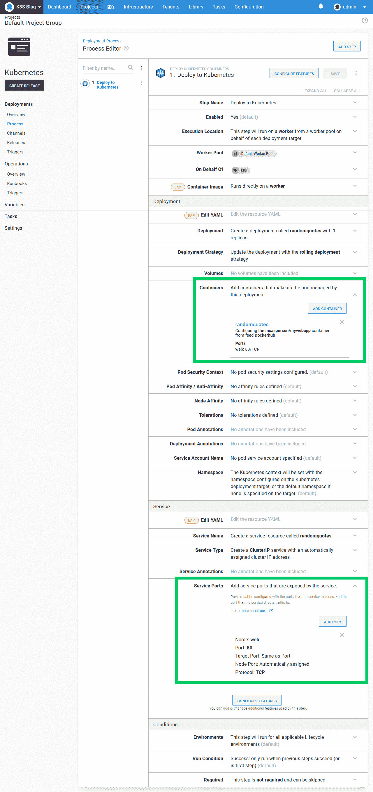

# 通过 Octopus - Octopus Deploy 将您的第一个容器部署到 Kubernetes

> 原文：<https://octopus.com/blog/deploy-your-first-container-to-kubernetes>

[](#)

在[之前的帖子](/blog/getting-started-with-kind-and-octopus)中，我们看到了如何用 Kind 创建一个本地测试 Kubernetes 集群，并在 Octopus 中配置它。在本文中，我们将学习如何使用 Octopus 中的步骤向本地 Kubernetes 集群部署和公开单个 Docker 容器。

## 创建并推送 Docker 映像

Octopus 使用提要从 Docker 存储库中访问 Docker 图像。有许多工具可以让你托管自己的 Docker 存储库，但是当你第一次开始时，公共存储库 [Docker Hub](https://hub.docker.com/) 是最简单的选择。

如果您还没有帐户，请创建一个新帐户，然后使用命令`docker login`登录 Docker Hub:

```
$ docker login
Login with your Docker ID to push and pull images from Docker Hub. If you don't have a Docker ID, head over to https://hub.docker.com to create one.
Username: mcasperson
Password:

Login Succeeded 
```

接下来，我们需要构建 Docker 映像。在这篇文章中，我们将使用来自 https://github.com/OctopusSamples/RandomQuotes-Java 的[的样例应用程序。使用命令`docker build . -t mcasperson/mywebapp:0.1.7`构建映像(用 Docker Hub 用户名替换`mcasperson`)。](https://github.com/OctopusSamples/RandomQuotes-Java)

很重要的一点是，标签(本例中为`0.1.7`)是一个有效的 SemVer 版本字符串。Docker 标签不强制任何版本规则，但是 Octopus 希望它部署的所有包都可以被比较以找到最新的。这是通过要求 Docker 标签是 SemVer 字符串来实现的。

Octopus 会忽略没有 SemVer 兼容标签的 Docker 图像。

构建完成后，您可以使用命令`docker images "mcasperson/mywebapp"`验证映像是否已经创建:

```
$ docker images "mcasperson/mywebapp"
REPOSITORY            TAG                 IMAGE ID            CREATED             SIZE
mcasperson/mywebapp   0.1.7               fadf80ecf48a        1 second ago        129MB 
```

最后，使用命令`docker push mcasperson/mywebapp:0.1.7`将图像推送到 Docker Hub:

```
$ docker push mcasperson/mywebapp:0.1.7
The push refers to repository [docker.io/mcasperson/mywebapp]
d817461c3564: Pushed
11276c4aac8e: Pushed
f955d35132bf: Pushed
edd61588d126: Mounted from library/openjdk
9b9b7f3d56a0: Mounted from library/openjdk
f1b5933fe4b5: Mounted from library/openjdk
0.1.7: digest: sha256:0eb09072c3ab7768e9e5f9cae994e63a2d5c8d6957a2d0cd85baae31ee8cc6d7 size: 1573 
```

一旦推送，图像就可以在 Docker Hub 上[查看。](https://hub.docker.com/r/mcasperson/mywebapp)

## 创建 Docker 提要

Octopus 在部署过程中引用的所有包都来自提要。为了在 Kubernetes 部署中使用我们的新 Docker 映像，我们需要通过 URL[https://index . Docker . io](https://index.docker.io)将 Docker Hub 配置为 Docker 提要:

[](#)

然后，我们可以搜索我们的新图像:

[](#)

## 部署映像

Octopus 附带了许多支持 Kubernetes 部署的步骤。概括地说，它们分为三类:

*   针对部署、服务、进入、机密和配置映射的自以为是、以用户界面为中心的步骤。
*   生 YAML 的部署。
*   舵图的展开。
*   针对`kubectl`的自定义脚本。

因为这是我们第一次部署到 Kubernetes 集群中，固执己见的步骤将使我们快速启动并运行，而无需了解 Kubernetes YAML 的详细信息，因此我们将向我们的 Octopus 项目添加一个**部署 Kubernetes 容器**步骤:

[](#)

这一步将 Kubernetes 部署资源与可选的服务、入口、秘密和配置映射结合起来。在 Kubernetes 中部署应用程序时，这些资源通常作为一个紧密耦合的单元一起部署。但是，在我们的示例中，我们不会部署入口、秘密或配置映射，因此可以禁用这些功能以简化步骤 UI:

[](#)

该步骤公开了大量选项，但是对于这个示例，我们只需要注意两个选项。

第一个是容器的定义，第二个是服务端口。下面的截图突出显示了这些内容:

[](#)

容器定义引用了我们之前推送到 Docker Hub 的映像:

[](#)

它还公开了 TCP 端口 80 和一个名为 **web** 的 Kubernetes 端口:

[](#)

然后，服务端口将容器上的端口 80 公开为服务上的端口 80:

[](#)

这就是我们将我们的映像部署到 Kubernetes 所需的全部配置。当我们部署这个项目时，Octopus 将在幕后执行一些逻辑来创建 Kubernetes 部署和服务资源，并将两者链接在一起。链接这些资源使我们从一些手工工作中解脱出来，否则将需要用服务来公开部署。

创建 Octopus 部署时要注意的一件事是，我们在部署时选择 Docker 映像版本(如果您还记得，这是我们在构建映像时分配给它的标记)。使用 Octopus 管理 Kubernetes 部署的优点之一是在部署时选择映像版本，并在默认情况下选择最新版本。通常，Docker 映像的新版本不需要对引用它们的 Kubernetes 资源进行任何更改，因此只需创建一个新的 Octopus 部署并引用新的 Docker 映像，就可以将新版本的代码推送到 Kubernetes:

[](#)

当部署完成时，我们可以用命令`kubectl get deployments`验证 Kubernetes 包含部署资源:

```
$ kubectl get deployments
NAME           READY   UP-TO-DATE   AVAILABLE   AGE
randomquotes   1/1     1            1           20m 
```

然后，我们验证部署使用命令`kubectl get pods`创建了 pod:

```
$ kubectl get pods
NAME                            READY   STATUS    RESTARTS   AGE
randomquotes-65cbb7c849-5vvnw   1/1     Running   0          30s 
```

然后我们验证服务是用命令`kubectl get service randomquotes`创建的:

```
$ kubectl get service randomquotes
NAME           TYPE        CLUSTER-IP      EXTERNAL-IP   PORT(S)   AGE
randomquotes   ClusterIP   10.99.245.202   <none>        80/TCP    19m 
```

为了从我们的本地 PC 访问服务，我们需要使用`kubectl`将一个本地端口代理到服务端口，这是我们使用命令`kubectl port-forward svc/randomquotes 8081:80`完成的。然后，我们可以在 http://localhost:8081:

[](#)

## 通过 Octopus 检查集群

对于经验丰富的 Kubernetes 管理员来说，在本地运行`kubectl`非常好，并且在创建新的部署来调试和验证事情是否按预期工作时经常需要。不过，它也有一些缺点:

*   它需要在本地安装`kubectl`，并配置管理员凭证。
*   如果凭证改变，本地`kubectl`配置需要手动更新。
*   对群集执行的操作可能很难在以后重新构建。
*   决策所依据的值通常会丢失，例如 pod 日志的内容或 pod 的状态。
*   使用`kubectl`需要对 Kubernetes 管理有很好的了解。

随着 Kubernetes 基础设施的成熟，自动化常见的管理任务是有利的。通过自动化这些任务，机构知识可以嵌入到 Octopus 中，从而更容易将日常操作交给可能不是 Kubernetes 专家的团队。

为了自动化我们在上一节中对`kubectl`的调用，我们将利用一个名为**Kubernetes-Inspect Resources**的社区步骤模板:

[](#)

首先，我们将获得部署列表。这是通过将**资源**选项设置为`Deployment`，将**库对象动词**设置为`Get`，并通过将**创建工件**设置为`True`来捕获输出来实现的:

[](#)

现在，任何人都可以通过 Octopus UI 运行该运行手册，解决了上述限制:

*   这些凭证由 Octopus 管理，只需在一个地方更新。
*   `kubectl`可执行文件只需要在 worker 上可用，消除了用户在本地安装该工具的需要。
*   这个 runbook 的输出被捕获到 Octopus 日志中，并作为该步骤生成的一个工件，使得返回并查看导致采取某些操作的集群的状态变得容易。
*   `kubectl`命令嵌入在一个步骤中，不需要支持人员记忆命令。

[](#)

现在让我们添加第二个步骤来查询 pod。注意这里的**资源名称**已经被设置为`randomquotes\*`。这是由**Kubernetes-Inspect Resources**步骤增加的便利，允许 Kubernetes 资源通过通配符进行匹配，这在`kubectl`中是不可用的。这对于由部署创建的 pod 尤其方便，因为 Kubernetes 会为这些 pod 名称分配随机后缀:

[](#)

最后，我们得到了服务:

[](#)

在此基础上，我们创建了一个可以由支持人员运行的操作手册，作为诊断集群任何问题的第一步，生成的工件提供了一个有用的日志集合，可以在以后查看或传递给更高级别的支持。

## 结论

在这篇文章中，我们编译了一个新的 Docker 映像并将其推送到 Docker Hub，将 Docker Hub 作为一个提要添加到 Octopus 中，然后将该映像作为一个 Kubernetes 部署进行部署，该部署由一个服务公开给我们在[上一篇博文](/blog/getting-started-with-kind-and-octopus)中用 Kind 创建的测试集群。

有人说 *Kubernetes 让简单的事情变得困难，让困难的事情成为可能*。即使是一个简单的 Kubernetes 部署看起来也有许多移动部分，但是如果您已经达到了这一步，那么您已经实现了一个坚实的基础，可以在此基础上使用 Kubernetes 构建更复杂的生产就绪型基础设施。事实上，即使是这个简单的例子，您也已经创建了:

*   任何人都可以通过 Octopus 门户网站启动可重复的部署，不需要本地工具或 Kubernetes 专业知识。
*   得益于 Octopus 的内置功能，可对部署进行审核。
*   通过[许多可用的插件](https://octopus.com/docs/packaging-applications/build-servers)，一个连续的交付管道随时可以从 CI 系统中触发。
*   多环境部署的基础——参见本指南的[了解更多详情。](https://i.octopus.com/books/kubernetes-book.pdf)
*   一些帮助负责集群的支持人员的初步操作手册。